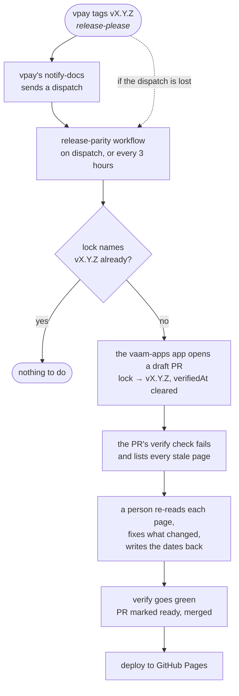

# How these docs stay current

Every page here describes **one vpay release**: the one named in the top bar and
in
[`vpay.lock.json`](https://github.com/vaam-apps/vpay-docs/blob/main/vpay.lock.json).
Every link into vpay points at that tag, not at `master`. When vpay releases
again, a check compares the new release with that lock and lists every page the
release made stale.

## The loop



**vpay's release is never blocked by this.** Its images, chart and SDKs publish
on their own schedule. What the loop blocks is this site _claiming_ a release it
hasn't been re-read against. Until someone bumps the lock, the site keeps saying
"verified against" the older tag, which is still true, and the draft PR's red
check says which pages are behind.

The PR is opened with a token from the org's `vaam-apps` GitHub App, not the
workflow's default token. GitHub runs no workflows for anything the default
token does, so a PR opened with it would get no check at all. The bot does the
mechanical half: it moves the tag, the commit and the vpay-skills commit, and
it records where the lock came from. It **never** writes the `verifiedAt`
dates. Only a person does that, and until they do the check stays red.

The fast path is a `vpay-release` dispatch from vpay's own
[`notify-docs`](https://github.com/vaam-apps/vpay/blob/master/.github/workflows/notify-docs.yml) workflow the moment a
tag lands. It merged on 2026-09-23
([vaam-apps/vpay#246](https://github.com/vaam-apps/vpay/pull/246)) and has
not run on a real tag yet; the first vpay release after it is its first run.
The 3-hourly poll stays as the fallback.

## What the check refuses

`tools/verify-parity.mjs` runs in both directions. vpay's own gates and
vpay-skills' `verify-coverage` do the same, for the same reason: a map checked
in only one direction goes stale in the direction nobody checks.

| Direction     | Fails when                                                                                                                                   |
| ------------- | -------------------------------------------------------------------------------------------------------------------------------------------- |
| vpay → docs   | a `docs/flows/` page, a runbook, an ADR or an `sdks/` package exists in vpay and no page here lists it in its `sources:`                     |
| docs → vpay   | a page's `sources:` entry, or a `vpay:` link in its text, names a path that doesn't exist at the tag                                         |
| docs → skills | a page names a skill that vpay-skills doesn't have                                                                                           |
| skills → docs | vpay-skills has a skill that no page here references                                                                                         |
| lock          | `vpay.lock.json` names a tag that doesn't exist, or whose commit isn't the one recorded                                                      |
| release       | run with `--release vX.Y.Z` for a tag newer than the lock. It lists every page whose sources changed between the two tags                    |
| unverified    | `vpay.lock.json` has a `verifiedAt` set to `null`, as the bot's PR leaves it. It lists the pages whose sources changed since `vpay.previous` |

The last row is what makes a release actionable. It isn't a vague "the docs
might be stale". It prints the pages, and for each one the vpay files that
changed in that release.

Here is a real run. On 2026-09-23 vpay's `master` was four commits past v0.4.1:
the Tauri v2 checkout plugin and its follow-ups. Tagged locally as a stand-in
release (not a real vpay tag), the check printed this, trimmed:

```text
release drift: v0.4.1 → v0.4.2-dryrun, 4 commits, 125 files changed
  [vpay → docs] `docs/flows/tauri-checkout.md` exists in vpay and no page lists it in `sources:`.
  [vpay → docs] `docs/adr/0023-tauri-checkout-plugin.md` exists in vpay and no page lists it in `sources:`.
  [vpay → docs] `sdks/tauri` exists in vpay and no page lists it in `sources:`.
  [release] these pages are verified against v0.4.1; vpay has released v0.4.2-dryrun.
            Re-read the 13 stale page(s) below, then bump vpay.lock.json.
  [stale] docs/guide/quickstart.md <- README.md, examples/README.md, justfile
  [stale] docs/sdks/index.md <- docs/sdks/README.md, docs/sdks/parity.md
  …eleven more
```

That is the work the next release will create. There are three new vpay pages to
write, and 13 existing pages to re-read against the files that changed under
them.

It did. vpay **v0.5.0**, tagged on 2026-09-23, carried the Tauri plugin. Within
seconds of the tag, `release-parity` opened
[vpay-docs#1](https://github.com/vaam-apps/vpay-docs/pull/1) with the same three
missing pages. It listed **31** stale pages rather than 13, because the release
also carried vpay's own corrections to about twenty stale claims
([vaam-apps/vpay#243](https://github.com/vaam-apps/vpay/pull/243)), and those
changed files under pages the dry run never saw move.

## How a page declares what it covers

Every page starts with frontmatter the check reads:

```yaml
---
title: Payment lifecycle
status: partial # built · partial · unproven · not-built
sources: # paths in vpay, at the locked tag
  - docs/flows/payment-lifecycle.md
skills: # vpay-skills skills on the same ground
  - vpay-payments
---
```

The same fields drive what you see. The status chip at the top of the page comes
from them, and so does the "Source of truth" and "Agent skills" box at the
bottom. A reader and the check are reading the same claim.

In the text, `[the flow](vpay:docs/flows/money.md)` links to vpay's file at the
locked tag, and `[vpay-payments](skill:vpay-payments)` links to a skill at the
pinned vpay-skills commit. Pages never hard-code a version, so bumping the lock
moves every link at once, and the check verifies that every one of them still
exists.

## What the check can't see

It checks that a claim **exists**, not that it is **true**. A page can list
`docs/flows/ledger.md` in its sources and still misdescribe the ledger. That is
why a release produces a draft PR that a person must sign off, rather than an
automatic lock bump.
The stale list tells a reviewer where to look. It can't do the reading for them.

Three smaller blind spots, stated so nobody mistakes them for coverage:

- **Anchors.** `vpay:docs/flows/x.md#heading` is checked for the file, not the
  heading. vpay's own `verify-links` has the same limit.
- **vpay's working record.** `docs/status/`, `docs/plans/`, `docs/rfc/` and
  `docs/reference/` aren't required to have pages here. Pages link to them where
  a reader needs the detail.
- **Sub-pages.** A flow that vpay split into an overview and a directory
  (webhooks, dashboard and others) must have its overview covered. Its sub-pages
  count as stale when they change, but only if a page lists them.

## Run it yourself

```bash
git clone https://github.com/vaam-apps/vpay-docs && cd vpay-docs
git clone https://github.com/vaam-apps/vpay ../vpay
git -C ../vpay checkout "$(node -p 'require("./vpay.lock.json").vpay.tag')"
git clone https://github.com/vaam-apps/vpay-skills ../vpay-skills
pnpm install
pnpm verify     # parity against the locked tag
pnpm dev        # the site, with release notes from ../vpay
```

To see what a newer release would ask of these pages:

```bash
git -C ../vpay fetch --tags && git -C ../vpay checkout v0.5.0
node tools/verify-parity.mjs --release v0.5.0
```

## Go deeper

- [vpay's CHANGELOG](vpay:CHANGELOG.md), which [release notes](/releases/) is
  generated from at the locked tag
- [vpay's release configuration](vpay:release-please-config.json), for what a
  vpay release is
- [vpay-docs-status](skill:vpay-docs-status), the skill an agent loads to finish
  a vpay change, including the parity rule
