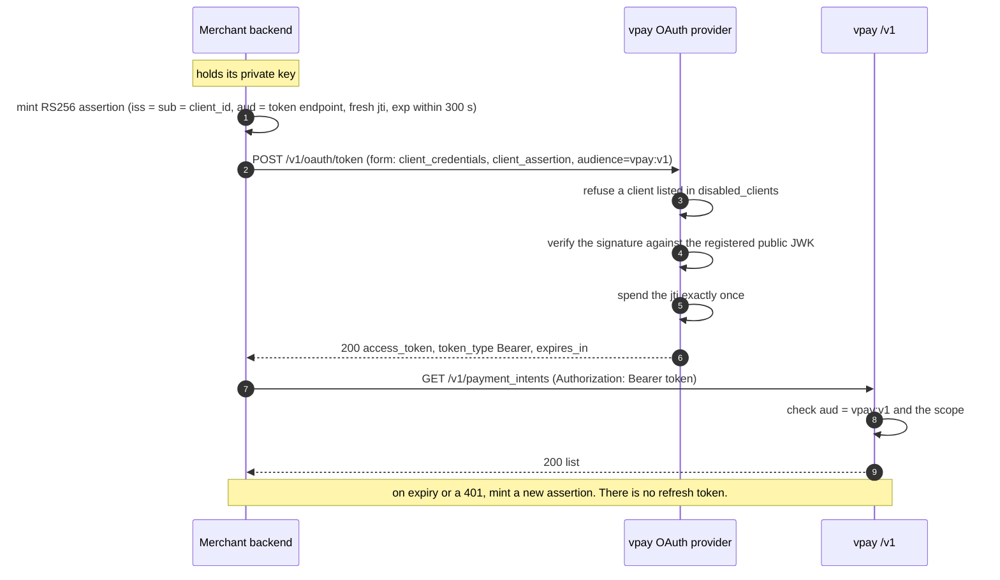

# Authentication

No `/v1` request runs without a short-lived access token that vpay issued
against an assertion only the merchant's own private key could have signed.
There is no API key of any shape. A merchant is an OAuth2 client registered in
vpay's YAML with its **public** JWK, and it authenticates with
`client_credentials` (RFC 6749 §4.4) using `private_key_jwt` client
authentication (RFC 7523).

This is the one place vpay deliberately stops looking like Stripe. Agents
working on it should load [vpay-merchant-api](skill:vpay-merchant-api).

## Why no `sk_live_` keys

vpay originally planned Stripe-shaped `sk_live_`/`sk_test_` bearer keys, and
[ADR-0010](vpay:docs/adr/0010-merchant-auth-private-key-jwt.md) reversed that.
The trigger was practical — the OAuth library's own database-backed client store
could not serve `private_key_jwt` at the pinned version, while a YAML-configured
registry has no such gap — but the result is stronger than the design it
replaced:

- **No shared secret exists anywhere.** Not in a table, not in an environment
  variable, not on the wire. The assertion is signed, not transmitted, and vpay
  holds only the public half. A stolen vpay database does not let anyone
  impersonate a merchant.
- **No refresh token.** A client re-authenticates with a fresh assertion
  instead, as RFC 6749 §4.4.3 recommends for this grant.
- **One grant only.** `authorization_code`, `refresh_token` and the device grant
  are refused with `unauthorized_client` before any store is touched.

The costs are stated just as plainly. Onboarding is a pull request, not a
self-serve flow: the merchant generates their own keypair, sends the public JWK,
and it lands in YAML and is deployed. Configuration loads once at boot, so a
rolling deploy has a window where one pod knows a new merchant and another does
not. And an official Stripe SDK needs glue to authenticate — which vpay ships;
see [Stripe SDK compatibility](/api/stripe-compat).

Revocation without a deploy is the `disabled_clients` table: an operator flips a
client to disabled and it takes effect on the next request. The table only ever
subtracts access; YAML stays authoritative for who exists and what their key is.

## The handshake



### 1. The client assertion

| Claim / header | Value                                                                                         |
| -------------- | --------------------------------------------------------------------------------------------- |
| `alg`          | `RS256` — the permitted algorithm comes from the registered key, never from the header        |
| `kid`          | optional with one registered key; **required** and exact when the merchant registered several |
| `iss`, `sub`   | both the `client_id`                                                                          |
| `aud`          | the OP's token endpoint URL or its issuer, as a single string                                 |
| `jti`          | a fresh UUIDv4 per assertion, spent exactly once server-side                                  |
| `exp`          | `now + lifetime`, lifetime 1–300 s (the SDKs default to 60)                                   |

The OP allows 60 seconds of clock leeway. Spent `jti`s do not pile up: the
worker's hourly `sweep_expired` job deletes the expired ones, so the table holds
at most about an hour's worth of expired rows. The delete itself is tested; no
test asserts that the job runs it.

::: warning `aud` is what vpay calls itself, not the URL you POST to
The OP compares `aud` against exactly two strings, both derived from
`deployment.public_base_url`: `{public_base_url}/v1/oauth/token` and the issuer
`{public_base_url}/v1/oauth`. If your server reaches vpay by an internal name —
a compose service, a private DNS name, a mesh address — set the audience
explicitly (`assertionAudience` in `@vaam-apps/vpay-sdk`,
`ClientBuilder::assertion_audience` in `vpay-sdk`). Left wrong, every token
request is `invalid_client` while the signature, key and lifetime are all
correct, and nothing on the wire says audience.
:::

### 2. The token request

`POST /v1/oauth/token`, form-encoded:

| Field                   | Value                                                    |
| ----------------------- | -------------------------------------------------------- |
| `grant_type`            | `client_credentials`                                     |
| `client_id`             | your `client_id` (always sent, so a log line names you)  |
| `client_assertion_type` | `urn:ietf:params:oauth:client-assertion-type:jwt-bearer` |
| `client_assertion`      | the JWT from step 1                                      |
| `audience`              | `vpay:v1`                                                |
| `scope`                 | only if you want less than your registration grants      |

`audience=vpay:v1` is load-bearing. Without it the OP mints a token addressed to
your `client_id`, and every `/v1` route refuses it with a bare `401`. vpay
refuses to boot a merchant registration whose `allowed_audiences` cannot target
`vpay:v1`, because neither runtime symptom would name the cause.

`examples/merchant-curl` shows the raw two-step. The first step is pseudocode —
`build_signed_jwt` is not a real tool; both SDKs mint the assertion for you:

```bash
# 1. Build a client assertion (RFC 7523).
ASSERTION=$(build_signed_jwt \
  --iss merchant_a --sub merchant_a --aud https://api.vpay.example/v1/oauth/token \
  --exp "+300s" --jti "$(uuidgen)" \
  --key merchant-a-private-key.pem --alg RS256)

# 2. Exchange the assertion for an access token.
curl -X POST https://api.vpay.example/v1/oauth/token \
  -d grant_type=client_credentials \
  -d client_id=merchant_a \
  -d client_assertion_type=urn:ietf:params:oauth:client-assertion-type:jwt-bearer \
  -d client_assertion="$ASSERTION" \
  -d audience=vpay:v1
# → { "access_token": "…", "token_type": "Bearer", "expires_in": 900 }
```

Errors follow RFC 6749's JSON
(`{ "error": "invalid_client", "error_description": "…" }`): `invalid_client` is
`401`, every other token error `400`. The SDKs never retry them.

### 3. Using the token

Every `/v1` call carries `Authorization: Bearer <access_token>`. Access tokens
live **900 seconds** (`vpay_api::op::ACCESS_TOKEN_TTL_SECS`, not configurable).
The SDKs cache the token until `expires_in` minus a safety margin, share one
in-flight token request between concurrent callers, and on a `401` from `/v1`
discard the token, re-authenticate once and retry once.

### Scopes

Two strings: `payments:write` for any method that is not a read, and
`payments:read` or `payments:write` for `GET`/`HEAD` (write implies read; an
unknown verb requires write). A token request that names no `scope` is granted
exactly the client's registered `scopes:` — which is what both SDKs do. A
narrower request keeps its narrower scope; anything outside the registration is
`invalid_scope`. A token carrying neither scope is `403 forbidden` on every
call.

## Discovery and JWKS

The issuer is `{deployment.public_base_url}/v1/oauth`, derived in one place, so
the `iss` a token is stamped with, the `iss` the validator pins and the
discovery document's `issuer` cannot drift apart. The path is not configurable.

- `GET /v1/oauth/.well-known/openid-configuration` is hand-built and advertises
  only what vpay serves: no `/authorize`, no `/userinfo`, no device or refresh
  grant, and `private_key_jwt` as the only client-auth method.
- `GET /v1/oauth/jwks.json` lists every publishable signing key — the active one
  plus any retired key still inside the 24-hour rotation window — with
  `Cache-Control: public, max-age=300`.

vpay's own signing key is one RSA PEM loaded at boot. Rotating it is a restart
with a new Secret; the retired key stays publishable for 24 hours so tokens it
already signed keep verifying, and rolling back to a retired key is refused with
exit `78`. Nobody has rotated one on a deployment — see
[the rotation runbook](vpay:docs/runbooks/rotate-signing-key.md).

## What can go wrong

| Failure                                          | What you see                                                  |
| ------------------------------------------------ | ------------------------------------------------------------- |
| Wrong private key, unregistered `kid`, typo'd id | `invalid_client` from the token endpoint                      |
| Client disabled in `disabled_clients`            | the token endpoint refuses, or `/v1` answers `401`            |
| Clock skew beyond 60 s                           | `invalid_client`, deliberately not saying which check failed  |
| Wrong `aud` (internal hostname)                  | `invalid_client`; set the assertion audience                  |
| Token minted without `audience=vpay:v1`          | `200` from the token endpoint, then `401` on every `/v1` call |
| New merchant, pod not yet restarted              | `invalid_client` from one replica, success from another       |

## Known limitations

::: danger Read these before trusting this with money

- **The `jti` replay namespace is global, not per merchant.** A merchant whose
  library used a counter or timestamp as `jti` could collide with — or pre-spend
  — another merchant's values. Until that changes, `jti` **must** be a UUIDv4
  (both vpay SDKs do this).
- **No rate limit on `/v1/oauth/token` or `/v1`.** It is left to the ingress,
  and nothing in the repository verifies the ingress does it.
- **The signing-key PEM is not zeroized** in memory.
  :::

## Status in this release

| Part                                        | Status                   | Evidence                                                                                                                                                                                          |
| ------------------------------------------- | ------------------------ | ------------------------------------------------------------------------------------------------------------------------------------------------------------------------------------------------- |
| Token endpoint, discovery, JWKS             | <Status s="built" />     | `merchant_token_flow.rs` boots a real router against a real Postgres; runs in CI                                                                                                                  |
| Replay protection (`jti` spent once)        | <Status s="built" />     | `the_same_client_assertion_cannot_be_spent_twice`                                                                                                                                                 |
| Kill switch (`disabled_clients`)            | <Status s="built" />     | `a_disabled_client_is_refused_with_invalid_client_and_401`, no restart in between                                                                                                                 |
| Rust SDK handshake                          | <Status s="built" />     | verified by the real pinned verifier and against a real router                                                                                                                                    |
| Node SDK handshake                          | <Status s="built" />     | its live suites (`invoices.live.test.ts`, `refunds.live.test.ts`) start with it against a real `vpay-server` in CI's `e2e` job; the conformance bridge to the Rust verifier stays a manual recipe |
| Per-merchant `jti` namespace, rate limiting | <Status s="not-built" /> | recorded limitations from the 2026-09-02 security review                                                                                                                                          |
| A real merchant completing the handshake    | <Status s="not-built" /> | no vpay outside a test process has ever done it                                                                                                                                                   |

The full record is
[docs/flows/merchant-auth.md § Status](vpay:docs/flows/merchant-auth.md#status).

## Go deeper

- [Merchant authentication and the SDK wire contract](vpay:docs/flows/merchant-auth.md)
- [Webhook verification, failure table and known limitations](vpay:docs/flows/merchant-auth/verification-and-limits.md)
- [ADR-0010: private_key_jwt, not API keys](vpay:docs/adr/0010-merchant-auth-private-key-jwt.md)
- [Raw HTTP with curl](vpay:examples/merchant-curl/README.md)
- [Rotating the OAuth signing key](vpay:docs/runbooks/rotate-signing-key.md)
- The SDKs that do all of this for you: [Node.js](/sdks/nodejs),
  [Rust](/sdks/rust)
- Skill: [vpay-merchant-api](skill:vpay-merchant-api)
