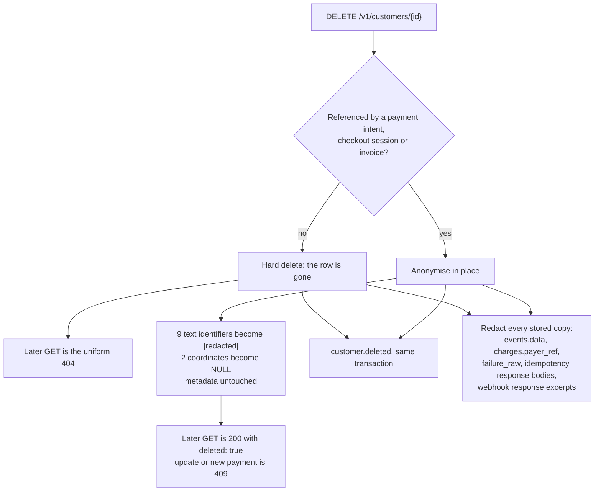

# Customers

A customer (`cus_…`, on `/v1/customers`) is the record of a payer a merchant
expects to see again: the merchant stores its id against their own user and
sends it back on later payment intents, checkout sessions and invoices. It is
also the only object in vpay whose entire content is **another person's personal
data** — so most of what matters about it is not its shape but the rules around
keeping and forgetting it.

Agents working on this resource should load
[vpay-customers](skill:vpay-customers).

## The object

```json
{
  "id": "cus_…",
  "object": "customer",
  "name": null,
  "email": null,
  "phone": "237600000200",
  "address": null,
  "metadata": { "order_id": "1234" },
  "created": 1753401600,
  "livemode": false
}
```

Nine keys, plus a tenth — `deleted: true` — only on an erased customer. On a
live one the key is **absent**, not `false`.

**At least one of `name`, `email` and `phone` is required, and `phone` alone is
enough.** That is a recorded maintainer decision: on a mobile-money rail the
phone number _is_ the payer. An address alone is not a customer. The example
above is complete.

**`phone` is stored canonical** — `2376XXXXXXXX`, twelve digits, no `+` —
whatever spelling was sent (`+237 6 00 00 02 00` and `600000200` both read back
as `237600000200`). It is canonicalised by the same function the account-holder
lookup uses, so it is the value a rail is given. Neither SDK validates it
locally.

**The phone number is not a key.** Two creates with the same number make two
customers. There is no unique index on `phone` or `email`, which is also what
stops two merchants on one deployment from discovering they share a payer. The
`Idempotency-Key` is what stops a _retry_ from creating a duplicate.

`last_used_at` (the retention clock) exists in the table and is deliberately not
on the wire.

## The address, and the GPS point

`address` is `null` or one nested object of eight nullable components — Stripe's
six plus two of vpay's own:

```json
"address": {
  "line1": "12 Rue Njo-Njo", "line2": null,
  "city": "Douala", "state": null, "postal_code": null, "country": "CM",
  "latitude_microdeg": 4061000, "longitude_microdeg": 9786000
}
```

- **Coordinates are integers in microdegrees.** `4.061` is a `400`, not a value
  vpay rounds; no floating-point number appears anywhere on the API. Formal
  addressing is unreliable in the markets vpay serves, and a point is how a
  place is actually found.
- **Both halves or neither**, within ±90 000 000 and ±180 000 000.
- **`country` is ISO 3166-1 alpha-2**, upper-cased on the way in. Its shape is
  checked; it is not resolved against a list.
- **An update replaces the address whole**, coordinate included. Correcting a
  street means sending the city (and the point) again; `address=` clears it. A
  component-wise merge would assemble an address that was never anybody's.

Nothing in vpay captures a coordinate from a payer — the hosted checkout
collects only an `msisdn`, and the payer-facing `/v1/browser` surface has no
customer on it. Every coordinate is one a merchant's server sent. Whether the
checkout page should ever ask, and whether merchants should read back a coarser
point by default, are open maintainer decisions.

## The routes

| Method   | Path                 | Notes                                                                        |
| -------- | -------------------- | ---------------------------------------------------------------------------- |
| `POST`   | `/v1/customers`      | `name`, `email`, `phone`, `address[…]`, `metadata[…]`                        |
| `GET`    | `/v1/customers/{id}` | answers an erased customer too, with `deleted: true`                         |
| `POST`   | `/v1/customers/{id}` | the update; `409` on an erased customer                                      |
| `GET`    | `/v1/customers`      | `limit`, `starting_after`, `ending_before`; erased customers included        |
| `DELETE` | `/v1/customers/{id}` | always `{"id", "object": "customer", "deleted": true}`, or the uniform `404` |

An update has **three states per field**: absent leaves it alone, a value sets
it, and an empty string clears it (`name=`). Clearing the last identifier is a
`400`. `metadata` is merged key-wise, and a key sent empty is removed. A
bodiless update is Stripe's no-op and writes nothing.

Every query is merchant-scoped in SQL. Another merchant's `cus_…` is the same
`404` as one that never existed, byte for byte — and naming one as `customer` on
a payment intent or checkout session is the same `400` a nonexistent one gets.

There is **no `email` filter** on the list, deliberately: a filter on a payer
identifier turns the list into a lookup.

## Erasure: `DELETE` in one of two shapes

`DELETE /v1/customers/{id}` never answers `409`. What it does depends on whether
anything references the customer, and the database decides inside the
transaction:



**Why not a soft delete?** A row flagged "this person asked to be forgotten" is
still the record of that person. An anonymised row holds nothing of theirs, and
a database CHECK refuses any row marked anonymised whose identifier columns are
not all in their erased state.

**Why keep the row at all?** A payment is never detached from the payer it was
taken from — that record is what a dispute is settled with — so the row stays
and the _payer_ goes. The asymmetry (a `404` in one case, a `200` with
`deleted: true` in the other) is Stripe's too.

**Every copy vpay kept goes in the same transaction**, not just the row: the
stored `customer.*` event bodies, the payer's MSISDN on charges, the rails' raw
decline messages (which can name the subscriber), stored idempotency response
bodies, and receiver response excerpts. A test scans every text and JSON column
in the schema before and after an erasure and finds none of the fixture's
identifiers afterwards.

::: warning The one copy vpay cannot erase
The merchant received the payer's details in `customer.created` and every
`customer.updated`, before the erasure. vpay cannot reach that copy. It tells
the merchant — `customer.deleted`, carrying the `cus_…` and nothing about the
person — but nothing obliges them to act on it. That is a data-processing
agreement, and the decision is recorded as **not taken**.
:::

## The twelve-month retention sweep

`sweep_idle_customers`, a worker job of its own that runs hourly, erases every
customer idle for more than 365 days — hard-deleting or anonymising exactly as
`DELETE` does, with one `customer.deleted` per erasure in the same transaction.
"Idle" is measured by `last_used_at`, which moves whenever the customer is
created, updated, or named by a payment intent, a checkout session or an invoice
(including at confirm). The stamp only ever moves forward, so a process with a
slow clock cannot rewind it.

For a hard-deleted customer, `customer.deleted` is the **only** way a merchant
can learn — a `GET` afterwards is indistinguishable from an id that never
existed.

## Events

| Write                                   | Event              |
| --------------------------------------- | ------------------ |
| `POST /v1/customers`                    | `customer.created` |
| `POST /v1/customers/{id}` that changes  | `customer.updated` |
| `POST /v1/customers/{id}` with no body  | nothing            |
| `DELETE /v1/customers/{id}`             | `customer.deleted` |
| the retention sweep                     | `customer.deleted` |
| a second `DELETE` on an erased customer | nothing            |

The update takes the row's lock before merging `metadata`, so two concurrent
updates produce two events describing the two committed states, never one
describing a merge that was lost. See [Webhooks](/api/webhooks).

## Status in v0.4.1

| Part                                     | Status                   | Evidence                                                                                          |
| ---------------------------------------- | ------------------------ | ------------------------------------------------------------------------------------------------- |
| Routes, object, address and GPS          | <Status s="built" />     | 24 cases in `customers.rs` through the shipping router against a real Postgres                    |
| Erasure, both shapes, every stored copy  | <Status s="built" />     | `an_erasure_leaves_no_payer_identifier_in_any_column_of_any_table`                                |
| Events (`created`, `updated`, `deleted`) | <Status s="built" />     | asserted at the `events` row; only `customer.created` has been delivered to a test receiver       |
| Retention sweep                          | <Status s="built" />     | proven through the real worker loop with a test-controlled horizon; no vpay has run twelve months |
| SDK customer methods                     | <Status s="partial" />   | at parity in both SDKs, but every server in their customer cases is a stub                        |
| Erasing the merchant's own copy          | <Status s="not-built" /> | cannot be built; the contractual decision is not taken                                            |

The full record is
[docs/flows/customers.md § Status](vpay:docs/flows/customers.md#status).

## Go deeper

- [Customers](vpay:docs/flows/customers.md)
- [The API, the three-state patch and tenancy](vpay:docs/flows/customers/api-and-code.md)
- [The address object and microdegrees](vpay:docs/flows/customers/address-and-gps.md)
- [Privacy, and what `DELETE` actually erases](vpay:docs/flows/customers/privacy-and-erasure.md)
- [The twelve-month retention sweep](vpay:docs/flows/customers/retention-sweep.md)
- [Customer events](vpay:docs/flows/customers/events.md)
- Related: [Account-holder lookup](/rails/account-holder-lookup), a stateless
  name check that is not a customer
- Skill: [vpay-customers](skill:vpay-customers)
