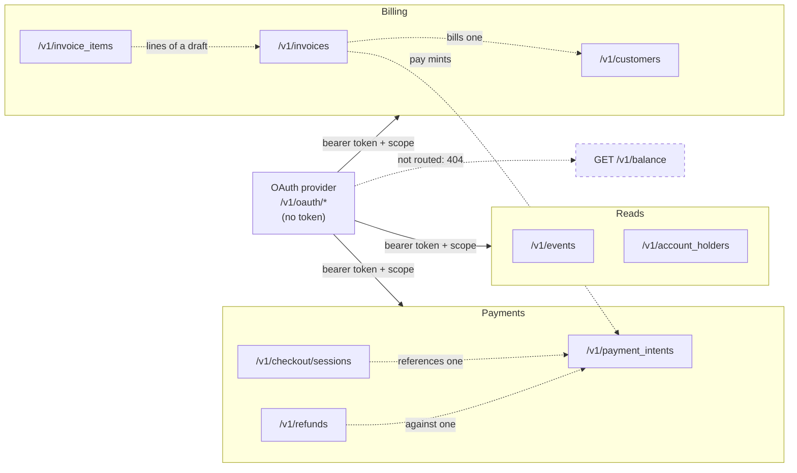
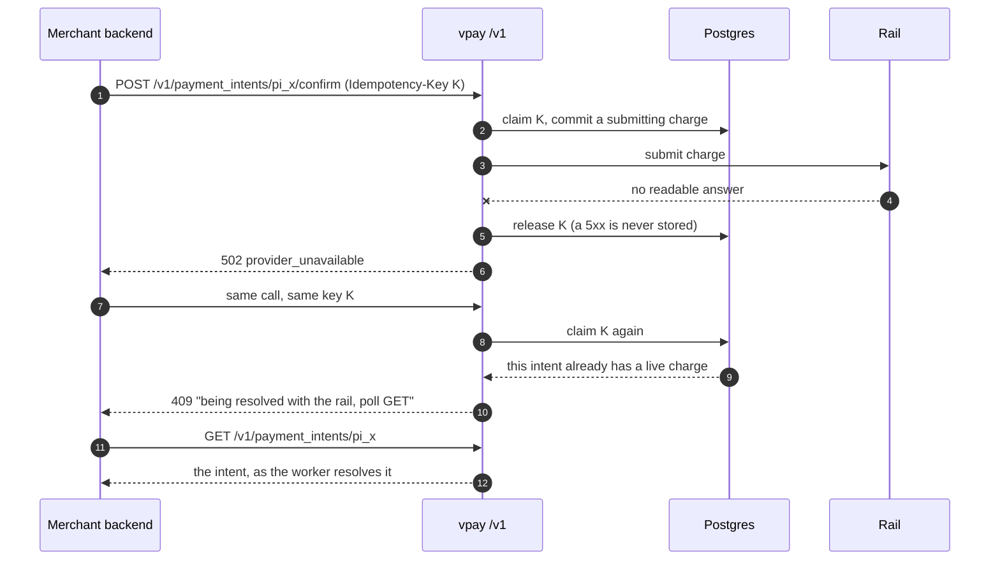

# Merchant API

`/v1` is the API a merchant's own backend calls. Its object model, form
encoding, error envelope and idempotency semantics are Stripe's, so an existing
Stripe integration reads naturally against it. Its **authentication is not**
Stripe's: there is no API key, only a short-lived bearer token obtained with
OAuth2 `client_credentials` + `private_key_jwt` (see
[Authentication](/api/authentication)).

Every route below is real — it answers with real rows from a real Postgres — but
the rails behind the money-moving ones have only ever been WireMock stubs, apart
from one MTN **sandbox** charge on 2026-09-15. Read [Status](/guide/status)
before you build on anything here.

Agents working on this surface should load
[vpay-merchant-api](skill:vpay-merchant-api).

## Four surfaces, four credential models

vpay exposes three authenticated HTTP surfaces and one public callback path.
They are kept apart on purpose — the API reference calls conflating any of them
a security bug.

| Surface                     | Caller                   | Credential                                                               | Page                                        |
| --------------------------- | ------------------------ | ------------------------------------------------------------------------ | ------------------------------------------- |
| `/v1`                       | the merchant's backend   | bearer token from `private_key_jwt`                                      | this section                                |
| `/v1/browser`               | the payer's browser      | publishable key + the intent's (or session's) `client_secret`            | [Browser checkout](/checkout/browser)       |
| `/dash/v1`                  | a signed-in staff member | OIDC session (authorization code + PKCE)                                 | [Dashboard auth](/dashboard/authentication) |
| `/provider/{code}/callback` | a rail                   | none — a callback only pulls a status query forward, never changes state | [Reconciler](/payments/reconciler)          |

`/v1/browser` is **not** a second way into `/v1`: it has its own route table,
its own 404 fallback and CORS, and exactly one route that is not a `GET`.
`/dash/v1` is mounted only on a deployment configured for the staff surface, and
— like everything else — has never run in a deployment. The provider callback
route is proven against WireMock and has never been called by MTN or Orange.

{.diagram}

## What is served on `/v1`

Unauthenticated, by necessity: `GET /healthz` and the merchant OAuth provider —
`POST /v1/oauth/token`, `GET /v1/oauth/.well-known/openid-configuration` and
`GET /v1/oauth/jwks.json`. Everything else sits behind a merchant bearer token
and a scope check:

| Resource                               | Methods                                                            |
| -------------------------------------- | ------------------------------------------------------------------ |
| `/v1/payment_intents`                  | `POST`, `GET`, `GET {id}`, `POST {id}/confirm`, `POST {id}/cancel` |
| `/v1/checkout/sessions`                | `POST`, `GET`, `GET {id}`, `POST {id}/expire`                      |
| `/v1/customers`                        | `POST`, `GET`, `GET {id}`, `POST {id}`, `DELETE {id}`              |
| `/v1/invoices`                         | `POST`, `GET`                                                      |
| `/v1/invoices/{id}`                    | `GET`, `POST`, `PATCH`, `DELETE`                                   |
| `/v1/invoices/{id}/finalize`           | `POST`                                                             |
| `/v1/invoices/{id}/void`               | `POST`                                                             |
| `/v1/invoices/{id}/mark_uncollectible` | `POST`                                                             |
| `/v1/invoices/{id}/pay`                | `POST`                                                             |
| `/v1/invoice_items`                    | `POST`                                                             |
| `/v1/invoice_items/{id}`               | `GET`, `POST`, `PATCH`, `DELETE`                                   |
| `/v1/events`                           | `GET`, `GET {id}`                                                  |
| `/v1/refunds`                          | `POST`, `GET`                                                      |
| `/v1/refunds/{id}`                     | `GET`, `POST`                                                      |
| `/v1/refunds/{id}/cancel`              | `POST`                                                             |
| `/v1/account_holders`                  | `GET`                                                              |

The table is the constant `vpay_api::V1_ROUTES`, and a boundary test walks that
constant rather than a list of its own, asserting every entry answers `401`
without a token — so a route cannot be mounted without being covered.

`POST` and `PATCH` are one handler on `/v1/invoices/{id}` and
`/v1/invoice_items/{id}`. Stripe's API has no `PATCH`, so an existing client
sends `POST`; `PATCH` sits beside it because a partial update is what the verb
means. There is no collection `GET` on `/v1/invoice_items` — an invoice's lines
are read from the invoice.



### Scopes

Two scopes exist: `payments:write` for any method that is not a read, and either
`payments:read` or `payments:write` for `GET`/`HEAD`. A valid token with neither
is a `403 forbidden`, not a `401` — the credential is fine, it just authorises
nothing. An authenticated request to a path with no route is
`404 unknown_route`.

## Bodies and errors

Request bodies are `application/x-www-form-urlencoded`, bracket-nested the way
Stripe's SDKs send them (`metadata[order_id]=1234`,
`payment_method_types[0]=mtn_momo`; the unindexed `[]` spelling is accepted
too). A JSON body is refused with a `400` telling you to send a form, and a body
over **64 KiB** is refused. Amounts are integer minor units — see
[Money](/payments/money).

Every non-2xx response the API renders is Stripe's envelope:

```json
{
  "error": {
    "type": "invalid_request_error",
    "code": "…",
    "message": "…",
    "param": "…"
  }
}
```

The status, `type` and `code` are derived from one classification of the failing
error, never chosen per handler, so the same failure always gets the same
answer. `message` never carries hosts, table names or credentials. Two responses
are produced above that renderer and carry an empty or plain-text body instead:
a `405` (right path, wrong method) and a `413` (body too large). The full
category table is on [Errors](/payments/errors).

## `Idempotency-Key` is required on every `POST`

This is stricter than Stripe, where the header is optional. A `POST` without one
is a `400` naming `idempotency_key`, before anything is created. Keys are 1–255
printable-ASCII bytes, scoped to your merchant, and kept for 24 hours. Both vpay
SDKs, and stripe-node, send one on every `POST` automatically, so in practice
this only bites a hand-rolled client.

| What you did                             | What you get                                            |
| ---------------------------------------- | ------------------------------------------------------- |
| Same key, same body, first call finished | the stored response, byte for byte                      |
| Same key, different body                 | `400` `idempotency_error` / `idempotency_key_in_use`    |
| Same key, first call still running       | `400` `idempotency_error` / `idempotency_key_in_flight` |
| First call answered `5xx`                | the key is released; the retry re-executes              |
| Deployment changed under a replay        | the replay still answers what the original did          |

Stripe answers `409` for a key still in flight; vpay answers `400`, because the
status comes from the error's category. Branch on `code`, which is distinct
either way.

The case that matters most is a confirm that timed out at the rail. The `502`
releases the key, and the retry re-executes — which is safe, because it is not
the key that prevents a second charge but the database rule "one charge per
intent, forever":



::: warning Do not open a second intent after a 502
On a push rail a second PaymentIntent prompts the payer's handset a second time
for the same money. Retry under the same key, and if the answer is the `409`
saying the charge is being resolved, poll the `GET`. Only a `409` saying the
charge is terminal means "create a new intent".
:::

## Refunds: a `201` is not money back

The four refund write routes were mounted on 2026-09-16. A `201` from
`POST /v1/refunds` means vpay wrote the refund as `pending`, reserved its amount
against the intent, emitted `charge.refunded` in the same transaction, and
instructed the rail. It does **not** mean money moved:

- **nothing settles a `pending` refund** — the provider port has no refund
  status read and there is no refund poll ladder (RFC-0003 open question 8);
- `mtn_momo::refund` makes MTN's Disbursements `transfer` call, but no real
  Disbursements credential exists in the project and that product has never been
  called — it is WireMock-proven only;
- `orange_money::refund` is a declared `NotImplemented` token, which fails the
  refund, releases its reservation and answers `501`.

`destination[<payment_method_type>][msisdn]` is required on both rails (a
mobile-money refund is an outbound transfer and needs a payee), and
`POST /v1/refunds/{id}/cancel` in practice refuses every refund the create route
produces, because the rail has already been handed the transfer by the time you
hold the `re_…`.

## `GET /v1/balance` is not routed

It answers the honest `404` from the nest's fallback, to an authenticated
caller, because there is no ledger read path — a `200` would mean somebody
invented a resource. Both SDKs can call it and get that `404`.

## Status in this release

| Part                                        | Status                   | Evidence                                                                                        |
| ------------------------------------------- | ------------------------ | ----------------------------------------------------------------------------------------------- |
| OAuth provider and the `/v1` 401 boundary   | <Status s="built" />     | integration suites over a real router and Postgres, run in CI                                   |
| Payment intents, checkout sessions          | <Status s="partial" />   | real routes and rows; confirm reaches a rail that has only been a stub (one MTN sandbox charge) |
| Customers, invoices, events                 | <Status s="built" />     | container-backed integration suites through the shipping router                                 |
| Idempotency                                 | <Status s="built" />     | every row of the table above is a named integration test against a real Postgres                |
| Refunds                                     | <Status s="unproven" />  | routes and rows are real; no rail has ever refunded and nothing settles `pending`               |
| `GET /v1/balance`                           | <Status s="not-built" /> | honest `404`                                                                                    |
| Rate limiting on `/v1` or `/v1/oauth/token` | <Status s="not-built" /> | left to an ingress nothing in the repository verifies                                           |

The full record is [docs/api/README.md](vpay:docs/api/README.md) and
[docs/status/backend.md](vpay:docs/status/backend.md).

## Go deeper

- [API reference, every route and its answers](vpay:docs/api/README.md)
- [README — what is served on `/v1` today](vpay:README.md)
- [The resource contract the SDKs implement](vpay:docs/flows/merchant-auth/resource-contract.md)
- [RFC-0003: refunds and their destinations](vpay:docs/rfc/0003-refunds-destinations-and-the-first-ledger-postings.md)
- [Raw HTTP walkthrough with curl](vpay:examples/merchant-curl/README.md)
- Skill: [vpay-merchant-api](skill:vpay-merchant-api)
