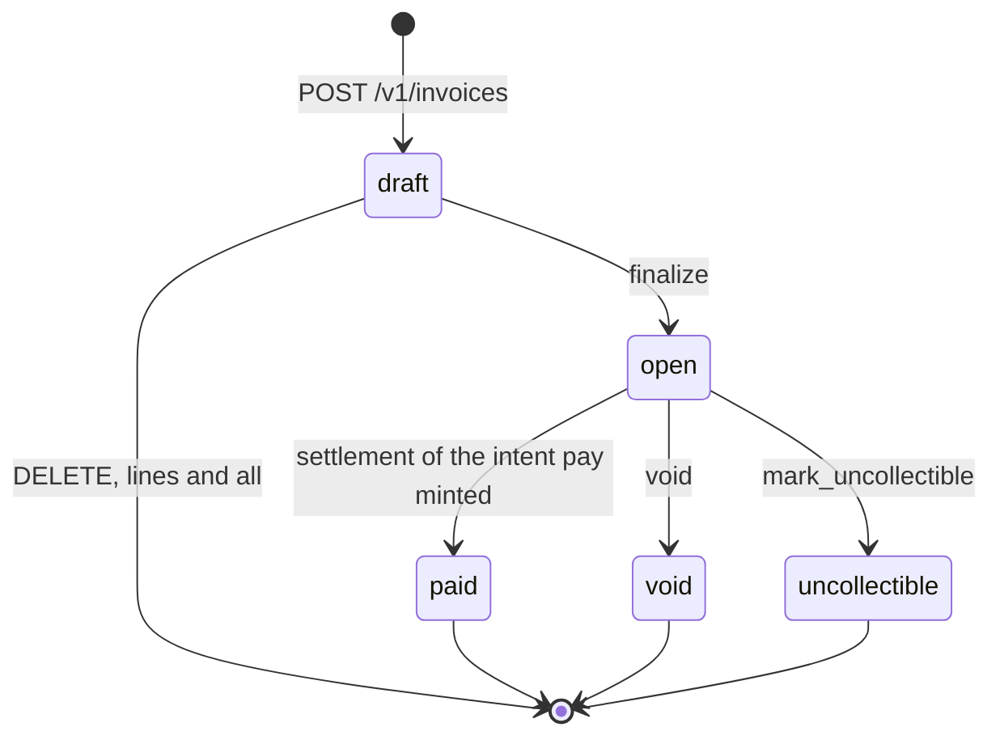
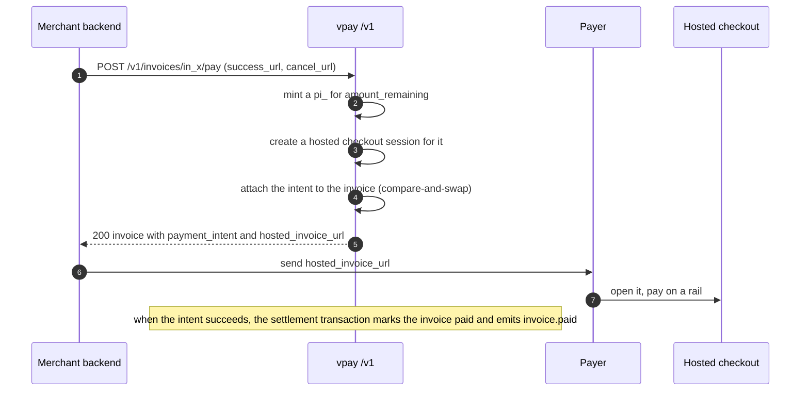

# Invoices

An invoice (`in_…`) is a merchant's bill to one customer. It is Stripe's
`invoice` narrowed to what a Cameroon merchant needs to bill a phone: lines, a
number, a state machine, and a way to get paid through the checkout page vpay
already has. There is **no PDF, no e-mail, no tax, no credit note, no dunning
and no subscription** — see [What is not built](#what-is-not-built).

Agents working on invoices should load [vpay-invoices](skill:vpay-invoices).

## Two objects

**The invoice** has nineteen keys:

| Field                                             | Meaning                                                             |
| ------------------------------------------------- | ------------------------------------------------------------------- |
| `id`, `object`                                    | `in_…`, `"invoice"`                                                 |
| `customer`                                        | the `cus_…` this bills — **required**, never `null`                 |
| `currency`                                        | lower-case; every line is in it                                     |
| `status`                                          | `draft`, `open`, `paid`, `void` or `uncollectible`                  |
| `number`                                          | `{prefix}-{000001}`, assigned at finalize, `null` while a draft     |
| `amount_due` / `amount_paid` / `amount_remaining` | integer minor units                                                 |
| `amount_refunded`                                 | how much of `amount_paid` has been given back, gross                |
| `due_date`                                        | unix seconds, **advisory** — nothing in vpay reads it               |
| `description`, `metadata`                         | the merchant's own                                                  |
| `payment_intent`                                  | the `pi_…` paying it, or `null`                                     |
| `hosted_invoice_url`                              | a checkout session for that intent, or `null` — not an invoice page |
| `lines`                                           | every line, always expanded, `has_more` always `false`              |
| `status_transitions`                              | `finalized_at`, `paid_at`, `voided_at`, `marked_uncollectible_at`   |
| `created`, `livemode`                             | as everywhere else                                                  |

`customer` is required because an invoice is a bill to _somebody_ — it carries a
number people quote and may be chased for months, and `pay` needs a payer to
bind an intent to.

**A line** (`ii_…`) is `id`, `description`, `quantity`, `unit_amount`, `amount`,
`currency`, `livemode` — nothing else. `amount` is never a parameter: it is
`quantity * unit_amount`, and the database checks it.

The route is `/v1/invoice_items` and the object is `line_item`, on purpose.
Stripe has two objects (a pending `invoiceitem` and an attached `line_item`);
vpay writes lines straight onto a named draft, so it keeps Stripe's route
spelling for existing clients and Stripe's `lines` spelling for handlers that
switch on it.

## The state machine



`paid`, `void` and `uncollectible` are terminal: nothing in vpay moves an
invoice out of them. **Finalize** takes the next number under a row lock,
freezes the lines and sums `amount_due` once; a draft with no lines is a `400`.
Only a draft can be edited, have lines added, or be deleted — an issued invoice
is **voided**, never deleted, and keeps its number.

Three things enforce this, and none is a validation function: a CHECK closing
the five labels; every transition written as a compare-and-swap on the current
status, where "matched no row" _is_ the refusal; and five multi-column CHECKs
(`number_is_assigned_at_finalize`, `paid_means_nothing_remaining`,
`only_a_live_invoice_has_an_intent`, `amounts_add_up`, `amount_is_the_product`)
that make the combinations a broken transition would produce unstorable.

### Numbers without holes

A number is `{prefix}-{000001}`: an eight-character random prefix per merchant
from Crockford's upper-case alphabet (no `I`, `L`, `O` or `U` to misread off a
receipt), then that merchant's own 1-based sequence. The sequence is an ordinary
table row, not a Postgres `SEQUENCE`, so a finalize that rolls back burns no
number — because a tax authority reads a missing invoice number as a destroyed
document. Two concurrent finalizes take consecutive numbers.

## Paying, on a market with no stored payment methods

Stripe's `pay` charges a card already on file. On mobile money there is nothing
on file — a payment is a payer approving a prompt on their own handset — so
vpay's `POST /v1/invoices/{id}/pay` does something different:



- **It needs `success_url` and `cancel_url`**, because a hosted session does.
  They can be sent on the request or configured once per merchant; a request's
  own values always win, and with neither there is one `400` naming both. vpay
  never invents a return page.

  ```yaml
  merchant_clients:
    - client_id: acme-cameroon
      merchant_id: acme-cameroon-tenant
      invoices:
        success_url: https://shop.acme.example/invoice-paid
        cancel_url: https://shop.acme.example/invoice-cancelled
  ```

- **No invoice page.** The payer sees the existing checkout page — merchant name
  and amount. The invoice number is in the intent's `description` but **the page
  does not show it**, which is a recorded gap.
- **Paid in the settlement transaction**, not afterwards, so there is no window
  where the intent is `succeeded` and the invoice still says money is owed.
- **A failed intent leaves the invoice `open`** and emits nothing about the
  invoice; the merchant hears `payment_intent.payment_failed`.
- **One payment at a time.** While an attached intent is not `canceled`, `pay`,
  `void` and `mark_uncollectible` are `409`. Cancel the intent to get them back.
  Partial payments are out of scope, enforced by the database.

Paying an invoice is exactly as proven as the rails are: apart from one MTN
sandbox charge, every rail call vpay has made went to a WireMock stub.

## Refunds against a paid invoice

Decided, and not reachable. A refund leaves the invoice `paid` and adds to
`amount_refunded` (gross, beside the arithmetic, never more than `amount_paid`),
in the refund's own settlement transaction, with no second `invoice.paid`. But
nothing in vpay settles a `pending` refund and no rail has ever returned money,
so **`amount_refunded` is `0` on every invoice in every deployment**.

## Events

| Type                | Written by                        |
| ------------------- | --------------------------------- |
| `invoice.created`   | `POST /v1/invoices`               |
| `invoice.finalized` | `POST /v1/invoices/{id}/finalize` |
| `invoice.paid`      | the settlement transaction        |
| `invoice.voided`    | `POST /v1/invoices/{id}/void`     |

A refused transition writes none. Webhook bodies carry `lines.data` **empty**
(rendering lines inside the transaction would mean a second query while holding
the number lock); read `GET /v1/invoices/{id}` for them. There is no
`invoice.marked_uncollectible` and no `invoice.payment_failed` — find write-offs
with `GET /v1/invoices?status=uncollectible`.

## The surface

| Route                                  | Methods                          | Notes                                                   |
| -------------------------------------- | -------------------------------- | ------------------------------------------------------- |
| `/v1/invoices`                         | `POST`, `GET`                    | list takes `customer`, `status` and the standard cursor |
| `/v1/invoices/{id}`                    | `GET`, `POST`, `PATCH`, `DELETE` | `POST`/`PATCH` are one handler; writes are draft-only   |
| `/v1/invoices/{id}/finalize`           | `POST`                           |                                                         |
| `/v1/invoices/{id}/void`               | `POST`                           |                                                         |
| `/v1/invoices/{id}/mark_uncollectible` | `POST`                           | emits no event                                          |
| `/v1/invoices/{id}/pay`                | `POST`                           | `success_url`, `cancel_url` — sent or configured        |
| `/v1/invoice_items`                    | `POST`                           | no collection `GET`                                     |
| `/v1/invoice_items/{id}`               | `GET`, `POST`, `PATCH`, `DELETE` | writes need a draft parent                              |

Another merchant's `in_…` is the same `404` as one that never existed on every
route, the transitions included, so a `409` naming a status cannot leak
existence.

## What is not built

- No PDF, no e-mail, no hosted invoice page — `hosted_invoice_url` is a checkout
  session.
- No taxes, discounts or credit notes; no subscriptions or recurring invoices.
- No dunning, reminders or automatic `uncollectible` — `due_date` is read by
  nothing.
- No partial payments; no invoice screen in the dashboard.
- No invoice cases in the `stripe` compatibility suite, and no browser test from
  an invoice to a paid charge.
- Amounts above `2^53 - 1` minor units cannot be finalized.

## Status in this release

| Part                                     | Status                   | Evidence                                                                   |
| ---------------------------------------- | ------------------------ | -------------------------------------------------------------------------- |
| Routes, state machine, numbering         | <Status s="built" />     | 16 cases in `invoices.rs` against a real Postgres and the shipping router  |
| Paid inside the settlement transaction   | <Status s="built" />     | `apply_succeeded_pays_the_invoice_the_intent_was_for` and its aborted twin |
| Both merchant SDKs                       | <Status s="built" />     | stub-backed wire tests plus a live suite each, run in CI's `e2e` job       |
| Paying through a real rail               | <Status s="unproven" />  | the rails behind `pay` are WireMock stubs                                  |
| Refund accounting (`amount_refunded`)    | <Status s="unproven" />  | written and tested at the database; no shipping path reaches it            |
| PDF, e-mail, tax, dunning, subscriptions | <Status s="not-built" /> | out of scope, listed above                                                 |

The full record is
[docs/flows/invoices.md § Status](vpay:docs/flows/invoices.md#status).

## Go deeper

- [Invoices — object model, state machine, paying, refunds](vpay:docs/flows/invoices.md)
- [The invoice object in the API reference](vpay:docs/api/README.md)
- Related: [Customers](/api/customers), [Hosted checkout](/checkout/hosted)
- Skill: [vpay-invoices](skill:vpay-invoices)
