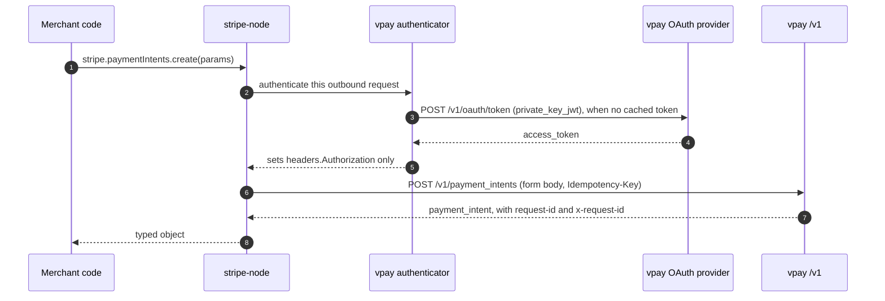

# Stripe SDK compatibility

vpay's `/v1` object model, form encoding, error envelope and idempotency are
Stripe's; its authentication is not. The official `stripe` package (stripe-node)
cannot mint a `private_key_jwt` assertion by itself — but it accepts an
arbitrary async `config.authenticator`, invoked once per request attempt, and
`@vaam-apps/vpay-sdk/stripe` supplies one. With it, an existing stripe-node
integration reaches vpay with an **empty** API key.

This is proven, not argued: `sdks/stripe-compat` drives the real `stripe`
package against a live compose stack in CI's `e2e (compose)` job. What it
proves, and where the two APIs differ, is below. Agents working on the SDKs
should load [vpay-sdks](skill:vpay-sdks).

## The client

```js
import { readFileSync } from "node:fs";
import Stripe from "stripe";
import { createStripeAuthenticator } from "@vaam-apps/vpay-sdk/stripe";

const authenticator = createStripeAuthenticator({
  baseUrl: "https://api.vpay.example",
  clientId: "acme-cameroon",
  privateKey: readFileSync("./merchant-key.pem", "utf8"),
  kid: "acme-cameroon-2026-08", // only if you registered more than one JWK
});

const stripe = new Stripe("", {
  authenticator,
  host: "api.vpay.example",
  port: "443",
  protocol: "https",
  maxNetworkRetries: 2,
  timeout: 30_000,
  telemetry: false,
});
```

stripe-node refuses only when both a key and an authenticator are given, or
neither, so `new Stripe("", { authenticator })` is legal. `host`, `port` and
`protocol` move every request off `api.stripe.com`; the generated resources use
absolute paths (`/v1/payment_intents`, `/v1/payment_intents/{id}/confirm`) that
are exactly vpay's. The authenticator writes only `headers.Authorization` — it
must not touch the body, whose length is computed before it runs.

`examples/merchant-stripe-node` is a runnable version: create, confirm on the
MTN push rail, and poll `paymentIntents.retrieve` until `succeeded` — against a
WireMock rail.



## What carries over unchanged

| Behaviour                 | Why it works                                                                                               |
| ------------------------- | ---------------------------------------------------------------------------------------------------------- |
| Resource paths            | stripe-node hardcodes the same `/v1/payment_intents` paths vpay serves                                     |
| Form encoding             | stripe-node's indexed arrays (`payment_method_types[0]=…`) and `%2B` for `+` are what vpay's decoder takes |
| `Idempotency-Key`         | stripe-node sends one on every v1 `POST`, which vpay requires                                              |
| Lists and auto-pagination | `autoPagingToArray` needs only `data[].id` and `has_more`                                                  |
| Error envelope            | `{ error: { type, code, message, param? } }` from the same closed vocabulary                               |
| `webhooks.constructEvent` | vpay's signature construction is byte-identical; see [Webhooks](/api/webhooks)                             |
| `err.requestId`           | vpay sends `request-id` (the only name stripe-node reads) as well as `x-request-id`, one value             |

## Which error class you catch

stripe-node picks the class from the **status first**, and vpay derives status,
`type` and `code` from one classification — so this mapping is a property of the
two designs meeting.

| vpay answer                  | What you catch                                                      |
| ---------------------------- | ------------------------------------------------------------------- |
| `404` `resource_missing`     | `StripeInvalidRequestError`, `err.code === "resource_missing"`      |
| `400` `invalid_request`      | `StripeInvalidRequestError`, `err.param` naming the field           |
| `400` `idempotency_error`    | `StripeIdempotencyError`                                            |
| `401` `authentication_error` | `StripeAuthenticationError`                                         |
| `403` (missing scope)        | `StripePermissionError`, because stripe-node branches on the status |
| `409` (lifecycle conflict)   | `StripeAPIError`                                                    |
| `502` (rail transport)       | `StripeAPIError` — and stripe-node retries it                       |
| `429`                        | never emitted                                                       |

vpay sets `stripe-should-retry` on every error it renders: `false` on a `409`
(which stripe-node would otherwise retry unconditionally) and `true` on an
in-flight idempotency key (which it would otherwise never retry). A replayed
response carries the advisory the original did.

## Every divergence

| Area                                                                                           | vpay's behaviour                                                                                                                                                                 |
| ---------------------------------------------------------------------------------------------- | -------------------------------------------------------------------------------------------------------------------------------------------------------------------------------- |
| API keys, `stripeAccount`, Connect                                                             | none exist; `Stripe-Account`, `Stripe-Version`, `Stripe-Context` and `X-Stripe-Client-*` are accepted and ignored                                                                |
| API version                                                                                    | none advertised or echoed; `lastResponse.apiVersion` is `undefined` and pinning `apiVersion` does nothing                                                                        |
| `payment_method_types`                                                                         | required, non-empty, each a rail this deployment enabled; `automatic_payment_methods` is dropped and the create is refused for the missing field                                 |
| `confirm: true` on create                                                                      | refused with `param: "confirm"`; `confirm=false` is accepted                                                                                                                     |
| `payment_method_data.type`                                                                     | a rail code such as `mtn_momo`, with the instrument under the same key (`payment_method_data[mtn_momo][msisdn]`); TypeScript needs a cast                                        |
| `capture_method` (not `automatic`), `application_fee_amount`, `transfer_data`, `on_behalf_of`  | **refused** with a `400` naming the field, on create and confirm — ignoring them would move money at a time or to an account nobody asked for                                    |
| `setup_future_usage`, `confirmation_method`, `receipt_email`, `statement_descriptor`, `expand` | accepted and ignored; nothing is expandable                                                                                                                                      |
| `metadata`, `customer`                                                                         | stored and rendered on every read; a `cus_…` that is not yours is a `400` naming `customer`                                                                                      |
| `client_secret`                                                                                | on `create` and `retrieve` only; absent from `confirm`, `cancel`, `list` and every webhook body                                                                                  |
| `amount_received`, `capture_method`, `confirmation_method` on the object                       | absent, though stripe-node's types declare them                                                                                                                                  |
| `next_action`                                                                                  | only ever `redirect_to_url`, only on a redirect rail; `null` on a push rail                                                                                                      |
| Currencies                                                                                     | XAF and EUR in integer minor units; a confirm whose currency is not the rail's settlement currency is a `400`                                                                    |
| Status vocabulary                                                                              | no `failed`; a refused charge returns the intent to `requires_payment_method` with `last_payment_error`                                                                          |
| In-flight idempotency key                                                                      | `400`, where Stripe answers `409`                                                                                                                                                |
| `search`, `/v1/balance`                                                                        | not routed; `404 unknown_route`                                                                                                                                                  |
| `refunds.create`                                                                               | needs `destination[<rail>][msisdn]`, which Stripe has no parameter for; a `201` is a `pending` refund no rail has ever settled                                                   |
| `refunds.update`                                                                               | metadata only, as Stripe — but an unaccepted parameter is a `400` naming it, not `parameter_unknown`                                                                             |
| `405` and `413`                                                                                | produced below the error renderer, with no JSON body — stripe-node throws "Invalid JSON received from the Stripe API" with `statusCode` undefined; only `err.requestId` survives |
| Checkout                                                                                       | vpay's `checkout.session` is its own (no `line_items`, `mode` or `amount_total`); the compat suite makes no claim about it                                                       |
| Rust                                                                                           | no `async-stripe` twin; Rust merchants use `vpay-sdk`                                                                                                                            |

::: warning A 502 from the rail is re-POSTed
stripe-node retries a `502` unconditionally, under the same `Idempotency-Key`.
The retry meets vpay's one-charge-per-intent rule and comes back as a `409`.
That is the predicted consequence of the headers — **no test observes it**,
because the compose stack's WireMock rails cannot be steered into a transport
failure from outside.
:::

## What the suite proves

`sdks/stripe-compat` runs the real `stripe@22.6.1` package, out of process over
TCP, against a real `vpay-server`, Postgres, worker, WireMock rails and a
WireMock webhook receiver. Its setup **fails** the run if no stack answers or
the handshake does not complete, so it cannot skip. It covers create, retrieve,
cursor paging including `autoPagingToArray`, cancel, confirm to `processing` and
a poll to `succeeded`; a delivered webhook verified with
`stripe.webhooks.constructEvent` and refused for a tampered body and a wrong
secret; the request-id mirror; ignored `Stripe-Version`/`Stripe-Account`;
`expand` through stripe-node's own encoding; the error classes above with
`err.requestId`; each refused money-moving field naming itself; the `409`'s
`stripe-should-retry: false`; idempotent replay and a changed body under the
same key; and the `405`/`413` collapse.

**Not proven:**

- the `stripe-should-retry: true` direction (provoking an in-flight key
  deterministically would need a test double in a shipping process);
- the `502` re-POST above;
- `stripe.refunds.*` and `stripe.events.list()` through stripe-node — the routes
  exist, but no case drives them;
- anything about a real rail: the `succeeded` the suite polls to is a WireMock
  mapping answering `SUCCESSFUL`, driven through the real worker and settlement;
- delivery to a real endpoint: the receiver is WireMock too;
- any `stripe` release other than `22.6.1`.

## Status in this release

| Part                                               | Status                   | Evidence                                                                                                |
| -------------------------------------------------- | ------------------------ | ------------------------------------------------------------------------------------------------------- |
| stripe-node through `createStripeAuthenticator`    | <Status s="built" />     | `sdks/stripe-compat`: 25 cases, 0 skipped when measured on 2026-09-03; runs in CI's `e2e (compose)` job |
| Webhook verification with `constructEvent`         | <Status s="built" />     | `webhooks.compat.test.ts`, over bytes read from the receiver's journal                                  |
| Refunds and events through stripe-node's resources | <Status s="unproven" />  | the routes are served; no compat case calls them                                                        |
| A `405`/`413` stripe-node can read                 | <Status s="not-built" /> | no envelope renderer for either                                                                         |
| Rust (`async-stripe`) glue                         | <Status s="not-built" /> | scoped as a follow-up                                                                                   |
| Against a real rail                                | <Status s="not-built" /> | every rail in the suite is WireMock                                                                     |

The full record is
[docs/flows/stripe-sdk-compat.md § Status](vpay:docs/flows/stripe-sdk-compat.md#status).

## Go deeper

- [Using the official Stripe SDKs against vpay](vpay:docs/flows/stripe-sdk-compat.md)
- [The compat suite](vpay:sdks/stripe-compat/README.md)
- [The authenticator's source](vpay:sdks/nodejs/src/stripe-auth.ts)
- [A runnable stripe-node example](vpay:examples/merchant-stripe-node/README.md)
- [ADR-0010 and its 2026-09-03 amendment](vpay:docs/adr/0010-merchant-auth-private-key-jwt.md)
- The Node SDK itself: [Node.js](/sdks/nodejs); all SDKs: [SDKs](/sdks/)
- Skill: [vpay-sdks](skill:vpay-sdks)
