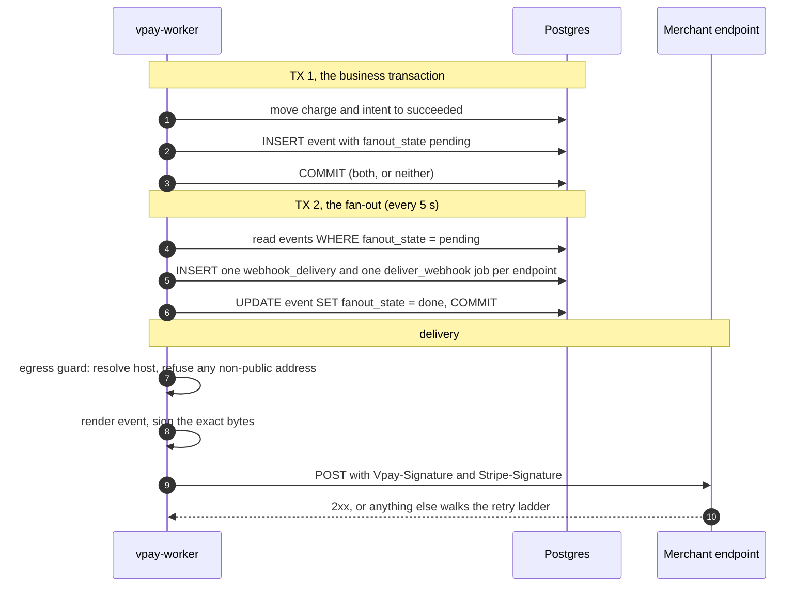
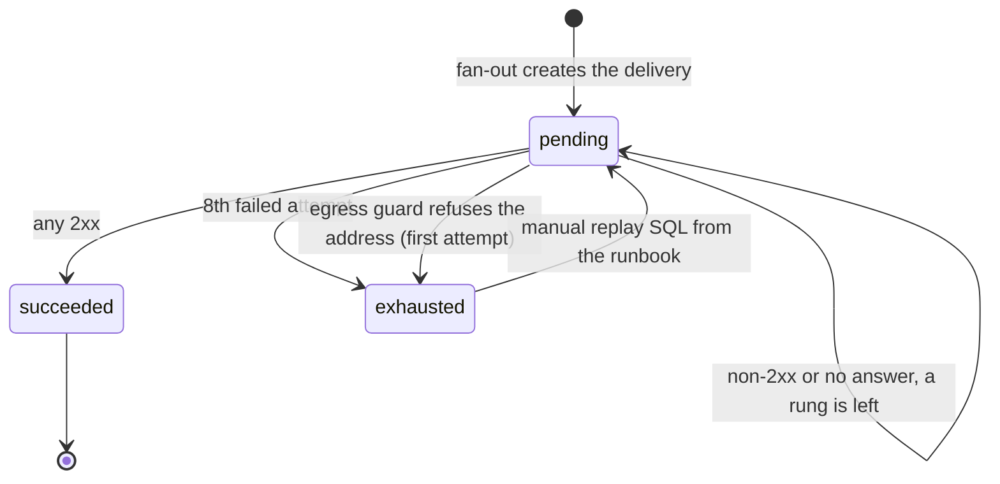

# Webhooks

vpay tells a merchant that something happened — a payment settled, a customer
was erased, an invoice was paid — by POSTing a signed `event` to an endpoint the
merchant configured. The signature scheme is Stripe's, copied exactly, so
existing verification code works unchanged.

::: warning Never to a merchant outside this repository
Every receiver in vpay's history is a WireMock host or the demo shop, both on a
compose network. **No webhook has ever reached a merchant endpoint outside this
repository**, and no deployment has ever refused one either.
:::

Agents working on delivery should load [vpay-webhooks](skill:vpay-webhooks).

## Only real Stripe event types

The vocabulary is fifteen types, closed by a database CHECK so nothing else can
be written. A custom type would be silently dropped by any merchant using
stripe-node's typed event union or an exhaustive `switch`, which is why a late
success is a plain `payment_intent.succeeded` and not something new.

| Type                            | Written by                                                       |
| ------------------------------- | ---------------------------------------------------------------- |
| `payment_intent.created`        | **nothing** — events are for terminal transitions only           |
| `payment_intent.processing`     | **nothing** — same reason                                        |
| `payment_intent.succeeded`      | the settlement transaction                                       |
| `payment_intent.payment_failed` | the settlement transaction, **and** a decline at submit          |
| `payment_intent.canceled`       | `POST /v1/payment_intents/{id}/cancel`                           |
| `charge.refunded`               | `POST /v1/refunds`                                               |
| `charge.refund.updated`         | a refund's metadata update, cancel, or a rail refusing it        |
| `checkout.session.expired`      | the hourly expiry sweep (not a merchant's own `expire`)          |
| `customer.created`              | `POST /v1/customers`                                             |
| `customer.updated`              | `POST /v1/customers/{id}` when something changed                 |
| `customer.deleted`              | `DELETE /v1/customers/{id}` and the twelve-month retention sweep |
| `invoice.created`               | `POST /v1/invoices`                                              |
| `invoice.finalized`             | `POST /v1/invoices/{id}/finalize`                                |
| `invoice.paid`                  | the settlement transaction                                       |
| `invoice.voided`                | `POST /v1/invoices/{id}/void`                                    |

A few shapes to know:

- **`charge.refunded` reports an _instructed_ refund, not a returned one.** The
  refund in `data.object` is `pending`, and nothing in vpay settles a `pending`
  refund. Its `fee` is always present and always `null` — and `null` is not `0`.
- **`checkout.session.expired`** carries a `checkout.session` whose `url` is
  always `null` (a hosted `url` carries a secret) and has no `client_secret`.
  `url: null` does not mean the session was embedded — read `ui_mode`.
- **`customer.deleted`** carries the customer with every identifier already
  `[redacted]`. See [Customers](/api/customers).
- **`invoice.*` bodies carry `lines.data` empty**; `GET /v1/invoices/{id}`
  always carries the lines.
- `invoice.marked_uncollectible`, `invoice.payment_failed` and
  `checkout.session.completed` are deliberately absent, because nothing writes
  them.

The body is the same six-key `event` that `GET /v1/events` returns — rendered by
the same code — and its `data.object` is a snapshot taken at the transition, not
a re-read:

```json
{
  "id": "evt_…",
  "object": "event",
  "type": "payment_intent.succeeded",
  "created": 1753401600,
  "livemode": false,
  "data": { "object": { "…": "the payment_intent, verbatim" } }
}
```

## The two-step outbox

The failure this design exists to prevent is a succeeded payment with no
webhook. Two transactions do it:



**TX 1** writes the state change and its `events` row together, so a crash
cannot leave one without the other — every event writer in vpay has this shape.
**TX 2** is separate so the business transaction never depends on reading the
endpoint table, and `fanout_state` is what lets vpay _find_ an event that has
not been fanned out yet. Crash replays are absorbed by unique indexes on the
delivery and the job.

One event that can never be fanned out does not block the others: it is retried
on later passes and, after five failures, marked `failed` with exactly one
`alert = true` log line. Nothing resurrects a `failed` event except a deliberate
`UPDATE` from the runbook.

## Signing

```
Vpay-Signature: t=1753401600,v1=<hex hmac>
```

The signed payload is the literal bytes `"{t}.{raw body}"`, HMAC-SHA256 with the
endpoint's secret, hex-encoded. Four headers go out with the body:

| Header             | Value                                                                               |
| ------------------ | ----------------------------------------------------------------------------------- |
| `Content-Type`     | `application/json`                                                                  |
| `Vpay-Signature`   | `t=…,v1=…` — one `v1=` per configured secret, so two during a rotation              |
| `Stripe-Signature` | the **same string**, byte for byte, so `stripe.webhooks.constructEvent` verifies it |
| `Vpay-Event-Id`    | the `evt_…` — a convenience for access logs, **not** covered by the signature       |

Both vpay SDKs ship the verifier (`verifyWebhook` in `@vaam-apps/vpay-sdk`,
`vpay_sdk::webhooks::verify` in Rust). Both reject a `t` more than 5 minutes
from your clock and accept a header if any `v1=` matches. From the Node SDK's
README:

```ts
import { verifyWebhook, WebhookSignatureError } from "@vaam-apps/vpay-sdk";

event = verifyWebhook({
  rawBody: raw,
  signatureHeader: header,
  secret: webhookSecret,
});
```

Signing is proven against the verifiers a merchant installs: a delivered header,
read back out of a WireMock receiver's own request journal, verifies with the
Rust SDK, the Node SDK (in a subprocess) and the official `stripe` package's
`constructEvent` — and each also refuses a flipped byte or a wrong secret.

## Delivery and retries



- **Eight POSTs over about 31 hours**: the first attempt, then 10 s, 30 s, 2 m,
  10 m, 1 h, 6 h, 24 h. Then `exhausted`, with an `alert = true` log line.
- **Every non-2xx walks the whole ladder, `4xx` included.** Answering `410 Gone`
  does not stop it — a `404` from a receiver mid-deploy looks the same as one
  meaning "stop". To retire an endpoint, remove it from config.
- **A `3xx` is a failed attempt.** Redirects are refused, because following one
  would replay a signed body at a host nobody configured.
- **10 seconds end to end** (5 to connect). Acknowledge with a `2xx` first and
  do your work afterwards.
- **A lost job is recovered, an exhausted delivery is not.** A background scan
  every 10 minutes re-enqueues `pending` deliveries whose job vanished. It does
  not touch `exhausted` rows or dead-lettered jobs; there is no replay endpoint
  and no CLI — replay is two SQL statements in a `psql` session.
- **vpay never tells the merchant a delivery failed.** No `webhook.failed`
  event, no email, no dashboard view. `GET /v1/events` is the merchant's
  fallback, and they have to poll it.

### The egress guard

Before each attempt, `vpay_worker::ssrf` resolves the endpoint's host once,
refuses the delivery if **any** returned address is loopback, private,
link-local, CGNAT or otherwise non-public, and pins the connection to the
addresses it checked so the name cannot be re-resolved. A refused address is a
permanent failure on the first attempt, recorded by address _class_ only. A host
that merely fails to resolve is an ordinary failed attempt and walks the ladder.
The sandbox profile turns classification off with
`webhooks.allow_private_targets`, which is refused at boot in livemode.

Boot-time URL checks are something else: in livemode they require `https` and
refuse hosts containing `wiremock`, `stub`, `mock` or `localhost`. They never
inspect the address, and are not SSRF protection.

## Endpoints and secrets are configuration

There is no `/v1/webhook_endpoints` and no endpoints table. An endpoint is an
entry under `merchant_clients[].webhooks[]` in YAML, with an operator-chosen
`id`, a `url` and one or two `secrets`:

```yaml
merchant_clients:
  - client_id: demo-merchant
    webhooks:
      - id: primary
        url: https://merchant.example/hooks/vpay
        secrets:
          ["${MERCHANT_WEBHOOK_SECRET}", "${MERCHANT_WEBHOOK_SECRET_NEXT}"]
```

A second secret is how a rotation has no window: both sign, the receiver accepts
either, then the old one is removed. In livemode a secret must come from the
environment and be at least 32 bytes once resolved. Changing any of this is a
deploy of both `vpay-server` and `vpay-worker`.

::: info Not the OAuth signing key
Webhook secrets are HMAC keys per merchant endpoint. The RSA key that signs
merchant **access tokens** is separate and is rotated by a different procedure:
[rotate-signing-key.md](vpay:docs/runbooks/rotate-signing-key.md), covered on
[Authentication](/api/authentication).
:::

## What a receiver must get right

- **Verify the raw bytes.** A framework that parses and re-serialises JSON
  before verifying breaks every delivery.
- **Try every `v1=`.** During a rotation there are two.
- **Check your clock.** A drifted receiver rejects good deliveries, and vpay
  records that as an ordinary `4xx`.
- **Dedupe on `event.id` from the verified body**, never on `Vpay-Event-Id`.
- **Do not trust arrival order.** Delivery is at-least-once and unordered:
  concurrent workers and the retry ladder reorder events. Reason from
  `event.created` and the object's own `status`.

`examples/webhook-receiver` is a hand-rolled receiver in the repository;
[docs/runbooks/webhook-delivery-failures.md](vpay:docs/runbooks/webhook-delivery-failures.md)
is the operator's side.

## Status in this release

| Part                                         | Status                   | Evidence                                                                                                                         |
| -------------------------------------------- | ------------------------ | -------------------------------------------------------------------------------------------------------------------------------- |
| Event writers (13 of 15 types)               | <Status s="built" />     | each written in its transition's transaction; integration tests against a real Postgres                                          |
| Two-step outbox, fan-out isolation, abandon  | <Status s="built" />     | container-backed worker tests, including a five-pass abandonment                                                                 |
| Signing, verified by Rust, Node and `stripe` | <Status s="built" />     | a delivered header read from a WireMock receiver's journal, verified by all three                                                |
| Types observed on a wire                     | <Status s="partial" />   | five types had been read back from a test receiver by 2026-09-11; `customer.updated` and `checkout.session.expired` only as rows |
| Egress guard                                 | <Status s="partial" />   | unit and container cases; no deployment has ever refused a real endpoint                                                         |
| Replay, re-arming a failed event             | <Status s="not-built" /> | manual SQL only; a replayed delivery has never been observed reaching a receiver                                                 |
| Delivery to a real merchant endpoint         | <Status s="not-built" /> | never happened                                                                                                                   |

The full record, and the "What is not built" list every claim here sits inside,
is
[webhooks/events-api-and-recovery.md](vpay:docs/flows/webhooks/events-api-and-recovery.md).

## Go deeper

- [Outbound webhooks](vpay:docs/flows/webhooks.md)
- [Which transition writes which event](vpay:docs/flows/webhooks/status-writers.md)
- [The two transactions, delivery and signing](vpay:docs/flows/webhooks/outbox-transactions.md)
- [Endpoints, boot validation and the egress guard](vpay:docs/flows/webhooks/endpoints-and-egress.md)
- [The events API, recovery, and what is not built](vpay:docs/flows/webhooks/events-api-and-recovery.md)
- [Runbook: webhook deliveries that fail](vpay:docs/runbooks/webhook-delivery-failures.md)
- [Runbook: rotate the OAuth signing key](vpay:docs/runbooks/rotate-signing-key.md)
- Skill: [vpay-webhooks](skill:vpay-webhooks)
