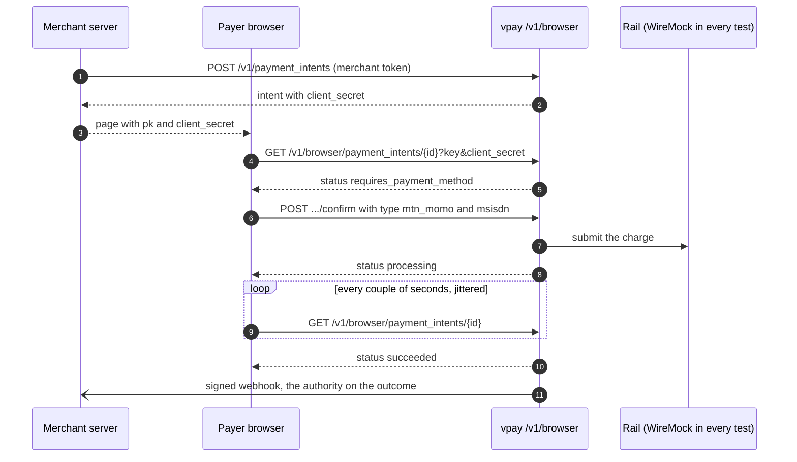
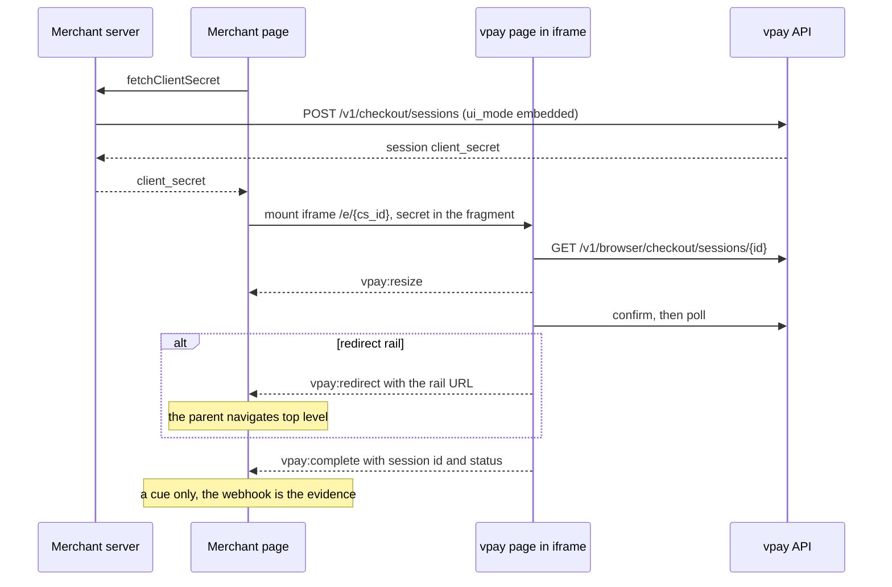

# Browser checkout

A payer's browser must be able to confirm a payment and watch it settle without
ever holding a merchant credential. vpay does this the way Stripe does: the
browser holds a **publishable key**, which names the tenant and authorises
nothing, and the PaymentIntent's own **`client_secret`**, which authorises that
one intent and nothing else. `/v1/browser` is the small surface that accepts
them, and `@vaam-apps/vpay-stripe-js` is a Stripe.js-shaped client for it. This
is also the surface vpay's own [hosted checkout](/checkout/hosted) page is built
on.

Agents working on this should load [vpay-checkout](skill:vpay-checkout).

::: info Why not Stripe.js itself?
`@stripe/stripe-js` cannot be pointed at another API — it has no base-URL option
and its loader hardcodes `https://js.stripe.com`. So vpay ships its own package,
Stripe.js-_shaped_. Its README at v0.4.1 still says it is **not yet on the npm
registry**. Inside the vpay workspace it is a `workspace:*` dependency.
:::

## The credential model

| Value                  | Looks like                | What it is                                                                                                                                                    |
| ---------------------- | ------------------------- | ------------------------------------------------------------------------------------------------------------------------------------------------------------- |
| Publishable key        | `pk_test_…` / `pk_live_…` | Not a secret. Listed per merchant in YAML (`merchant_clients[].publishable_keys`); never derived                                                              |
| Intent `client_secret` | `pi_…_secret_…`           | 160 random bits minted once at `create`. Authorises reading and confirming **one** intent, for its whole life. No rotation endpoint — a retry is a new intent |

Neither is a bearer token and neither can be exchanged for one. A payer holding
both can read one intent and confirm it once. The secret is compared in constant
time and redacted from every `Debug` output.

The `client_secret` is returned only by `create`, `retrieve`, the browser routes
and the checkout-session read — never on a list item and never in a webhook
body. One exception to "lives as long as the intent": if the intent has a
checkout session and its newest session is no longer `open`, the confirm is
refused with `409 checkout_session_expired`.

Publishable keys are validated at boot: a duplicate across merchants, a
malformed key, or a `pk_live_` key on a test deployment (or the reverse) stops
the server. An empty list — the default — means that merchant has no browser
checkout at all.

## The routes

| Method | Path                                        | Params                                                                | Answers                                                |
| ------ | ------------------------------------------- | --------------------------------------------------------------------- | ------------------------------------------------------ |
| GET    | `/v1/browser/payment_intents/{id}`          | `key`, `client_secret` (query)                                        | The intent with its secret — the polling endpoint      |
| POST   | `/v1/browser/payment_intents/{id}/confirm`  | `key`, `client_secret`, `payment_method_data[…]`, `return_url` (form) | The same confirm `/v1` performs, scoped to this intent |
| GET    | `/v1/browser/checkout/sessions/{id}`        | `key`, `client_secret`                                                | The checkout session, intent expanded with its secret  |
| GET    | `/v1/browser/checkout/sessions/{id}/return` | `key`, `t`                                                            | The same, without the intent's secret                  |
| GET    | `/v1/browser/checkout/origins`              | `key`                                                                 | The merchant's allowed framing origins                 |

Only the confirm writes. There is no create, no list and no cancel here, and no
route answers `401`.

**Every credential failure is the same `404`.** Unknown key, intent not found,
another merchant's intent, wrong secret — one byte-identical body. A distinct
answer for any of them would let a caller enumerate merchants, or learn which
intents exist before guessing secrets.

**No `Idempotency-Key`.** A custom header forces a CORS preflight, and Stripe.js
sends none. What stops a double-tap from becoming two charges is what always
did: the confirm refuses an intent that already has a charge, and a unique index
refuses even if two requests race. A double-tap gets a `200` and a `409`.

**CORS is on this nest only** (`allow_origin(Any)`, no credentials). The
merchant `/v1` nest has no CORS layer at all, so a browser is never invited to
send a merchant token cross-origin.

## A direct integration, step by step

The merchant's **server** creates the intent and renders the key and the secret
into the page; the **browser** confirms and polls.



The server half, from the package README:

```ts
// server (Node, @vaam-apps/vpay-sdk, OAuth2 private_key_jwt)
const intent = await vpay.paymentIntents.create({
  amount: 5000,
  currency: "xaf",
  payment_method_types: ["mtn_momo"],
});
res.render("checkout", {
  publishableKey: process.env.VPAY_PUBLISHABLE_KEY,
  clientSecret: intent.client_secret,
});
```

And the browser half:

```ts
// browser
import { loadStripe } from "@vaam-apps/vpay-stripe-js";

const stripe = await loadStripe(publishableKey, {
  baseUrl: "https://api.vpay.example",
});

const confirmed = await stripe.confirmMobileMoneyPayment(clientSecret, {
  type: "mtn_momo",
  msisdn: "237690000000",
});
if (confirmed.error) {
  show(confirmed.error.message);
} else {
  // The payer now approves the push on their handset. Poll until the intent
  // stops moving — three minutes by default, every two seconds, jittered.
  const settled = await stripe.waitForPaymentIntent(clientSecret);
  show(settled.error ? settled.error.message : settled.paymentIntent.status);
}
```

`examples/checkout-browser` is exactly this as a plain HTML page with no
framework, and `frontends/tests/e2e/cypress/e2e/checkout.cy.ts` drives it
against the compose stack.

### What the package offers

| Stripe.js                                                          | `@vaam-apps/vpay-stripe-js`                                                        |
| ------------------------------------------------------------------ | ---------------------------------------------------------------------------------- |
| `loadStripe(pk)`                                                   | `loadStripe(pk, { baseUrl, checkoutBaseUrl? })` — `baseUrl` is required            |
| `stripe.retrievePaymentIntent(clientSecret)`                       | same                                                                               |
| `stripe.confirmPayment({ clientSecret, confirmParams, redirect })` | same, minus `elements`                                                             |
| `stripe.handleNextAction({ clientSecret })`                        | same                                                                               |
| —                                                                  | `stripe.confirmMobileMoneyPayment(clientSecret, { type, msisdn })`                 |
| —                                                                  | `stripe.waitForPaymentIntent(clientSecret, { timeoutMs, intervalMs })`             |
| `stripe.createEmbeddedCheckoutPage(...)`                           | `stripe.initEmbeddedCheckout({ fetchClientSecret, onComplete })` — vpay's own page |
| —                                                                  | `stripe.retrieveCheckoutSession(clientSecret)`                                     |
| —                                                                  | `stripe.openCheckoutPopup({ fetchCheckoutUrl, onComplete, onCancel })`             |
| —                                                                  | `notifyCheckoutOpener({ session, status })`                                        |

**Absent by construction, not stubbed:** Elements, cards, 3DS, Payment Element,
Link, Payment Request / Apple Pay / Google Pay, `confirmCardPayment`,
`createPaymentMethod`, ConfirmationTokens and SetupIntents. A missing method is
a compile error on the merchant's page rather than a surprise at the till. The
exact type-compatibility claims are compile-time assertions in the package's
`src/compat.test.ts`; see [Stripe compatibility](/api/stripe-compat).

### Redirect rails

`confirmPayment` follows Stripe.js's rule: when the rail answers with
`next_action.redirect_to_url` and `redirect` is not `'if_required'`, the browser
navigates and the promise never settles. **vpay appends nothing to your
`return_url`** — none of Stripe's `payment_intent`,
`payment_intent_client_secret` or `redirect_status` parameters. A page handling
the return trip carries its own state and calls `retrievePaymentIntent` to learn
the outcome.

A merchant integrating a redirect rail **directly** (no checkout session) still
lands the payer on its own `return_url` and must poll from there. A checkout
session removes that work: vpay's page receives the payer on its own return
page.

## Embedded checkout

Embedded checkout is a **checkout session** (`ui_mode: "embedded"`) rendered in
an iframe. The merchant's server creates the session and returns its
`client_secret`; the merchant's page hands a function that fetches it to
`initEmbeddedCheckout`. From the runbook's worked example, `examples/shop`:

```tsx
const stripe = await loadStripe(publishableKey, {
  baseUrl: apiBaseUrl,
  checkoutBaseUrl,
});
const checkout = await stripe.initEmbeddedCheckout({
  fetchClientSecret: async () => {
    const result = await trpc.orders.embeddedSecret.mutate({ orderId });
    return result.clientSecret; // from YOUR server; the browser never sees a merchant credential
  },
  onComplete: () => {
    // A message from an iframe: a CUE, not evidence. Navigate to a page that
    // reads your own database, which only the webhook writes.
    router.push(`/orders/${orderId}/return`);
  },
});
checkout.mount("#vpay-embedded-checkout");
```



The frame's origin is checked twice — by
`Content-Security-Policy: frame-ancestors`, built from the merchant's
`checkout_origins`, and by the page itself. The handle
`{ mount, unmount, destroy }` is type-compatible with Stripe's
`StripeEmbeddedCheckout`, but the session model is vpay's, so a Stripe Checkout
integration does **not** port over by changing an import. The frame protocol and
the framing rules are on [Hosted and embedded checkout](/checkout/hosted).

## The popup {#popup}

`openCheckoutPopup` opens vpay's **hosted** page in a top-level window the
merchant's page owns, instead of navigating the payer's tab. The session is an
ordinary hosted one (`success_url` and `cancel_url`), so a payer whose popup is
blocked can fall back to a redirect with the same session. vpay's page treats a
popup as a third kind of peer: it posts `vpay:complete` to the opener, at most
once, and only to an origin it could pin from the merchant's `checkout_origins`.

::: warning Never opened for real
The popup is proven by unit cases against **stub windows** only — jsdom
implements neither `window.open` nor cross-window `postMessage`. No test in vpay
opens a real popup.
:::

## What can go wrong

- **No in-process rate limiting.** 160 bits of secret, the uniform `404` and
  one-charge-per-intent stand between a guesser and an intent — not a counter. A
  deployment **must** put rate limiting in front of `/v1/browser` at the ingress
  before serving real payers. Nothing in vpay enforces or checks that.
- **A double-tap is a `409`, not a replay.** A merchant's `/v1` retry under an
  idempotency key replays the stored response; a payer's retry here re-executes
  and is refused. It is never a second charge.
- **The return trip decides nothing.** A payer arriving back at `return_url`
  proves only that a browser was pointed there. Poll, and fulfil from the
  [webhook](/api/webhooks).

## Status in v0.4.1

| Part                                               | Status                   | Evidence                                                                                              |
| -------------------------------------------------- | ------------------------ | ----------------------------------------------------------------------------------------------------- |
| `/v1/browser` routes, uniform `404`, CORS, secrets | <Status s="built" />     | `backends/tests/integration/tests/browser_checkout.rs` — real Postgres, WireMock MTN, shipping router |
| `@vaam-apps/vpay-stripe-js`                        | <Status s="partial" />   | Vitest suite against a real `node:http` stub of `/v1/browser`; its README says it is not yet on npm   |
| `examples/checkout-browser` in a real browser      | <Status s="partial" />   | `checkout.cy.ts` against the compose stack, MTN push only                                             |
| Redirect return trip via a checkout session        | <Status s="partial" />   | Driven in `shop-hosted.cy.ts` — against a WireMock stub of Orange's page                              |
| Popup mode                                         | <Status s="unproven" />  | Stub windows only                                                                                     |
| Rate limiting                                      | <Status s="not-built" /> | An operational requirement at the ingress                                                             |
| A real rail                                        | <Status s="not-built" /> | Both rails are WireMock hosts on a compose network here                                               |

Nothing on this page has taken real money. The full record is
[browser-checkout.md § Status](vpay:docs/flows/browser-checkout.md#status).

## Go deeper

- [The browser checkout flow](vpay:docs/flows/browser-checkout.md) — decisions
  D1–D5, the proof map
- [`@vaam-apps/vpay-stripe-js` README](vpay:sdks/stripe-js/README.md) — the
  drop-in claim, scoped
- [`examples/checkout-browser`](vpay:examples/checkout-browser/README.md) — a
  plain-JS payer page and a 7-step walkthrough
- [Hosted and embedded checkout](/checkout/hosted),
  [Stripe compatibility](/api/stripe-compat)
- Skills: [vpay-checkout](skill:vpay-checkout), [vpay-sdks](skill:vpay-sdks)
