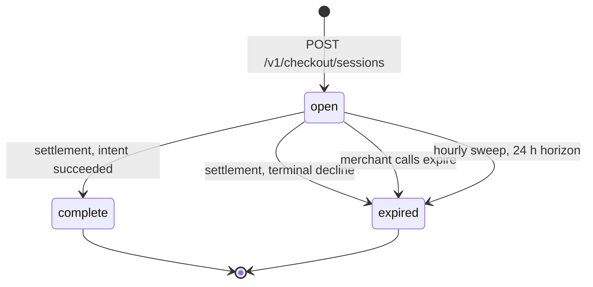
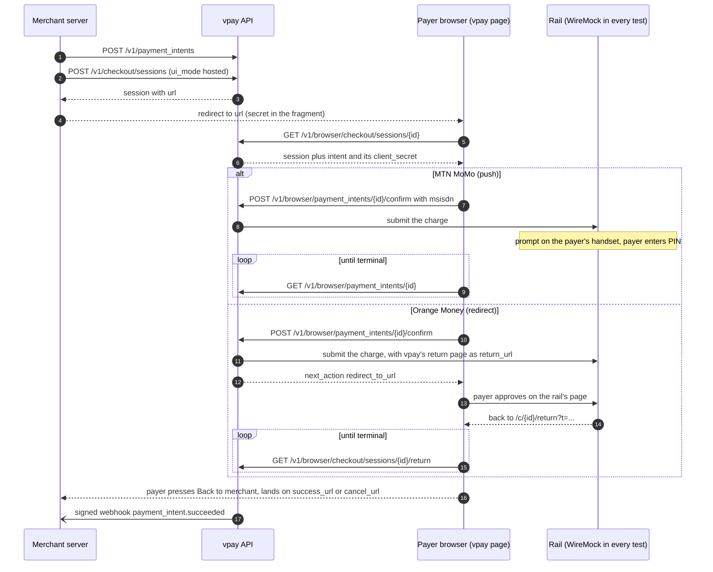
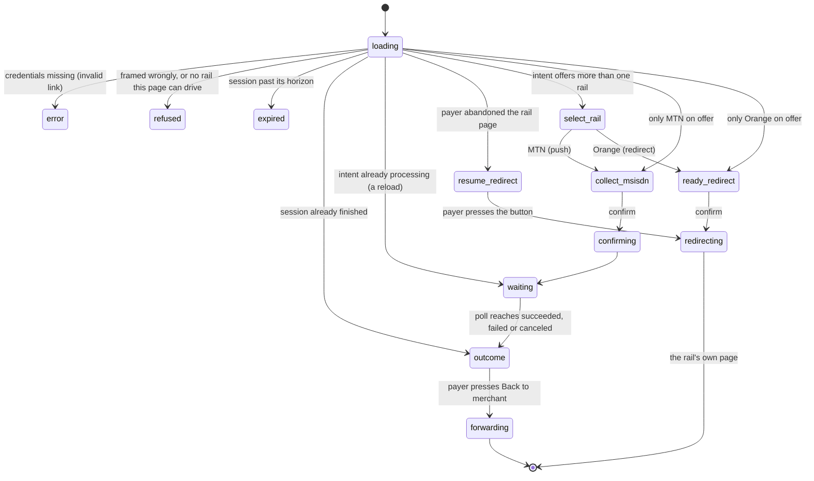

# Hosted and embedded checkout

vpay serves its own payer page so a merchant does not have to build one. The
merchant's server creates a **Checkout Session** against a PaymentIntent it
already has, and either redirects the payer to vpay's page (**hosted**) or
frames that page inside its own site (**embedded**). The page collects what the
rail needs, confirms, waits for the outcome from vpay's API, and sends the payer
back. It has been walked end to end in a real browser — but every rail behind it
has been a WireMock stub, never MTN or Orange.

Agents working on this should load [vpay-checkout](skill:vpay-checkout).

## The rule the whole design rests on

A payer's browser holds credentials for **one checkout and nothing else**, and
every one of them expires. There is no bearer token, no cookie, and no server
session beyond the session row. The strongest credential a payer can hold buys
one confirm of one payment intent; the weakest buys a read of one session's
outcome; both stop working 24 hours after the session was created.

The page authenticates exactly the way a merchant's own page would, through the
`/v1/browser` surface described in [Browser checkout](/checkout/browser).

## The two modes

|                                     | Hosted                                                          | Embedded                                                         |
| ----------------------------------- | --------------------------------------------------------------- | ---------------------------------------------------------------- |
| The merchant's server gets          | a `url`                                                         | a `client_secret`                                                |
| The merchant then                   | redirects the payer to it                                       | hands it to `@vaam-apps/vpay-stripe-js`'s `initEmbeddedCheckout` |
| URL a browser loads                 | `{checkout.public_base_url}/c/{cs_id}?key={pk}#{client_secret}` | `{checkout.public_base_url}/e/{cs_id}?key={pk}#{client_secret}`  |
| Framing (`Content-Security-Policy`) | `frame-ancestors 'none'`                                        | `frame-ancestors` = the merchant's `checkout_origins`            |
| Required on create                  | `success_url` **and** `cancel_url`                              | `return_url`                                                     |
| Where the payer ends up             | `success_url` / `cancel_url`, top level                         | `return_url`, plus a `vpay:complete` message to the framing page |

Both modes render the same screens from the same state machine. The mode is
fixed on the session at create, and the page refuses to run in the wrong one:
`/c/{id}` refuses if it _is_ framed, `/e/{id}` refuses if it is _not_.

A merchant can also open the **hosted** page in a popup with `openCheckoutPopup`
— see [Browser checkout](/checkout/browser#popup).

## The checkout session

`checkout.session` (`cs_…`) is one row in `checkout_sessions`. It **references**
a PaymentIntent; it never creates one. Amount, currency and the rails on offer
stay on the intent.

```json
{
  "id": "cs_…",
  "object": "checkout.session",
  "livemode": false,
  "payment_intent": "pi_…",
  "ui_mode": "hosted",
  "status": "open",
  "payment_status": "unpaid",
  "success_url": "https://shop/ok?sid={CHECKOUT_SESSION_ID}",
  "cancel_url": "https://shop/cancel",
  "return_url": null,
  "url": "https://checkout.example/c/cs_…?key=pk_…#cs_…_secret_…",
  "expires_at": 1757000000,
  "created": 1756913600,
  "client_secret": "cs_…_secret_…"
}
```

The object is vpay's own and deliberately small: there are no `line_items`, no
`mode`, no `amount_total`. Field names match Stripe's only where the meaning
matches. `{CHECKOUT_SESSION_ID}` in a URL is a literal placeholder that vpay
substitutes when it forwards the payer — it is the only thing vpay ever writes
into a merchant's URL.

### Routes

| Surface | Method and path                                            | What it does                                                                                                                                                                   |
| ------- | ---------------------------------------------------------- | ------------------------------------------------------------------------------------------------------------------------------------------------------------------------------ |
| `/v1`   | `POST /v1/checkout/sessions`                               | Creates a session (with `client_secret`, and `url` when hosted). Refuses an intent that is not `requires_payment_method`, already has a charge, or already has an open session |
| `/v1`   | `GET /v1/checkout/sessions/{id}`                           | The session, with `client_secret`                                                                                                                                              |
| `/v1`   | `GET /v1/checkout/sessions`                                | A list, no secrets, filterable by `payment_intent`                                                                                                                             |
| `/v1`   | `POST /v1/checkout/sessions/{id}/expire`                   | `open` → `expired`; `409` if the payer is mid-payment                                                                                                                          |
| browser | `GET /v1/browser/checkout/sessions/{id}?key&client_secret` | The session with the intent expanded **and** the intent's own `client_secret`, while `open`                                                                                    |
| browser | `GET /v1/browser/checkout/sessions/{id}/return?key&t`      | The same, **without** the intent's secret — the return page's read                                                                                                             |
| browser | `GET /v1/browser/checkout/origins?key`                     | The merchant's allowed framing origins                                                                                                                                         |

The `/v1` routes need a merchant token and an `Idempotency-Key` on POST, like
every other merchant route. Every failure on the two browser session reads is
one identical `404` — unknown key, wrong tenant, wrong credential, missing
credential, past the horizon — so the answer cannot be used to probe which part
of a link is wrong.

### Lifecycle



Exactly four things move a session, and a payer's browser is not one of them:

1. **The settlement transaction** flips the session in the _same commit_ as the
   intent — `complete`/`paid` on success, `expired`/`failed` on a terminal
   decline.
2. **`POST /v1/checkout/sessions/{id}/expire`**, the merchant abandoning it. It
   refuses with `409` if a charge is live.
3. **The worker's hourly sweep** expires `open` sessions past `expires_at` that
   have no live charge, and emits one `checkout.session.expired` event per
   session in the same transaction.
4. Nothing else.

Only the sweep emits an event. The settlement already emits
`payment_intent.succeeded` / `payment_intent.payment_failed`, and a merchant who
expired a session already knows. One open session per intent is enforced by a
partial unique index, not just a handler check.

A session that is no longer `open` also **refuses the confirm**: both
`POST /v1/payment_intents/{id}/confirm` and its browser twin answer
`409 checkout_session_expired` for an intent whose newest session is expired —
even an `open` one past its horizon the sweep has not reached yet. That is what
makes the 24-hour horizon a promise rather than a notification.

## The payer's journey

The merchant's server does the two credentialed calls; the browser sees only the
URL. MTN is a **push** rail (the payer approves on their handset); Orange is a
**redirect** rail (the payer approves on Orange's own page).

{.diagram}



::: warning The return page is not the outcome
The payer arriving at `success_url` means only that their browser was pointed
there. The merchant learns the outcome from the **signed webhook**; vpay's page
learns it from an authenticated status query. The runbook's worked example marks
an order paid from the webhook and from nothing else — see
[Webhooks](/api/webhooks).
:::

### Two credentials, and why

Secrets ride in **URL fragments, never query strings**, on vpay's pages: a
fragment is never sent to a server, never logged, and never carried across a
redirect. So the session's `client_secret` lives in the fragment and the page
reads it in JavaScript.

A fragment does not survive a rail's redirect — which is exactly what the return
page must survive. So a redirect charge is given a separate **`return_token`**
(160 bits, in the query string as `t`), which buys a read of the session and a
poll of its intent and nothing else. Because a copy of it ends up in the rail's
logs, both reads stop at `expires_at` whatever the session's status.

Every vpay-served page also sends `Referrer-Policy: no-referrer`,
`Cache-Control: no-store` and `X-Content-Type-Options: nosniff`.

## What the page shows

`frontends/apps/checkout` keeps its logic in a pure reducer — no `fetch`, no
timer, no DOM — so every transition is a unit test. The state names below are
the reducer's own.



### The screens, as vpay renders them

These are screenshots of vpay's own checkout components, captured at v0.4.1 from
the checkout app's Storybook (`frontends/apps/checkout`, story file
`checkout-screens.stories.tsx`). The data is the repository's test fixture: a 5
000 FCFA session for "Boutique Test", with reference
`cs_test_fixture000000000001`. It is the same set of states
`checkout-view.test.tsx` asserts against, and that vpay's Storybook
accessibility gate renders in Chromium. The "Mode test" banner is real. The page shows it whenever the session is not `livemode`. French is the default locale, and two
screens are shown in English.

<div class="shot-grid">
  <figure class="shot">
    
    <figcaption><code>select_rail</code>: more than one rail on offer</figcaption>
  </figure>
  <figure class="shot">
    
    <figcaption><code>collect_msisdn</code>: the MTN number, before confirm</figcaption>
  </figure>
  <figure class="shot">
    
    <figcaption><code>waiting</code>: the payer approves on their handset</figcaption>
  </figure>
  <figure class="shot">
    
    <figcaption><code>ready_redirect</code>: Orange, before the hand-off</figcaption>
  </figure>
  <figure class="shot">
    
    <figcaption><code>redirecting</code>: leaving for the rail's page</figcaption>
  </figure>
  <figure class="shot">
    
    <figcaption><code>outcome</code>: succeeded, with one button and no timer</figcaption>
  </figure>
  <figure class="shot">
    
    <figcaption><code>outcome</code>: failed, with the rail's own words under the translated reason</figcaption>
  </figure>
  <figure class="shot">
    
    <figcaption><code>expired</code>: the session is past its horizon</figcaption>
  </figure>
</div>

::: info What these screenshots are, and what they are not
They are vpay's real components, rendered with fixture state. They are **not** a
capture of a live payment. No rail answered behind them, and at <Release /> no
real payer has seen any of these screens. The checkout components are among
this page's sources, so a release that changes them marks the page stale and
the screenshots due for a retake.
:::

A few properties worth knowing:

- **Nothing happens on a timer.** Every outcome — succeeded, failed, canceled —
  ends in one button, "Back to {merchant}". An earlier five-second auto-forward
  was removed because it took the failure reason away from a payer still reading
  it.
- **A failed outcome shows the rail's own words** where the API returned any,
  labelled as the provider's and rendered as text, under the translated
  sentence.
- **The embed check runs before the credential is read**, so a refusal cannot be
  used to probe a link.
- **The language switch does not navigate** (that would drop the fragment, which
  is the credential). The initial locale comes from `Accept-Language`, French by
  default.
- **No floating point in the money path.** `5000 XAF` is formatted by moving a
  decimal point through the integer's digits, never by `minor / 100`.
- The return page has its own smaller machine with **no confirm at all**: it
  holds no intent secret, so it polls, shows the outcome and forwards.

## Embedded mode: framing and messages

The page talks to its framer with `postMessage`, and `event.origin` is checked
on both sides against a pinned value — `'*'` appears nowhere as a target, and
the parent never posts into the frame.

| Message         | Direction      | Why                                                                                        |
| --------------- | -------------- | ------------------------------------------------------------------------------------------ |
| `vpay:resize`   | child → parent | The frame starts at `height: 0`; the page reports its height                               |
| `vpay:complete` | child → parent | `{ session, status }` — the `cs_…` id, never a secret                                      |
| `vpay:redirect` | child → parent | The frame is sandboxed without `allow-top-navigation`, so the parent navigates to the rail |

There are **two locks on framing**: the `frame-ancestors` header (computed
server-side from the merchant's `checkout_origins`, failing closed to `'none'`
four ways), and the page's own comparison of its framer against the same list.
An empty `checkout_origins` — the default — means no site may frame the page.
Origins must be spelled canonically (lower-case host, no default port) or boot
refuses them.

## Configuring the page

One image serves every operator. Two YAML files are read once at container start
— never at build time:

| File            | Default path                       | Override                      |
| --------------- | ---------------------------------- | ----------------------------- |
| `branding.yaml` | `/etc/vpay/checkout/branding.yaml` | `VPAY_CHECKOUT_BRANDING_FILE` |
| `config.yaml`   | `/etc/vpay/checkout/config.yaml`   | `VPAY_CHECKOUT_CONFIG_FILE`   |

```yaml
# config.yaml
checkout:
  public_base_url: https://checkout.example
  allowed_methods: [mtn_momo, orange_money]
  features:
    page_memory: true
```

`display_name` in `branding.yaml` is the **operator's** name and never stands in
for the merchant's; `allowed_methods` can only narrow what the intent offers,
and an empty list is ignored with a warning rather than refusing every payment.
A missing or bad file costs only the affected key and logs one `WARN`.

With `page_memory` on, a payer may opt in to the page remembering their number
and last rail **on their own device** (IndexedDB, 90 days). There is no PIN
store, deliberately: neither rail takes a PIN through vpay's API, so a PIN field
would go nowhere — and on a payment page it would look like phishing.

On the API side, the operator sets `checkout.public_base_url` and each
merchant's `publishable_keys`, `display_name` and (for embedded)
`checkout_origins` — the runbook has the full YAML. See
[Configuration](/operate/configuration).

## What can go wrong

| Symptom                                               | Cause                                                                                     |
| ----------------------------------------------------- | ----------------------------------------------------------------------------------------- |
| Create answers `checkout_not_configured`              | No `checkout.public_base_url`. It is a `500`, not `503` — a recorded maintainer decision  |
| Create is a `400` naming `payment_intent`             | The intent is not `requires_payment_method`, has a charge, or already has an open session |
| The payer's page says "invalid link"                  | The URL lost its fragment — copied through a redirect, a logger or a query-only link      |
| The embedded iframe is an empty box                   | The page never painted, so no `vpay:resize` arrived. Check the browser console            |
| "This page will not load here"                        | The framing origin is not in that merchant's `checkout_origins`                           |
| The order never turns paid though vpay says succeeded | The merchant's webhook endpoint — verify the **raw** bytes and the secret                 |

## Status in this release

| Part                                         | Status                   | Evidence                                                                                                              |
| -------------------------------------------- | ------------------------ | --------------------------------------------------------------------------------------------------------------------- |
| Sessions, routes, lifecycle, confirm refusal | <Status s="built" />     | Container-backed cases in `checkout_sessions.rs` against real Postgres                                                |
| Hosted and embedded page, both rails         | <Status s="partial" />   | Cypress `shop-hosted.cy.ts` and `shop-embedded.cy.ts` green through `examples/shop` — against WireMock rails          |
| A real rail behind the page                  | <Status s="not-built" /> | Orange's "hosted page" is a WireMock mapping; nothing shows Orange accepts the return URL                             |
| `frame-ancestors` enforced by a browser      | <Status s="unproven" />  | Cypress strips CSP, so the header is asserted as sent; only the page's own origin check was observed refusing         |
| `checkout.session.expired` delivery          | <Status s="partial" />   | Emitted and fanned out in tests; no merchant endpoint outside the repository has received one                         |
| Popup mode                                   | <Status s="unproven" />  | Unit cases against stub windows; no test opens a real popup                                                           |
| Page memory                                  | <Status s="unproven" />  | Driven against a hand-written IndexedDB stub; no real browser's IndexedDB observed                                    |
| Rate limiting on the browser surface         | <Status s="not-built" /> | Must be done at the ingress; nothing in vpay enforces or checks it                                                    |
| Content policy beyond `frame-ancestors`      | <Status s="not-built" /> | No `script-src` / `default-src`; a stated gap                                                                         |
| Running in Kubernetes                        | <Status s="not-built" /> | The chart templates it (`checkout.enabled`, off by default) and supplies no ConfigMap for the YAML; no pod has run it |

The full record, including every dated correction, is
[hosted-checkout.md § Status](vpay:docs/flows/hosted-checkout.md#status) and
[not-built-and-not-proven.md](vpay:docs/flows/hosted-checkout/not-built-and-not-proven.md).
Overall standing is on [Status](/guide/status).

## Go deeper

- [The hosted checkout flow](vpay:docs/flows/hosted-checkout.md) — the design,
  the routes, the credentials
- [The page's state machine and outcome screens](vpay:docs/flows/hosted-checkout/state-machine-and-outcomes.md)
- [Runtime configuration](vpay:docs/flows/hosted-checkout/runtime-configuration.md)
- [Page memory, the iframe protocol, the popup, the headers](vpay:docs/flows/hosted-checkout/page-memory-and-protocols.md)
- [What is not built and not proven](vpay:docs/flows/hosted-checkout/not-built-and-not-proven.md)
- [The integration runbook](vpay:docs/runbooks/checkout.md) — both modes, worked
  through `examples/shop`
- [The reducer](vpay:frontends/apps/checkout/src/lib/machine.ts)
- Skill: [vpay-checkout](skill:vpay-checkout); for the frontend workspace,
  [vpay-frontend](skill:vpay-frontend)
