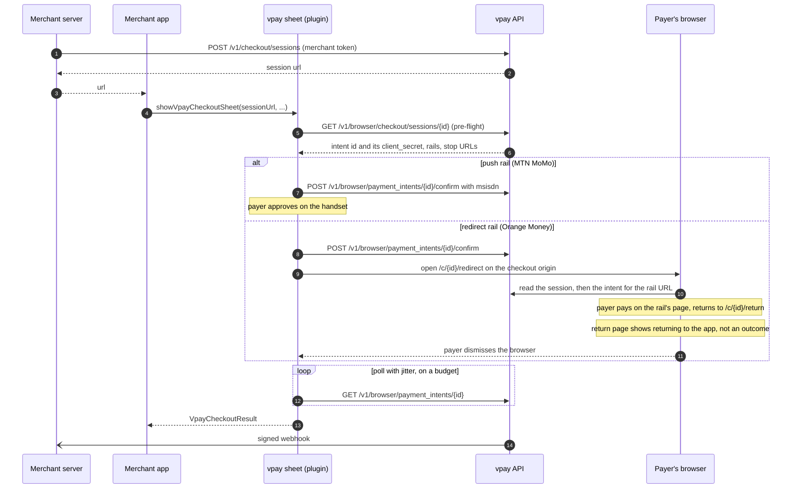
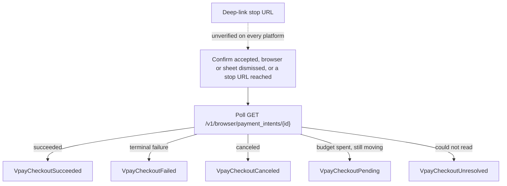

# Mobile checkout

`vpay_checkout_flutter` is a Flutter plugin that lets a merchant's app take a
mobile-money payment from a payer without the app ever holding a merchant
credential. In <Release /> it renders the checkout as a **native Flutter sheet** over
the merchant's app, hands off to the payer's own browser only when a rail needs
the payer on the rail's own site (Orange Money), and reports a typed result that
it reads **from vpay's API, never from a URL**. It is a payer surface — like
[browser checkout](/checkout/browser) — not a merchant SDK.

Agents working on this should load [vpay-sdks](skill:vpay-sdks).

::: tip Building with Tauri v2 instead?
`tauri-plugin-vpay-checkout` is the same payer surface for Tauri v2 apps on
Android, iOS, desktop and the plain web. It inherits this plugin's decisions
unchanged — publishable key only, the outcome polled and never read off a URL,
no WebView — but it has no native sheet: it always opens vpay's hosted page in
the payer's own browser. See [Tauri checkout](/checkout/tauri).
:::

::: warning Not published, not in CI
The plugin is consumed by `path:` dependency — its README says "not published
yet". None of its recipes (`just install-flutter`, `analyze-flutter`,
`test-flutter`, `test-flutter-e2e`) is in `just ci`; every count vpay quotes for
it is a human running them by hand. Every rail behind every run has been a
WireMock stub.
:::

## The two rules

**A Flutter app is a payer's device, not a merchant's server.** It holds a
publishable key and one session's credentials — no merchant token, no private
key, no `Authorization` header, ever. `POST /v1/checkout/sessions` stays on the
merchant's own server, exactly as for the web; the plugin is handed only the
session `url` that call returned.

**The outcome is polled, never read off a navigation.** The merchant controls
`success_url`, so reaching it proves nothing. Only
`GET /v1/browser/payment_intents/{id}` decides — and a dismissed sheet triggers
a short poll **before** anything is reported, because a payer who closes the
sheet fifteen seconds after approving an MTN push has not cancelled.

## Using it

The merchant's server creates the session and returns its `url` to the app:

```jsonc
// your server's response to your app
{
  "url": "https://checkout.vpay.example/c/cs_abc123?key=pk_test_…#cs_abc123_secret_…",
}
```

The app opens the sheet:

```dart
import 'package:vpay_checkout_flutter/vpay_checkout_flutter.dart';

final VpayCheckoutResult result = await showVpayCheckoutSheet(
  context,
  sessionUrl: sessionUrl,
  baseUrl: 'https://api.vpay.example',
  publishableKey: 'pk_test_…',
  merchantName: 'Njangi Store',
);
```

`showVpayCheckoutSheetRoute` is the same thing as a full-screen route.
`VpayCheckoutResult` is a sealed class, so the compiler makes the app handle all
five outcomes:

| Result                   | Meaning                                                                   |
| ------------------------ | ------------------------------------------------------------------------- |
| `VpayCheckoutSucceeded`  | The intent reached `succeeded` — a UI fact, not a settlement              |
| `VpayCheckoutFailed`     | The rail declined; `providerMessage` carries the rail's own words         |
| `VpayCheckoutCanceled`   | The intent is terminally canceled                                         |
| `VpayCheckoutPending`    | Still moving when the poll budget ran out — not a failure                 |
| `VpayCheckoutUnresolved` | The plugin could not find out (a typed `VpayError`), never a silent guess |

::: danger Fulfil from the webhook
`VpayCheckoutSucceeded` means the payer's device observed `succeeded`. Ship the
goods when your server receives `payment_intent.succeeded` and verifies its
signature — see [Webhooks](/api/webhooks).
:::

## What happens, in order



1. **Pre-flight.** One session read before anything is shown. It buys the
   intent's polling credential, the session's own `success_url`/`cancel_url` (so
   the stop list is derived from the session, never configured by the app), the
   rails on offer, and a fail-fast on a bad or expired link. An `embedded`
   session is refused here with a typed error.
2. **Render natively.** The sheet is a Flutter widget tree driven by the rail
   spec the server sends: rail choice, the phone field, waiting, outcome. It is
   French by default (`VpayLocale.fr` / `.en`), carries the same 72 message keys
   as the web page, and can offer to remember the payer's number on the device
   (opt-in, 90 days, never a PIN).
3. **Redirect rails hand off to a browser** — a partial (bottom-sheet) Custom
   Tab on Android, `SFSafariViewController` on iOS, the default browser on
   macOS, a `window.open` popup on web. The browser opens vpay's own
   `/c/{id}/redirect` page rather than the rail's raw URL, so a crafted link
   cannot become an open redirect, and the return page suppresses its own
   outcome so the payer sees it once, in the sheet.
4. **Resolve and answer** from the poll.



## Why a browser, and never a WebView

The plugin once rendered the payment page in an in-app WebView. That was removed
on every platform: a WebView runs inside the merchant app's own process, where
JavaScript evaluation, the cookie store and navigation delegates are reachable
to code the merchant controls. A separate browser process cannot be inspected
that way, and the payer sees a real URL bar. The page gets no JavaScript bridge
and no native peer.

**The cost:** no host can watch a navigation any more, so reaching a stop URL
can only arrive as an incoming deep link (Android App Link / iOS or macOS
Universal Link). That needs a merchant-hosted `assetlinks.json` /
`apple-app-site-association` that vpay cannot deploy, so it is **unverified on
every platform**. Every checkout today ends as a dismissal — the payer taps Done
— and the poll is what makes that correct. On macOS there is no dismissal signal
at all unless a Universal Link arrives or the app calls `dismiss()`.

Cards are out of scope: the sheet collects a phone number and nothing else, and
an unknown field kind from the server (`"card"` included) is never rendered.

## App Store and Play policy

The rule keys on **what is sold**, not on where the payment UI lives. A merchant
selling physical goods or real-world services is required by Apple's App Store
Review Guidelines 3.1.3(e) to use a method other than in-app purchase — which is
what this plugin is. A merchant unlocking something **inside** the app
(subscriptions, credits, premium content) falls under 3.1.1, and opening a
browser does not move it out; outside the US storefront, 3.1.1(a) can make the
browser hand-off itself the violation. This is vpay's reading of the guidelines
on 2026-09-13, not legal advice — the
[flow document](vpay:docs/flows/mobile-checkout.md) has the quotes.

## What can go wrong

- **The deep link never arrives.** Expected today on every platform; the result
  still comes from the poll after the payer dismisses.
- **Chrome's first-run screen.** On an Android device where Chrome has not
  finished onboarding, a sign-in prompt can appear before the page loads. Not
  fixable from the plugin.
- **Plain HTTP.** `BrowserClient` refuses a non-`https` base URL unless the
  named `allowInsecureBaseUrl` opt-in is passed (for the demo stack only).
- **Regenerating the platform channel.** The pigeon-generated types are
  hand-edited to redact the session URL; `dart run pigeon` silently reverts
  them, and only the Dart copy has a test that notices.

## Status in this release

| Part                                             | Status                   | Evidence                                                                                                                                                |
| ------------------------------------------------ | ------------------------ | ------------------------------------------------------------------------------------------------------------------------------------------------------- |
| Dart core (client, reducers, results, redaction) | <Status s="built" />     | `flutter test` green with 0 skipped, run by hand; not in CI                                                                                             |
| Dart core against a running vpay                 | <Status s="partial" />   | `just test-flutter-e2e`: real session, confirm, poll, uniform 404, `checkout_session_expired` — WireMock rail                                           |
| Native sheet on Android                          | <Status s="partial" />   | Driven by hand on an emulator against the demo stack: three MTN payments to `paid`, one Orange hand-off, one dismissal that never fabricated `canceled` |
| Redirect leg via `/c/{id}/redirect`              | <Status s="unproven" />  | Unit and stub-server cases only; nobody has driven it end to end                                                                                        |
| iOS                                              | <Status s="partial" />   | The browser surface was run on an iOS Simulator (2026-09-16); the native sheet was exercised on Android only                                            |
| macOS                                            | <Status s="not-built" /> | Compiled by nobody; no dismissal signal                                                                                                                 |
| Web                                              | <Status s="partial" />   | `flutter build web` and a platform test in real Chrome; the popup never walked end to end                                                               |
| Deep-link return (App Links / Universal Links)   | <Status s="unproven" />  | Wired, never driven — needs merchant-hosted association files                                                                                           |
| A real rail, a device, a store review            | <Status s="not-built" /> | WireMock behind everything; the Android 21 / iOS 12 floor is untested                                                                                   |

The full, dated record is
[mobile-checkout.md § Status](vpay:docs/flows/mobile-checkout.md#status) and
[the plugin's status page](vpay:docs/status/mobile-flutter-plugin.md).

## Go deeper

- [The mobile checkout flow](vpay:docs/flows/mobile-checkout.md)
- [ADR-0021: a Flutter checkout plugin — a payer surface, polling never a URL](vpay:docs/adr/0021-flutter-checkout-plugin.md)
- [The plugin's README](vpay:sdks/flutter/vpay_checkout_flutter/README.md) —
  setup, theming, the five results
- [The plugin's status page](vpay:docs/status/mobile-flutter-plugin.md)
- [Hosted and embedded checkout](/checkout/hosted) — the page the redirect leg
  lands on; [Flutter SDK](/sdks/flutter)
- [Tauri checkout](/checkout/tauri) — the same payer surface for Tauri v2
  ([ADR-0023](vpay:docs/adr/0023-tauri-checkout-plugin.md))
- Skills: [vpay-sdks](skill:vpay-sdks), [vpay-checkout](skill:vpay-checkout)
