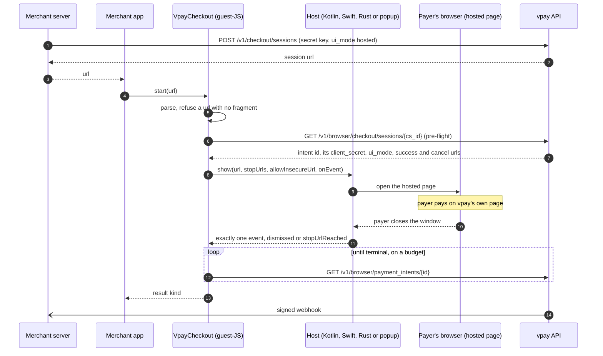
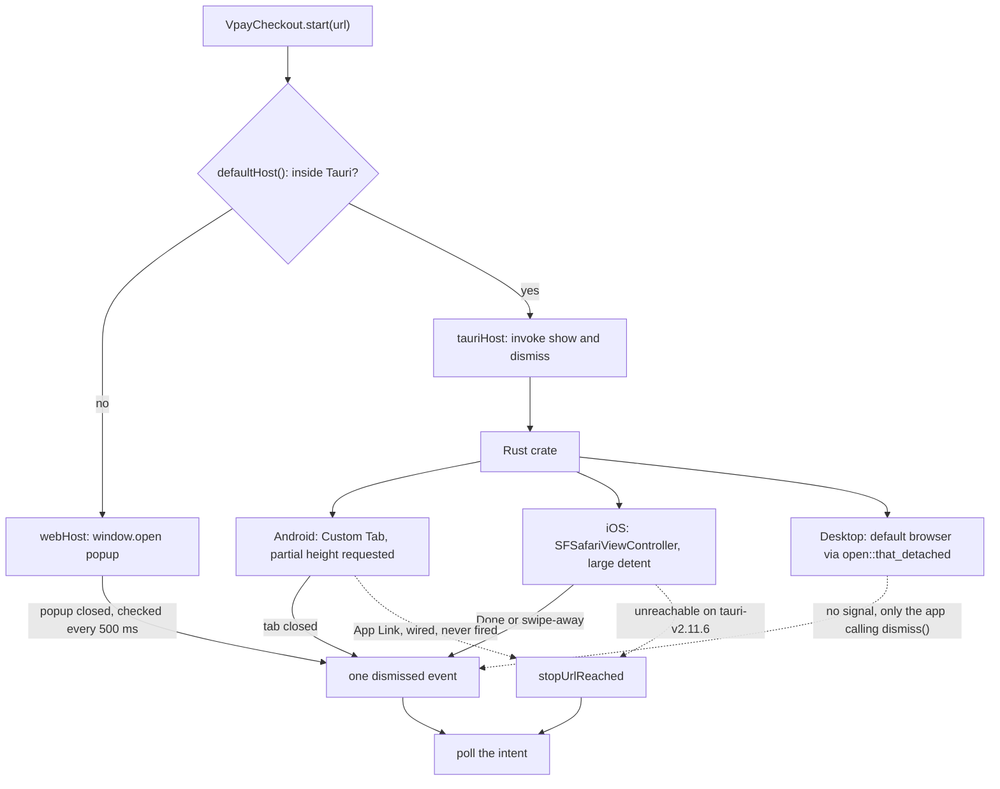

# Tauri checkout

`tauri-plugin-vpay-checkout` lets a Tauri v2 app take a payment from a payer
without the app ever holding a merchant credential. It opens vpay's
[hosted checkout page](/checkout/hosted) in the **payer's own browser** — a
Custom Tab on Android, an `SFSafariViewController` on iOS, the default browser
on desktop — and answers the app with a typed result once the payment intent has
actually settled, read **from vpay's API, never from a URL**. Its JavaScript
half also runs outside Tauri, in a plain browser, where it opens a `window.open`
popup instead. That is what "Android + iOS + web" means here: one package, one
state machine, several hosts. It is a payer surface, like the
[Flutter plugin](/checkout/mobile), not a merchant SDK.

Agents working on this should load [vpay-sdks](skill:vpay-sdks).

::: warning New, not published, mostly ungated
The plugin landed on 2026-09-22 and is new in <Release />. Neither half is on a
registry — `pnpm add @vaam-apps/vpay-tauri-checkout` 404s, and the crate is
`publish = false` — so you consume it from a checkout of the vpay repository.
Only its TypeScript half is in CI; **no gate compiles the Rust, the Kotlin or
the Swift**. Two real checkouts have run, on simulators, against a vpay whose
rail was a WireMock stub. Its decision record,
[ADR-0023](vpay:docs/adr/0023-tauri-checkout-plugin.md), is still _Proposed_.
:::

## What it is made of

Two packages ship from one directory, `sdks/tauri/tauri-plugin-vpay-checkout/`:

| Piece                            | What it is                                                                                                  |
| -------------------------------- | ----------------------------------------------------------------------------------------------------------- |
| `@vaam-apps/vpay-tauri-checkout` | The guest-JS package. It is **the whole state machine**: parse, pre-flight, stop URLs, the poll, the result |
| `tauri-plugin-vpay-checkout`     | The Rust crate: two commands, `show` and `dismiss`, plus the desktop host. Its own Cargo workspace          |
| `android/` (Kotlin)              | The Android host: opens the Custom Tab, reports the tab closing                                             |
| `ios/` (Swift)                   | The iOS host: opens the `SFSafariViewController`, reports Done or a swipe-away                              |

The hosts decide nothing. Each one opens a window and later reports exactly
**one** event — `dismissed` or `stopUrlReached` — and that vocabulary has no
`succeeded`, `canceled` or `failed` in it at all. The state machine lives in
TypeScript rather than Rust because the web has no Rust, and one tested
implementation beats two (ADR-0023, T1). For the two API reads it reuses
[`@vaam-apps/vpay-stripe-js`](/checkout/browser)'s client rather than writing a
second one (T3).

## The two rules

**A Tauri app is a payer's device, not a merchant's server.** It holds a
publishable key and one session's credentials, and nothing else — no merchant
token, no private key, no `Authorization` header. `POST /v1/checkout/sessions`
stays on the merchant's own server; the app is handed only the `url` that call
returned.

**The outcome is read from the API, never from a URL.** The merchant controls
`success_url`, so reaching it proves nothing. Only a poll of
`GET /v1/browser/payment_intents/{id}` decides. And no window in the payment
path is ever a WebView: rendering the payment form inside the app's own process
would put the payer's input within that app's reach.

## Using it

Your server creates a hosted session (`ui_mode: "hosted"`, a `success_url`, a
`cancel_url`, on your secret key) and hands the app `session.url` —
`{base}/c/{cs_id}?key={pk}#{cs_secret}`. The app starts the checkout:

```ts
import { VpayCheckout } from "@vaam-apps/vpay-tauri-checkout";

const checkout = new VpayCheckout({
  baseUrl: "https://api.vpay.example",
  publishableKey: "pk_live_…",
});

const result = await checkout.start(sessionUrl);
```

`start` **never rejects**. The result is a discriminated union, so a `switch`
over it is exhaustive at compile time:

```ts
switch (result.kind) {
  case "succeeded":
    return showThankYou();
  case "failed":
    return showFailure(result.code, result.providerMessage);
  case "canceled":
    return showCanceled();
  case "pending":
    return showStillProcessing(); // poll your own order
  case "unresolved":
    return showTryAgain(result.error);
}
```

| `kind`       | Meaning                                                                      |
| ------------ | ---------------------------------------------------------------------------- |
| `succeeded`  | The poll saw `succeeded` — a UI fact, not a settlement                       |
| `failed`     | `requires_payment_method` **with** a `last_payment_error`: the rail declined |
| `canceled`   | The intent itself says `canceled`                                            |
| `pending`    | The poll budget ran out with the intent still moving — **not a failure**     |
| `unresolved` | The plugin could not observe an outcome at all — **not a failure either**    |

::: danger Fulfil from the webhook
A `succeeded` here is what the payer's browser and one API read showed. Ship
the goods when your server receives `payment_intent.succeeded` and verifies its
signature — see [Webhooks](/api/webhooks).
:::

In a Tauri app you also add the crate to `src-tauri/Cargo.toml` — from git, not
by version, because it is on no registry — register it, and grant its
permission. From the plugin's README:

```toml
[dependencies]
tauri-plugin-vpay-checkout = { git = "https://github.com/vaam-apps/vpay", branch = "master" }
```

```rust
tauri::Builder::default()
    .plugin(tauri_plugin_vpay_checkout::init())
```

```json
{ "permissions": ["vpay-checkout:default"] }
```

The README asks you to pin with `tag = "vX.Y.Z"` or `rev = "<sha>"` rather than
`branch` for anything you ship. Without the capability in
`src-tauri/capabilities/default.json`, Tauri denies both commands and `start`
answers `unresolved` with `platform_window_failed` — correct, and confusing if
you do not know to look there.

## What happens, in order



1. **Parse.** `start` splits the URL into base, session id, publishable key and
   the session secret, which travels in the **fragment**. A URL without one is
   refused with no network call, and the URL never appears in the error.
2. **Pre-flight, once, before any window opens.** One session read buys the
   intent id, the intent's own `client_secret` (the polling credential, good for
   the intent's whole life), and the session's `success_url`/`cancel_url`, from
   which the stop rules are derived — the app configures no URLs. An
   `embedded` session is refused here.
3. **Show.** The host opens the window. The event callback is wired before
   `show` is awaited, so an event reported from inside `show` cannot be lost.
4. **One event**, then **poll**: 180 s at 2 s after a stop URL, 5 s at 1 s after
   a dismissal. A bare `requires_payment_method` keeps polling; only
   `succeeded`, `canceled`, or `requires_payment_method` with a
   `last_payment_error` is terminal.

The hosted page itself needed no change: it already runs top-level, with no
peer, in a Custom Tab, a Safari view or a desktop tab.

## Per platform



| Host                          | Window                                                                   | Dismissal signal              | `stopUrlReached`                                    |
| ----------------------------- | ------------------------------------------------------------------------ | ----------------------------- | --------------------------------------------------- |
| Android                       | Custom Tab, **requested** partial (90 % height); the browser may decline | yes — the tab closing         | wired through an App Link, never fired              |
| iOS                           | `SFSafariViewController`, `.pageSheet` with a `.large()` detent          | yes — Done **and** swipe-away | **unreachable**                                     |
| Desktop (macOS/Windows/Linux) | the payer's default browser                                              | **none** — only `dismiss()`   | not implemented                                     |
| Plain browser (no Tauri)      | `window.open` popup, address bar visible                                 | yes — the popup's `closed`    | n/a — a cross-origin popup's location is unreadable |

- **Android** declares no `<intent-filter>` of its own, because a hostless
  `https` filter would claim every https URL on the device. For a deep-link
  return, the merchant declares one for their own verified host against
  `dev.vpay.tauri.checkout.VpayCheckoutAppLinkActivity` and serves an
  `assetlinks.json` there.
- **iOS cannot report `stopUrlReached` at all.** Tauri v2.11.6 gives a Swift
  plugin no app-delegate hook, and Tauri's own `deep-link` plugin ships no iOS
  code. Every iOS checkout therefore ends `dismissed` when the payer taps Done or
  swipes the sheet away — and because a dismissal polls before it answers, that
  is still correct, just slower. The iOS floor is 15.0.
- **Desktop has no dismissal signal, by decision.** Handing a URL to the default
  browser leaves the app no handle on the window, and a "the app regained
  focus" signal is not "the payer finished" (the Flutter macOS host shipped one
  and removed it). A desktop app that never calls `dismiss()` waits out the
  5-second budget and gets `pending`. Whether a desktop host should exist at all
  is one of ADR-0023's open questions.
- **The plain-browser popup** accepts a `vpay:complete` message only from its
  own origin **and** its own popup window, and reads no outcome off it.

## How it relates to Flutter and the hosted page

| Question             | [Flutter plugin](/checkout/mobile)                                   | Tauri plugin                                        |
| -------------------- | -------------------------------------------------------------------- | --------------------------------------------------- |
| Decision record      | ADR-0021                                                             | ADR-0023, which inherits 0021's decisions unchanged |
| Where the payer pays | A native sheet; the browser only when a rail needs it (Orange Money) | Always vpay's hosted page, in the payer's browser   |
| Outcome              | Polled from `/v1/browser`                                            | Polled from `/v1/browser`, same terminal rule       |
| Result               | Five sealed classes                                                  | Five `kind`s                                        |
| Web fallback         | A `window.open` popup                                                | A `window.open` popup                               |
| Published            | No                                                                   | No                                                  |

## What can go wrong

- **The payer closes the sheet having paid** → a short poll → `succeeded`. This
  is the ordinary end of a successful payment on every host.
- **The payer closes it mid-payment** → the 5-second budget runs out →
  `pending`, never `canceled` unless the intent says so.
- **A stop URL arrives while the intent is still processing** → `pending` if it
  never settles; never `succeeded` off the URL.
- **The poll returns a different intent** than the pre-flight named →
  `unresolved`, never `succeeded`.
- **A bad, expired or mistyped link** → the pre-flight's uniform 404 →
  `unresolved`, before any window opens.
- **The host refuses to open a window** (no capability, popup blocked) →
  `unresolved` with `platform_window_failed`. The host's own message is never
  passed through, because it could quote the URL — and the URL's fragment is the
  session secret.
- **A host that resolves `show` and then never reports anything hangs `start`.**
  There is no stream-done signal on that seam. Named, not fixed.
- **Plain HTTP.** The constructor throws on an `http://` base URL unless you
  pass `allowInsecureBaseUrl: true` — for the demo stack only.
- **Chrome's first-run screen** on a fresh Android image can appear instead of
  the page. The payment never reaches vpay; force-stopping Chrome there answered
  `pending`, which is correct.
- **An unquoted `VITE_VPAY_SESSION_URL`** in the example app's `.env.local` is
  cut at the `#` by vite's dotenv parser, silently dropping the session secret.
  Quote it.

## Status in this release

| Part                                         | Status                   | Evidence                                                                                                                                         |
| -------------------------------------------- | ------------------------ | ------------------------------------------------------------------------------------------------------------------------------------------------ |
| Guest-JS state machine                       | <Status s="built" />     | 71 vitest cases across 8 files, 0 skipped; typecheck, lint and tests reach it through `pnpm -r` in CI. Every `fetch` and `Window` is injected    |
| Rust crate and desktop state machine         | <Status s="partial" />   | Builds, clippy-clean, 19 unit tests + 1 doctest — run by hand; no gate compiles it                                                               |
| Android host                                 | <Status s="partial" />   | One checkout to `succeeded` on an API 36 emulator. Chrome showed the tab **full-height**, declining the partial sheet. No gate builds the Kotlin |
| iOS host                                     | <Status s="partial" />   | On an iPhone 17 simulator: one checkout to `succeeded`, one unpaid swipe-away to `pending`. Dismiss-from-the-app could not be driven             |
| `stopUrlReached` on Android                  | <Status s="unproven" />  | Wired through an App Link, never fired: it needs a merchant-verified host serving `assetlinks.json`, which vpay cannot deploy                    |
| `stopUrlReached` on iOS and desktop          | <Status s="not-built" /> | Unreachable on iOS with tauri-v2.11.6; not implemented on desktop                                                                                |
| Desktop checkout                             | <Status s="unproven" />  | The desktop binary builds and launches; `open::that_detached` has never executed and no desktop checkout has run                                 |
| Plain-browser popup                          | <Status s="unproven" />  | Tested against a hand-rolled `Window` only; never run in a real browser                                                                          |
| Against a running vpay                       | <Status s="partial" />   | Three sessions, two paid — but on published `edge` images, not a build of the tree, and **no merchant webhook was verified**                     |
| A real rail, a physical device, store review | <Status s="unproven" />  | The rail was WireMock: no MTN endpoint called, no money moved; Orange never exercised; no physical device; no App Store or Play review           |
| Published package, CI gate for native code   | <Status s="not-built" /> | `publish = false`, npm package published by nothing; the Rust, Kotlin and Swift are in no `just ci` or `just verify` gate                        |

No window has ever closed itself: every completed checkout ended with a person
closing the sheet and the poll deciding. The full, dated record is
[tauri-checkout.md § Status](vpay:docs/flows/tauri-checkout.md#status),
[the plugin's status page](vpay:docs/status/mobile-tauri-plugin.md) and
[the verification page](vpay:docs/status/verification/2026-09-22-tauri-plugin.md);
every gap is a dated ⛔ in the Tauri table of
[docs/sdks/parity.md](vpay:docs/sdks/parity.md).

## Go deeper

- [The Tauri checkout flow](vpay:docs/flows/tauri-checkout.md)
- [ADR-0023: a Tauri v2 checkout plugin — one state machine, three hosts](vpay:docs/adr/0023-tauri-checkout-plugin.md)
  — T1–T7 and the four questions left to the maintainer
- [The plugin's README](vpay:sdks/tauri/tauri-plugin-vpay-checkout/README.md) —
  setup, platforms, errors and credentials
- [The example app](vpay:examples/tauri-checkout/README.md) — how to run it on
  desktop, Android, iOS and the plain web
- [Mobile checkout](/checkout/mobile) — the Flutter plugin, the fuller document
  of the same process, including the App Store and Play policy reading that
  applies here unchanged
- [Hosted and embedded checkout](/checkout/hosted), [SDKs](/sdks/)
- Skills: [vpay-sdks](skill:vpay-sdks), [vpay-checkout](skill:vpay-checkout)
