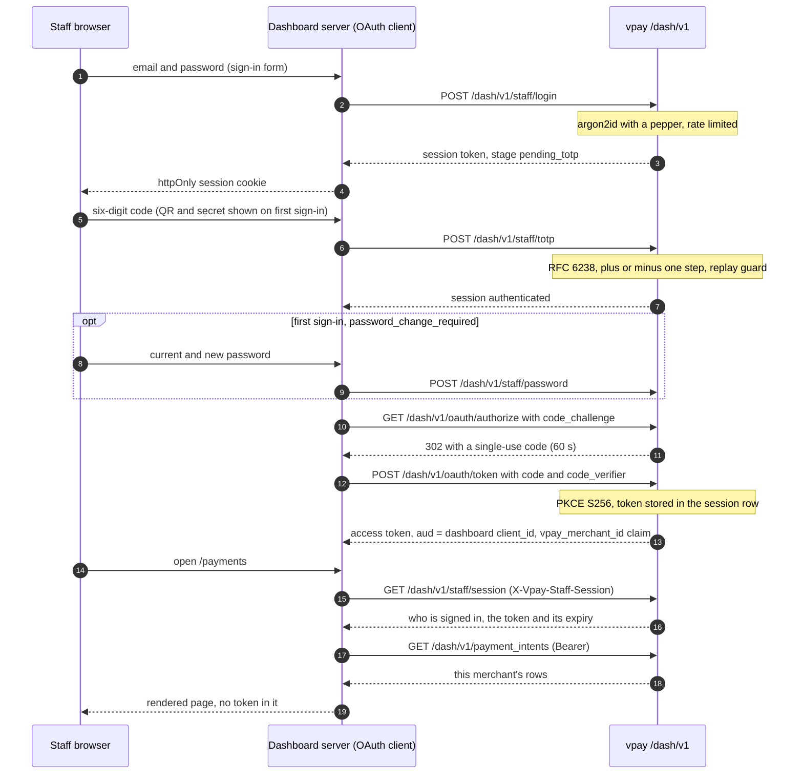
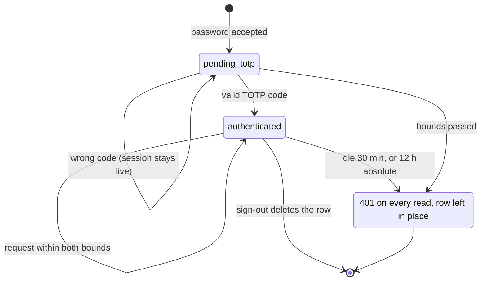
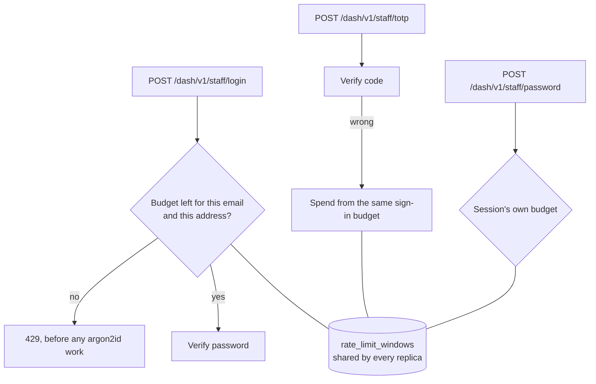

# Dashboard authentication

Staff sign in to the dashboard with a password and a mandatory six-digit TOTP
code, against a staff table vpay owns. The dashboard's own server then runs an
OAuth authorization-code grant with PKCE against vpay's **in-process** OpenID
Provider and receives a short-lived `/dash/v1` access token — which it never
shows to the browser. `/dash/v1` accepts no merchant API key and federates to no
external identity provider. This is built and tested end to end against a real
server and a real browser; it has never run in a deployment, and signing keys
have never been rotated.

Agents working on this should load [vpay-dashboard](skill:vpay-dashboard).

> **No `/dash/v1` request runs without a token vpay itself issued, signed with a
> key vpay itself holds, against a client vpay itself registered.**

## Who can sign in

There is no sign-up. The **only** way to create a staff member is the CLI:

```bash
vpay-server staff add --merchant … --email … --name …
```

It prints a one-time password on stdout and marks the account
`password_change_required`. Each staff member belongs to one merchant, and an
optional `--admin` flag (default off) grants cross-tenant **reads** — see
[below](#admins).

Credentials live in a `credentials` table, one row per credential. Eight kinds
are declared and **two are implemented** — the argon2id password and RFC 6238
TOTP. `hotp`, `magic_link`, `email_otp`, `phone_otp`, `webauthn` and `oidc` are
reachable by no code path; federated identity has columns and no writer.

## Signing in



**The dashboard's server follows the `302` itself.** In a browser-driven flow a
callback page would complete the exchange; here the app's own server requests
the code, follows the redirect and exchanges it in one function call, so a
browser never sees a code, a verifier or a token. That is why there is **no page
at `redirect_uri`** — it is a string both legs must spell identically (matched
byte for byte, no prefix or wildcard), not a route. PKCE is mandatory for every
client on this grant.

**No refresh token and no ID token.** The dashboard reads who is signed in from
`GET /dash/v1/staff/session`, which answers from the session row; an ID token
would be a staler copy of the same fact. There is one issuer,
`{public_base_url}/v1/oauth`, and one JWKS at `/v1/oauth/jwks.json`; discovery,
`/userinfo` and `/jwks.json` are **not** served under `/dash/v1`. Tokens are
`RS256`.

**No machine client can read the dashboard.** A `client_credentials` token
carries no `vpay_merchant_id` claim, and nothing but this grant stamps one.

## Sessions

The session token is 256 bits from the OS CSPRNG, held by the dashboard in an
httpOnly, Secure, `SameSite=Lax` cookie on its own origin and sent to vpay as
`X-Vpay-Staff-Session`. vpay stores only its SHA-256, so a dump of
`staff_sessions` yields no usable session.

| Bound    | Value                                      | Moved by               |
| -------- | ------------------------------------------ | ---------------------- |
| Absolute | 12 hours from creation                     | nothing                |
| Idle     | 30 minutes since the last accepted request | every accepted request |



**Signing out deletes the row.** Because the access token lives in that row, the
dashboard's server can no longer obtain it, and any unexchanged authorization
code the session issued dies with it by cascade. What sign-out cannot do is
invalidate the JWT itself: it stays cryptographically valid for the rest of its
TTL. There is no revocation endpoint in the OP.

**The access token is re-minted before it expires.** It lives
`staff_auth.access_token_ttl_seconds` (900 by default, bounded 10–3600). When
less than a fifth of that is left, the next render runs the authorization-code
leg again on the live session — which re-checks that the staff member is still
active, still bound to this merchant, and owes no password change. A `401` on a
read is retried once after a re-mint; a `403` never is. Disabling a staff member
or moving them to another merchant takes effect on their **next request**.

**Changing a password requires the current one** and deletes every other session
of that staff member, keeping only the caller's.

**A mistyped code does not end a session.** The TOTP page reads
`GET /dash/v1/staff/session/stage`, which answers `pending_totp` or
`authenticated` and nothing about the person, so a typo leaves the person on the
form with the enrolment panel still there.

## Every refusal is one answer

No such address, wrong password, disabled account, wrong or replayed code,
expired, idle or forged session, session at the wrong stage: one `401`, one
sentence, `error.code = "authentication_error"`. The step that refused goes to
the log, never the body. An address with no account still costs one argon2id
verification, so the answers match in **timing** as well as shape — the form is
not an account-enumeration oracle.

The dashboard treats a `401` from the session read, and only that, as "signed
out". Any other failure — vpay restarting, a `503`, a proxy's `403` — renders
the error and keeps the cookie, so a rolling deploy does not sign everybody out.

## Rate limits



- **Sign-in** is limited per email **and** per client address, fixed window:
  `staff_auth.rate_limits.sign_in`, default 10 attempts per 300 seconds. Both
  counters move on every attempt, and a request over budget is refused before it
  costs an argon2id verification.
- **The second factor spends from the same budget** on every wrong code, so a
  phished password does not buy unlimited guesses at six digits.
- **Password change** has its own budget, keyed by the session
  (`staff_auth.rate_limits.change_password`, default 5 per 300 seconds), so a
  thief with a stolen cookie cannot lock the owner out of their own login.
- **The budget is the deployment's, not each replica's.** Counters are rows in
  Postgres, updated in one `INSERT … ON CONFLICT … RETURNING` statement, keyed
  by a SHA-256 digest so no email address is stored verbatim. A database failure
  is a refusal, never an allowance.
- **Which address counts.** By default, the transport peer.
  `staff_auth.trusted_proxies` (addresses and CIDRs, empty by default) lets a
  named proxy vouch for a client via `X-Forwarded-For`, walked from the right
  and stopping at the first hop that is not one of yours. `Forwarded` is not
  read. With the list empty behind a reverse proxy, every staff member shares
  one per-address budget (the per-email one still binds per account), and
  `vpay-server` says so at boot.

## Admins {#admins}

A staff member with `is_admin` may add `?merchant_id=` to a `/dash/v1` read to
scope it to any merchant the deployment registers, one at a time; without the
parameter it is their own merchant. For a non-admin the parameter is not even
parsed. An admin still cannot write — the read-only boundary is checked before
the flag is read.

## What can go wrong

- **Behind a proxy that rewrites `Host`**, set `VPAY_DASHBOARD_PUBLIC_ORIGIN` —
  the dashboard's own origin check on every Server Action compares `Origin`
  against it and never trusts `X-Forwarded-Host`. That is necessary but not
  sufficient: Next.js runs its own check too, so the proxy must also send an
  `X-Forwarded-Host` matching the public host, or every action fails with a bare
  `500`.
- **A typo in `trusted_proxies`** takes staff login down (the read surface still
  mounts), rather than silently widening the budget.
- **Ten wrong attempts in five minutes** locks that email or address out for the
  rest of the window — deliberately high enough that a person mistyping a
  printed one-time password twice is not locked out of their first login.

## Status in this release

| Part                                       | Status                   | Evidence                                                                                                                                     |
| ------------------------------------------ | ------------------------ | -------------------------------------------------------------------------------------------------------------------------------------------- |
| Password, TOTP, sessions, PKCE grant       | <Status s="built" />     | `backends/tests/integration/tests/staff_sign_in.rs` drives the real router on a real socket over real Postgres and mints no token of its own |
| Sign-in in a real browser                  | <Status s="built" />     | `dashboard.cy.ts` enrols from the QR the screen displayed, changes the password, exchanges the code, signs out                               |
| Shared rate-limit budget, trusted proxies  | <Status s="built" />     | Two vpay servers over one Postgres read `429` on the sixth attempt against a budget of five                                                  |
| Admin cross-tenant reads                   | <Status s="built" />     | `dashboard_read_surface.rs` cases for admin, non-admin and write refusal                                                                     |
| Sweep of expired sessions and codes        | <Status s="not-built" /> | Expired rows are refused on read and never deleted on a schedule                                                                             |
| Signing-key rotation                       | <Status s="not-built" /> | One key per process life; `oauth_signing_keys` exists and no code reads or writes it                                                         |
| Disabling the dashboard client             | <Status s="not-built" /> | Only by removing it from YAML and restarting; per-person `status` works                                                                      |
| Other credential kinds, federated identity | <Status s="not-built" /> | Declared in the schema, no verifier                                                                                                          |
| Running in a deployment                    | <Status s="not-built" /> | No Kubernetes pod has ever run the dashboard or its backend tier                                                                             |

The full record is
[dashboard-auth.md § Status](vpay:docs/flows/dashboard-auth.md#status).

## Go deeper

- [The dashboard authentication flow](vpay:docs/flows/dashboard-auth.md)
- [Sessions and refusals](vpay:docs/flows/dashboard-auth/sessions-and-refusals.md)
  · [Rate limiting](vpay:docs/flows/dashboard-auth/rate-limiting.md) ·
  [Scope and tokens](vpay:docs/flows/dashboard-auth/scope-and-tokens.md)
- [ADR-0009: vpay runs its own OpenID Provider](vpay:docs/adr/0009-dashboard-oidc-provider.md)
- [ADR-0017: how a staff member signs in](vpay:docs/adr/0017-staff-authentication.md)
- [ADR-0018: cross-tenant admin reads](vpay:docs/adr/0018-cross-tenant-admin-reads.md)
  · [ADR-0019: the credential model](vpay:docs/adr/0019-credential-model.md)
- [The staff dashboard](/dashboard/),
  [Merchant API authentication](/api/authentication)
- Skill: [vpay-dashboard](skill:vpay-dashboard)
