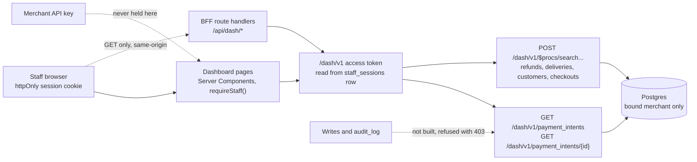

# The staff dashboard

The dashboard is a Next.js app a merchant's staff sign in to, to see what
happened to that merchant's payments. Its founding decision is that it
**observes and does not administer**: it reads records, it never changes
configuration, and it never holds a merchant API key. In <Release /> it is
**read-only** — a staff member can sign in and read payments, refunds, webhook
deliveries, customers and checkout sessions, and cannot do anything at all to
any of them. It has never run in a deployment.

Agents working on this should load [vpay-dashboard](skill:vpay-dashboard).

## The boundary

> A `/dash/v1` request reads exactly one tenant's rows: the one
> `dashboard_client.merchant_id` names, fixed in YAML and checked at boot.

The tenant does **not** come from the caller's credential, the way `/v1`
resolves one. No claim in any token can change it. A deployment whose staff must
see two merchants registers two dashboard clients.

Four checks stand between a request and a row, each in a different place so no
single edit removes the boundary:

1. The token validates — signature, expiry, issuer, and an audience equal to the
   registered `dashboard_client.client_id` — against vpay's own JWKS.
2. It carries a `vpay_merchant_id` claim equal to the bound merchant. Only the
   staff sign-in grant stamps that claim, so **no `client_credentials` token can
   ever read `/dash/v1`**. The claim is compared, never used: a forged one buys
   a `403`, never another merchant's rows.
3. It carries the registration's single scope.
4. Every query filters by the bound `merchant_id`.

Any method other than `GET`/`HEAD` is refused by the boundary **before** the
router matches, with a `403`. That is what makes "read-only" structural rather
than a promise: a write mounted later cannot arrive unlogged. Two boot checks
back this up — a `dashboard_client.merchant_id` no merchant registers is fatal,
and so is a merchant registration listing the dashboard's client id in its
`allowed_audiences`. A deployment with no `dashboard_client` mounts no
`/dash/v1` at all.

How a staff member gets that token is
[Dashboard authentication](/dashboard/authentication).

## From browser to `/dash/v1`

The browser never holds a vpay token. It holds an httpOnly session cookie on the
dashboard's own origin; the dashboard's **server** looks up the `/dash/v1`
access token in the `staff_sessions` row on every render and makes the call.

- **Pages read on the server.** Each page is a Server Component that calls
  `requireStaff()` and reads `/dash/v1` itself, then hands the rows to Refine's
  hooks as initial data. A browser-side read was tried and withdrawn after it
  broke the end-to-end suite.
- **The BFF** (`/api/dash/*`) is a same-origin, `GET`-only proxy that
  authenticates on the same cookie. A request with no cookie never reaches vpay;
  a request the dashboard did not issue is refused by an `Origin` /
  `Sec-Fetch-Site` check; the bearer token appears in no response header or
  body; no caller-supplied merchant id, audience or scope is forwarded. Every
  other method gets a `405`. It has six handlers — one per list plus the
  payment detail — and Refine's data provider is wired to it, but every page's
  first render is read on the server as above, so the BFF carries at most the
  re-reads Refine makes afterwards in the browser. It was attacked in a
  security review and driven from a real browser.
- **The payments list** is served by two REST routes and is cursor-paged, like
  the merchant API. **The other four lists** are CrateStack procedures under
  `/dash/v1/$procs/`, which the dashboard's server calls with `POST` on the
  browser's behalf; they are offset-paged and carry no filter yet.

The dashboard is not an SDK surface: the merchant SDKs speak `/v1`, and a
`/dash/v1` method in one would be a merchant credential reaching for a staff
surface. The detail response is vpay's own shape
(`object: "dashboard.payment_detail"`), not a pretend Stripe object.

## The screens

| Page                                                  | What it shows                                                                                 |
| ----------------------------------------------------- | --------------------------------------------------------------------------------------------- |
| `/login`, `/login/totp`, `/login/password`            | The sign-in — see [authentication](/dashboard/authentication)                                 |
| `/payments`                                           | The bound merchant's intents, newest first; status and created-range filters, cursor paging   |
| `/payments/{id}`                                      | The intent, its charge, its refunds, the last error with its failure code, the event timeline |
| `/refunds`, `/deliveries`, `/customers`, `/checkouts` | Read-only lists, one page at a time, no filter controls                                       |

The navigation is generated from one array and a test fails if it ever links to
a page that does not exist — a menu entry for an unwritten page is the same lie
as an empty table.

### What a screen may show

A dashboard that looks complete is the failure mode this project fears most, so
the screens are held to rules about **absence**:

- **No "Rail" column on the list.** The list response carries no charge, only
  `payment_method_types` — the rails an intent _may_ use. So the column is
  headed **Methods**. The detail page has a real rail, from the charge.
- **The payer's phone is always a dash.** `charges.payer_ref_masked` is never
  written, so the detail page renders a real `null` as `—` and must never fall
  back to the unmasked value. There is no payer column on the list and no search
  by phone, because both would be sourced from a column that is always empty.
- **No page count on the payments list.** Its route returns cursors and
  `has_more`, never a total, so "page 3 of 12" would be invented. "Next" appears
  only when `has_more` says so.
- **An unknown status renders as text**, not as a coloured pill. A green badge
  on an unfamiliar status is a claim.
- **The timeline names what it cannot show.** Under it, a banner says the
  timeline is not the whole history of a payment and names the event types
  nothing writes. The banner is itself out of date: it still names five
  (`payment_intent.created`, `payment_intent.processing`,
  `payment_intent.canceled`, `charge.refunded`, `charge.refund.updated`), but
  the last three have had writers since 2026-09-10 and 2026-09-16. Only
  `payment_intent.created` and `payment_intent.processing` are still written by
  nothing — see [Webhooks](/api/webhooks).
- **The merchant is on every page**, beside the staff member's address, so an
  empty list is distinguishable from looking at the wrong merchant.
- **Payer credentials never appear.** The checkout list's source type does not
  even carry `client_secret_suffix` or `return_token`.
- **Configuration fails closed.** The API URL, client id, redirect URI and scope
  are read at container start; if one is missing, `/login` names the variables
  and offers no form.

## What it cannot do

- **Anything to a payment.** ADR-0008 describes per-record writes — re-poll a
  charge, replay a webhook, issue a refund, annotate a charge — each with an
  `audit_log` row. **None is built**, so there is no `audit_log` either.
- **Balances and the ledger, settings, rail health** (slices 4–6) are not
  started. Webhook deliveries are a list only; retries and signature replay are
  not started.
- **It has never been deployed.** The Helm chart templates a Deployment for the
  app (`dashboard.enabled`, off by default) and a separate `/dash/v1`-only
  backend tier (`management.enabled`). The image was run by hand with a
  read-only root filesystem and answered its health path — but **no Kubernetes
  pod has ever run**, of this app or anything else in the chart.

::: warning Two deployment traps, already documented
The management tier does **not** serve `POST /v1/oauth/token` (that mints the
merchant credential); the staff grant is `/dash/v1/oauth/token`. And publishing
`/dash/v1` through the chart's HTTPRoute with `networkPolicy.enabled` requires
the Gateway's namespace in `networkPolicy.managementIngress.namespaceSelector` —
a chart guard refuses the combination. Whether this tier should face a public
gateway at all is an open maintainer decision. See
[Deployment](/operate/deployment).
:::

## Status in this release

| Part                                                      | Status                   | Evidence                                                                                            |
| --------------------------------------------------------- | ------------------------ | --------------------------------------------------------------------------------------------------- |
| `/dash/v1` boundary, the two payment reads, boot refusals | <Status s="built" />     | `backends/tests/integration/tests/dashboard_read_surface.rs` over a booted server and real Postgres |
| Sign-in and the pages, in a real browser                  | <Status s="built" />     | `dashboard.cy.ts` signs in through the real OP against the compose stack and reads payments         |
| Refunds, deliveries, customers, checkouts lists           | <Status s="partial" />   | Read-only lists over CrateStack procedures; no filters                                              |
| The BFF read surface                                      | <Status s="partial" />   | Six handlers, reviewed and browser-tested; pages render from server-side reads, not through it      |
| Writes and `audit_log`                                    | <Status s="not-built" /> | Refused at the boundary; ADR-0008's writes are designed, unbuilt                                    |
| Slices 4–6                                                | <Status s="not-built" /> | Not started                                                                                         |
| Real data on screen                                       | <Status s="partial" />   | Every payment it has shown settled against a WireMock rail                                          |
| Running in Kubernetes                                     | <Status s="not-built" /> | Chart templates exist; no pod has ever run                                                          |

The full record is [dashboard.md § Status](vpay:docs/flows/dashboard.md#status)
and its three status pages. Overall standing is on [Status](/guide/status).

## Go deeper

- [The dashboard flow](vpay:docs/flows/dashboard.md) — the invariant, the
  slices, the boundary
- [What slice 1 did not build](vpay:docs/flows/dashboard/slice-1-gaps.md) —
  including the rules about absence
- [The read seam, the BFF, and its security review](vpay:docs/flows/dashboard/status-read-seam-and-bff.md)
- [What is built and proven](vpay:docs/flows/dashboard/status-built-and-not-built.md)
- [ADR-0008: the dashboard observes; it does not administer](vpay:docs/adr/0008-dashboard-scope.md)
- [ADR-0022: surface isolation and independent scaling](vpay:docs/adr/0022-surface-isolation-and-independent-scaling.md)
- [The app's README](vpay:frontends/apps/dashboard/README.md)
- Skills: [vpay-dashboard](skill:vpay-dashboard),
  [vpay-frontend](skill:vpay-frontend)
