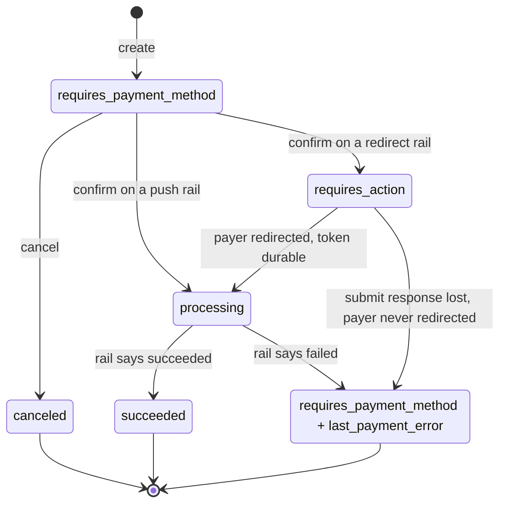
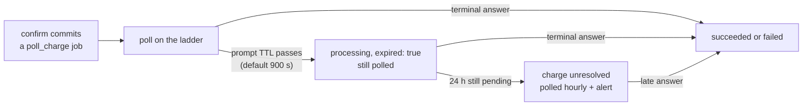

# Core concepts

vpay has a small number of ideas that everything else depends on. Most of them
exist because mobile money behaves differently from cards: the payer approves
the payment somewhere vpay cannot see, callbacks cannot be trusted, and a
payment that is still pending after fifteen minutes can succeed hours later.
Each section below is a short summary with a link to the full page.

::: info Designed is not the same as built
vpay's flow documents describe the _design_. Where a concept is only proven
against WireMock stubs, this page says so. See [What works
today](/guide/status).
:::

## How the concepts fit together

```mermaid
flowchart LR
    M["Merchant"] -->|"POST with Idempotency-Key"| PI["PaymentIntent"]
    PI -->|"confirm: exactly one, ever"| CH["Charge"]
    CH -->|"amount in integer minor units"| PORT["Provider port<br/>(ProviderAdapter)"]
    PORT -->|"capability: flow = push"| MTN["mtn_momo"]
    PORT -->|"capability: flow = redirect"| OR["orange_money"]
    CB["Rail callback"] -.->|"hint: identifiers only"| JOB["poll_charge job"]
    JOB --> REC["Reconciler<br/>(vpay-server worker)"]
    REC -->|"authenticated status query"| PORT
    REC -->|"settle charge + intent + event<br/>in one transaction"| EV["Event"]
    EV -->|"two-step outbox"| WH["Signed webhook"]
    WH --> M
```



## PaymentIntent and Charge

A **PaymentIntent** is the merchant-facing object. It follows Stripe's shape: it
is created in `requires_payment_method`, it is confirmed, and it ends in
`succeeded`, in `canceled`, or back in `requires_payment_method` with a
`last_payment_error`. A **Charge** is the single attempt at a rail that a
confirm creates.



`confirm` always submits. `requires_action` happens only on redirect rails.
`processing` ends only when the rail gives a terminal answer: timers fire, but
they never decide the outcome. `canceled` is reachable only before a rail has
the request. Full page: [Payment lifecycle](/payments/lifecycle).

## Money is integer minor units

Every amount is an **integer count of the currency's minor unit**. There is no
floating point anywhere in the money path, and `clippy::float_arithmetic` is
denied across the workspace. XAF, the Central African CFA franc, is
**zero-decimal**, so `amount: 5000, currency: "xaf"` means 5,000 FCFA, not
50.00. This is the same way Stripe handles zero-decimal currencies. Amounts are
converted for a rail in exactly one place (`Money::to_provider_string`, with an
integer twin, `Money::to_provider_minor`). Full page: [Money](/payments/money).

## Rails and the provider port

A payment rail is reached only through one trait, `ProviderAdapter`, in
`backends/crates/vpay-provider`. The core owns the lifecycle, the ledger,
reconciliation and the failure taxonomy. An adapter owns one rail's wire
protocol and maps that rail's failures into vpay's `FailureCode` and
`ProviderError`. Providers are rows in a table, never enum variants
([ADR-0002](vpay:docs/adr/0002-provider-port.md)). Full page:
[Provider port](/rails/provider-port).

## Capabilities, not provider codes

The core never asks _which_ rail it is talking to. It reads the rail's declared
**capabilities** and branches on their values:

| Capability                 | `mtn_momo` | `orange_money` |
| -------------------------- | ---------- | -------------- |
| `flow`                     | `Push`     | `Redirect`     |
| `supports_refunds`         | `true`     | `true`         |
| `supports_partial_refunds` | `true`     | `false`        |

Code outside an adapter crate that branches on a provider code, as in
`if provider == "mtn_momo"`, is a defect. Adding a rail means making the one
shared conformance suite pass, not writing a new suite.

## Callbacks are hints

Mobile-money callbacks are usually unauthenticated and unsigned, and they can be
late, missing or duplicated. So a callback **never changes state**.
`POST /provider/{code}/callback` asks the adapter's `parse_callback` for
**identifiers only**, never a status, and enqueues a status query. The only
thing that moves money is the **authenticated status query** vpay makes to the
rail. `parse_callback` is synchronous on purpose: it cannot make a network call,
so it cannot sneak a status in from the request. Full page:
[Reconciler](/payments/reconciler).

::: warning Never received from a real rail
The callback route is proven against WireMock. MTN and Orange have never called
it.
:::

## One charge per intent

```sql
CREATE UNIQUE INDEX one_charge_per_intent ON charges (payment_intent_id);
```

This is a plain unique index, not a partial one. If it covered only live states,
a charge that moved to `failed` would stop counting, and a second charge could
be inserted, possibly before the rail's answer was final. So a failed intent
stays failed, and **a retry means a new PaymentIntent**. This is the one place
vpay deliberately differs from Stripe's ergonomics.

## Crash safety has two enforcement points

The invariant is: **never let a payer act on a transaction you cannot later
name.** The two flow shapes enforce it at different moments, because the payer
can act at different moments.

- **Push (MTN):** MTN acknowledges `requesttopay` with a `202` and an empty
  body. The only id is the `X-Reference-Id` vpay sent. So vpay **commits the
  reference before calling the rail**. A retry reuses the same reference,
  because a new reference on retry is how a customer gets charged twice.
- **Redirect (Orange):** the payer cannot act until vpay hands over the payment
  URL. So vpay **commits the rail's `pay_token` before the redirect**. If the
  submit response is lost, no payment can have happened.

Full page: [Crash safety](/payments/crash-safety).

## Idempotency keys

Every `POST` on `/v1` **requires** an `Idempotency-Key`. That is stricter than
Stripe, where the key is optional. The key is scoped to the merchant and kept
for 24 hours. A replayed key returns the same object and writes no second row.
Both merchant SDKs always send one. Full page: [The merchant API](/api/).

## Events and webhooks

vpay emits **only real Stripe event types**, such as `payment_intent.succeeded`
and `payment_intent.payment_failed`. A custom type would be silently dropped by
merchants whose code uses `stripe-node`'s typed union. Deliveries are signed
with Stripe's scheme under a `Vpay-Signature` header. They go through a
**two-step outbox**: the event is written in the same transaction as the state
change, and a separate fan-out step creates one delivery per endpoint. Delivery
is **at least once, in no guaranteed order**, so receivers must dedupe by
`event.id`. Full page: [Webhooks](/api/webhooks).

::: warning Never reached a merchant
No merchant endpoint outside the repository has ever been POSTed to. Every
receiver so far has been a container on a compose network.
:::

## The reconciler

Payer prompts expire and callbacks may never arrive, so the worker
(`vpay-server worker`) drives every payment to a terminal state, or hands it to
a human. It polls each charge on a ladder: every 10 to 90 seconds at first, then
every 120 seconds, then every 15 minutes out to 24 hours.



A late success, at minute 40 or at hour 30, is normal. The intent stayed
`processing` the whole time, so it moves to `succeeded` and emits a plain
`payment_intent.succeeded`. Full page: [Reconciler](/payments/reconciler).

## Status in this release

| Concept                        | Status                  | Evidence                                                                                                                         |
| ------------------------------ | ----------------------- | -------------------------------------------------------------------------------------------------------------------------------- |
| Integer minor-unit money       | <Status s="built" />    | `Money` in `vpay-core`, float arithmetic denied workspace-wide                                                                   |
| One charge per intent          | <Status s="built" />    | The unique index, proven against a real Postgres                                                                                 |
| Provider port and capabilities | <Status s="partial" />  | Both adapters pass the shared conformance suite, against WireMock containers                                                     |
| Idempotency keys               | <Status s="partial" />  | Required on every `/v1` `POST`, and stored for 24 hours                                                                          |
| Crash safety                   | <Status s="partial" />  | `SIGKILL` tests cover two of the three kill points on MTN. Orange is not exercised by the kill test                              |
| Reconciler                     | <Status s="partial" />  | Ladder, expiry and 24-hour escalation are built and tested. Every rail behind them was a stub, apart from one MTN sandbox charge |
| Callbacks as hints             | <Status s="unproven" /> | Route proven against WireMock, never called by a real rail                                                                       |
| Webhooks                       | <Status s="partial" />  | Signed and delivered through the outbox, to receivers on a compose network only                                                  |

Each concept's own page carries the full record. The index of vpay's flow
documents is [`docs/flows/README.md`](vpay:docs/flows/README.md).

## Go deeper

- [docs/flows/README.md](vpay:docs/flows/README.md): one document per process,
  and the difference between an ADR, a flow and a reference page
- [docs/README.md](vpay:docs/README.md): which vpay document answers which
  question
- [payment-lifecycle.md](vpay:docs/flows/payment-lifecycle.md),
  [money.md](vpay:docs/flows/money.md),
  [provider-port.md](vpay:docs/flows/provider-port.md),
  [crash-safety.md](vpay:docs/flows/crash-safety.md),
  [reconciler.md](vpay:docs/flows/reconciler.md) and
  [webhooks.md](vpay:docs/flows/webhooks.md)
- Agents working on the money path should load
  [vpay-payments](skill:vpay-payments). For the worker, load
  [vpay-reconciler](skill:vpay-reconciler).
