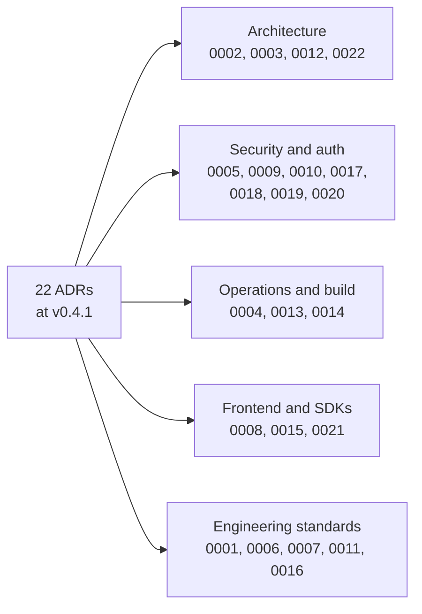
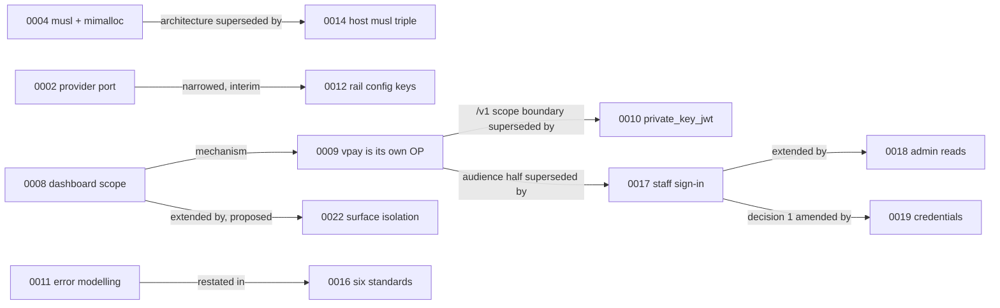

# Architecture decisions

vpay records every architecturally significant choice as a numbered
**architecture decision record** (ADR) in
[`docs/adr/`](vpay:docs/adr/0001-record-architecture-decisions.md). An ADR
records a decision that has been _taken_. It describes neither the process that
follows from it (that is a flow document) nor the code that implements it (that
is a reference page). v0.4.1 carries 22 ADRs, 0001 to 0022. This page gives each
one a single sentence. Read the ADR itself for the context, the alternatives
that were rejected and the consequences.

::: info ADRs are immutable
Once an ADR is accepted, it is never edited to change what it decided. To change
a decision, a new ADR supersedes it, in whole or in part, and the old one says
so in its status line. Where the implementation differs from the decision, vpay
adds a **dated addendum** or amendment instead of rewriting the decision. 0004
and 0008 carry addenda of that kind; 0010 and 0011 carry amendments.
:::

## How the decisions relate

Several ADRs refine earlier ones. This is how the chain of supersession and
extension looks at v0.4.1:

## Architecture

| ADR                                                                                                                | Status             | Decision                                                                                                                                                                                                                    |
| ------------------------------------------------------------------------------------------------------------------ | ------------------ | --------------------------------------------------------------------------------------------------------------------------------------------------------------------------------------------------------------------------- |
| [0002](vpay:docs/adr/0002-provider-port.md): Rails live behind a port                                              | Accepted           | Every rail is reached through one `ProviderAdapter` trait. The core branches on capability values (`flow`, `supports_refunds`), never on a provider code, and providers are table rows, not enum variants                   |
| [0003](vpay:docs/adr/0003-yaml-configuration.md): Administration is YAML in git                                    | Accepted           | All administration is YAML, loaded and validated at boot. A validation failure exits before any traffic is served, and the dashboard cannot change any of it                                                                |
| [0012](vpay:docs/adr/0012-rail-configuration-requirements-in-config.md): Rail config keys in `vpay-config`         | Accepted (interim) | `REQUIRED_RAIL_KEYS`, a small table keyed by rail code, is the one sanctioned place outside an adapter that matches on a provider code. It stays until the port grows a hook to replace it                                  |
| [0022](vpay:docs/adr/0022-surface-isolation-and-independent-scaling.md): Surface isolation and independent scaling | **Proposed**       | One image and one binary, with configuration choosing which surfaces a process serves. It would mean two server Deployments and a chart guard on the Postgres connection budget. Three decisions are left to the maintainer |

## Security and authentication

| ADR                                                                                                                 | Status                          | Decision                                                                                                                                                                              |
| ------------------------------------------------------------------------------------------------------------------- | ------------------------------- | ------------------------------------------------------------------------------------------------------------------------------------------------------------------------------------- |
| [0005](vpay:docs/adr/0005-rustls-only.md): rustls everywhere                                                        | Accepted                        | Every TLS client uses rustls. `deny.toml` bans `openssl`, `openssl-sys` and `native-tls`, and TLS verification is never disabled, not even against stub hosts                         |
| [0009](vpay:docs/adr/0009-dashboard-oidc-provider.md): vpay is its own OpenID Provider for `/dash/v1`               | Accepted, **partly superseded** | Staff sign in with authorization code + PKCE, against `authkestra-op` handlers hosted by vpay itself. Its `/v1` scope boundary is superseded by 0010, and its audience half by 0017   |
| [0010](vpay:docs/adr/0010-merchant-auth-private-key-jwt.md): Merchants use `client_credentials` + `private_key_jwt` | Accepted, amended               | Each merchant is a statically registered OAuth2 client, with its public JWK in YAML. No API key of any shape is accepted on `/v1`, and no refresh token is issued                     |
| [0017](vpay:docs/adr/0017-staff-authentication.md): How a staff member signs in                                     | Accepted                        | Staff authenticate against a vpay-owned `staff_members` table with two mandatory factors: an argon2id password with a deployment pepper, and RFC 6238 TOTP, enrolled at first sign-in |
| [0018](vpay:docs/adr/0018-cross-tenant-admin-reads.md): A cross-tenant admin role                                   | Accepted                        | An admin is a `staff_members.is_admin` column, re-read on every request like the rest of the staff row, rather than a claim baked into a token                                        |
| [0019](vpay:docs/adr/0019-credential-model.md): Credentials are their own object                                    | Accepted (amends 0017)          | Credentials move to one `credentials` table, generic over kind and subject. Federated identity is keyed on `(iss, sub)`, never on email                                               |
| [0020](vpay:docs/adr/0020-privacy-controls-and-evidence.md): Privacy controls share one inventory                   | Accepted                        | vpay keeps one exhaustive, machine-readable inventory of its processing surfaces, and every privacy control builds on that inventory and one shared evidence architecture             |

## Operations and build

| ADR                                                                                       | Status                             | Decision                                                                                                                                                                                   |
| ----------------------------------------------------------------------------------------- | ---------------------------------- | ------------------------------------------------------------------------------------------------------------------------------------------------------------------------------------------ |
| [0004](vpay:docs/adr/0004-musl-mimalloc.md): Static musl with mimalloc                    | Accepted, **superseded in part**   | Shipping binaries are statically linked musl, in `FROM scratch` images, with mimalloc. The architecture it named is superseded by 0014, and an addendum retires its "two binaries" framing |
| [0013](vpay:docs/adr/0013-database-backups-and-retention.md): Backups, PITR and retention | **Proposed**                       | It proposes RPO ≤ 5 minutes and RTO ≤ 60 minutes, met by continuous WAL archiving with point-in-time recovery. **Nothing in it is implemented, and no backup has ever been taken**         |
| [0014](vpay:docs/adr/0014-builder-host-musl-triple.md): The builder's host musl triple    | Accepted (supersedes 0004 in part) | Build for the builder's own musl triple (`x86_64` or `aarch64`), never cross-compile, and list every published triple in `.cargo/config.toml`                                              |

## Frontend and SDKs

| ADR                                                                              | Status                         | Decision                                                                                                                                                                                                            |
| -------------------------------------------------------------------------------- | ------------------------------ | ------------------------------------------------------------------------------------------------------------------------------------------------------------------------------------------------------------------- |
| [0008](vpay:docs/adr/0008-dashboard-scope.md): The dashboard observes            | Accepted, **writes not built** | The dashboard acts on records and never on configuration, and never holds a merchant secret. An addendum records that the per-record writes it describes are designed but unbuilt, and that `/dash/v1` is read-only |
| [0015](vpay:docs/adr/0015-sdk-parity.md): Merchant SDKs are held to parity       | Accepted                       | `sdks/rust` and `sdks/nodejs` agree capability by capability, checked by machine. A capability lands in both in one PR, or it is recorded as a dated gap with an owner                                              |
| [0021](vpay:docs/adr/0021-flutter-checkout-plugin.md): A Flutter checkout plugin | Accepted                       | `vpay_checkout_flutter` shows the hosted page in a native window and gets the outcome by polling `GET /v1/browser/payment_intents/{id}`. It never reads the outcome off a URL                                       |

## Engineering standards

| ADR                                                                                             | Status            | Decision                                                                                                                                                               |
| ----------------------------------------------------------------------------------------------- | ----------------- | ---------------------------------------------------------------------------------------------------------------------------------------------------------------------- |
| [0001](vpay:docs/adr/0001-record-architecture-decisions.md): Record decisions                   | Accepted          | Every significant decision is a numbered ADR. An accepted ADR is immutable, and changing it means writing a new ADR that supersedes it                                 |
| [0006](vpay:docs/adr/0006-no-mocks-in-main-processes.md): No test doubles in shipping processes | Accepted          | No mock, fake or stub may be reachable from a shipping binary. A stub rail is a WireMock host in configuration, and `cargo xtask verify-no-mocks` enforces this        |
| [0007](vpay:docs/adr/0007-lint-policy.md): A panic in a payment path is a defect                | Accepted          | `unwrap`, `expect`, `panic`, `todo`, `unimplemented` and float arithmetic are denied workspace-wide, and `unsafe` is forbidden. Tests are exempt                       |
| [0011](vpay:docs/adr/0011-error-modelling.md): Error modelling                                  | Accepted, amended | Errors are typed at the leaves, composed per layer and classified once through `Classify`. `anyhow` appears only at a binary's edge                                    |
| [0016](vpay:docs/adr/0016-engineering-standards.md): Six engineering standards                  | Accepted          | The six standards are errors, adapters, serde `snake_case`, SOLID/DRY, repositories as traits, and compiled doctests with externalised docs. Three are machine-checked |

## Status in this release

Most ADRs describe decisions that are in force. The ones below are where the
decision and the code do not match yet, and the ADR says so itself:

| Decision                          | Status                   | Evidence                                                                                             |
| --------------------------------- | ------------------------ | ---------------------------------------------------------------------------------------------------- |
| 0008: dashboard per-record writes | <Status s="not-built" /> | The 2026-09-20 addendum says `/dash/v1` mounts reads only, and the writes are designed but unbuilt   |
| 0013: backups, PITR, retention    | <Status s="not-built" /> | The status is _Proposed_. No backup, restore or drill has ever happened                              |
| 0022: surface isolation           | <Status s="partial" />   | The status is _Proposed_, pending maintainer acceptance, with three decisions deliberately left open |
| 0012: rail config keys            | <Status s="partial" />   | An interim exception to 0002 until the port grows a `required_settings()`-style hook                 |

Each ADR's own status line is authoritative. The directory is
[`docs/adr/`](vpay:docs/adr/0001-record-architecture-decisions.md).

## Go deeper

- [ADR-0001](vpay:docs/adr/0001-record-architecture-decisions.md): why vpay
  records decisions at all
- [ADR-0016](vpay:docs/adr/0016-engineering-standards.md): the standards every
  change applies, and which gate enforces each
- [docs/flows/README.md](vpay:docs/flows/README.md): how ADRs, flows and
  reference pages divide the work
- [AGENTS.md](vpay:AGENTS.md) § Architecture rules: the rules these ADRs
  produce, in one place
- Agents applying the standards should load
  [vpay-conventions](skill:vpay-conventions).
