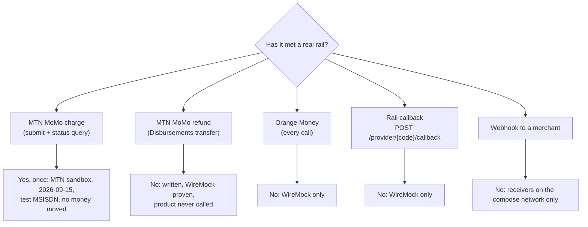
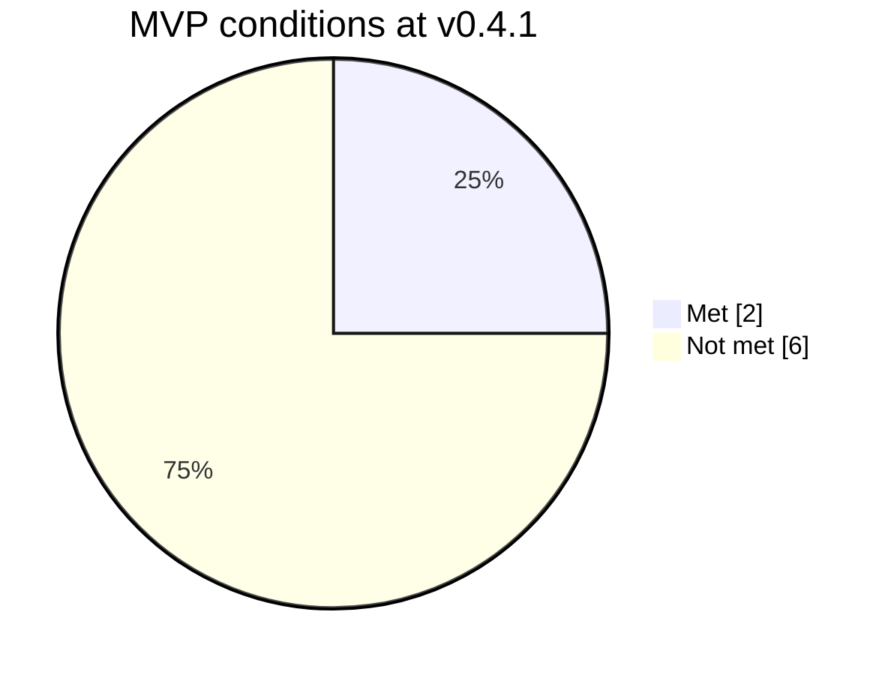

# What works today

This page tells you what vpay v0.4.1 actually does. Most of the other pages on
this site describe how vpay is _designed_ to work. They mark what is built, but
this page is the honest summary. The source of truth is vpay's own
[`docs/status.md`](vpay:docs/status.md), and a build gate reads that file, so it
cannot silently fall behind the code.

::: danger vpay is a scaffold
It compiles, lints clean and its tests pass, **but it cannot take a payment. Do
not deploy it.**
:::

## The one real rail call

Until 2026-09-15 the load-bearing sentence was "no HTTP call to a real rail has
ever been made". On that day one EUR `mtn_momo` PaymentIntent was created,
confirmed and settled against **MTN's real sandbox**. The worker's authenticated
status query reported the charge paid, and the intent reached `succeeded`.

The sentence that replaced it is narrower, and it still decides what you can
trust:

> No real payer, no production rail, and no rail other than MTN's sandbox have
> ever been touched.

Concretely:

- The payer number was an MTN-sandbox test MSISDN that the sandbox settles by
  itself. No handset was prompted and **no money moved**.
- **Orange's redirect rail has never been called.**
- **No webhook has ever reached a merchant endpoint** outside the repository.
- **No rail has ever refunded anything.** MTN's Disbursements product, which is
  what an MTN refund is, has never been called. `orange_money::refund` is
  `NotImplemented`.
- **No cluster has ever run vpay.**

## Where things stand, area by area

In this table, a <Status s="partial" /> chip means some of the area is real and
the rest is listed on the linked page. On vpay's side, every 🟡 and ⛔ is there
because a test says so, and nothing is marked ✅ unless a test would fail if it
broke.

| Area                                                       | Status                  | Today                                                                                                                                                  | Detail                                                                                                   |
| ---------------------------------------------------------- | ----------------------- | ------------------------------------------------------------------------------------------------------------------------------------------------------ | -------------------------------------------------------------------------------------------------------- |
| **Backend**: `/v1`, `/dash/v1`, `/provider`, `/v1/browser` | <Status s="partial" />  | Real routes, real rows and real adapters. Every rail call went to a stub until 2026-09-15, when the MTN push first reached MTN's real sandbox          | [status/backend.md](vpay:docs/status/backend.md)                                                         |
| **Adapter**: `mtn_momo` charge                             | <Status s="partial" />  | Wire calls proven against WireMock. Since 2026-09-15 the charge path is also proven against MTN's real sandbox                                         | [status/backend.md](vpay:docs/status/backend.md)                                                         |
| **Adapter**: `mtn_momo` refund                             | <Status s="unproven" /> | The Disbursements `transfer` call is written and WireMock-proven. It has never been called, and no real Disbursements credential exists in the project | [status.md](vpay:docs/status.md)                                                                         |
| **Adapter**: `orange_money`                                | <Status s="unproven" /> | Wire calls proven against WireMock. Never called                                                                                                       | [status/backend.md](vpay:docs/status/backend.md)                                                         |
| **Frontend**: checkout page, dashboard, demo shop          | <Status s="partial" />  | Built, and walked by a real browser against a stub rail                                                                                                | [status/frontend.md](vpay:docs/status/frontend.md)                                                       |
| **Infrastructure**: images, compose, Helm, migrations      | <Status s="partial" />  | Boots in compose and in CI. **No pod has ever run**                                                                                                    | [status/infrastructure.md](vpay:docs/status/infrastructure.md)                                           |
| **Data layer**: sqlx, CrateStack, the schema               | <Status s="partial" />  | `schemas/vpay.cstack` compiles into `vpay-db`. The drift between migrations and models is counted but not closed                                       | [status/cratestack.md](vpay:docs/status/cratestack.md)                                                   |
| **Merchant SDKs**: `sdks/rust`, `sdks/nodejs`              | <Status s="partial" />  | Parity is machine-checked in both directions. The gaps are dated and each has an owner                                                                 | [status/merchant-sdks.md](vpay:docs/status/merchant-sdks.md), [sdks/parity.md](vpay:docs/sdks/parity.md) |
| **An MVP**                                                 | <Status s="partial" />  | Two of eight conditions met (see below). It is not an MVP                                                                                              | [status/mvp.md](vpay:docs/status/mvp.md)                                                                 |

### What "partial" means in practice

A few rows from the area pages show where the limits sit:

- **Refunds.** The four `/v1` refund routes and both SDKs' refund surfaces
  exist. A refund is written as `pending`, and `charge.refunded` is emitted.
  **Nothing settles a `pending` refund**, because there is no refund poll
  ladder, so every refund stays `pending`.
- **Webhooks.** Signing and the two-step outbox are real, and delivered
  signatures have been verified by both SDKs and by `stripe`'s `constructEvent`.
  Every receiver has been a container on the same compose network.
- **The dashboard.** A staff member can sign in with a password and TOTP, and
  read one merchant's payments in a browser, against the local stack. It has not
  run in a deployment. `/dash/v1` has no write routes.
- **Infrastructure.** The Helm chart renders and is schema-validated, and images
  are built and signed by the release workflow. **Database backups, PITR and
  retention are not implemented**: no backup has ever been taken
  ([ADR-0013](vpay:docs/adr/0013-database-backups-and-retention.md) is only
  _proposed_). Nothing has ever scraped `/metrics`.

## What would make it an MVP

vpay keeps a list of eight conditions it must meet before it can call itself an
MVP. Two are met.

| #   | Condition                                                                         | Status                  | Why                                                                                                                                                                |
| --- | --------------------------------------------------------------------------------- | ----------------------- | ------------------------------------------------------------------------------------------------------------------------------------------------------------------ |
| 1   | Database schema and migrations, with the `one_charge_per_intent` unique index     | <Status s="built" />    | The index exists, and a test proves the database rejects a second charge                                                                                           |
| 2   | Both adapters making real HTTP calls and passing the shared conformance suite     | <Status s="unproven" /> | The literal words are met, with no `#[ignore]`s. But every conformance case talks to a WireMock container, and Orange has never been called                        |
| 3   | The worker's job loop, poll ladder and reconciler, with crash tests               | <Status s="partial" />  | Built and tested, including real `SIGKILL` tests for two of three kill points. One kill point is simulated, and the rail is still a stub                           |
| 4   | `/v1/payment_intents` create and confirm, form-encoded, idempotent, authenticated | <Status s="partial" />  | Works end to end, and the worker settles it. What decides the item is that the rail is a stub                                                                      |
| 5   | Signed webhooks with the two-step outbox                                          | <Status s="partial" />  | Real and SSRF-guarded, but no merchant endpoint has ever been POSTed to, and the long retry rungs have never elapsed                                               |
| 6   | `just test-e2e` green against the compose stack                                   | <Status s="built" />    | Green, with four Cypress specs. The rails behind them are WireMock hosts                                                                                           |
| 7   | `/dash/v1` login end to end: issue a token, verify it, rotate a signing key       | <Status s="partial" />  | Staff sign-in works against a real Postgres. Key rotation is restart-based and has never been observed on a deployment                                             |
| 8   | A hosted payment page, in an iframe version and a fully hosted version            | <Status s="partial" />  | Both pages are built and driven by a real browser, but they are not ready for production. Stub rails, and no browser has been observed enforcing `frame-ancestors` |

One fact keeps items 2, 3, 4, 5 and 8 open: every rail and every webhook
receiver in the project's history has been a stub. The single MTN sandbox charge
does not change that. It was one charge, to a test number, with no money moved.

## The `NotImplemented` declaration

vpay's second rule is that code which has not been written returns
`ProviderError::NotImplemented("<crate>::<fn>")` instead of faking a success.
`cargo xtask verify-status` scans the shipping code for every such token and
**fails in both directions**. A token that `docs/status.md` does not declare
fails the build, and so does a declared token that no shipping code still
carries.

At v0.4.1 **exactly one** token is declared:

| Token                  | What it means                                                                                                                                                                                                                                                                                                                     |
| ---------------------- | --------------------------------------------------------------------------------------------------------------------------------------------------------------------------------------------------------------------------------------------------------------------------------------------------------------------------------- |
| `orange_money::refund` | An Orange refund is an outbound **transfer** back to a payee (RFC-0003 § 5). The repository holds no Orange transfer specification, so writing the call would mean inventing an endpoint in the money path. The rail declares `supports_refunds: true`: the gap is vpay's, not Orange's. `supports_partial_refunds` stays `false` |

::: warning A short list is the weakest claim, not the strongest
A missing token only means that no function body is missing. It says nothing
about whether a written call has ever run. `mtn_momo::refund` left the list on
2026-09-15 because its code was written. **It has never been called.**
:::

There is also something that is declared but never filled in: the refund `fee`.
The column, the wire field and both SDKs' `Refund.fee` exist, but it stays
`null`. No rail response that carries a fee has ever been seen, and an adapter
must never invent one.

## Status in v0.4.1

| Part                          | Status                   | Evidence                                                                     |
| ----------------------------- | ------------------------ | ---------------------------------------------------------------------------- |
| Taking a real payment         | <Status s="not-built" /> | The banner in `docs/status.md`: vpay cannot take a payment                   |
| End to end against stub rails | <Status s="partial" />   | `just demo` settles six payments on both rails, and `just test-e2e` is green |
| MTN sandbox charge            | <Status s="partial" />   | One intent, `pi_xxd2xj1e914e16c6m63gezag`, reached `succeeded` on 2026-09-15 |
| Declared unimplemented paths  | <Status s="partial" />   | One token, `orange_money::refund`, gate-checked in both directions           |

The full record is in [`docs/status.md`](vpay:docs/status.md). Its history,
verbatim and dated, is in [`docs/status/`](vpay:docs/status/README.md).

## Go deeper

- [docs/status.md](vpay:docs/status.md): the banner, the area table and the
  declaration
- [docs/status/mvp.md](vpay:docs/status/mvp.md): all eight MVP conditions, item
  by item
- [docs/status/backend.md](vpay:docs/status/backend.md),
  [frontend.md](vpay:docs/status/frontend.md) and
  [infrastructure.md](vpay:docs/status/infrastructure.md): row-by-row evidence
- [The 2026-09-15 verification page](vpay:docs/status/verification/2026-09-15.md)
  and [the live-sandbox runbook](vpay:docs/runbooks/live-sandbox-test.md)
- This site's own [parity gate](/about/parity), which keeps these pages tied to
  a vpay release
- Agents updating status should load [vpay-docs-status](skill:vpay-docs-status).
