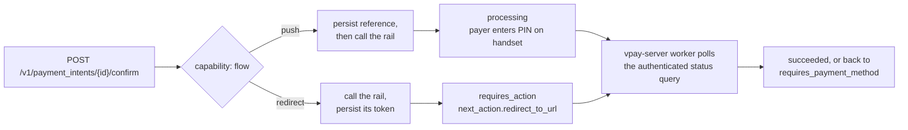
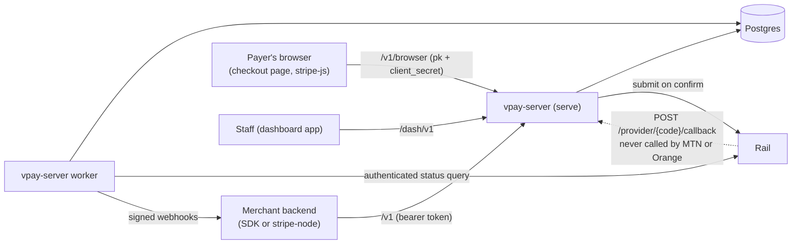
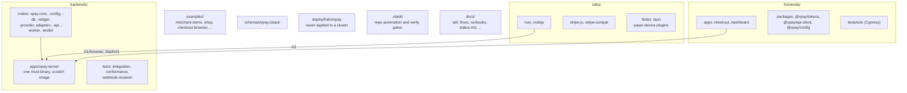

# What is vpay

vpay is meant to be a small, provider-agnostic payment gateway for Cameroon and
Central Africa. Merchants integrate it the way they would integrate Stripe, with
the same object model, the same idempotency semantics and the same webhook
signature scheme. Underneath, it talks to mobile-money rails that behave nothing
like cards. MTN MoMo and Orange Money are the first two adapters. Neither of
them defines the architecture.

::: danger vpay has never taken a real payment
At <Release /> vpay is a **scaffold**. It compiles, lints clean and its tests pass,
but it cannot take a payment. **Do not deploy it.** Every payment in its history
has settled against a WireMock stub, with one exception: a single MTN
**sandbox** charge on 2026-09-15. See [What works today](/guide/status).
:::

{.diagram}

## Who it is for

| Reader                   | What vpay offers them                                                                                                                                                                        |
| ------------------------ | -------------------------------------------------------------------------------------------------------------------------------------------------------------------------------------------- |
| **A merchant developer** | A Stripe-shaped `/v1` API (PaymentIntents, Checkout Sessions, Customers, Invoices, Events, Refunds), two merchant SDKs, a browser client and a hosted payment page                           |
| **An operator**          | One static binary in a `FROM scratch` image, configured entirely by YAML in git ([ADR-0003](vpay:docs/adr/0003-yaml-configuration.md)), with a dashboard that observes and never administers |
| **A contributor**        | A repository that enforces its own honesty rules with build gates, so that what it says about itself stays checkable                                                                         |

## Two rails, two very different payer journeys

Card payments have one shape. Mobile money has at least two, and vpay's core
picks between them using a **capability value** (`flow`), never a rail name.

{.diagram}

|                                          | **MTN MoMo** (`push`)           | **Orange Money** (`redirect`)         |
| ---------------------------------------- | ------------------------------- | ------------------------------------- |
| How the payer acts                       | Enters a PIN on their handset   | Is redirected to Orange's hosted page |
| Intent status after `confirm`            | `processing`                    | `requires_action`                     |
| Who holds the payer's identifier         | vpay (it is an input to submit) | The rail. vpay may never learn it     |
| **Can the payer act before vpay saves?** | **Yes**                         | **No**                                |

The last row matters more than the others. On a push rail the payer's phone
starts buzzing as soon as vpay calls MTN, so vpay must save the reference
**before** it makes the call. On a redirect rail the payer cannot do anything
until vpay hands over a URL, so vpay must save Orange's token **before** it
redirects. That is why [crash safety](/payments/crash-safety) has two
enforcement points instead of one.

## A Stripe-shaped API, and where the comparison breaks

The object model, the idempotency semantics and the webhook signature are all
copied from Stripe on purpose, so that a merchant's existing knowledge and code
carry over. The comparison breaks in three places:

1. **Authentication.** This is the big one. `/v1` accepts no
   `sk_live_`/`sk_test_` API key. Merchants authenticate with OAuth2
   `client_credentials` plus `private_key_jwt` (RFC 7523). Each merchant is a
   statically registered client that holds its own private key, and vpay stores
   only the public half, in YAML
   ([ADR-0010](vpay:docs/adr/0010-merchant-auth-private-key-jwt.md)). The
   official `stripe` package can still reach vpay: `@vaam-apps/vpay-sdk/stripe`
   supplies a `config.authenticator`, so
   `new Stripe("", { authenticator, host, port, protocol })` works with an empty
   key. See [Stripe compatibility](/api/stripe-compat) and
   [Authentication](/api/authentication).
2. **Idempotency is required.** Every `POST` must carry an `Idempotency-Key`.
   Stripe makes the key optional.
3. **A retry is a new PaymentIntent.** An intent can have only one charge, ever
   ([One charge per intent](/guide/concepts#one-charge-per-intent)).

## The shape of the system

vpay ships as **one binary**, `vpay-server`, with several modes. With no
subcommand it serves the API. `vpay-server worker` runs the job loop. The job
loop polls rails, settles charges, delivers webhooks and escalates stuck
payments. `vpay-server staff add` creates a dashboard account. Both of the
long-running modes share one Postgres database.

| Surface                          | Who calls it                                                            | Today                                                                                     |
| -------------------------------- | ----------------------------------------------------------------------- | ----------------------------------------------------------------------------------------- |
| `/v1`                            | A merchant's server, with a bearer token from `POST /v1/oauth/token`    | Payment intents, checkout sessions, customers, invoices, events, refunds, account holders |
| `/v1/browser`                    | A payer's page, with a publishable key and the intent's `client_secret` | Built, and walked by a real browser against stub rails                                    |
| `POST /provider/{code}/callback` | A rail (callbacks are hints only)                                       | Proven against WireMock. **MTN and Orange have never called it**                          |
| `/dash/v1`                       | The dashboard app's server, under a staff session                       | Staff sign-in and read routes. None of the dashboard writes ADR-0008 describes is built   |

`GET /v1/balance` is not routed anywhere, and it answers an honest `404`. A
refund can be created, but a `201` does not mean money came back. Nothing in
<Release /> settles a `pending` refund, and no rail has ever refunded anything.

### The two web apps and the SDKs

- **`frontends/apps/checkout`** is the payment page vpay serves, in hosted and
  embedded (iframe) modes. See [Hosted checkout](/checkout/hosted).
- **`frontends/apps/dashboard`** is where staff sign in and read one merchant's
  payments. It observes and does not administer
  ([ADR-0008](vpay:docs/adr/0008-dashboard-scope.md)). See
  [Dashboard](/dashboard/).
- **Merchant SDKs.** `sdks/rust` (`vpay-sdk`) and `sdks/nodejs`
  (`@vaam-apps/vpay-sdk`) are held to one capability matrix. `sdks/stripe-js`
  (`@vaam-apps/vpay-stripe-js`) is the browser client for a payer's page.
  `sdks/stripe-compat` drives the official `stripe` package against a live
  stack. Most of `sdks/nodejs`'s own tests answer themselves through a
  `node:http` stub, but its two live suites (`invoices.live.test.ts` and
  `refunds.live.test.ts`) drive a real `vpay-server`, and CI's `e2e` job runs
  them. See [SDKs](/sdks/).
- **Payer-device plugins.** `sdks/flutter` (`vpay_checkout_flutter`) and
  `sdks/tauri` (`tauri-plugin-vpay-checkout`, since 2026-09-22) open vpay's
  hosted checkout page on the payer's device and learn the outcome by polling
  the intent, never by reading a URL. They are not merchant SDKs. **Neither is
  built or tested by `just ci`**, apart from the Tauri plugin's TypeScript
  half. See [Mobile checkout](/checkout/mobile) and
  [Tauri checkout](/checkout/tauri).

## The repository layout

The backend is Rust (edition 2024) with axum, sqlx and rustls only. It builds
static musl binaries into `FROM scratch` images with mimalloc. The frontend is
Next.js 15 and React 19 in strict TypeScript. `examples/shop` runs on Next 16.

## Two rules the repository enforces on itself

Both rules are wired into `just verify` and CI.

1. **No test doubles in shipping processes.** No mock, fake or stub may be
   reachable from `vpay-server` in any of its modes. A stub rail is a **WireMock
   host in configuration**, reached over HTTP exactly as a real rail would be
   ([ADR-0006](vpay:docs/adr/0006-no-mocks-in-main-processes.md)).
2. **Never claim a feature is done when it is not.** Code that has not been
   written returns `ProviderError::NotImplemented` and never fakes a success.
   Every such path must be declared in `docs/status.md`, and
   `cargo xtask verify-status` fails in both directions if the code and the page
   disagree.

Rails also stay behind the port. Code outside an adapter crate that branches on
a provider code, as in `if provider == "mtn_momo"`, is a defect
([ADR-0002](vpay:docs/adr/0002-provider-port.md),
[Provider port](/rails/provider-port)).

## Status in this release

| Part                                  | Status                   | Evidence                                                                                       |
| ------------------------------------- | ------------------------ | ---------------------------------------------------------------------------------------------- |
| End-to-end payment against stub rails | <Status s="partial" />   | `just demo` walks six payments on both rails. Every rail in those runs is a WireMock container |
| MTN MoMo charge path                  | <Status s="partial" />   | One EUR sandbox charge settled on 2026-09-15. The payer was a test number, and no money moved  |
| Orange Money                          | <Status s="unproven" />  | Wire calls proven against WireMock only. Orange has never been called                          |
| Refunds                               | <Status s="unproven" />  | Routes exist. Nothing settles a `pending` refund, and no rail has ever refunded anything       |
| A deployment                          | <Status s="not-built" /> | The Helm chart renders and is schema-validated. No cluster has ever run vpay                   |

See [What works today](/guide/status) for the full picture, and
[`docs/status.md`](vpay:docs/status.md) for the record.

## Go deeper

- [README.md](vpay:README.md): the project's own front page, including the `/v1`
  route table and the layout
- [AGENTS.md](vpay:AGENTS.md): the rules, the standards and the architecture
  rules every change follows
- [Payment lifecycle flow](vpay:docs/flows/payment-lifecycle.md): the two flow
  shapes and every state
- [ADR-0002](vpay:docs/adr/0002-provider-port.md) and
  [ADR-0010](vpay:docs/adr/0010-merchant-auth-private-key-jwt.md): the port and
  merchant authentication
- Agents orienting in this repository should load the [vpay](skill:vpay) skill
  first. It routes to the rest.
