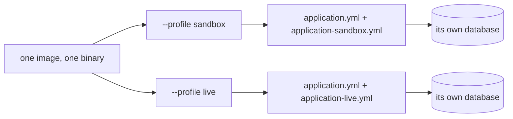
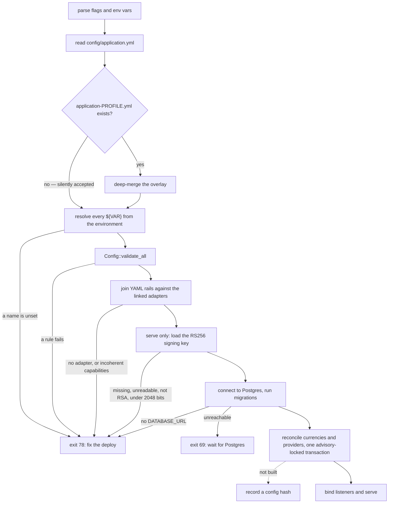

# Configuration

Everything that decides where money goes — which rails exist, their hosts and
credentials, which merchants may authenticate, where webhooks are sent — lives
in YAML files in git, is loaded once at boot, and is validated hard enough that
a bad file stops the process before it binds a port. There is no admin UI and
the dashboard cannot change any of it
([ADR-0003](vpay:docs/adr/0003-yaml-configuration.md)). A change is a reviewed
pull request and a redeploy, which is the point: configuration gets diffs,
review and rollback, and a half-configured gateway never serves traffic.

Agents working on configuration should load [vpay-ops](skill:vpay-ops).

## Two layers: flags, then the file

Both processes — `vpay-server` in its default `serve` mode and the same binary
run as `vpay-server worker` — first parse a small CLI in which every flag also
resolves from an environment variable, an explicit flag beating its variable.
The two modes share one flag definition, so they cannot drift on a name or a
default.

| Flag                                    | Env var                       | Default        |
| --------------------------------------- | ----------------------------- | -------------- |
| `--bind` (serve only)                   | `VPAY_BIND`                   | `0.0.0.0:8080` |
| `--database-url`                        | `DATABASE_URL`                | none           |
| `--profile`                             | `VPAY_PROFILE`                | `sandbox`      |
| `--config`                              | `VPAY_CONFIG`                 | none           |
| `--observability-bind`                  | `VPAY_OBSERVABILITY_BIND`     | `0.0.0.0:9090` |
| `--oauth-signing-key-file` (serve only) | `VPAY_OAUTH_SIGNING_KEY_FILE` | none           |
| `--log-filter`                          | `RUST_LOG`                    | `info`         |
| `--log-format` (`json` or `text`)       | `VPAY_LOG_FORMAT`             | `json`         |
| `--shutdown-grace-seconds`              | `VPAY_SHUTDOWN_GRACE_SECONDS` | `25`           |
| `--worker-concurrency` (worker only)    | `VPAY_WORKER_CONCURRENCY`     | `4`            |

`cargo run -p vpay-server -- --help` prints the live set and beats this table if
they ever disagree. Everything else — rails, merchants, checkout, the dashboard
client — is in the YAML file `--config` names.

## A profile selects a file, never a code path

vpay borrows Spring Boot's idiom: `config/application.yml` is the base, and
`application-{profile}.yml` in the same directory is deep-merged over it. The
rule that makes this safe is strict: **a profile may select values, never
behaviour.** There is a sandbox _environment_ — a deployment whose YAML points
at rail sandboxes or WireMock, with its own database — but there is no sandbox
_mode_: no `if (sandbox)`, no code that exists only outside production.



Two merge details matter when you write an overlay. Dictionaries merge key by
key, so an overlay only needs the keys that differ. **Lists replace wholesale**
— `providers` and `merchant_clients` in an overlay are the complete lists for
that profile, which is why `config/application-live.yml` restates its one
merchant and one rail in full.

The repository ships three files. `application.yml` is deliberately
sandbox-shaped (`livemode: false`, rail hosts pointing at the compose WireMock
stubs). `application-sandbox.yml` is the CLI's default profile.
`application-live.yml` is a _prod-shaped local_ overlay: it still has
`livemode: false`, but points `mtn_momo` at MTN's real sandbox — it is what the
[live sandbox runbook](/operate/runbooks#live-sandbox-test) runs. None of the
three is a production configuration.

## How a configuration is resolved at boot



The exit codes are a contract an operator can act on: **78 means fix the
deployment, and restarting will not help; 69 means the database is not there
yet, and waiting is correct.** Every configuration failure in the diagram is
checked before the database is contacted except the missing `DATABASE_URL`,
which is raised at the connection step and is still 78.

**Unresolved placeholders are fatal, never empty.** vpay's resolver has no
default syntax: a `${VAR}` naming an unset variable is
`ConfigError::UnresolvedPlaceholder`, exit 78, in both modes. An empty
subscription key would otherwise fail much later, at a first charge, looking
like a rail outage. _Empty_ is a value, though — only _unset_ refuses to boot.

**Reconcile is the mirror, configuration is the authority.** After migrations,
both modes make the `currencies` and `providers` tables match the YAML in one
transaction under a Postgres advisory lock, so replicas booting together cannot
interleave. A rail present in the file is upserted; a rail removed from it is
set `enabled = false` rather than deleted, because a rail that has ever taken
money must stay nameable. Capabilities (flow, refund support) come from the
linked adapter, never from YAML ([the provider port](/rails/provider-port)).

## Rail credentials

Credentials are written as `${VAR}` placeholders and resolved from the process
environment. This is the `mtn_momo` block from `config/application.yml`, with
its comments removed:

```yaml
providers:
  - code: mtn_momo
    host:
      url: http://wiremock-mtn:8080
      label: mtn-sandbox-wiremock
    display_name:
      en: MTN Mobile Money
      fr: MTN Mobile Money
    currency: EUR
    settings:
      subscription_key_header: Ocp-Apim-Subscription-Key
      target_environment: sandbox
      api_user: ${MTN_API_USER}
      disbursement_api_user: ${MTN_DISBURSEMENT_API_USER}
    credentials:
      subscription_key: ${MTN_SUBSCRIPTION_KEY}
      api_key: ${MTN_API_KEY}
      disbursement_subscription_key: ${MTN_DISBURSEMENT_SUBSCRIPTION_KEY}
      disbursement_api_key: ${MTN_DISBURSEMENT_API_KEY}
```

`settings` are printed in full by the config's `Debug` output; `credentials` are
redacted, which is why anything secret belongs in `credentials`. The base file
references ten variables in total: nine rail variables (`MTN_*` above plus
`ORANGE_MERCHANT_KEY`, `ORANGE_CLIENT_ID`, `ORANGE_CLIENT_SECRET`) and
`MERCHANT_WEBHOOK_SECRET` for webhook signing. Every environment that loads the
file must define all ten — including the server, which never delivers a webhook
but validates the same document.

A rail missing a key its adapter cannot work without refuses to boot, and a
present-but-empty value counts as missing. This table is the one sanctioned
place outside an adapter crate that matches on a rail code — a recorded interim
until the port grows a hook for it
([ADR-0012](vpay:docs/adr/0012-rail-configuration-requirements-in-config.md)):

| Rail           | Required keys                                                                                             |
| -------------- | --------------------------------------------------------------------------------------------------------- |
| `mtn_momo`     | `settings.target_environment`, `settings.api_user`, `credentials.subscription_key`, `credentials.api_key` |
| `orange_money` | `credentials.merchant_key`, `credentials.client_id`, `credentials.client_secret`                          |

::: warning The Disbursements keys are defined, not real
The three `MTN_DISBURSEMENT_*` variables feed MTN refunds. They are deliberately
_not_ required keys, so an empty value boots and a refund then fails loudly. No
deployment holds a real MTN Disbursements credential; the compose stack's values
are stubs aimed at WireMock. See [MTN MoMo](/rails/mtn-momo).
:::

## Rules that refuse to boot

A selection of what `Config::validate_all` enforces:

| Rule                                                                             | Why                                                                               |
| -------------------------------------------------------------------------------- | --------------------------------------------------------------------------------- |
| Every merchant registration has a unique `merchant_id`                           | It is the `/v1` tenancy boundary, and no foreign key backs it                     |
| Currency exponents match the canonical table                                     | A 100x amount bug is otherwise silent ([Money](/payments/money))                  |
| `livemode` ⇒ every host is `https://`                                            |                                                                                   |
| `livemode` ⇒ no host labelled `wiremock`, `stub`, `mock` or `localhost`          | What makes "the code cannot tell a stub from a real rail" safe                    |
| `livemode` ⇒ secrets are written as `${VAR}`, never literals                     | Checked against the file's _text_, before resolution                              |
| `checkout.public_base_url` is a well-formed origin, `https://` under `livemode`  | Every payer link is built on it                                                   |
| `checkout_origins` entries are canonical origins, no duplicates across merchants | They become `frame-ancestors`; a non-canonical spelling would be dropped silently |
| `--worker-concurrency` ≤ 5 (worker only)                                         | Half the 10-connection pool; see [Crash safety](/payments/crash-safety)           |

`livemode` is a single boolean under `deployment:`. Every file in the repository
sets it `false`, so none of them exercises the livemode rules outside tests.

## The checkout page reads its own files

`frontends/apps/checkout` — the container serving the payment page — does not
read `application.yml`. It reads `branding.yaml` and `config.yaml` (defaults
under `/etc/vpay/checkout/`, examples in `config/checkout/`) with the opposite
policy: a bad value costs that one key and a `WARN`, and the page still renders.
Nothing reconciles its copy of `checkout.public_base_url` with the server's.
**The Helm chart templates no ConfigMap for either file**, so a Kubernetes
deployment has no supported way to supply them yet. See
[Hosted checkout](/checkout/hosted).

## What can go wrong

- **A typo in the profile boots cleanly on the baked sandbox file.** A missing
  overlay is not an error, so `VPAY_PROFILE=prodcution` yields a healthy pod
  with WireMock rail hosts and placeholder merchant keys. Nothing detects it;
  check the rendered mount path against `VPAY_PROFILE` before you deploy
  ([Deployment](/operate/deployment#what-can-go-wrong)).
- **A stale `VPAY_PUBLIC_BASE_URL` is silently ignored.** The flag was removed;
  the issuer comes from `deployment.public_base_url` in YAML.
- **No replica can tell it booted from a different file.** The config hash that
  would detect it is not built.
- **Changing a rail's host, currency or payee under in-flight charges.** The
  flow page classes these as identity-defining — a charge submitted to host A
  must be polled at host A — while credentials, TTLs and webhook endpoints are
  safe to change. Nothing described in its Status section enforces this; plan
  such changes for when no charge is in flight.

## Status in v0.4.1

| Part                                                | Status                   | Evidence                                                                 |
| --------------------------------------------------- | ------------------------ | ------------------------------------------------------------------------ |
| CLI / env layer                                     | <Status s="built" />     | Flag parsing, env resolution and precedence tested in `vpay-config`      |
| YAML load, overlay, `${VAR}` resolution, validation | <Status s="built" />     | `Config::load` wired into both modes; exit 78 proven by subprocess tests |
| Reconcile into `currencies` / `providers`           | <Status s="built" />     | Advisory-locked, one transaction; proven against real Postgres           |
| Livemode guard rules                                | <Status s="partial" />   | Implemented and unit-tested; no livemode deployment has ever booted      |
| Config hash (detect replicas on different files)    | <Status s="not-built" /> | "Nothing records or compares one"                                        |
| Hot reload                                          | <Status s="not-built" /> | By design: a config change is a redeploy                                 |
| Checkout-page files in Kubernetes                   | <Status s="not-built" /> | The chart templates no ConfigMap for them                                |

The full record, including every test name, is the Status section of
[docs/flows/configuration.md](vpay:docs/flows/configuration.md#status).

## Go deeper

- [docs/flows/configuration.md](vpay:docs/flows/configuration.md) — the flow,
  boot order and every refusal rule
- [ADR-0003: administration is YAML in git](vpay:docs/adr/0003-yaml-configuration.md)
- [ADR-0012: rail configuration requirements in config](vpay:docs/adr/0012-rail-configuration-requirements-in-config.md)
- [config/application.yml](vpay:config/application.yml),
  [config/application-sandbox.yml](vpay:config/application-sandbox.yml),
  [config/application-live.yml](vpay:config/application-live.yml) — all three
  read as annotated examples
- [Deployment](/operate/deployment) — how the file and its secrets reach a pod
- Skill: [vpay-ops](skill:vpay-ops)
