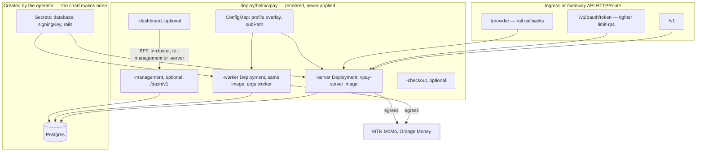
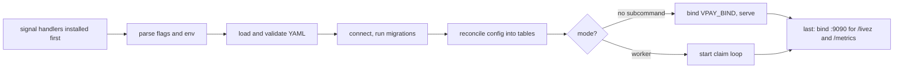
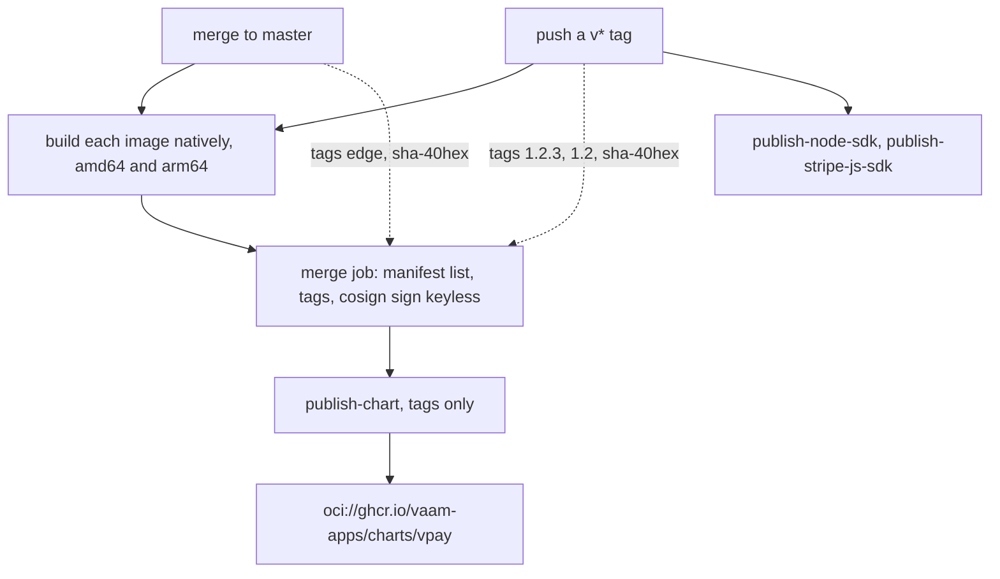

# Deployment

This page describes how a vpay build becomes a running deployment: what the
images contain, what has to exist around them, the order a process boots in, and
the guards that stop a bad configuration before it becomes an outage. Read it
with one fact in front of you.

::: danger No cluster has ever run vpay
The Helm chart renders, lints and validates against Kubernetes schemas in CI.
**No pod has ever run** — not in a real cluster, not in kind. Images are built,
published and signed by CI; nobody has pulled one. The only places vpay has
actually booted are Docker Compose on developer machines and in CI. vpay's own
banner says: do not deploy it.
:::

Agents working on deployment should load [vpay-ops](skill:vpay-ops); for the
compose files and `just` recipes, [vpay-tooling](skill:vpay-tooling).

## What ships

Three images, published to `ghcr.io/vaam-apps/vpay-{server,dashboard,checkout}`:

| Image            | Base             | Contents                                                                                                 |
| ---------------- | ---------------- | -------------------------------------------------------------------------------------------------------- |
| `vpay-server`    | `scratch`        | One static musl binary with mimalloc, plus `config/` baked at `/config`. Runs **both** backend workloads |
| `vpay-dashboard` | `node:22-alpine` | The staff dashboard's Next.js standalone server                                                          |
| `vpay-checkout`  | `node:22-alpine` | vpay's own hosted/embedded payment page                                                                  |

The backend image has no shell, no package manager and no writable path
([ADR-0004](vpay:docs/adr/0004-musl-mimalloc.md)). Everything is observed from
outside the container — there is no `HEALTHCHECK` and no `kubectl exec` — and it
runs as the raw UID `65532` because `scratch` has no `/etc/passwd`. The binary
is built for the builder's _own_ musl target triple, so amd64 and arm64 are both
native builds rather than cross-compiles
([ADR-0014](vpay:docs/adr/0014-builder-host-musl-triple.md)).

**The worker is the server image with one argument.** `vpay-server` serves HTTP;
`vpay-server worker` runs the job loop. In compose that is
`command: ["worker"]`; in the chart it is `args: ["worker"]` — never `command:`,
which in Kubernetes replaces the entrypoint (measured: that spelling exits 127).
A separate `vpay-worker` image existed until it was retired; its GHCR package is
frozen and nothing publishes to it.

## The shape of a Kubernetes deployment



The chart renders the server and worker always; the management tier, the
checkout page and the dashboard only behind their own `.enabled` flags (all off
by default). The management tier and the server autoscaler come from
[ADR-0022](vpay:docs/adr/0022-surface-isolation-and-independent-scaling.md),
which is still **Proposed**. The chart creates **no Secret and no database** —
backups, point-in-time recovery and retention are an obligation on whoever runs
Postgres, and the policy for them
([ADR-0013](vpay:docs/adr/0013-database-backups-and-retention.md)) is also only
proposed: no vpay database has ever been backed up.

## What must exist before a pod can start

Both modes refuse to start rather than start half-configured:

| Needed                             | Supplied as                                                | Missing ⇒                                                 |
| ---------------------------------- | ---------------------------------------------------------- | --------------------------------------------------------- |
| `VPAY_CONFIG`                      | baked `ENV` in the image                                   | exit 78                                                   |
| `DATABASE_URL`                     | Secret (`database.existingSecret`)                         | exit 78, both modes                                       |
| Every `${VAR}` the config names    | Secret via `envFrom` (`rails.existingSecret`)              | exit 78, both modes                                       |
| The RS256 signing key              | Secret mounted as a **file** (`signingKey.existingSecret`) | exit 78, server only                                      |
| Postgres, reachable and migratable | outside the chart                                          | exit 69                                                   |
| `worker.concurrency` ≤ 5           | chart value                                                | exit 78, worker only — and a chart guard refuses it first |

The signing key is deliberately a file, never an environment value, and only the
server mounts it — the worker issues no tokens.
[Configuration](/operate/configuration) explains the `${VAR}` rules.

## Boot, and migrations



**Migrations run at boot**, in both modes, through `sqlx::migrate!`, before the
listener binds — which is why the chart gives both workloads a startup probe
with a generous failure threshold. Two rules follow, and both bite on rollback:

- **There are no down-migrations.** An older image does not undo a migration a
  newer one ran; running old code against a new schema is unsupported and
  nothing checks for it.
- **A shipped migration file is never edited.** sqlx stores a hash of each
  file's bytes, comments included, and a changed file stops every database that
  applied the original from booting (exit 78). `MANIFEST.sha256` and
  `cargo xtask verify-migrations` make the rule a build failure; the
  [migrations runbook](/operate/runbooks#migrations) is the repair for a
  database already in that state.

`/livez` is bound _last_, so a liveness probe against a process still booting —
or about to exit 78 — is refused rather than answered `ok`.

## Probes, ports and shutdown

| Path           | Port | Answers                     | Role                     |
| -------------- | ---- | --------------------------- | ------------------------ |
| `GET /livez`   | 9090 | static `ok`, no database    | liveness, both workloads |
| `GET /metrics` | 9090 | Prometheus text             | scraping                 |
| `GET /healthz` | 8080 | `SELECT 1` against Postgres | readiness, server only   |

Metrics sit on a second port because `/metrics` names every rail, route and
error code, and 8080 is the one an Ingress fronts; the NetworkPolicy admits 9090
from the monitoring namespace only. **Nothing has ever scraped these metrics** —
the `ServiceMonitor` and `PrometheusRule` are off by default and every alert
threshold is proposed, not measured.

SIGTERM starts a drain bounded by `--shutdown-grace-seconds` (25 s). A non-zero
exit at the deadline means work was cut off, not that shutdown failed. The
chart's `grace-period` guard refuses to render unless
`terminationGracePeriodSeconds` (35) is at least the drain plus five seconds.

## Local and CI: compose

Compose is the only shape that has actually run vpay:

| File               | Adds                                                                                               |
| ------------------ | -------------------------------------------------------------------------------------------------- |
| `compose.yml`      | Postgres and the two WireMock rail stubs                                                           |
| `compose.e2e.yml`  | `vpay-server`, `vpay-worker`, a WireMock webhook receiver, dashboard, checkout page, the demo shop |
| `compose.demo.yml` | The overlay `just demo`, `just test-e2e` and CI's `e2e` job run under                              |

Every rail and every webhook receiver in these stacks is a `wiremock/wiremock`
container reached over HTTP. See the [demo runbook](/operate/runbooks#demo).

## The release pipeline

`.github/workflows/release.yml` is the only thing that publishes.



There is deliberately no `latest` tag and no `edge` chart: a real deployment
pins an image digest and a chart `--version`. Signing is keyless cosign over the
GitHub OIDC token, so verification names the workflow, not a key — and only the
manifest-list digest is signed, not the per-architecture children. The chart's
`version:`, its `appVersion` and the git tag must all agree or `publish-chart`
refuses; its republish guard distinguishes "already published and signed" (stop)
from "published, not signed" (resume signing).

What has happened: the workflow has run on `master` and on tags, pushed and
signed images, and published and signed a chart. What has **not**: nobody has
run `cosign verify` against anything this repository produced, nobody has pulled
an image, and GHCR package visibility is unmeasured. The
[release runbook](/operate/runbooks#release) is the procedure.

Installing from the registry takes the shape the chart README gives:

```bash
helm upgrade --install vpay oci://ghcr.io/vaam-apps/charts/vpay --version "$VERSION" -f your-values.yaml
```

## What can go wrong

- **A profile typo boots on sandbox configuration and reports healthy.** The
  overlay is merged only if the file exists; a wrong `VPAY_PROFILE` gives
  WireMock rail hosts and placeholder merchant keys with no error. Check the
  rendered mount path against `VPAY_PROFILE` in `helm template` output.
- **Mounting a ConfigMap _at_ `/config` deletes the baked base file.** The
  overlay must be a single-file `subPath` mount; the chart does this, and adds a
  checksum annotation so an edit rolls the pods (a `subPath` mount never updates
  in place).
- **An autoscaler can exhaust Postgres connections before CPU.** Each process
  holds a pool of 10 connections; the `connection-budget` guard compares
  `(maxReplicas + management + worker) × 10` against the database's budget.
- **Rolling the signing-key Secret back to a retired key crash-loops the server
  with exit 78.** Roll forward instead.
- **An un-upgraded cluster keeps pulling the frozen `vpay-worker` image**
  against a newer server and schema. Deleting that package is an open maintainer
  action.
- **Every rail callback 404s if `/provider` is not routed.** The chart now
  routes it by default and a guard refuses to turn it off silently.

## Status in this release

| Part                                             | Status                   | Evidence                                                                                    |
| ------------------------------------------------ | ------------------------ | ------------------------------------------------------------------------------------------- |
| Images built, published, signed by `release.yml` | <Status s="partial" />   | Runs green on `master` and tags; no pull, no `cosign verify` ever                           |
| Helm chart                                       | <Status s="unproven" />  | `just helm-check`: lint, renders, 24 named guards, kubeconform — never applied to a cluster |
| Chart published to OCI registry                  | <Status s="partial" />   | Published and signed on a tag; signature never verified                                     |
| Compose (local and CI)                           | <Status s="built" />     | Boots in CI's `e2e` job and `just demo`                                                     |
| Metrics and alerts                               | <Status s="unproven" />  | Series emitted and asserted in tests; never scraped, no rule ever evaluated                 |
| Management tier and autoscaling (ADR-0022)       | <Status s="unproven" />  | Rendered and guarded; the ADR is Proposed                                                   |
| Database backups                                 | <Status s="not-built" /> | ADR-0013 proposed; no backup has ever been taken                                            |

The full record is the Status section of
[docs/flows/deployment.md](vpay:docs/flows/deployment.md#status) and the chart's
own [README](vpay:deploy/helm/vpay/README.md).

## Go deeper

- [docs/flows/deployment.md](vpay:docs/flows/deployment.md) — images, boot,
  guards, observability
- [deploy/helm/vpay/README.md](vpay:deploy/helm/vpay/README.md) — every rendered
  object and value
- [docs/runbooks/release.md](vpay:docs/runbooks/release.md) — tagging,
  verifying, pinning
- [docs/runbooks/migrations.md](vpay:docs/runbooks/migrations.md) — the
  immutability rule
- [ADR-0004](vpay:docs/adr/0004-musl-mimalloc.md),
  [ADR-0014](vpay:docs/adr/0014-builder-host-musl-triple.md),
  [ADR-0022](vpay:docs/adr/0022-surface-isolation-and-independent-scaling.md),
  [ADR-0013](vpay:docs/adr/0013-database-backups-and-retention.md)
- [Runbooks](/operate/runbooks) — every operational procedure
- Skills: [vpay-ops](skill:vpay-ops), [vpay-tooling](skill:vpay-tooling)
