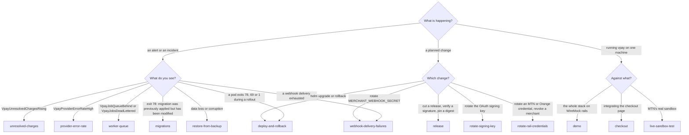

# Runbooks

vpay ships thirteen runbooks. Each answers three questions: how do I know this
is happening, what do I do, and how do I know it is fixed. This page is the
index a human reads first — one section per runbook, the gist in a few lines,
and a link to the real procedure, which is where the SQL and the commands are.

::: warning Most of these have never been followed against a deployment
No deployment of vpay exists, so no `kubectl` or `helm` command in any runbook
has been run against a cluster. The evidence that does exist is narrower and is
named in each section below: SQL executed against a scratch Postgres, states
produced by integration tests, and three procedures (the demo, the checkout
integration and the MTN sandbox test) that have genuinely been run end to end on
one machine. Every alert threshold is proposed, and no Prometheus has ever
evaluated one.
:::

Agents working on operations should load [vpay-ops](skill:vpay-ops); for what
the runbooks and status pages claim and how that is checked,
[vpay-docs-status](skill:vpay-docs-status); for a failing local stack,
[vpay-troubleshooting](skill:vpay-troubleshooting).

## Which runbook do I need?

The alert names are the rules in the chart's `PrometheusRule`; each rule's
`runbook_url` points at its page. The rule set is off by default and every rule
carries `provisional: "true"`.

## Incidents

### Unresolved charges

**When:** `VpayUnresolvedChargesRising` fires — a charge passed its 24-hour
escalation with no terminal answer from the rail.

- The payment is **escalated, not lost**: it is still polled hourly and the
  intent stays `processing`. The question is whether the payer was debited.
- Read the `provider_requests` timeline. `status_code IS NULL` means no answer
  was received — on a push rail that is the genuinely ambiguous case.
  `status_code = 0` is a sentinel for "answered, no HTTP status".
- Query the rail directly by reference, then reconcile against its settlement
  statement. There is no annotation field to record the finding in.
- Never force a charge terminal because it is old, and never create a
  replacement charge on the same intent.

[docs/runbooks/unresolved-charges.md](vpay:docs/runbooks/unresolved-charges.md)
· background: [The reconciler](/payments/reconciler)

### Provider error rate

**When:** `VpayProviderErrorRateHigh` — more than 5% of calls to one rail not
succeeding over 15 minutes (both numbers proposed).

- **Step 0 is splitting by `error_kind`**, because the rule counts every
  non-success — including ordinary declines, which on mobile money are a large
  normal share. Expect it to fire on a healthy system.
- `provider_unavailable` is the rail being down (see unresolved charges);
  `misconfigured` is your YAML or credentials; `provider_error` is the adapter
  seeing a rail error string it does not know.
- For `provider_error`, group by `charges.failure_raw`; a dominant new string is
  a mapping to add. Never widen an existing mapping to swallow it.

[docs/runbooks/provider-error-rate.md](vpay:docs/runbooks/provider-error-rate.md)
· background: [Failures](/payments/failures)

### Worker queue

**When:** a dead-lettered job, a stranded lease, an `unresolved` escalation, or
a rail contradicting a settled charge.

- All worker work is a row in `jobs`. A dead letter is parked at
  `run_at = 'infinity'`; fix what `last_error` names, then re-arm it with the
  guarded `UPDATE` the runbook gives. Never delete a parked `poll_charge` row.
- Stranded leases are reaped automatically by any running worker; free them by
  hand only when no worker runs.
- A rail contradicting a settled charge is logged and **not acted on** — a
  charge settles once. Reconcile by hand; never `UPDATE charges SET state`.
- The throughput knob is `--worker-concurrency` up to 5, then more replicas.

_Evidence:_ its SQL ran against a fully migrated database, and the states it
looks for are produced by the worker's integration suite.
[docs/runbooks/worker-queue.md](vpay:docs/runbooks/worker-queue.md)

### Webhook delivery failures

**When:** a delivery reaches `exhausted`, a delivery job is dead-lettered, an
event was never fanned out, an endpoint has no secret, or you rotate
`MERCHANT_WEBHOOK_SECRET`.

- **vpay never tells a merchant a delivery failed** — no failure event, no
  email. Their fallback is polling `GET /v1/events`.
- Replay is two writes in one transaction (reset the row, re-enqueue the job);
  there is no replay endpoint or CLI.
- Rotation: add the new secret _beside_ the old (at most two), restart both
  workloads, move the receiver, remove the old one. Both SDK verifiers accept
  any matching `v1=`.
- Most "vpay is not sending webhooks" reports are the receiver: verify the raw
  bytes, check the clock, and answer inside the 10-second delivery deadline.

_Evidence:_ most of its SQL was executed, including the replay; no replayed
delivery has ever been seen reaching a receiver.
[docs/runbooks/webhook-delivery-failures.md](vpay:docs/runbooks/webhook-delivery-failures.md)
· background: [Webhooks](/api/webhooks)

### Migrations

**When:** a process exits 78 at boot with
`migration <n> was previously applied but has been modified`.

- A shipped migration file is never edited: sqlx hashes each file's whole bytes,
  comments included, and refuses a database whose recorded hash moved.
- The page repairs one known case (migration 0028, where only a comment changed)
  by writing the _current_ checksum into `_sqlx_migrations`. For any other
  version, do not copy it: check whether SQL changed first.
- Correct an applied migration with a new migration, never an edit.

_Evidence:_ its `UPDATE` is parsed out of the markdown and executed by the
integration suite; the `kubectl` steps have run nowhere.
[docs/runbooks/migrations.md](vpay:docs/runbooks/migrations.md)

### Restore from backup

**When:** data loss or corruption, and the quarterly drill ADR-0013 proposes.

- **No backup of any vpay database has ever been taken.** This page exists so
  the drill can run the first time there is one.
- Always restore into a scratch database; check that every ledger transaction
  balances and that `one_charge_per_intent` still holds before promoting it.
- Both modes migrate at boot, so pick and pin the image version _before_
  starting anything. Start the server before the worker: a restored
  `resubmit_charge` job can move money.
- The signing-key Secret is the second restore input — a key the restored
  database already retired is exit 78.

_Evidence:_ its SQL ran against a scratch Postgres with a deliberately torn
ledger transaction, which the check caught.
[docs/runbooks/restore-from-backup.md](vpay:docs/runbooks/restore-from-backup.md)
· background: [The ledger](/payments/ledger)

## Planned changes

### Release

**When:** cutting a `v*` tag, verifying an image or chart signature, pinning a
digest in Helm values.

- A tag builds three images natively on two architectures, signs each manifest
  list with keyless cosign, publishes the Helm chart to
  `oci://ghcr.io/vaam-apps/charts/vpay`, and publishes the npm packages.
- Before tagging: `master` green, and `Chart.yaml`'s `version:`, `appVersion`
  and the tag in agreement, or `publish-chart` refuses.
- Pin by digest; there is no `latest`. A failed run is re-run, never re-tagged.

_Evidence:_ the workflow has run on `master` and on tags. `cosign verify` has
never been run by anyone against anything this repository produced.
[docs/runbooks/release.md](vpay:docs/runbooks/release.md) · background:
[Deployment](/operate/deployment#the-release-pipeline)

### Deploy and rollback

**When:** a `helm upgrade`, a rollback, or a pod exiting during a rollout.

- `helm upgrade --install … --atomic --timeout 10m`; the chart's `grace-period`
  guard keeps the kubelet from killing a draining process.
- Three things a rollback does not undo: a migration (there are no
  down-migrations), a signing-key rotation, and anything a rail already did.
- Exit 78 is configuration and restarting never fixes it; 69 is the database; 1
  is a drain cut short.

_Evidence:_ none against a cluster — written from the chart and the binaries'
shutdown code and tests.
[docs/runbooks/deploy-and-rollback.md](vpay:docs/runbooks/deploy-and-rollback.md)

### Rotate the signing key

**When:** rotating the RS256 key the server signs `/v1` tokens with, or a server
crash-looping on a retired `kid`.

- Rotation is a restart: replace the Secret, restart the server Deployment. The
  old key keeps verifying for a 24-hour overlap.
- **Rolling back to a retired key is exit 78, not a fix.** Roll forward — put
  the current key back or rotate to a new one.
- Only the server mounts the key; there is nothing to restart on the worker.

_Evidence:_ unit and integration tests against containers; no rotation has ever
been performed on a deployment.
[docs/runbooks/rotate-signing-key.md](vpay:docs/runbooks/rotate-signing-key.md)

### Rotate rail credentials

**When:** rotating an MTN or Orange credential, or revoking a merchant client.

- A rail credential is a `${VAR}` from one Secret: replace the whole Secret (a
  dropped key is an unresolved placeholder, exit 78) and restart **both**
  workloads.
- A bad credential shows up as `error_kind = 'misconfigured'` from the moment
  you restarted — it reads like a rail outage.
- vpay holds no merchant secret. Revoking a merchant is an insert into
  `disabled_clients`, effective on the next token request; tokens already issued
  live out their 900-second TTL.

_Evidence:_ no real rail credential had been used when this was written, and no
`kubectl` step has been run.
[docs/runbooks/rotate-rail-credentials.md](vpay:docs/runbooks/rotate-rail-credentials.md)
· background: [Configuration](/operate/configuration#rail-credentials)

## Running it yourself

### Demo

**When:** bringing vpay up from nothing on one machine and walking payments
through both rails.

- `just demo` generates throwaway keys, builds the images, boots Postgres, three
  WireMock hosts, the server and the worker, then runs `examples/merchant-demo`:
  six payments, every outcome each rail documents, each walked to its signed
  webhook.
- `just demo-down` removes containers **and** volumes.
- Its output is a pasted real run, and it found a real confirm/worker race that
  was then fixed.

_What it does not prove:_ anything about MTN or Orange — both rails are
WireMock. No money moved. [docs/runbooks/demo.md](vpay:docs/runbooks/demo.md) ·
[what it proves](vpay:docs/runbooks/demo/what-it-proves.md) · see also
[Quickstart](/guide/quickstart)

### Checkout

**When:** integrating vpay's own payment page, hosted or embedded, using
`examples/shop` as the worked example.

- Hosted: create an intent, then a Checkout Session, redirect to `session.url`.
  Embedded: frame vpay's page from an origin listed in `checkout_origins`.
- **Mark an order paid from the signed webhook only**, never from the return
  page.
- An unregistered origin is refused; the runbook shows how to see it.

_Evidence:_ its buying flow is driven end to end in a real browser by Cypress
against the demo stack; its `docker compose` and `psql` checks are not.
[docs/runbooks/checkout.md](vpay:docs/runbooks/checkout.md) · background:
[Hosted checkout](/checkout/hosted)

### Live sandbox test

**When:** reproducing a payment against **MTN's real sandbox** on your own
machine — server, worker, payer page and dashboard.

- Runs the binaries with `--profile live` (still `livemode: false`) against a
  local Postgres, with your own MTN Collections sandbox credentials.
- The currency is **EUR**: MTN's sandbox rejects XAF. The test MSISDN
  `46733123454` auto-settles, so no handset is prompted.
- The worker's authenticated status query is what settles the charge, not the
  callback.

_Evidence:_ the one page whose commands have run against a real rail, on
2026-09-15. It is not evidence of MTN production, Orange, refunds or a cluster.
[docs/runbooks/live-sandbox-test.md](vpay:docs/runbooks/live-sandbox-test.md) ·
background: [MTN MoMo](/rails/mtn-momo)

## Status in v0.4.1

| Runbook group                                       | Status                  | Evidence                                                                             |
| --------------------------------------------------- | ----------------------- | ------------------------------------------------------------------------------------ |
| Demo, checkout, live sandbox test                   | <Status s="built" />    | Executed end to end on one machine; checkout in CI via Cypress                       |
| Worker queue, webhook failures, migrations, restore | <Status s="partial" />  | SQL executed against real Postgres; procedures never followed on a deployment        |
| Deploy/rollback, both rotations, release            | <Status s="unproven" /> | Written from the chart and code; no `kubectl`/`helm` step ever run against a cluster |
| Unresolved charges, provider error rate             | <Status s="unproven" /> | Alerts never evaluated; thresholds proposed                                          |

The authoritative account of what each page has and has not been exercised
against is [docs/runbooks/README.md](vpay:docs/runbooks/README.md).

## Go deeper

- [docs/runbooks/README.md](vpay:docs/runbooks/README.md) — the index, with each
  page's evidence
- [Deployment](/operate/deployment) and [Configuration](/operate/configuration)
- Skills: [vpay-ops](skill:vpay-ops),
  [vpay-docs-status](skill:vpay-docs-status),
  [vpay-troubleshooting](skill:vpay-troubleshooting)
