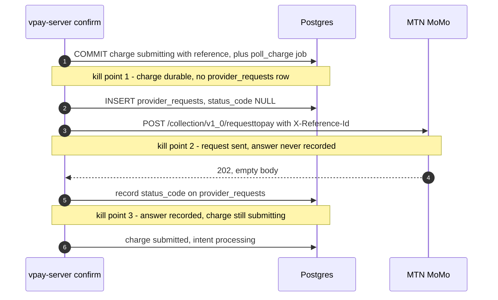
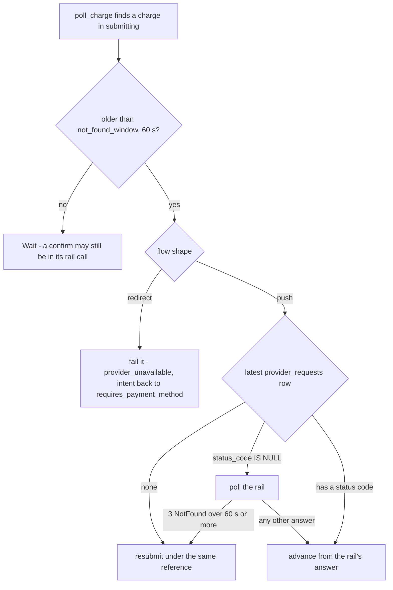
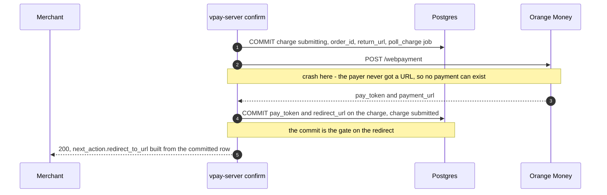

# Crash safety

A process can die at any instant — between a database commit and a network call,
or halfway through reading a rail's answer. On a payment path the question is
always the same: after the restart, can vpay still name the transaction the
payer may have acted on? vpay's crash-safety design is one sentence applied
twice:

> **Never let a payer act on a transaction you cannot later name.**

The two flow shapes apply it at different moments, because the payer becomes
able to act at different moments. On a **push** rail the payer can act as soon
as the request leaves vpay, so the reference must be durable _before_ submit. On
a **redirect** rail the payer can act only once they hold a URL, so the rail's
token must be durable _before_ the redirect.

Agents working on this should load [vpay-reconciler](skill:vpay-reconciler).

## Push rails (MTN MoMo): persist the reference before submit

MTN acknowledges `requesttopay` with **202 and an empty body**. There is no
transaction id in the response — the id _is_ the `X-Reference-Id` vpay sent. The
payer's handset starts prompting before vpay knows whether its request
succeeded. Generate a reference in memory, send it, crash before writing it
down, and you have created a payment you can never observe.

So the confirm path writes first and calls the network second:

1. mint the `provider_reference_id`;
2. **commit** the charge in `submitting` carrying that reference, together with
   the `poll_charge` job that will drive it, in one transaction;
3. insert a `provider_requests` row with `status_code IS NULL` — "about to
   send";
4. call the adapter's `submit`;
5. record what came back on that row, and move the charge to `submitted`.

Every kill point leaves a committed charge **and** a job behind, because the job
is committed in step 2's transaction. That is the reason it is enqueued there
rather than beside step 5: kill points 1 and 2, precisely the recovery cases,
would otherwise leave a charge nothing would ever ask the rail about.

### The retry rule

If submit times out or errors, **do not generate a new reference** — retry with
the same one. The adapter contract requires a duplicate submission to be
reported as `Submitted`, not as an error, which is what makes a resubmit safe. A
fresh reference on retry is how you double-charge a customer.

### Recovering a `submitting` charge

`submitting` covers two physically different situations, and the worker tells
them apart with `provider_requests`:

| Evidence                          | What happened                  | Action                                                                                                                               |
| --------------------------------- | ------------------------------ | ------------------------------------------------------------------------------------------------------------------------------------ |
| Charge younger than 60 s          | A confirm may still be running | **Wait** — reschedule once, for the rest of the window, and touch nothing                                                            |
| No `provider_requests` row        | Crashed before the POST        | **Resubmit**, same reference                                                                                                         |
| Row exists, `status_code IS NULL` | POST issued, response lost     | **Poll**. Only after 3 consecutive `NotFound` **and** at least 60 s, treat it as never received and resubmit with the same reference |
| Row has a status code             | Normal path                    | Advance the bookkeeping from the code — no rail call                                                                                 |

Three details matter:

- **The age guard comes first.** A charge in `submitting` is also the ordinary
  state of a confirm still inside its rail call; younger than the window,
  nothing on disk distinguishes the two. The age is measured by Postgres at both
  ends, so a worker host with a fast clock cannot shrink the window.
- **A bare `NotFound` never fails a charge.** Resubmitting is always safe, so
  every ambiguity resolves toward "find out", never "give up". The threshold
  needs both conditions because three polls can happen in under a second, and a
  rail that is merely slow to index a new charge looks identical to one that
  never received it.
- **The table applies only while the charge is `submitting`.** Once the rail has
  answered, a `NotFound` is an ordinary pending answer: the ladder keeps
  running.

The table is a pure function, `vpay_worker::recovery::recovery_step`, over the
flow shape, the latest submit attempt, the `NotFound` streak, the charge's age
and the window.

## Redirect rails (Orange Money): persist the token before redirect

The ordering is reversed, and it is safe for a reason worth stating plainly: the
payer cannot act until vpay hands them a URL.

**If the submit response is lost, no payment can have occurred** — the payer was
never given the URL. That `order_id` is dead: the worker fails the charge with
`provider_unavailable` and the merchant creates a new PaymentIntent. It does
this without asking the rail, because Orange's `transactionstatus` needs the
`pay_token`, and the `pay_token` was in the response that was lost.

What would **not** be safe is emitting `redirect_to_url` before the token is
committed: a crash would then strand a payer mid-payment on Orange's page
against a charge vpay cannot query. So `next_action` is built only from the
committed row.

When a Checkout Session drives the charge, its `return_url` is also written
**before** the first commit and read back from that row at submit, so what the
rail is told, what `next_action` renders and what a resubmit would send are one
column.

::: tip Why Orange is integrable at all
Read naively, "status must be queryable by a reference you generated" would
disqualify Orange: its status call requires a `pay_token` that only exists in
the submit response. It does not disqualify it, because of the asymmetry above.
That is why vpay states its rail preconditions **per flow shape** rather than
universally.
:::

## One charge per intent

Both enforcement points lean on a database index:
`one_charge_per_intent ON charges (payment_intent_id)`, plain and not partial. A
confirm that is retried cannot produce a second charge
(`a_second_confirm_cannot_produce_a_second_charge`), and the runbook for stuck
charges says it outright: do not create a replacement charge on the same intent
— the database refuses it, and this scenario is why. See
[the payment lifecycle](/payments/lifecycle#one-charge-per-intent-forever).

A related consequence: because confirm moves the intent only **after** the rail
answers, every kill point leaves a live charge against an intent still reading
`requires_payment_method`. The settlement's guard accepts that status alongside
`processing` and `requires_action`, so a recovered charge settles instead of
dead-lettering.

## How it is tested

- **Written crash states.** `worker_recovery.rs` builds each of the three kill
  points directly against a real Postgres, aged ninety seconds, then runs the
  real handler against a WireMock rail. The decisive assertion is that every
  `provider_requests` row for the charge carries the **same**
  `provider_reference_id`. Unaged copies of the same fixtures assert that
  nothing moves.
- **Real `SIGKILL`s.** `worker_kill9.rs` spawns the shipping binary as real
  processes against real Postgres and WireMock and kills them with signal 9: a
  worker killed mid-poll (the charge settles exactly once after its lease is
  reaped) and a server killed mid-submit (kill point 2 — the worker recovers by
  polling and **never** resubmits).
- **Graceful stops** are covered on
  [the reconciler page](/payments/reconciler#sigterm-and-the-drain).

## Status in this release

| Part                                                 | Status                   | Evidence                                                                                                                           |
| ---------------------------------------------------- | ------------------------ | ---------------------------------------------------------------------------------------------------------------------------------- |
| Write-before-network ordering in confirm             | <Status s="built" />     | `redirect_confirm_commits_the_rails_material_before_it_answers`, `an_unreachable_rail_leaves_the_charge_where_recovery_expects_it` |
| Recovery table read by the worker                    | <Status s="built" />     | `worker_recovery.rs`, 23 cases against real Postgres                                                                               |
| Kill point 2 and mid-poll crash under real `SIGKILL` | <Status s="partial" />   | `worker_kill9.rs` — MTN only, rail is a WireMock container                                                                         |
| Kill point 1 under a real signal                     | <Status s="not-built" /> | Only written, not caused: there is no network call at that instant for a signal to land during                                     |
| Any kill case on Orange Money                        | <Status s="not-built" /> | Neither kill case exercises the redirect rail                                                                                      |
| Recovery against a real rail                         | <Status s="unproven" />  | Every recovery case is proven against a stub speaking the documented protocol                                                      |

What is proven is that vpay executes its recovery table correctly — not that the
rails behave as vpay's documents claim. The full record is the status notes in
[the crash-safety flow](vpay:docs/flows/crash-safety.md).

## Go deeper

- [docs/flows/crash-safety.md](vpay:docs/flows/crash-safety.md) — the source of
  truth, including the test history
- [docs/reference/vpay-worker.md § Recovering a `submitting` charge](vpay:docs/reference/vpay-worker.md)
  — the code's side
- [docs/runbooks/unresolved-charges.md](vpay:docs/runbooks/unresolved-charges.md)
  — reading `provider_requests` by hand
- [Reconciler](/payments/reconciler) — the worker that runs the recovery
- Skill: [vpay-reconciler](skill:vpay-reconciler)
