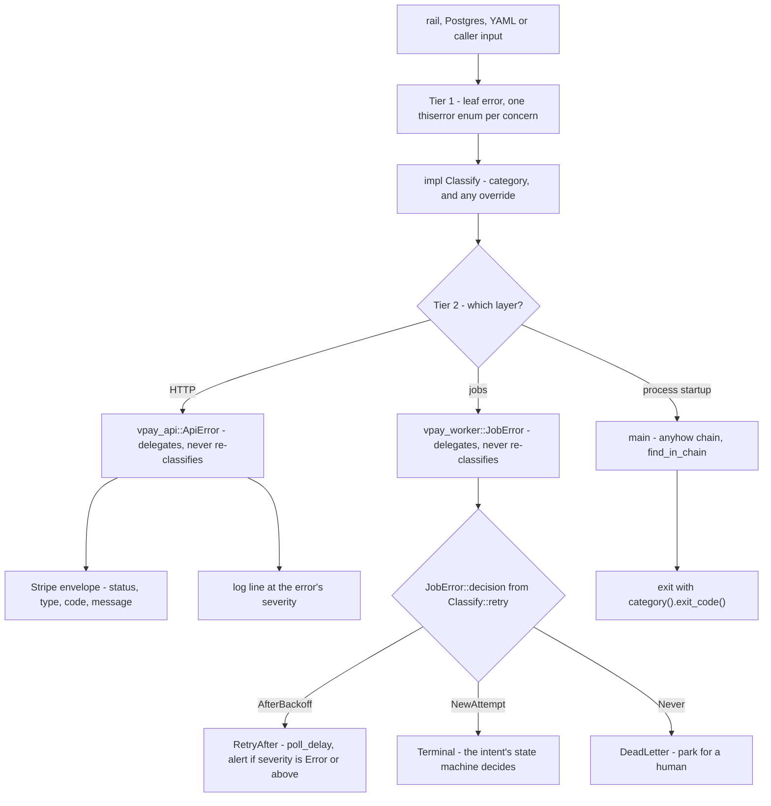

# Errors

A payment system has to branch on its errors — retry a rail timeout, never retry
a rejected charge, page someone for a bug — and it has to do so the same way
whether the error surfaces through an HTTP request, a background job or a
process exiting at boot. vpay does this with one rule and one table. This page
shows the envelope a merchant receives, the table behind it, and how an error is
classified exactly once.

Agents working on this should load [vpay-conventions](skill:vpay-conventions).

## The invariant

> **Every error is classified exactly once, by the crate that raises it, and
> every boundary — HTTP envelope, worker retry, process exit code, log line — is
> derived from that classification, never re-decided.**

So two errors of the same kind always get the same status, the same retry policy
and the same severity, whichever handler or job they surface through. The
decision is recorded in [ADR-0011](vpay:docs/adr/0011-error-modelling.md).

## The envelope a merchant receives

Every `/v1` error has Stripe's shape:

```json
{ "error": { "type": "…", "code": "…", "message": "…", "param": "…" } }
```

`param` appears only when the error names a request parameter. The HTTP status,
`type` and default `code` all come from the error's **category**; `message` is
the error's public message. The full error chain goes to the log — only the
public message reaches the merchant. Handlers cannot build an envelope by hand:
the renderers are private to `vpay-api` and called from one place.

Three properties keep the envelope from leaking: another merchant's object and a
missing object produce **byte-identical** `404`s (the API is not an id oracle);
a storage error's text reaches the log and never the body; and an idempotency
key is never echoed beyond an 8-character hint, in the log only.

## The Category table

`vpay_core::error::Category` is the whole policy. Everything else is derived
from it, unless a specific error overrides one column with a comment saying why.

| Category         | Whose problem    | HTTP | Stripe `type`           | Default `code`           | Retry         | Severity | Exit |
| ---------------- | ---------------- | ---- | ----------------------- | ------------------------ | ------------- | -------- | ---- |
| `InvalidRequest` | caller           | 400  | `invalid_request_error` | `invalid_request`        | never         | info     | 64   |
| `Authentication` | caller           | 401  | `authentication_error`  | `invalid_token`          | never         | info     | 77   |
| `Forbidden`      | caller           | 403  | `invalid_request_error` | `forbidden`              | never         | info     | 77   |
| `NotFound`       | caller           | 404  | `invalid_request_error` | `resource_missing`       | never         | info     | 1    |
| `Conflict`       | caller (state)   | 409  | `invalid_request_error` | `invalid_state`          | never         | info     | 1    |
| `Idempotency`    | caller           | 400  | `idempotency_error`     | `idempotency_key_in_use` | never         | info     | 64   |
| `RateLimited`    | caller (pace)    | 429  | `rate_limit_error`      | `rate_limit`             | after backoff | warn     | 1    |
| `Rail`           | the rail         | 502  | `api_error`             | `provider_unavailable`   | after backoff | warn     | 69   |
| `Storage`        | us (Postgres)    | 503  | `api_error`             | `service_unavailable`    | after backoff | error    | 69   |
| `Configuration`  | operator         | 500  | `api_error`             | `misconfigured`          | never         | error    | 78   |
| `NotImplemented` | us (honest stub) | 501  | `api_error`             | `not_implemented`        | never         | error    | 1    |
| `Internal`       | us (a bug)       | 500  | `api_error`             | `internal_error`         | never         | **page** | 1    |

Exit codes follow `sysexits.h` where one fits (78 config, 69 unavailable, 64
usage, 77 permission). The table is transcribed literally into a test in
`vpay-core`, so the document and the code fail together.

### Codes beyond the default

Some categories answer with more than their default `code`, while the status,
`type`, retry and severity still come from the category:

| Category         | Codes                                                                                                                                                    |
| ---------------- | -------------------------------------------------------------------------------------------------------------------------------------------------------- |
| `Conflict`       | `invalid_state`, `resource_conflict` (it already exists), `charge_declined` (a rail's decision), `checkout_session_expired`, `checkout_session_complete` |
| `Idempotency`    | `idempotency_key_in_use` (same key, different body), `idempotency_key_in_flight` (the first request has not finished)                                    |
| `InvalidRequest` | `invalid_reference` (the request named a currency, provider or object that does not exist)                                                               |

::: info Why a decline is `charge_declined` and not the `FailureCode`
A rail declining a charge is a business outcome, not a system failure. It is
`409 charge_declined`, with the specific [failure code](/payments/failures) in
the message and on the charge. It is **not** rendered as the `FailureCode`
itself because `provider_unavailable` already means "`502`, the rail is down, we
are retrying" — and a merchant branching on `code` must be able to tell that
from "your charge was declined, start a new intent".
:::

## How an error is classified, once



- **Tier 1, leaf errors.** Each library crate has its own closed enums —
  `MoneyError`, `LedgerError`, `ConfigError`, `DbError`, `ProviderError`,
  `AuthRejection`, `UnknownCurrency` — and each implements `Classify`. Foreign
  errors are attached as a real `#[source]`, never flattened into a string, so
  an operator's log still reaches the underlying cause (for a timeout: _…error
  sending request for url (…): operation timed out_).
- **Tier 2, composites.** `ApiError` and `JobError` wrap the leaves their layer
  meets and **delegate**. A `DbError` is `Storage` whether it surfaces through
  the API or the worker.
- **Tier 3, boundaries.** The HTTP envelope, the worker's retry decision, the
  log level and the process exit code are each read off the classification.
  `anyhow` appears only here, in the binaries.

Some leaf classifications worth knowing: `DbError::UniqueViolation` is
`Conflict`/`resource_conflict` ("you already did this"), not `invalid_state`;
`DbError::WriteMatchedNoRow` is `Internal` (only vpay's own code can cause it);
`ProviderError::Transport` and `Malformed` are `Rail` and retried by the poll
ladder; `ProviderError::Rejected` is `Conflict` with retry `NewAttempt`.

There is deliberately **no** `ProviderError::retryable()`. Retry policy is
`Classify::retry`; a second oracle beside it is exactly what ADR-0011 exists to
prevent.

## What can go wrong

| Failure                                            | What catches it                                                                                |
| -------------------------------------------------- | ---------------------------------------------------------------------------------------------- |
| A new error type forgets `impl Classify`           | `cargo xtask verify-errors`, part of `just verify`                                             |
| A library crate adds `anyhow`                      | the same check                                                                                 |
| A composite's catch-all arm answers for a new leaf | the same check: every `#[from]` variant must be named explicitly in each discriminating method |
| A handler hand-builds an envelope                  | the renderers are `pub(crate)` with one production caller                                      |
| Two boundaries disagree on retry                   | impossible by construction — both read `Classify::retry`                                       |

## Status in v0.4.1

| Part                                     | Status                 | Evidence                                                                                                       |
| ---------------------------------------- | ---------------------- | -------------------------------------------------------------------------------------------------------------- |
| `Category`, `Classify`, the policy table | <Status s="built" />   | Invariant tests over every category, plus a literal transcription of the table                                 |
| `ApiError` envelope on `/v1`             | <Status s="built" />   | Real request paths answer `400`, `401`, `403`, `404`, `409`, `502`, `503` through it                           |
| `JobError::decision` in the worker       | <Status s="built" />   | Consumed by `vpay_worker::run_loop`                                                                            |
| Exit codes from the category             | <Status s="built" />   | Both binaries exit with `Category::exit_code()`                                                                |
| `verify-errors` gate                     | <Status s="built" />   | In `just verify` and CI                                                                                        |
| Rail-produced codes against real rails   | <Status s="partial" /> | `charge_declined` and `502` have only ever come from WireMock hosts                                            |
| `501` for an unbuilt rail operation      | <Status s="built" />   | A refund against an `orange_money` charge — `orange_money::refund` is the one remaining `NotImplemented` token |

The full record is the **Status** section of
[the errors flow](vpay:docs/flows/errors.md#status).

## Go deeper

- [docs/flows/errors.md](vpay:docs/flows/errors.md) — the source of truth,
  including the full leaf table
- [docs/adr/0011-error-modelling.md](vpay:docs/adr/0011-error-modelling.md) —
  the decision and the alternatives rejected
- [docs/api/README.md](vpay:docs/api/README.md) — every code a `/v1` caller can
  receive, route by route
- [Failure codes](/payments/failures) — the merchant-facing decline vocabulary
- Skill: [vpay-conventions](skill:vpay-conventions)
