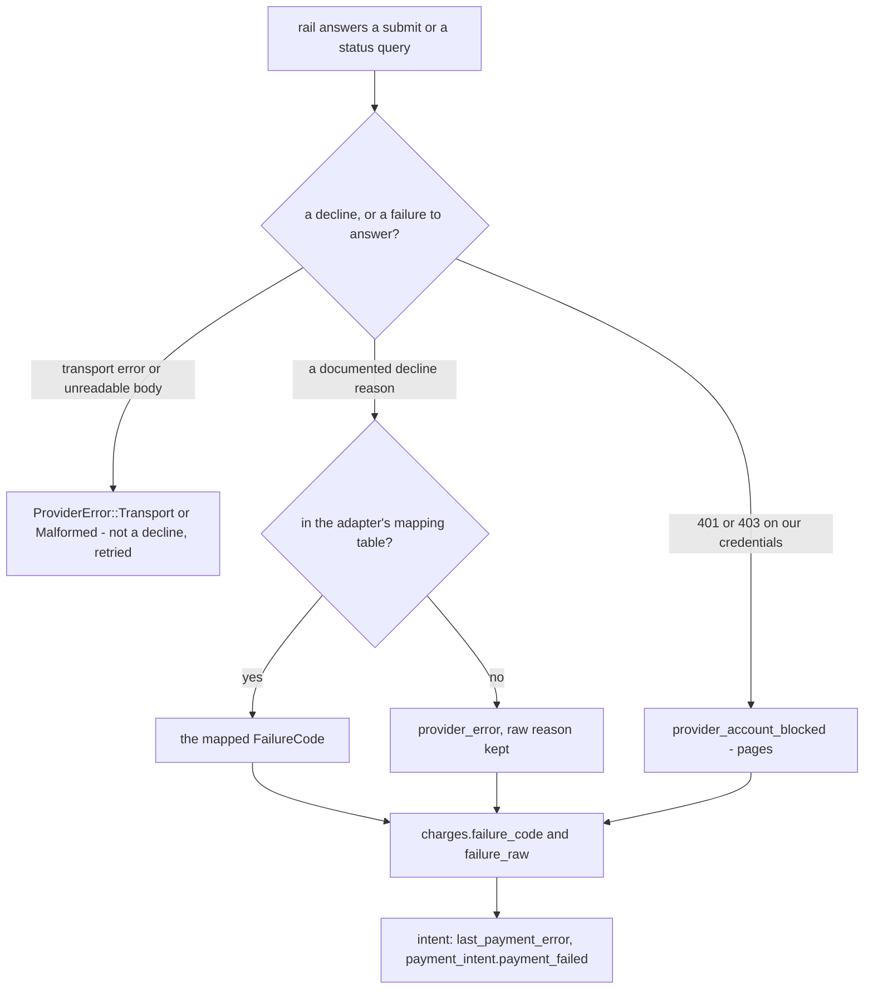

# Failure codes

When a rail declines a payment, the merchant does not see MTN's or Orange's
error string. They see a **`FailureCode`**: a closed vocabulary of eleven codes
owned by vpay's core, into which each adapter maps its rail's own reasons. A
merchant integrates against the list once, and it does not grow when a rail is
added. This page gives the vocabulary, how rail reasons map into it, and — just
as important — which codes each rail can actually produce.

Agents working on this should load [vpay-payments](skill:vpay-payments).

## The vocabulary

| Code                       | Meaning                                 | Payer can retry?    | Whose problem     |
| -------------------------- | --------------------------------------- | ------------------- | ----------------- |
| `insufficient_funds`       | Not enough balance                      | Yes, new intent     | Payer             |
| `payer_timeout`            | Never approved in time                  | Yes, new intent     | Payer             |
| `payer_declined`           | Actively rejected the prompt            | Yes, new intent     | Payer             |
| `invalid_payer`            | Identifier not valid on this rail       | No — fix the number | Payer/merchant    |
| `payer_limit_reached`      | Wallet or KYC-tier limit                | Later               | Payer             |
| `payer_account_blocked`    | Payer account not active                | No                  | Payer             |
| `invalid_payee`            | Merchant's receiving account invalid    | No                  | Merchant config   |
| `payee_account_blocked`    | Merchant's receiving account not active | No                  | Merchant config   |
| `provider_account_blocked` | **Your** partner account is blocked     | No                  | **Page yourself** |
| `provider_unavailable`     | Rail down or timing out                 | Yes, later          | You               |
| `provider_error`           | Unmapped; carries the raw reason        | Unknown             | Investigate       |

"New intent" is literal: an intent can hold only one charge, ever, so a retry is
a new PaymentIntent
([lifecycle](/payments/lifecycle#one-charge-per-intent-forever)).

## How a rail's answer becomes a code

The rail's own word survives in `failure_raw`, which is stored and logged. Only
the taxonomy code and a generic message are public. A decline at submit answers
the confirm with `409 charge_declined`; a decline found later by the poll ladder
arrives as the same `payment_intent.payment_failed` event.

## Which rail can produce which code

The vocabulary says what each code **means**. It does not say whether anything
can **produce** it — and the two rails differ by eight of eleven.

| Code                       | MTN MoMo                                    | Orange Money                |
| -------------------------- | ------------------------------------------- | --------------------------- |
| `insufficient_funds`       | `NOT_ENOUGH_FUNDS`                          | —                           |
| `payer_timeout`            | `COULD_NOT_PERFORM_TRANSACTION`, `EXPIRED`  | `EXPIRED`                   |
| `payer_declined`           | `PAYMENT_NOT_APPROVED`, `APPROVAL_REJECTED` | —                           |
| `invalid_payer`            | `PAYER_NOT_FOUND`                           | —                           |
| `payer_limit_reached`      | `PAYER_LIMIT_REACHED`                       | —                           |
| `payer_account_blocked`    | `SENDER_ACCOUNT_NOT_ACTIVE` †               | —                           |
| `invalid_payee`            | `PAYEE_NOT_FOUND`                           | —                           |
| `payee_account_blocked`    | `PAYEE_NOT_ALLOWED_TO_RECEIVE`              | —                           |
| `provider_account_blocked` | `NOT_ALLOWED`, HTTP 401/403                 | HTTP 401/403                |
| `provider_unavailable`     | `SERVICE_UNAVAILABLE` on a `FAILED` body    | —                           |
| `provider_error`           | anything unmapped                           | `FAILED`, anything unmapped |

† `SENDER_ACCOUNT_NOT_ACTIVE` and `COULD_NOT_PERFORM_TRANSACTION` are **not** in
MTN's published `ErrorReason` enum. Both are mapped anyway, and declared as
unpublished reasons in the adapter.

### Why Orange can say so little

Orange documents five statuses — `INITIATED`, `PENDING`, `SUCCESS`, `EXPIRED`,
`FAILED` — and no sub-reason for `FAILED`. Its protocol cannot say "not enough
funds" or "no such payer". A payer who clicks _Cancel_ on Orange's page arrives
as `EXPIRED`, indistinguishable from one who walked away, so `payer_declined` is
unreachable on Orange. vpay refuses to invent a `CANCELLED` to make the rails
look alike.

::: tip For merchants
Write one branch per code — that is the right integration. Do **not** assume
every branch is reachable on the rail in front of you: on Orange only
`payer_timeout`, `provider_account_blocked` and `provider_error` can occur.
:::

### No code is deleted

A code nothing produces is a documented reservation, not dead weight. The
vocabulary is a wire contract, and removing a variant would break a merchant
deserialising it. What keeps promises honest instead is a test:
`the_declines_prove_every_code_each_rail_can_produce` holds the conformance
cases against each adapter's `PRODUCED_FAILURE_CODES`, so a code that gains a
producer without a case — or a case for a code the adapter does not declare —
fails.

## `provider_error` is an alert, not a resting place

A rising `provider_error` rate means an adapter's mapping table has drifted
behind the rail's real error strings. Alert on it; do not tolerate it. The
runbook is [provider-error-rate](vpay:docs/runbooks/provider-error-rate.md).

## Status in this release

| Part                                | Status                  | Evidence                                                                                                     |
| ----------------------------------- | ----------------------- | ------------------------------------------------------------------------------------------------------------ |
| The taxonomy                        | <Status s="built" />    | `vpay-core::failure`                                                                                         |
| MTN mapping table                   | <Status s="partial" />  | Row by row in both directions; checked against MTN's published enum; every mapped reason has a WireMock case |
| Orange mapping                      | <Status s="partial" />  | Its documented statuses mapped and tested; proven only against WireMock                                      |
| Decline reaching the merchant       | <Status s="partial" />  | `409 charge_declined`, `last_payment_error`, one `payment_intent.payment_failed` — rails are stubs           |
| Mappings faithful to the real rails | <Status s="unproven" /> | Every decline in the test record came from WireMock; the one real-rail call (MTN sandbox) was a success      |

The full record is the **Status** section of
[the failure taxonomy flow](vpay:docs/flows/failures.md#status).

## Go deeper

- [docs/flows/failures.md](vpay:docs/flows/failures.md) — the source of truth,
  including the conformance case per row
- [docs/flows/adapter-mtn-momo.md](vpay:docs/flows/adapter-mtn-momo.md) and
  [docs/flows/adapter-orange-money.md](vpay:docs/flows/adapter-orange-money.md)
  — each rail's mapping
- [Errors](/payments/errors) — how `charge_declined` is classified, and why it
  is not the `FailureCode` itself
- Skill: [vpay-payments](skill:vpay-payments)
