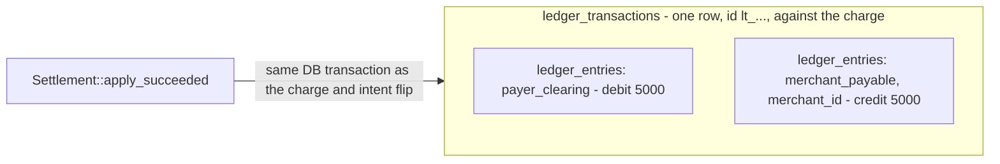
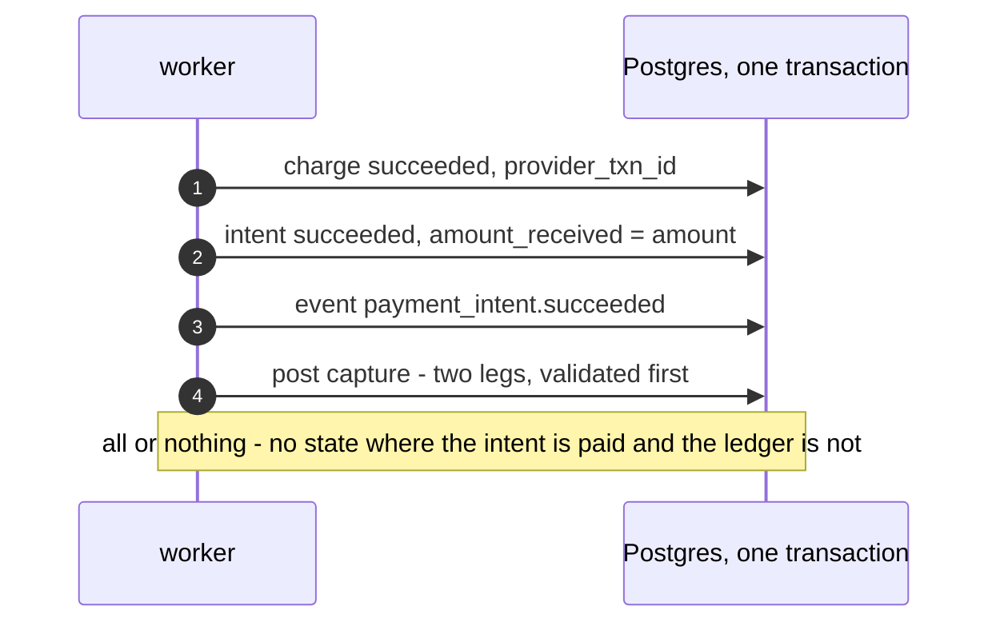

# Ledger

The ledger is vpay's record of where money is owed, kept as double entry: every
movement is a **transaction** made of **entries** whose debits and credits
balance. It is separate from the operational tables (`payment_intents`,
`charges`, `refunds`) on purpose — a ledger must not change when an operational
row does. This page explains the accounts, what gets posted when, and exactly
how much of it is live at v0.4.1: the writer exists and is wired into
settlement, but **no deployment has ever produced a ledger row**, because no
deployment has ever taken a payment.

Agents working on this should load [vpay-payments](skill:vpay-payments).

## Accounts and the sign convention

`balance(account) = SUM(credit) - SUM(debit)`. `merchant_payable` is
credit-normal: a positive balance is money the merchant has received.

| Account                | Whose                         | Carries a merchant?     |
| ---------------------- | ----------------------------- | ----------------------- |
| `payer_clearing`       | vpay's, pooled across tenants | No                      |
| `merchant_payable`     | One per merchant              | **Yes** — `merchant_id` |
| `platform_fee_revenue` | vpay's                        | No                      |

The merchant is a payload on the account kind itself —
`AccountKind::MerchantPayable { merchant_id }` — not a free-floating field. The
table mirrors that with a CHECK: an entry names a merchant **if and only if**
its account is `merchant_payable`. So a clearing entry cannot carry a merchant,
and a payable entry cannot omit one.

## What a settled charge posts

A capture of 5,000 XAF:

| Account            | Direction | Amount |
| ------------------ | --------- | ------ |
| `payer_clearing`   | debit     | 5000   |
| `merchant_payable` | credit    | 5000   |

That is the **only** capture shape vpay posts today. The design also has a
three-leg capture with a platform fee (5000 debit; 4900 to `merchant_payable`,
100 to `platform_fee_revenue`), but no column holds a capture-time fee and no
configuration computes one, so the call site passes none and
`platform_fee_revenue` is never credited. A test asserts the two-leg shape so a
fee model cannot land silently.

A refund of 2,000 XAF, when one settles, reverses part of it (the fee, if there
were one, is not refunded — Stripe's default):

| Account            | Direction | Amount |
| ------------------ | --------- | ------ |
| `merchant_payable` | debit     | 2000   |
| `payer_clearing`   | credit    | 2000   |

## When things post

A refund is asynchronous, so it moves through a **reservation** first:

| Moment          | What happens                                                                                                    | Ledger                          |
| --------------- | --------------------------------------------------------------------------------------------------------------- | ------------------------------- |
| Refund created  | `amount_refund_pending` incremented in the same transaction as the `refunds` row                                | nothing                         |
| Refund succeeds | pending down, `amount_refunded` up, invoice updated, refund posted — one transaction (`apply_refund_succeeded`) | two legs                        |
| Refund fails    | pending released only                                                                                           | nothing — so nothing to reverse |
| Refund canceled | pending released; only for a refund no rail was given                                                           | nothing                         |

Posting nothing on failure — rather than posting optimistically and unwinding —
is why the reservation column exists. A pair of legs that net to zero would
still claim money moved twice when it never moved at all.

::: danger No refund has ever reached the ledger
`POST /v1/refunds` creates `pending` refunds and reserves their amount. But
**nothing settles a pending refund**: the provider port has no refund status
read and there is no refund poll ladder. So `apply_refund_succeeded`'s posting
is reached by nothing a merchant can cause, and no rail has ever executed a
refund. That settlement also writes no event, so a merchant told `pending` would
hear nothing when a refund succeeded.
:::

## The guards

- **Over-refund.** `payment_intents` carries
  `CHECK (amount_refunded + amount_refund_pending <= amount)`. Two concurrent
  refunds serialise on the row lock and the second fails the CHECK — proven by
  two 3,000 refunds racing against a 5,000 capture, exactly one committing. The
  refusal is `DbError::OverRefund`, a `409` that is never retried.
- **Balance, per currency.** `SUM(debit) = SUM(credit)` spans many rows, which
  no row-level CHECK can see, so it is enforced in
  `vpay_ledger::Transaction::validate()` before the first statement is written.
  Each currency must balance on its own book.
- **One capture per charge.** Upheld by the settlement's compare-and-swap on the
  charge still being live; two settlements racing one charge post exactly one
  capture. The ledger's primary key is **not** a second guard, because the
  transaction id is minted fresh each time.
- **The right merchant.** The payable entry's merchant is taken from the intent
  row the same transaction wrote, never from a caller argument.

## Invariants

The ledger is meant to satisfy four invariants. The design says "asserted
nightly"; **nothing schedules any of them** — there is no nightly job. Each is
asserted by tests in CI instead.

1. Per transaction: `SUM(debit) = SUM(credit)`, per currency.
2. Per merchant: `balance(merchant_payable) = Σ captures − Σ fees − Σ refunds`.
3. `amount_refunded` equals the sum of succeeded refunds for that intent.
4. Every succeeded charge has exactly one capture transaction.

## The refund fee is reported, not posted

A `refund` object carries a `fee` — what the rail charged vpay to move money
back. It is **reported to the merchant and posted nowhere**, by decision: who
bears it is a marketplace judgement, not something a rail's response contains.
And no rail reports a refund fee to vpay today, so the column is never written.

## Status in v0.4.1

| Part                                       | Status                   | Evidence                                                                                         |
| ------------------------------------------ | ------------------------ | ------------------------------------------------------------------------------------------------ |
| Double-entry validation (invariant 1)      | <Status s="built" />     | `a_capture_with_a_fee_balances`, `an_unbalanced_transaction_is_rejected`, per-currency cases     |
| Capture posting in settlement              | <Status s="partial" />   | `a_settled_charge_posts_its_capture_in_the_same_transaction` — no deployment has a ledger row    |
| Per-merchant payable balance (invariant 2) | <Status s="partial" />   | Computable in Rust and SQL; `two_merchants_payable_balances_do_not_mix`; nothing schedules it    |
| Over-refund CHECK                          | <Status s="built" />     | Reached by `POST /v1/refunds`; `two_concurrent_refunds_race_and_the_database_refuses_the_second` |
| Refund posting                             | <Status s="not-built" /> | Written, but nothing settles a `pending` refund — no refund poll ladder                          |
| Platform fee at capture                    | <Status s="not-built" /> | No column, no configuration                                                                      |
| Nightly invariant checks                   | <Status s="not-built" /> | No scheduled job exists                                                                          |

The full record is the **Status** section of
[the ledger flow](vpay:docs/flows/ledger.md#status).

## Go deeper

- [docs/flows/ledger.md](vpay:docs/flows/ledger.md) — the source of truth, with
  every test named
- [Money](/payments/money) — the integer amounts every entry carries
- [Payment lifecycle](/payments/lifecycle) — the settlement that posts the
  capture
- Skill: [vpay-payments](skill:vpay-payments)
