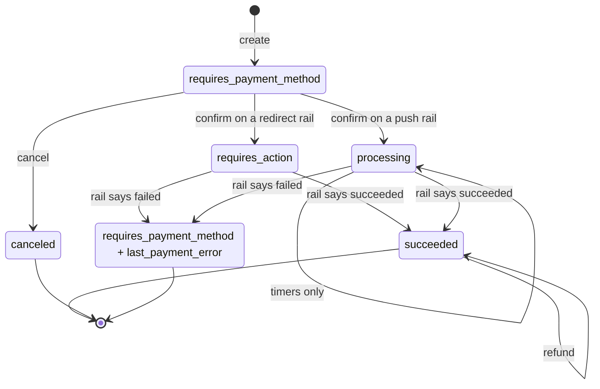
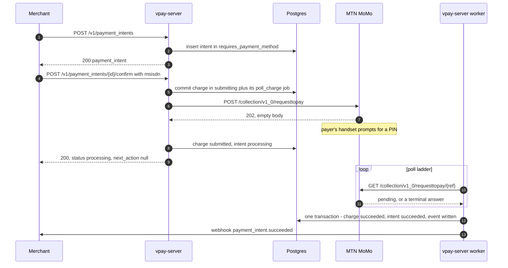
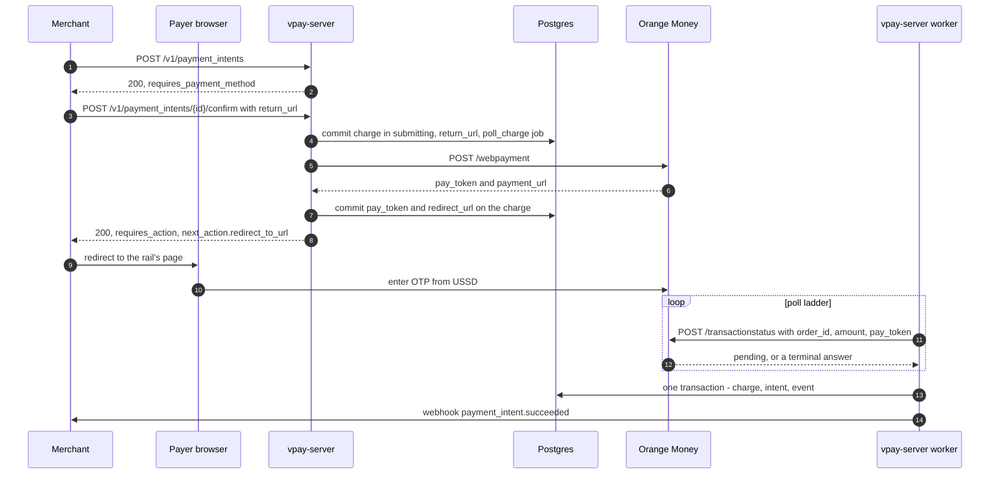

# Payment lifecycle

A PaymentIntent is vpay's record of one attempt to collect one amount from one
payer. It follows Stripe's shape closely enough that a merchant who knows Stripe
can read it, but it is built around a fact Stripe never had to face: on mobile
money the rail may take minutes or hours to give a final answer, and the two
Cameroon rails involve the payer in completely different ways. This page
explains the states, the two flow shapes, and the rule that holds the design
together — **one charge per intent, forever**.

Agents working on this should load [vpay-payments](skill:vpay-payments).

## Two flow shapes

The core never branches on a rail's name. It branches on a capability value,
`ProviderFlow`, which is either **push** or **redirect**.

{.diagram}

|                                         | **push** (MTN MoMo)                         | **redirect** (Orange Money)                                       |
| --------------------------------------- | ------------------------------------------- | ----------------------------------------------------------------- |
| How the payer acts                      | A prompt on their handset; they enter a PIN | Redirected to the rail's hosted page; they enter an OTP from USSD |
| Who holds the payer identifier          | vpay — it is an input to submit             | The rail. vpay may never learn it                                 |
| What submit returns                     | An acknowledgement with no id               | A `pay_token` and a URL to redirect to                            |
| Intent status after `confirm`           | `processing`                                | `requires_action`                                                 |
| Can the payer act before vpay persists? | **Yes**                                     | **No**                                                            |

That last row is why [crash safety](/payments/crash-safety) has two halves: the
moment at which vpay must have written things down is different for each shape.

## States

This is the state diagram from vpay's own flow document, with the states named
exactly as it names them. Note that `failed` here is **not** an intent status —
the diagram uses it as an alias for "back in `requires_payment_method`, carrying
`last_payment_error`".



The enum itself (`IntentStatus` in `vpay_core::state`) has exactly five values:
`requires_payment_method`, `requires_action`, `processing`, `succeeded`,
`canceled`. There is no `requires_confirmation` — `confirm` always submits — and
no `failed`.

::: info This diagram follows the code, not vpay's flow doc
vpay's [payment lifecycle flow](vpay:docs/flows/payment-lifecycle.md#states)
draws a `requires_action → processing` step. The code at v0.4.1 never takes it,
so it is not drawn here. The settlement's guard accepts an intent in
`processing`, `requires_action` **or** `requires_payment_method`
(`SETTLEABLE_STATUSES` in `vpay_db::payment_intents`). A redirect charge's
intent stays in `requires_action` until the worker settles it, and a settlement
can also land on an intent still in `requires_payment_method` when a confirm
crashed before moving it — see [crash safety](/payments/crash-safety).
:::

### The rules behind the transitions

- **`requires_action` is redirect-only.** It carries Stripe's own
  `next_action.redirect_to_url` shape, so existing redirect handling works. A
  push rail never enters it: nothing needs a browser while a payer types a PIN
  into their own handset.
- **`processing` leaves only on a terminal answer from the rail.** Timers fire
  but assert nothing. A payment still pending at minute 15 may succeed at hour
  30; pretending otherwise is how you double-charge. See
  [the reconciler](/payments/reconciler).
- **Only a rail-reported failure fails a payment.** The intent returns to
  `requires_payment_method` with `last_payment_error` populated. That is
  terminal in practice, because the intent can never have a second charge.
- **`canceled` is reachable only from `requires_payment_method`.** Once a rail
  has the request, it cannot be recalled. Cancel also refuses an intent with a
  live charge.
- **Refunds do not change intent status.** A refund is a separate object.

## One charge per intent, forever

```sql
CREATE UNIQUE INDEX one_charge_per_intent ON charges (payment_intent_id);
```

The index is deliberately **not** partial. Scoping it to live charges would let
a second charge be inserted the moment the first moved to `failed` — and a
`failed` charge can be one vpay recorded before the rail's answer was final.

**So a retry means a new PaymentIntent.** This is the one place vpay's API is
noticeably less convenient than Stripe's, on purpose.

## Create, confirm, settle: push rail



## Create, confirm, settle: redirect rail



In both shapes the `next_action` a merchant receives is rendered **only** from
the committed charge row, never from the adapter's in-memory answer.

::: warning Where these diagrams have actually run
Both sequences run end to end in CI against WireMock hosts that answer the way
vpay's documents say the rails answer. Against a real rail, only the push
sequence has run, once, against MTN's **sandbox** with a test number that
settles automatically. The redirect sequence has never met Orange, and no
webhook has ever reached a merchant endpoint outside the vpay repository.
:::

## What confirm can answer

| Outcome                                       | Response                                                | What moved                                                                                                                                   |
| --------------------------------------------- | ------------------------------------------------------- | -------------------------------------------------------------------------------------------------------------------------------------------- |
| Push rail accepts                             | `200`, `processing`, `next_action: null`                | charge `submitted`                                                                                                                           |
| Redirect rail accepts                         | `200`, `requires_action`, `next_action.redirect_to_url` | charge `submitted` with the rail's token and URL, committed before the response                                                              |
| Rail declines                                 | `409 charge_declined`                                   | charge `failed` with a `failure_code`; intent stays `requires_payment_method` with `last_payment_error`; one `payment_intent.payment_failed` |
| Transport, malformed answer, misconfiguration | an error (e.g. `502 provider_unavailable`)              | **nothing** — the charge stays `submitting`, because vpay does not know what the rail did                                                    |

## What each status means to a merchant

| Status                    | What it means                                                                          | What to do                                                                               |
| ------------------------- | -------------------------------------------------------------------------------------- | ---------------------------------------------------------------------------------------- |
| `requires_payment_method` | Created and not confirmed — **or** a charge was declined (`last_payment_error` is set) | Confirm it; if `last_payment_error` is set, create a **new** intent to retry             |
| `requires_action`         | Redirect rail: the payer must visit `next_action.redirect_to_url`                      | Send the payer there; wait for the outcome                                               |
| `processing`              | The rail has the charge and vpay is polling it                                         | Do not ship. Do not open a second intent — on a push rail that prompts the handset again |
| `succeeded`               | The rail reported the money moved; `amount_received = amount`                          | Fulfil the order                                                                         |
| `canceled`                | Withdrawn before any rail saw it                                                       | Nothing will be charged                                                                  |

A decline carries a `FailureCode`, and which codes are reachable depends on the
rail: MTN can produce all eleven, Orange only three. See
[failure codes](/payments/failures).

## What can go wrong

- **A cancel racing a settlement.** A confirm can commit its charge while a
  cancel's transaction is open. The settlement's own status guard then matches
  nothing (`canceled` is not settleable) and rolls back loudly. There is one
  terminal state and one terminal event, but the rail took money for a withdrawn
  intent. vpay has **no repair path** for this; an operator reconciles it.
- **The rail never answers.** After 24 hours the _charge_ becomes `unresolved`
  and a human is alerted; the intent stays where it is and polling continues
  hourly. See [the reconciler](/payments/reconciler).

## Status in v0.4.1

| Part                                                              | Status                   | Evidence                                                                                            |
| ----------------------------------------------------------------- | ------------------------ | --------------------------------------------------------------------------------------------------- |
| Transition table (`next_status`)                                  | <Status s="built" />     | Proven exhaustive over every (status, verb) pair in `vpay_core::state`                              |
| Create and cancel over HTTP                                       | <Status s="built" />     | Integration tests; cancel emits `payment_intent.canceled` in the same transaction                   |
| Confirm reaching a rail                                           | <Status s="partial" />   | Proven against WireMock; MTN's charge path settled once against MTN's real **sandbox** (2026-09-15) |
| Settlement by the worker                                          | <Status s="partial" />   | `worker_e2e.rs` drives a real confirm through the real loop — against a WireMock rail               |
| Orange redirect flow on a real rail                               | <Status s="unproven" />  | Orange has never been called                                                                        |
| `prompt_expired_at` and the `payment_intent.processing` milestone | <Status s="not-built" /> | Named as never having happened in the source                                                        |
| Partial `amount_received`                                         | <Status s="not-built" /> | Neither rail can collect part of an amount                                                          |

The full record is the **Status** section of
[the payment lifecycle flow](vpay:docs/flows/payment-lifecycle.md#status).

## Go deeper

- [docs/flows/payment-lifecycle.md](vpay:docs/flows/payment-lifecycle.md) — the
  source of truth for this page
- [docs/flows/crash-safety.md](vpay:docs/flows/crash-safety.md) — why the write
  order differs per flow shape
- [docs/flows/reconciler.md](vpay:docs/flows/reconciler.md) — what drives
  `processing` to a terminal state
- [docs/flows/failures.md](vpay:docs/flows/failures.md) — the `FailureCode`
  vocabulary
- [`vpay_core::state`](vpay:backends/crates/vpay-core/src/state.rs) — the enums
  and the transition table
- Skill: [vpay-payments](skill:vpay-payments)
