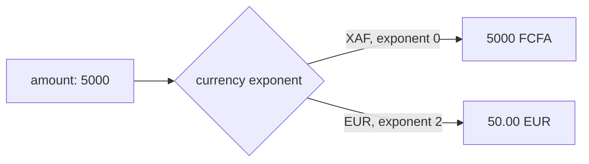
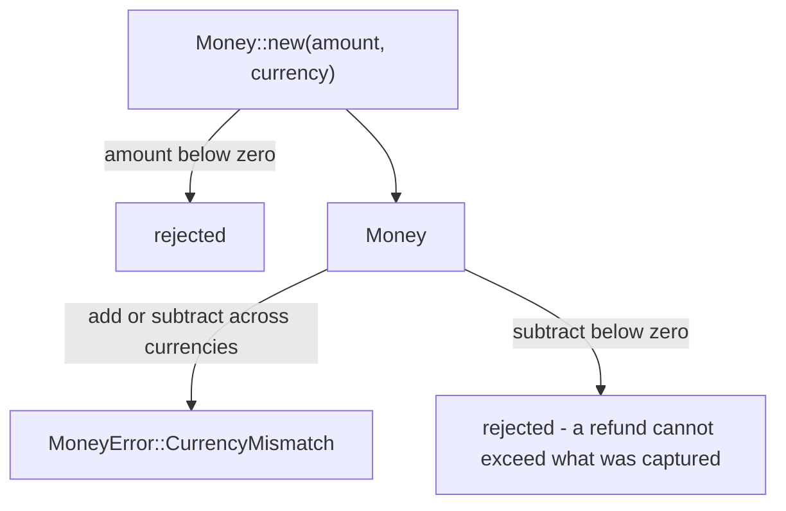

# Money

Every amount in vpay is an **integer count of a currency's minor unit**. There
is no floating point anywhere in the money path, and the workspace denies
`clippy::float_arithmetic` so that none can creep in. This page explains what
that means for the Central African CFA franc, the one function that turns an
amount into what a rail expects, and the invariants the `Money` type enforces.

Agents working on this should load [vpay-payments](skill:vpay-payments).

## XAF is zero-decimal

The Central African CFA franc (XAF) has no centimes in circulating use, so its
minor unit **is** its major unit:

```
amount: 5000, currency: "xaf"   →   5,000 FCFA
```

Not 50.00. This is the same way Stripe handles zero-decimal currencies, so a
developer who already knows Stripe gets it right by default.



## The single conversion point

Exactly one conversion renders an amount for a provider, offered in two
encodings, both on `Money` in
[`vpay-core/src/money.rs`](vpay:backends/crates/vpay-core/src/money.rs):

```rust
Money::to_provider_string()   // backends/crates/vpay-core/src/money.rs — "5000", "50.00"
Money::to_provider_minor()    // the same amount as an integer count of minor units
```

- `to_provider_string` reads the exponent from the **currency**. The exponent is
  a property of the currency everywhere — never of a deployment, an environment
  or a config row.
- `to_provider_minor` reads no exponent at all: it returns the integer the
  amount is already stored as.

Neither one scales anything. Two encodings exist because the rails disagree on
the wire: Orange Money's request body takes `"amount": 5000` as a JSON number,
while MTN's takes the string form. Sending minor units to a rail that expects
major units is a 100× error that nothing downstream can detect, so each adapter
uses the encoding its rail's own documentation names.

### Worked examples

| Currency | Exponent | Stored as `minor` | `to_provider_string()` | `to_provider_minor()` | A person reads |
| -------- | -------- | ----------------- | ---------------------- | --------------------- | -------------- |
| XAF      | 0        | `5000`            | `5000`                 | `5000`                | 5,000 FCFA     |
| EUR      | 2        | `5000`            | `50.00`                | `5000`                | €50.00         |

vpay's own table is `Money::new(5000, …)` rendered for XAF and EUR; the tests
`xaf_renders_the_same_digits_in_both_encodings` and
`eur_pads_the_fractional_part` pin them. The frontend mirrors the rule in
`@vpay/api-client`'s `formatAmount`, covered by the same table of cases.

## Why EUR appears at all

MTN's sandbox rejects XAF and accepts only EUR. That is a property of a
**provider profile**, expressed as configuration — never as a code branch. A
useful side effect: anyone testing against the sandbox exercises the two-decimal
formatting path every day.

::: warning Amounts on a EUR profile are notional
No foreign exchange happens and none is implied. The first real-rail call in
vpay's history (MTN's sandbox, 2026-09-15) was a EUR intent for exactly this
reason.
:::

::: details The demo stack puts both rails on XAF — do not read that as "MTN accepts XAF"
The overlay `just gen-demo-keys` writes (`.e2e/application-demo.yml`) puts both
rails on XAF, because the demo shop prices in XAF, offers both rails, and
`currencies_agree` refuses a confirm whose rail settles in a different currency
from the intent. That stack talks to a WireMock host, not to MTN, and no MTN
stub matches on currency. `config/application.yml` and
`config/application-sandbox.yml` still put `mtn_momo` on EUR.
:::

## Invariants

The `Money` type enforces three things, each covered by tests in
`vpay-core::money`:



1. **A negative amount cannot be constructed** — `Money::new` rejects it.
2. **Arithmetic across currencies is an error**, returned as
   `MoneyError::CurrencyMismatch`.
3. **Subtraction that would go below zero fails.** A refund can never exceed
   what was captured — at the type level here, and in the database by the
   `no_over_refund` CHECK described in [the ledger](/payments/ledger).

How these errors reach a merchant is in [errors](/payments/errors): `Negative`
and `CurrencyMismatch` are the caller's problem (`400`), while an `i64`
`Overflow` is classified as vpay's own bug.

## Status in v0.4.1

| Part                                       | Status                 | Evidence                                                                                                                                   |
| ------------------------------------------ | ---------------------- | ------------------------------------------------------------------------------------------------------------------------------------------ |
| Integer minor units, float ban             | <Status s="built" />   | `float_arithmetic = "deny"` in the workspace lints                                                                                         |
| `to_provider_string` / `to_provider_minor` | <Status s="built" />   | `xaf_renders_the_same_digits_in_both_encodings`, `eur_pads_the_fractional_part`, and Orange's `the_amount_is_a_json_number_in_minor_units` |
| The three `Money` invariants               | <Status s="built" />   | Tests in `vpay-core::money`                                                                                                                |
| EUR on a real rail                         | <Status s="partial" /> | One MTN **sandbox** charge in EUR; XAF has never reached a real rail                                                                       |

The full record is [the money flow](vpay:docs/flows/money.md).

## Go deeper

- [docs/flows/money.md](vpay:docs/flows/money.md) — the source of truth for this
  page
- [`vpay-core/src/money.rs`](vpay:backends/crates/vpay-core/src/money.rs) — the
  type and its tests
- [Ledger](/payments/ledger) — where amounts are posted as double entries
- Skill: [vpay-payments](skill:vpay-payments)
