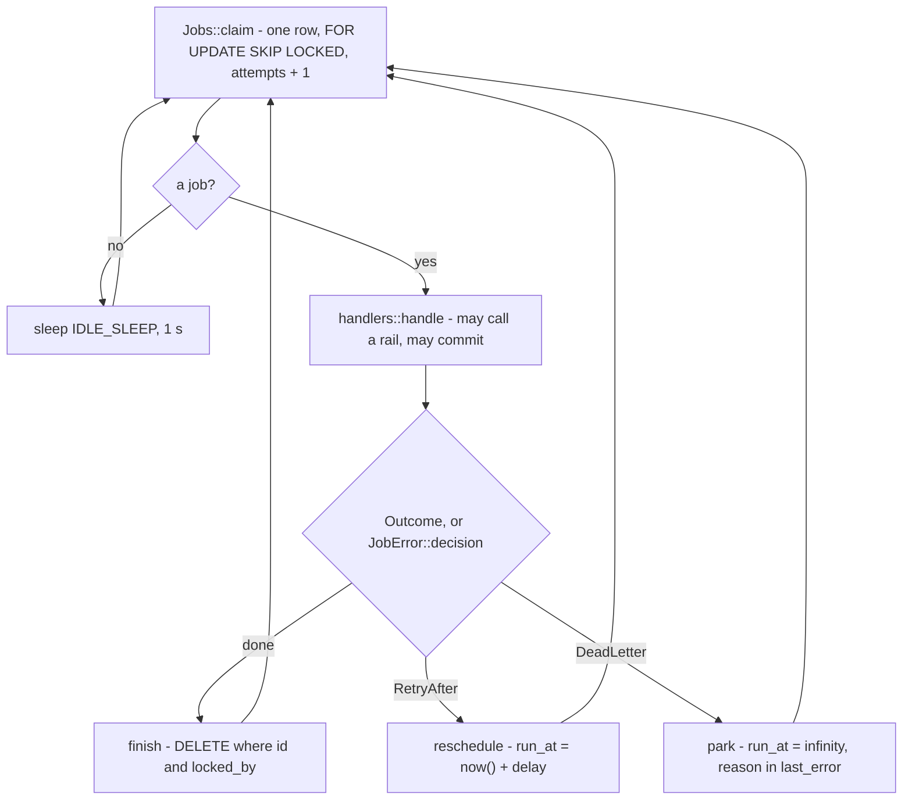
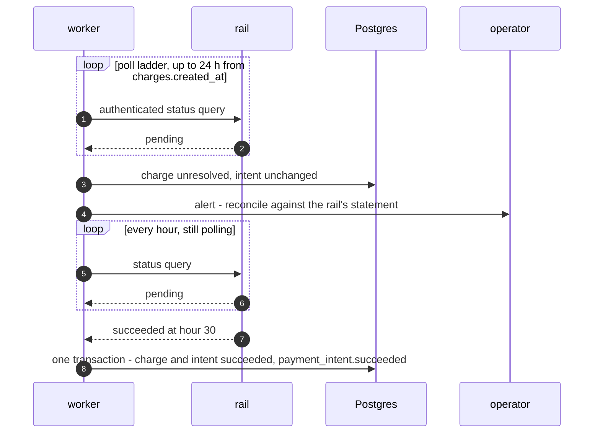
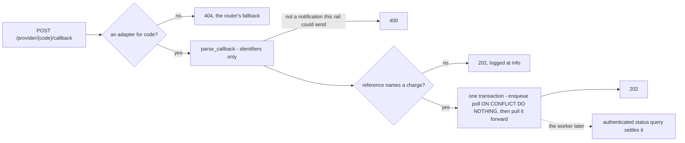
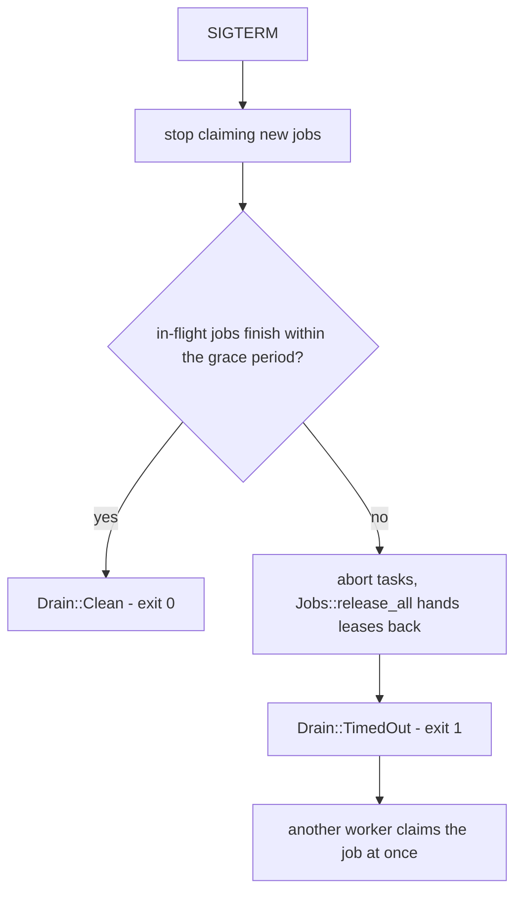

# Reconciler

Payer prompts expire. Callbacks may never arrive. So vpay does not wait to be
told how a payment ended: a worker process — `vpay-server worker`, the same
binary as the API run with a different subcommand — asks the rail, on a
schedule, until the rail gives a terminal answer or until a human has to step
in. This page explains the job queue that drives it, the poll ladder, the
24-hour escalation, and what keeps it correct when a worker dies or is stopped.

Agents working on this should load [vpay-reconciler](skill:vpay-reconciler).

## The job queue

Everything the worker does is a row in the `jobs` table. A job's `dedupe_key`
names its work — `poll:<charge_id>`, `resubmit:<charge_id>`, `sweep:expired`,
`scan:live` — and the same queue carries webhook fan-out and delivery (see
[webhooks](/api/webhooks)).

- **Claiming is safe under concurrency.** The claim is
  `UPDATE … WHERE id = (SELECT … FOR UPDATE SKIP LOCKED LIMIT 1)`, leased on
  `locked_by`, and two workers never take the same job.
- **Every write that ends a lease is guarded on `locked_by`.** A worker whose
  lease was reaped mid-run discards its answer instead of overwriting whoever
  holds the job now. The gauge line counts those as `lost`; any non-zero value
  means a handler outran the five-minute lease.
- **The loop owns the row; the handler does not.** A handler returns an
  `Outcome` and cannot delete or park its own row. Because a handler may commit
  a settlement and then fail before the `jobs` write, every handler is a
  compare-and-swap: re-running it matches no rows and answers "done".
- **The poll job is born with the charge**, in the same transaction, so every
  kill point in [crash safety](/payments/crash-safety) leaves work behind. The
  hourly `scan:live` job is only a backstop for charges nothing has touched for
  ten minutes.

## The poll ladder

`vpay_worker::poll_delay(attempt)`, tested for monotonicity:

| Attempt | Delay                        |
| ------- | ---------------------------- |
| 0–5     | 10s, 20s, 30s, 45s, 60s, 90s |
| 6–19    | 120s                         |
| 20+     | 15 min, out to 24 hours      |

A rung is one `UPDATE jobs SET run_at = now() + delay`. The queue adds at most
the one-second idle sleep on top: measured on the shipping loop, the last of a
backlog of eight was claimed 1.028 s after it committed at worst.

## Timers assert nothing

- **At 24 hours still pending**, the charge moves to `unresolved`. It is still
  polled, once an hour, and it raises an alert for a human to reconcile against
  the rail's settlement statement. The intent stays where it was. **The payment
  is not lost; it is escalated.** It is never dead-lettered.
- **The escalation does not depend on the rail answering.** A rail whose
  endpoint is down still has its charges escalated at the horizon.
- **A late success is a normal transition** — minute 40, or hour 30 from
  `unresolved`. It emits a plain `payment_intent.succeeded`, no special case. A
  late decline settles the same way.

::: warning The prompt-expiry half is not built
The design also has a rung at `prompt_ttl_seconds` (default 900): mark
`prompt_expired_at`, clear `next_action`, and emit `payment_intent.processing`
with `expired: true` so a merchant's UI can stop saying "check your phone".
**None of that exists in <Release />** — no column, no config key, no event. It was
deferred deliberately. Only the 24-hour rung runs.
:::

## Callbacks are hints

A rail's callback never changes state. `POST /provider/{code}/callback` extracts
identifiers only (the adapter's `parse_callback` cannot return a status), looks
the reference up, and in one transaction enqueues the charge's poll (a no-op if
it already exists) and pulls it forward. The
authenticated status query is the only thing that moves money.

The route answers `202` whether or not the reference names a charge — on
purpose, so that an unauthenticated endpoint is not an oracle for "does this
charge exist", and so that a rail does not retry forever against a reference it
will never find. Only two things get a different answer: a `{code}` that names
no rail this process links is a `404`, identical to the router's own fallback,
and a body that is not a notification the rail could have sent is a `400`.

It pulls a poll forward only if the poll is parked further out than the ladder's
first rung (10 s), and refuses a leased or dead-lettered one, so an
unauthenticated caller cannot spend a rail request on a poll that was about to
happen anyway. There is **no rate limit** on the route beyond that, and **no
rail has ever called it**: every body it has parsed was transcribed from vpay's
own adapter docs.

## Leases and crash recovery

A worker that is killed leaves its jobs with `locked_at` set, and the claim
matches only `locked_at IS NULL`. Leases older than `RecoveryPolicy::lease`
(five minutes) are reaped in three places, on purpose:

| Where                  | Why                                                                            |
| ---------------------- | ------------------------------------------------------------------------------ |
| At worker boot         | The dead worker may have been holding `sweep:expired`, the job that also reaps |
| Every `lease / 2`      | On its own timer, so a strand is freed within roughly one lease                |
| Inside `sweep:expired` | The hourly housekeeping sweep                                                  |

The charge behind a stranded job is then recovered by the table on
[crash safety](/payments/crash-safety#recovering-a-submitting-charge).

## SIGTERM and the drain

A `SIGTERM` is a different property from a `kill -9`. On shutdown the worker
stops **claiming**, and each task finishes the job it is on. The grace clock
(`--shutdown-grace-seconds`) starts when the signal arrives.

Both arms are exercised under a real signal to the shipping binary:

- **Clean drain.** A worker signalled while its webhook POST is inside the
  merchant's receiver finishes the delivery and exits `0`; the receiver sees
  **one** signed POST.
- **Timed-out drain.** With the grace below the receiver's delay, the worker
  exits `1`, logs `released=1`, and leaves the job unleased so a restarted
  worker finishes it. The merchant is told **twice** — a timed-out drain is
  at-least-once at the receiver, which is why webhook consumers must dedupe on
  the event id. The money is unaffected.

## What the worker does not do

- **Refunds have no poll ladder.** The port has no refund status read, and
  nothing settles a `pending` refund — so every refund vpay can create today
  stays `pending`. See [ledger](/payments/ledger).
- **Contradictions are logged, not acted on.** A rail that reports the opposite
  of a settled charge raises an alert and changes nothing. The classifier is
  unit-tested; neither call site is reached by any test.
- **Orange's `notif_token` is not checked** against the stored one; the callback
  route discards it rather than trusting it.

## What can go wrong

The [worker-queue runbook](vpay:docs/runbooks/worker-queue.md) covers the four
failure shapes — a dead-lettered job, a stranded lease, a charge escalated to
`unresolved`, and a rail contradicting a settled charge — with the SQL to find
each. Two rules from it are worth knowing before an incident:

- **Do not raise `--worker-concurrency` above 5.** A worker refuses a value
  above `vpay_db::MAX_CONNECTIONS / 2` at boot (exit 78). Scale with more
  replicas.
- **Do not force an old charge terminal.** Age is not evidence; reconcile
  against the rail's statement
  ([unresolved-charges runbook](vpay:docs/runbooks/unresolved-charges.md)).

## Status in this release

| Part                                       | Status                   | Evidence                                                                                        |
| ------------------------------------------ | ------------------------ | ----------------------------------------------------------------------------------------------- |
| Durable queue, claim, leases               | <Status s="built" />     | `two_workers_claiming_together_never_take_the_same_job`; lease reaping at boot and on its timer |
| Poll ladder and 24-hour escalation         | <Status s="partial" />   | `worker_recovery.rs`, `worker_e2e.rs` against real Postgres and a WireMock rail                 |
| Callback route                             | <Status s="partial" />   | Eleven cases in `provider_callback.rs`; **no rail has ever called it**                          |
| Graceful drain under SIGTERM               | <Status s="partial" />   | Both arms in `worker_kill9.rs`; MTN only, rail and receiver are WireMock                        |
| `prompt_ttl_seconds` / `prompt_expired_at` | <Status s="not-built" /> | No column, no config key, no event                                                              |
| Refund polling                             | <Status s="not-built" /> | No refund status read on the port                                                               |
| Contradiction alert call sites             | <Status s="unproven" />  | Wired; not reached by any test                                                                  |
| Operator runbooks                          | <Status s="unproven" />  | Queries run against a migrated database; never followed against a running deployment            |

The full record is the **Status** section of
[the reconciler flow](vpay:docs/flows/reconciler.md#status).

## Go deeper

- [docs/flows/reconciler.md](vpay:docs/flows/reconciler.md) — the source of
  truth for this page
- [docs/reference/vpay-worker.md](vpay:docs/reference/vpay-worker.md) — why the
  loop, the drain and the reapers are shaped as they are
- [docs/runbooks/worker-queue.md](vpay:docs/runbooks/worker-queue.md) — dead
  letters, stranded leases, contradictions
- [docs/runbooks/unresolved-charges.md](vpay:docs/runbooks/unresolved-charges.md)
  — reconciling an escalated charge
- [Operator runbooks](/operate/runbooks) on this site
- Skill: [vpay-reconciler](skill:vpay-reconciler)
