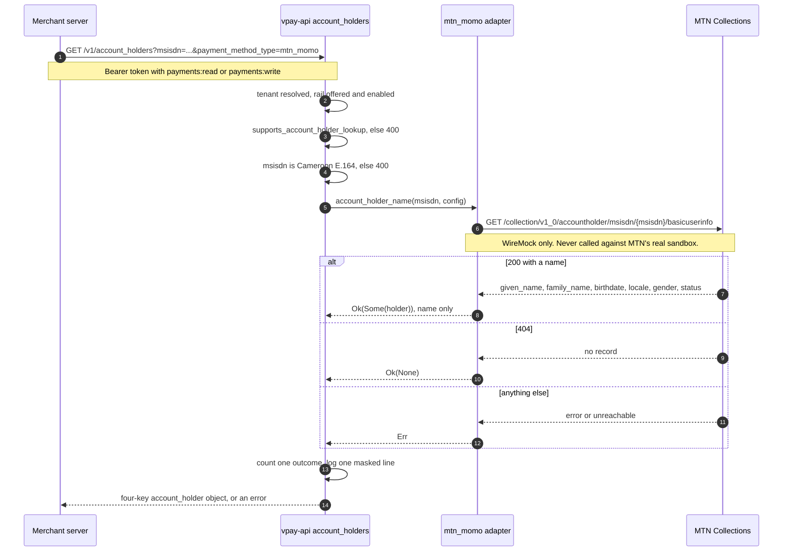
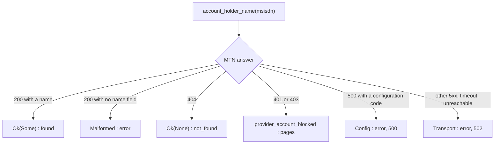

# Account-holder lookup

`GET /v1/account_holders` answers one question: _whose mobile-money account is
this number?_ It exists for integrators whose refund flow lets a buyer nominate
a **different** number to receive their money: before paying out, the integrator
must match the nominated account's registered name against the buyer's verified
one and refuse on a mismatch. Without a lookup every such nomination is
unverifiable, so every one is refused — safe, and useless.

This is **the only route on `/v1` that returns information about a person who is
not the caller**, and every design decision below follows from that.

Agents working on this route should load [vpay-customers](skill:vpay-customers).

::: warning Not safe to expose to untrusted merchants without ingress rate limiting
As shipped, any credential that can call `/v1` can turn a list of phone numbers
into a list of names, at whatever rate it can make HTTP requests — and vpay
keeps no record that it happened. vpay's own documentation names this as the
condition on turning the route on.
:::

## What happens



The MTN call uses the **same Collections subscription key and token** as a
charge, so a deployment that can take MTN payments needs no new credential for
it.

## The wire

```http
GET /v1/account_holders?msisdn=237600000200&payment_method_type=mtn_momo
Authorization: Bearer <token>
```

```json
{
  "object": "account_holder",
  "payment_method_type": "mtn_momo",
  "name": "David Mbarga",
  "verified": true
}
```

Four keys, always all four. When the rail has no record, `name` is present and
`null` (never omitted — both SDKs model it as a required nullable field) and
`verified` is `false`. `verified` is `true` exactly when `name` is present; it
exists for SDKs to branch on and is **not** a claim that anything was
cryptographically verified. There is no `livemode` field, deliberately: there is
no stored row to read it from.

`msisdn` accepts the three ways a Cameroon number is written — `+2376XXXXXXXX`,
`2376XXXXXXXX` or the national `6XXXXXXXX` — with the same separators the
checkout's number field accepts. Anything else is a `400` naming `msisdn`.

Both merchant SDKs expose it: `account_holders.retrieve` in the Rust SDK and
`accountHolders.retrieve` in the Node.js SDK.

## Three answers, never two

| The port says      | `/v1` answers                                                              | Meaning                                                |
| ------------------ | -------------------------------------------------------------------------- | ------------------------------------------------------ |
| `Ok(Some(holder))` | `200`, `name: "…"`, `verified: true`                                       | the rail named a holder                                |
| `Ok(None)`         | `200`, `name: null`, `verified: false`                                     | the rail answered and **has no record of this number** |
| `Err(..)`          | `502` rail unreachable, `500` misconfiguration, `400` rail has no such API | **nobody asked, or the rail could not answer**         |

The middle row is a fact about the **number**; the bottom row is a fact about
the **lookup**. A caller should refuse a nomination on both, but only one is the
buyer's to fix and only one is worth paging an operator about. Reporting an
unreachable rail as `Ok(None)` would tell an integrator that a real person's
real account does not exist — so the adapter maps exactly one status, `404`, to
`Ok(None)`, and the route matches on the result instead of propagating it.



## Privacy

vpay's rules for this route come from issue #47 §3. What each one amounts to:

1. **A name, and nothing else.** MTN's `basicuserinfo` body carries six fields;
   vpay's wire type has room for only `given_name` and `family_name`, so the
   rest — and anything MTN adds later — is dropped the moment the bytes are
   parsed. The port's `AccountHolder` type redacts even the name from `Debug`. A
   conformance case feeds a stub body with eleven personal fields and asserts
   each one is absent from the result and from every log line.
2. **Nothing is persisted.** Not the name, not the number, not the fact that the
   question was asked. There is no repository call and no migration behind the
   route.
3. **Logs carry a masked number, never a name.** One line per request, such as
   `+2376••••200` — a fixed number of bullets, so the mask does not reveal the
   input's length.
4. **Rate limiting — not built.** No limit exists and no default was chosen; the
   shape, the enforcement point and what an over-limit merchant is told are left
   to the maintainer.
5. **An audit log and a dedicated scope — not built.** An audit trail would be
   exactly the record rule 2 declines to keep, so choosing between them is a
   policy decision. A scope of its own (rather than `payments:read`) would
   refuse every existing merchant credential on the day it landed.

::: danger The cost of rules 2 and 4 together
A merchant enumerating the number space leaves **no record in vpay**. That is
the same fact as "nothing is persisted", seen from the other side.
:::

### Refunds ask the same question

Since 2026-09-16, `POST /v1/refunds` also looks up a nominated payee before it
instructs a transfer, through the same function, so it is counted and logged
exactly like the route. It is deliberately narrower: it refuses a number the
rail has no record of with a `400` naming `destination`, and never compares a
name, because vpay holds no verified buyer name. It skips the lookup on a rail
whose capability is `false`. So the reserved decisions above are about
**lookups**, not about one path: a credential with `payments:write` can put any
number in `destination` on a refund of its own intent and read "not a registered
account" off the `400` without ever calling `GET /v1/account_holders`.

## Capability, not provider code

The route branches on `supports_account_holder_lookup`, never on a rail name
([the provider port](/rails/provider-port)).

| Rail           | Capability | Behaviour                                                |
| -------------- | ---------- | -------------------------------------------------------- |
| `mtn_momo`     | `true`     | implemented against `basicuserinfo`                      |
| `orange_money` | `false`    | the port's default `ProviderError::Unsupported`, a `400` |

Orange's `false` means "no Orange route is confirmed from this repository", not
"Orange has none" — it is an open question on the
[Orange page](/rails/orange-money#what-is-unverified). An unknown rail, a
disabled rail and an incapable rail all get a byte-identical `400`, so a
merchant cannot enumerate which rails a deployment has switched off.

## Metrics

`vpay_account_holder_lookups_total{outcome}` counts one outcome per lookup:
`found`, `not_found`, `unsupported` or `error`. No label carries the number, the
name, the merchant or even the rail — a Prometheus label is retained and shipped
wherever the scrape goes, which would make it the stored record rule 2 refuses.
A malformed `msisdn` currently counts as `error`. The rail call itself also
appears on `vpay_provider_requests_total{operation="account_holder_name"}`.

## What can go wrong

The most dangerous failure is **silent**. Two details of the MTN call are
unverified: the case of the `accountHolderIdType` path segment (vpay sends
lower-case `msisdn`; MTN's portal declares upper-case values while its examples
use lower-case), and whether MTN answers `404` for an unknown holder at all (it
documents only `200`, `401` and `500` for this operation). If the path case is
wrong, MTN may answer `404` to _every_ lookup — which vpay renders as
`name: null` with HTTP `200`. A total misconfiguration would look exactly like
"nobody in Cameroon is registered".

It is safe about money — a caller refuses on `Ok(None)` just as on an error —
but on a first real call, check a number known to be registered before trusting
a `not_found`, and alert on a sustained `not_found` rate near 1.0.

## Status in this release

| Part                                   | Status                   | Evidence                                                                                                                                                         |
| -------------------------------------- | ------------------------ | ---------------------------------------------------------------------------------------------------------------------------------------------------------------- |
| `GET /v1/account_holders` route        | <Status s="unproven" />  | Served; six integration cases over a socket against a WireMock MTN                                                                                               |
| MTN `account_holder_name`              | <Status s="unproven" />  | Five conformance cases against WireMock; never called against MTN's real sandbox — the 2026-09-15 sandbox run charged a payment and did not call `basicuserinfo` |
| Name-only projection, masked logs      | <Status s="built" />     | Asserted against captured `tracing` output                                                                                                                       |
| Refund path as a second caller         | <Status s="unproven" />  | Counted and logged through the same function; WireMock only                                                                                                      |
| Orange lookup                          | <Status s="not-built" /> | `false`; Orange's route unconfirmed                                                                                                                              |
| Rate limit, audit log, dedicated scope | <Status s="not-built" /> | Reserved decisions for the maintainer                                                                                                                            |
| SDK `retrieve` methods                 | <Status s="unproven" />  | Tested against HTTP stubs only, never against a running vpay                                                                                                     |

The full record, with every test named, is in vpay's
[account-holder lookup flow § Status](vpay:docs/flows/account-holder-lookup.md#status).

## Go deeper

- [Account-holder lookup](vpay:docs/flows/account-holder-lookup.md) — the
  privacy rules and the evidence table
- [Adapter: MTN MoMo § the account-holder call](vpay:docs/flows/adapter-mtn-momo.md#the-account-holder-call)
- [Customers](/api/customers) and
  [refund destinations on MTN](/rails/mtn-momo#refunds-via-disbursements) on
  this site
- Skill: [vpay-customers](skill:vpay-customers)
