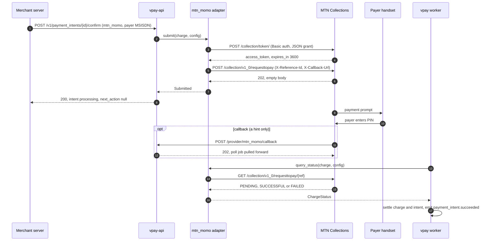
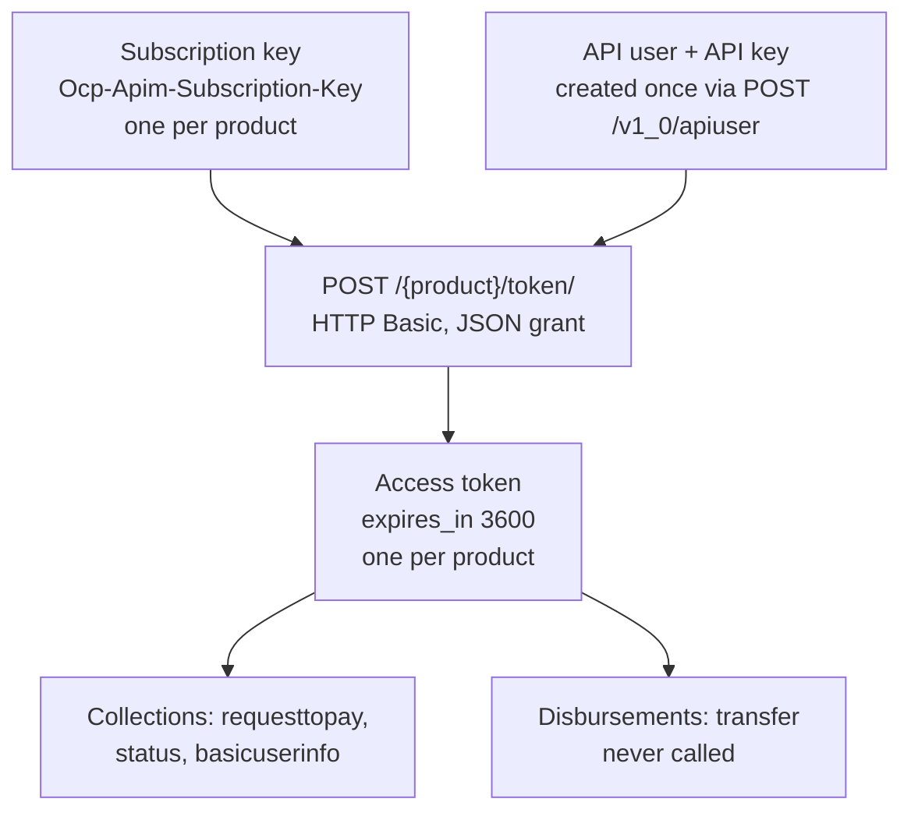

# MTN MoMo

MTN Mobile Money Cameroon is vpay's **push** rail: vpay asks MTN to prompt the
payer's handset, the payer approves with their PIN, and vpay learns the outcome
by asking MTN — never by trusting a notification. It is the only rail vpay has
ever called for real, and only on one day: on 2026-09-15, against MTN's
**sandbox**, where one payment settled. Everything else on this page — refunds,
the decline vocabulary, production — is proven against WireMock stubs or not at
all.

Agents working on this adapter should load [vpay-mtn-momo](skill:vpay-mtn-momo).

## Why MTN is a safe push rail

A push rail is only safe if two things hold, because the payer's phone starts
buzzing _before_ vpay learns whether its own request succeeded
([the provider port](/rails/provider-port#adding-a-rail)). MTN satisfies both:

| Precondition                                | MTN                                                   |
| ------------------------------------------- | ----------------------------------------------------- |
| The caller supplies its own reference       | Yes — `X-Reference-Id`, which _is_ the transaction id |
| Final status is queryable by that reference | Yes — `GET /collection/v1_0/requesttopay/{ref}`       |

So a crash after the submit is recoverable: vpay minted the reference, stored
it, and can always ask about it. A duplicate submit is answered
`409 RESOURCE_ALREADY_EXIST`, which the adapter reports as `Submitted`, not as
an error.

## The push charge



The collection request itself, as vpay's flow doc records it:

```http
POST /collection/v1_0/requesttopay
Authorization: Bearer <token>
Ocp-Apim-Subscription-Key: <collections key>
X-Target-Environment: sandbox | mtncameroon
X-Reference-Id: <the charge's provider_reference_id>
X-Callback-Url: https://<registered host>/provider/mtn_momo/callback

{ "amount": "5000", "currency": "XAF", "externalId": "<charge id>",
  "payer": { "partyIdType": "MSISDN", "partyId": "23767XXXXXXX" },
  "payerMessage": "…", "payeeNote": "…" }
```

`X-Callback-Url` is per request, and its host must match the
`providerCallbackHost` registered for the API user — otherwise MTN answers
`INVALID_CALLBACK_URL_HOST`. Settlement never depends on the callback arriving:
MTN signs nothing and sends no shared secret, so `parse_callback` returns the
reference (from `referenceId`, else `externalId`) and deliberately ignores the
body's `status`. The worker's authenticated status query on the
[poll ladder](/payments/reconciler) is what moves money.

## Credentials and tokens

The most common onboarding bug is confusing MTN's three credential layers:



Collections and Disbursements are **separate products** with separate
subscription keys and separately scoped tokens. vpay configures them separately
and **no Disbursements key falls back to its Collections twin**:

| Product       | Subscription key                            | API user                         | API key                            |
| ------------- | ------------------------------------------- | -------------------------------- | ---------------------------------- |
| Collections   | `credentials.subscription_key`              | `settings.api_user`              | `credentials.api_key`              |
| Disbursements | `credentials.disbursement_subscription_key` | `settings.disbursement_api_user` | `credentials.disbursement_api_key` |

The Collections keys are required at boot (a missing one is exit 78); the
Disbursements keys are not, and an empty one makes `refund` answer
`ProviderError::Config` naming it. Rotating them is covered by the
[rail-credential runbook](vpay:docs/runbooks/rotate-rail-credentials.md).

### The token grant — the one thing a real call proved

```http
POST /collection/token/          (or /disbursement/token/)
Authorization: Basic base64(api_user:api_key)
Ocp-Apim-Subscription-Key: <that product's key>
Content-Type: application/json

{"grant_type":"client_credentials"}
```

The body and its content type are load-bearing. Against MTN's real sandbox, a
bodyless POST answered `411 Length Required`, and the same grant sent
form-encoded answered a `200` "Request Rejected" HTML page. Only the JSON
spelling returns a token. Orange's adapter posts the form-encoded spelling, so
the two are not interchangeable. The WireMock token stub now requires the JSON
body, so this regression cannot go green again. **The Disbursements mint is
assumed to behave the same way; nobody has called it.**

### The token cache

Each adapter caches one bearer per product, treated as expired a minute before
MTN's `expires_in`. The cache key is a length-prefixed SHA-256 fingerprint of
the subscription key, API key and API user (plus the product), so rotating only
the API key evicts the old bearer immediately, and a second configuration never
reuses the first's token. A `401` re-mints exactly once and then reports
`provider_account_blocked`; a `500` is never retried by the adapter. Tokens and
credentials are redacted from `Debug`.

## Failure mapping

MTN reports why a charge failed in `reason.code` on the status response. vpay's
table is checked against the seventeen-value `ErrorReason.code` enum on MTN's
developer portal, which MTN binds to exactly that field:

| MTN `reason`                                | vpay failure code                         |
| ------------------------------------------- | ----------------------------------------- |
| `NOT_ENOUGH_FUNDS`                          | `insufficient_funds`                      |
| `COULD_NOT_PERFORM_TRANSACTION` †           | `payer_timeout`                           |
| `EXPIRED`                                   | `payer_timeout`                           |
| `PAYMENT_NOT_APPROVED`, `APPROVAL_REJECTED` | `payer_declined`                          |
| `PAYER_NOT_FOUND`                           | `invalid_payer`                           |
| `PAYER_LIMIT_REACHED`                       | `payer_limit_reached`                     |
| `SENDER_ACCOUNT_NOT_ACTIVE` †               | `payer_account_blocked`                   |
| `PAYEE_NOT_FOUND`                           | `invalid_payee`                           |
| `PAYEE_NOT_ALLOWED_TO_RECEIVE`              | `payee_account_blocked`                   |
| `NOT_ALLOWED`                               | `provider_account_blocked`                |
| `SERVICE_UNAVAILABLE` / 503                 | `provider_unavailable`                    |
| anything else                               | `provider_error`, carrying MTN's own word |

† Not in MTN's published enum; kept and explicitly declared as unpublished.
`TRANSACTION_CANCELED` stays `provider_error` on purpose: MTN does not say _who_
cancels, and vpay will not tell a buyer they declined on the strength of a verb.
With these rows MTN can produce all eleven of vpay's failure codes — see
[failures](/payments/failures).

::: warning MTN returns some logical errors as HTTP 500
`INVALID_CURRENCY`, `NOT_ALLOWED_TARGET_ENVIRONMENT`,
`INVALID_CALLBACK_URL_HOST`, and an `INTERNAL_PROCESSING_ERROR` that can mean
insufficient funds _or_ a platform outage, all arrive as `500`. The adapter
parses the body's `code` before deciding anything and never blind-retries a 500.
:::

Every mapped row is driven against a real WireMock container by
`a_declined_charge_maps_to_the_documented_failure_code`. That proves the
mapping, not the rail: MTN types the field but does not promise which values its
Cameroon deployment will ever send, and the one real payment succeeded, so **no
decline has ever been observed from MTN**.

## Refunds via Disbursements

An MTN refund is a Disbursements `transfer` to the payee the merchant names in
`destination[mtn_momo][msisdn]`. The call is written:

```http
POST /disbursement/v1_0/transfer
Authorization: Bearer <disbursement-scoped token>
Ocp-Apim-Subscription-Key: <disbursements key>
X-Target-Environment: sandbox | mtncameroon
X-Reference-Id: <the refund's provider_reference_id>

{ "amount": "5000", "currency": "XAF", "externalId": "<the same reference>",
  "payee": { "partyIdType": "MSISDN", "partyId": "237600000200" },
  "payerMessage": "…", "payeeNote": "…" }
```

A `202` maps to `Refunded` with `fee: None` — **accepted, not settled**. A
`409 RESOURCE_ALREADY_EXIST` answers the same, which is what makes a crash-retry
safe rather than a second payout. `401`/`403` is `provider_account_blocked` on
our Disbursements credentials.

::: danger Written, WireMock-proven, rail-unproven — never called
**MTN's Disbursements product has never been called by vpay** — not in
production, not in the sandbox, not once. No real Disbursements credential
exists anywhere in the project; in `config/application.yml` the three keys are
empty, so on every deployment `refund` answers `ProviderError::Config`. Only the
e2e/demo compose stack carries stub values, aimed at a `wiremock/wiremock`
container. And even an accepted transfer leaves the refund `pending` forever:
vpay never reads the transfer's status back, because the port has no refund
status read. **No rail has ever refunded anything.**
:::

What a first real Disbursements call would have to confirm: that its token mint
wants the same JSON grant; that the path is `/disbursement/v1_0/transfer` and
the member is `payee`; that a `202` really is empty and carries no fee; that
`409` is the duplicate answer on this product too; and whether MTN issues one
API user across both products. MTN's portal publishes no OpenAPI schema for the
Disbursement API, so the adapter reuses the Collections failure table.

## The sandbox run of 2026-09-15

This is the only time vpay has called a real rail.

**What happened.** Using the `live` profile (`deployment.livemode: false`, on
`localhost`), a EUR `mtn_momo` PaymentIntent (`pi_xxd2xj1e914e16c6m63gezag`) was
created, confirmed with MTN's stock sandbox test MSISDN `46733123454`, and
reached `succeeded` about a minute later, when the worker's
`GET /collection/v1_0/requesttopay/{ref}` observed the settlement. It took three
runs: the first two found the two halves of the token-grant bug above (no body,
then the wrong spelling), which the WireMock suite could not see because its
stub accepted what the adapter sent; the third settled.

| Proven against MTN's real sandbox                    | Not proven                                                                                      |
| ---------------------------------------------------- | ----------------------------------------------------------------------------------------------- |
| The Collections token mint (JSON grant)              | Any MTN **production** call; the production `base_url` and `target_environment` are unconfirmed |
| `submit` → `requesttopay` accepted                   | Any real payer — the test MSISDN auto-settles; no handset was prompted, no money moved          |
| `query_status` observing success; intent `succeeded` | Any decline or failure code                                                                     |
| Sandbox `base_url` and `target_environment: sandbox` | The account-holder lookup against the real sandbox                                              |
| EUR as the sandbox currency (it rejects XAF)         | Disbursements, token or transfer — never called                                                 |
|                                                      | The callback reaching vpay; the 401 → re-mint path                                              |

To reproduce it yourself, follow vpay's
[live sandbox runbook](vpay:docs/runbooks/live-sandbox-test.md): it needs your
own Collections credentials, Postgres, the server, the worker and the browser
checkout page.

| Environment value    | Sandbox                                                     | Cameroon production                          |
| -------------------- | ----------------------------------------------------------- | -------------------------------------------- |
| `base_url`           | `https://sandbox.momodeveloper.mtn.com` (called 2026-09-15) | `https://proxy.momoapi.mtn.com` — to confirm |
| `target_environment` | `sandbox` (called 2026-09-15)                               | `mtncameroon` — to confirm                   |
| `currency`           | EUR only                                                    | XAF                                          |

::: tip WireMock steering numbers are not real payers
The demo and conformance stubs key their scenarios on documentation MSISDNs —
for example `237600000100` settles, `237600000101` is `insufficient_funds`,
`237600000102` is `payer_timeout` and `237600000103` is `payer_declined`. They
mean nothing to MTN's sandbox; against the real sandbox use `46733123454`.
:::

## What can go wrong

- **`411` or an HTML "Request Rejected" from the token endpoint** — the grant
  was not sent as JSON. Do not "simplify" it to Orange's form spelling.
- **`INVALID_CALLBACK_URL_HOST`** — the callback host is not the one registered
  for the API user. Payments still settle by polling, but the submit fails.
- **A sudden `provider_account_blocked`** — MTN refused our credentials; it
  pages, and is not a payer decline.
- **A rising `provider_error` share** — MTN sent a reason the table does not
  know; see [Runbooks](/operate/runbooks).

## Status in v0.4.1

| Part                                    | Status                  | Evidence                                                                              |
| --------------------------------------- | ----------------------- | ------------------------------------------------------------------------------------- |
| Collections token mint                  | <Status s="partial" />  | Called against MTN's real sandbox on 2026-09-15                                       |
| `submit` / `query_status` (push charge) | <Status s="partial" />  | One sandbox payment settled 2026-09-15; WireMock conformance otherwise                |
| `parse_callback` and the callback route | <Status s="unproven" /> | Built; only vpay's own tests have ever called it                                      |
| Failure mapping                         | <Status s="unproven" /> | Every row driven against WireMock; no MTN decline ever observed                       |
| `refund` (Disbursements `transfer`)     | <Status s="unproven" /> | Written and WireMock-proven; never called; no real credential; refunds stay `pending` |
| `account_holder_name`                   | <Status s="unproven" /> | WireMock only; path-segment case and `404` behaviour unverified                       |
| MTN production                          | <Status s="unproven" /> | Never called; production host and environment unconfirmed                             |
| 401 → re-mint → retry                   | <Status s="unproven" /> | No test covers it                                                                     |

The full record is in vpay's
[MTN adapter flow § Status](vpay:docs/flows/adapter-mtn-momo.md#status) and the
[2026-09-15 verification page](vpay:docs/status/verification/2026-09-15.md).

## Go deeper

- [Adapter: MTN MoMo Cameroon](vpay:docs/flows/adapter-mtn-momo.md) — every wire
  shape, the steering table, "Not proven"
- [2026-09-15 — the first real rail call](vpay:docs/status/verification/2026-09-15.md)
- [Live sandbox runbook](vpay:docs/runbooks/live-sandbox-test.md)
- [Rotating a rail credential](vpay:docs/runbooks/rotate-rail-credentials.md)
- [The provider port](/rails/provider-port) and
  [account-holder lookup](/rails/account-holder-lookup) on this site
- Skill: [vpay-mtn-momo](skill:vpay-mtn-momo)
