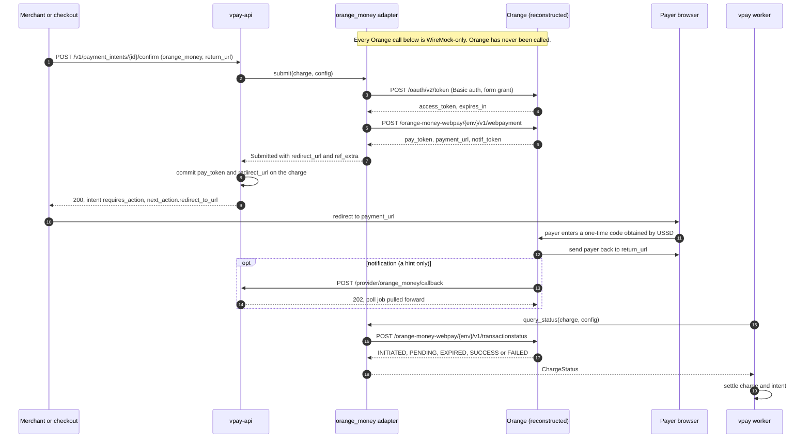
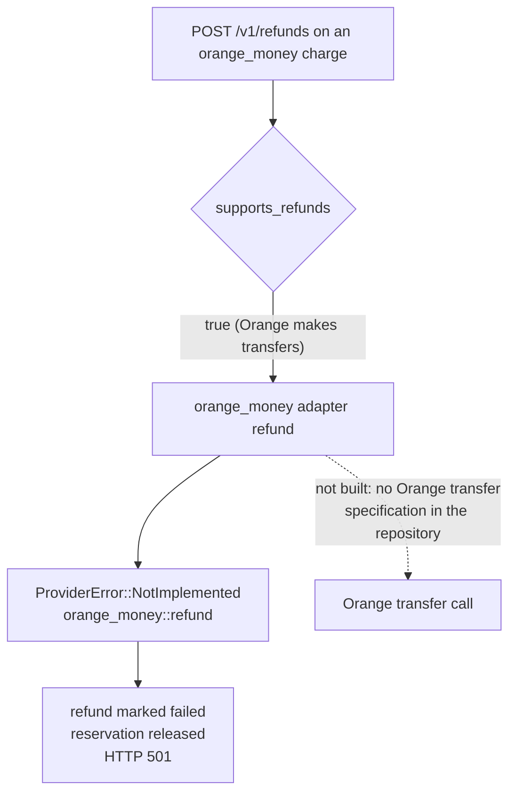

# Orange Money

Orange Money Cameroun is vpay's **redirect** rail: instead of prompting a
handset, vpay obtains a payment page from Orange and the payer's browser is sent
there to finish. The adapter implements three wire calls — a token, a payment
request and a status query — and all three are **reconstructed** from Orange
Developer's public overview and several community SDKs, because Orange's full
specification sits behind a signed merchant agreement.

::: danger Orange has never been called
Every Orange behaviour on this page has been exercised only against a
`wiremock/wiremock` stub that vpay wrote from the same reconstruction as the
adapter. A mapping faithful to vpay's reading of Orange, but not to Orange,
passes every test. `orange_money::refund` is `ProviderError::NotImplemented`.
:::

Agents working on this adapter should load
[vpay-orange-money](skill:vpay-orange-money).

## Why a redirect rail is still safe

A push rail must let you supply your own reference and query by it. Orange does
not — the reference that matters, `pay_token`, is Orange's — and it is still
safe, because the safety conditions are stated **per flow shape**
([crash safety](/payments/crash-safety)):

| Precondition for a redirect rail                            | Orange                                                                                                 |
| ----------------------------------------------------------- | ------------------------------------------------------------------------------------------------------ |
| The submit response is persistable before the payer can act | Yes, by construction — the payer's only way in is the `payment_url` vpay hands out after committing it |
| Status is queryable by material held after that persist     | Yes — `order_id` + `amount` + `pay_token`                                                              |

That is why `submit` returns the redirect URL and the key material **in the same
value**, and why vpay commits both to the charge row before it answers the
merchant.

## The redirect payment



The return is **not** the outcome. Orange's page distinguishes "paid" from
"cancelled" and vpay deliberately does not: both `return_url` and `cancel_url`
are sent the same per-charge value, and the result comes only from the
authenticated `transactionstatus` read. A charge with no `return_url` is refused
with `ProviderError::Config` before any call — the adapter will not invent one.
Where the value comes from is the core's decision: the merchant's own
`return_url` on a direct confirm, or vpay's return page when a
[hosted Checkout Session](/checkout/hosted) drives the charge.

## The three calls

As vpay's flow doc reconstructs them:

```http
POST https://api.orange.com/oauth/v2/token
Authorization: Basic <base64(client_id:client_secret)>
grant_type=client_credentials
→ { "access_token": "…", "expires_in": … }
```

```http
POST https://api.orange.com/orange-money-webpay/{env}/v1/webpayment
{ "merchant_key": "…", "currency": "XAF", "order_id": "<reference>",
  "amount": 5000, "return_url": "…", "cancel_url": "…",
  "notif_url": "https://…/provider/orange_money/callback", "lang": "fr" }
→ { "pay_token": "…", "payment_url": "https://webpayment.orange-money.com/payment/pay_token/…",
    "notif_token": "…", "status": 201 }
```

```http
POST https://api.orange.com/orange-money-webpay/{env}/v1/transactionstatus
{ "order_id": "…", "amount": 5000, "pay_token": "…" }
→ { "status": "INITIATED|PENDING|EXPIRED|SUCCESS|FAILED", "order_id": "…", "txnid": "…" }
```

Things worth knowing about them:

- **The environment is in the URL path**, not only the host: `{env}` is `dev` in
  sandbox and country-specific in production. The configured `base_url` must
  include the prefix.
- **The token grant is form-encoded** — the opposite of MTN, which the real
  sandbox proved insists on JSON. Neither spelling may be assumed for the other
  rail.
- `amount` is a JSON **number** here (MTN's is a string).
- `lang` is the one defaulted field in the body; it is `fr` when a deployment
  configures none.
- The `payment_url` is validated as `http(s)` and at most 2048 characters before
  it can reach a browser or the database, and a refusal never quotes it.
- The bearer is cached behind a SHA-256 fingerprint of `client_id` +
  `client_secret`, so rotating only the secret evicts it.

## Status mapping

| Orange `status`        | vpay `ChargeStatus`                                 |
| ---------------------- | --------------------------------------------------- |
| `INITIATED`, `PENDING` | `Pending`                                           |
| `SUCCESS`              | `Succeeded`                                         |
| `EXPIRED`              | `Failed(payer_timeout)`                             |
| `FAILED`               | `Failed(provider_error)` — no sub-reasons are known |

`INITIATED` means the token exists and the payer has not started — the state a
charge sits in if the merchant never redirects. It is `Pending`, not a failure.

### The payer window

How long Orange's real hosted page gives a payer, and what `transactionstatus`
answers while they are on it, is **unknown** (item 9 on vpay's "to confirm"
list). The adapter does not need the answer — both early statuses are `Pending`,
and the [poll ladder](/payments/reconciler) is indifferent to how many rungs it
spends there. The WireMock stub, however, has its own invented timing so that a
browser demo can finish: one `PENDING` from the submit, four more once a payer
loads the stub page (about 105 seconds on the worker's ladder), then `EXPIRED`.
**None of those numbers is a fact about Orange.**

The stub's hosted page (`/stub-hosted-page/{pay_token}`) is likewise vpay's own:
it renders a Pay link and a Cancel link so Cypress can drive the redirect leg.
Its Cancel arms `EXPIRED`, because Orange's five documented statuses contain no
`CANCELLED`.

### What this rail cannot say

Orange's vocabulary lets the adapter produce only three of vpay's eleven failure
codes: `payer_timeout`, `provider_error`, and `provider_account_blocked` (from
an HTTP 401/403). The other eight are **unreachable, not merely unmapped** —
Orange's protocol has no word for "not enough funds" or "no such payer". In
particular a payer who presses Cancel and a payer who walks away are the same
outcome, `EXPIRED` → `payer_timeout`; there is no `payer_declined` on this rail.
If Orange turns out to document sub-reasons for `FAILED`, they become rows in
the table. See [failures](/payments/failures).

## Refunds: `NotImplemented`



On a redirect rail vpay never learns who paid, so a refund cannot go "back the
way it came": it is an **outbound transfer to a named payee**, which is why the
adapter declares `refund_destination: Required`. Orange makes transfers, so
`supports_refunds` is `true` — answering `Unsupported` would be a false claim
about Orange. But vpay has **no Orange transfer specification of any kind**, not
even a reconstructed one, and writing one would mean inventing an endpoint and a
body in the money path on a rail nobody has called. So `refund` returns the
declared token `ProviderError::NotImplemented("orange_money::refund")`, tracked
by `verify-status`.

A merchant calling `POST /v1/refunds` on an Orange charge gets a **`501`**: the
refund row is written `pending`, moved to `failed`, and its reservation on the
intent is released. `supports_partial_refunds` stays `false` **by decision**:
turning it on later is additive, while turning a wrong `true` off would break
merchants who integrated against it.

Orange also declares `supports_account_holder_lookup: false`, because no Orange
name-lookup route is confirmed. That is `Unsupported`, not a token — see
[account-holder lookup](/rails/account-holder-lookup).

## What is unverified

Each of these blocks something concrete, and all are recorded in vpay's "To
confirm with Orange Cameroun" list:

- The error-body vocabulary for `webpayment` — a 4xx other than 401/404 becomes
  `provider_error` carrying the raw body.
- Whether `FAILED` carries any sub-reason.
- Whether a repeated `order_id` really is idempotent (the stub says so; Orange
  has not).
- Whether the notification carries `pay_token`, and whether it can be verified
  beyond `notif_token`.
- **The `notif_token` comparison is not built.** `parse_callback` requires a
  `notif_token` and fails closed without one, but the callback route discards it
  rather than comparing it with the stored token.
- The production `{env}` path segment and host for Cameroon.
- Whether `transactionstatus` stays queryable indefinitely.
- The transfer product — which one, which endpoint, which body, which
  credential, what amount rules. This is what unblocks `orange_money::refund`.
- The 401 → re-mint → retry path; only the token endpoint's own 401 is tested.

## Status in v0.4.1

| Part                                                                | Status                   | Evidence                                                                              |
| ------------------------------------------------------------------- | ------------------------ | ------------------------------------------------------------------------------------- |
| Token, `webpayment`, `transactionstatus` (`submit`, `query_status`) | <Status s="unproven" />  | Implemented; all conformance cases pass against WireMock; never called against Orange |
| `parse_callback`                                                    | <Status s="unproven" />  | Fails closed without `notif_token`; only vpay's own tests have posted to it           |
| `notif_token` comparison on the callback route                      | <Status s="not-built" /> | The route discards the received token                                                 |
| `refund`                                                            | <Status s="not-built" /> | `NotImplemented("orange_money::refund")`; merchants get a `501`                       |
| Partial refunds                                                     | <Status s="not-built" /> | `supports_partial_refunds: false` by decision                                         |
| Account-holder lookup                                               | <Status s="not-built" /> | `supports_account_holder_lookup: false`; Orange's route unconfirmed                   |
| Hosted page timing and cancel                                       | <Status s="unproven" />  | The stub's own invention, not a measurement of Orange                                 |

The full record is in vpay's
[Orange adapter flow § Status](vpay:docs/flows/adapter-orange-money.md#status).

## Go deeper

- [Adapter: Orange Money Cameroun](vpay:docs/flows/adapter-orange-money.md) —
  the calls, the ten "to confirm" items, the proof inventory
- [Crash safety](vpay:docs/flows/crash-safety.md) — why redirect preconditions
  differ from push ones
- [Payment lifecycle](/payments/lifecycle) and
  [the provider port](/rails/provider-port) on this site
- Skill: [vpay-orange-money](skill:vpay-orange-money)
