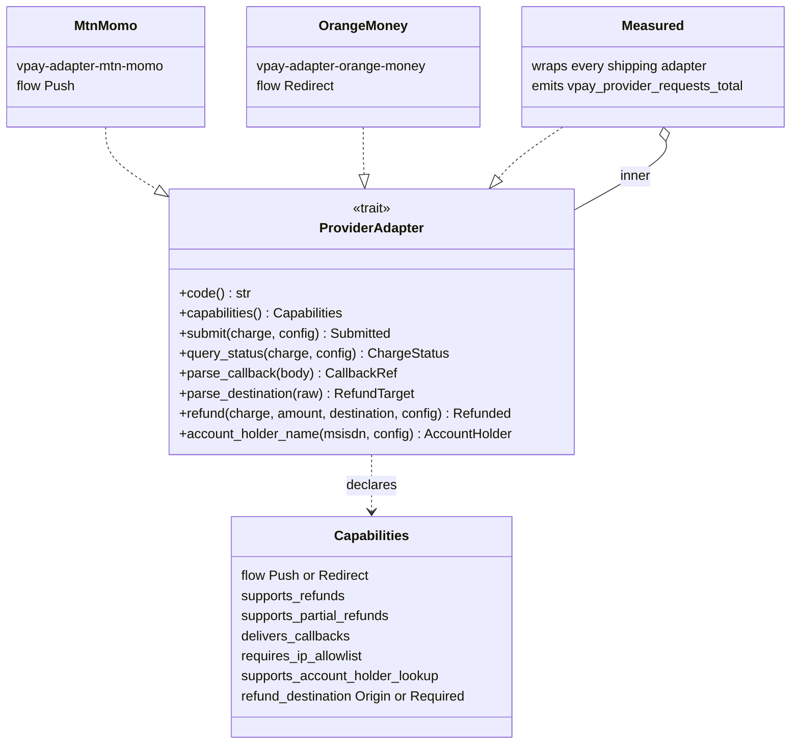
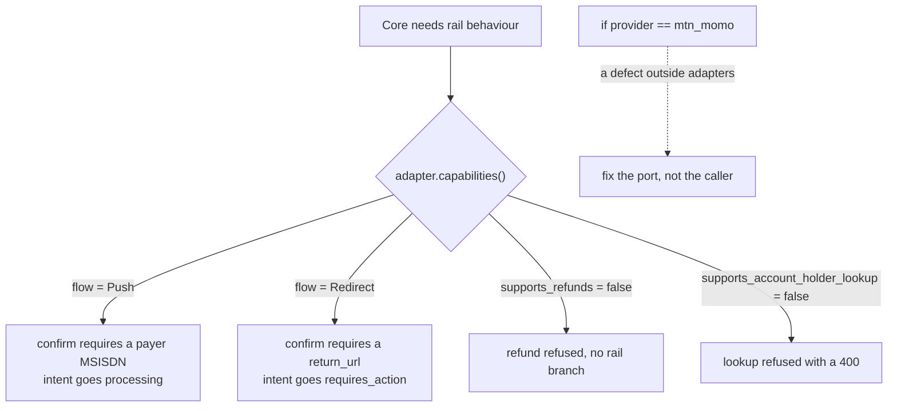
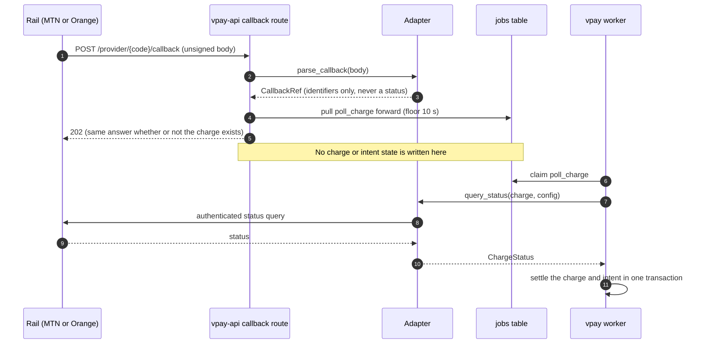

# The provider port

vpay's core decides what a payment _means_ — its lifecycle, its ledger, its
reconciliation, its failure vocabulary. An **adapter** decides how to say that
on one rail's wire. Between the two sits a single Rust trait, `ProviderAdapter`,
in `backends/crates/vpay-provider`. Everything rail-specific lives behind it, so
adding a third Central African rail is meant to be an adapter crate and some
configuration, not a change to the core.

The rule that keeps it honest is mechanical and greppable: if
`if provider == "mtn_momo"` appears anywhere outside an adapter crate, the port
is wrong — fix the port, not the caller
([ADR-0002](vpay:docs/adr/0002-provider-port.md)).

Agents working on an adapter or on the port itself should load
[vpay-provider-adapters](skill:vpay-provider-adapters).

{.diagram}

## The shape of the port

The HTTP layer only ever holds adapters as `Box<dyn ProviderAdapter>` — trait
objects whose concrete type it cannot name. That is what makes a rail-name
branch structurally awkward outside an adapter crate. Every shipping adapter is
additionally wrapped in `vpay_provider::Measured`, a decorator that records
`vpay_provider_requests_total` per port call.

### The operations

| Method                | What it promises                                                                                                                                                                                                                                                                                                                                 |
| --------------------- | ------------------------------------------------------------------------------------------------------------------------------------------------------------------------------------------------------------------------------------------------------------------------------------------------------------------------------------------------ |
| `submit`              | Ask the rail to take a payment. **Idempotent on `reference_id`**: a duplicate submission must answer `Submitted`, never an error, which is what makes a same-reference retry after a crash safe. A redirect rail returns its `redirect_url` and its key material (`ref_extra`) in the same value, so a caller cannot hold one without the other. |
| `query_status`        | The authoritative read, and the only thing that moves money. Takes the whole charge, because some rails need the amount and their own token. Must keep working indefinitely.                                                                                                                                                                     |
| `parse_callback`      | Turns a notification body into **identifiers only — never a status**. Deliberately synchronous, so it cannot make a network call and cannot smuggle a status out of an unauthenticated request.                                                                                                                                                  |
| `parse_destination`   | Optional. Reads the adapter's own `destination[<rail_code>][…]` sub-map from a refund request into a `RefundTarget`. The core strips the rail code and interprets nothing inside.                                                                                                                                                                |
| `refund`              | Optional, gated by `supports_refunds`. Answers `Refunded` — which carries `fee: Option<Money>` rather than a redirect URL. The default body is `ProviderError::Unsupported`.                                                                                                                                                                     |
| `account_holder_name` | Optional, gated by `supports_account_holder_lookup`. Defaults to `ProviderError::Unsupported`. See [account-holder lookup](/rails/account-holder-lookup).                                                                                                                                                                                        |
| `capabilities`        | A static declaration the core reads instead of special-casing a rail.                                                                                                                                                                                                                                                                            |

The three network methods are `async` via `#[async_trait]` (a native `async fn`
would not be dyn-safe). `ProviderConfig` carries `base_url`, `callback_url`,
`currency`, `settings`, `credentials` and two deadlines, `connect_timeout` and
`request_timeout` — on the config rather than the HTTP client, because one
`reqwest::Client` is shared by every rail.

### What every rail call inherits

All outbound rail traffic goes through `vpay_provider::http`, so both adapters
share the same refusals: redirects are returned rather than followed, proxy
environment variables are ignored, and response bodies are capped at 256 KiB.
None of these is rail-specific, which is why they live in the port crate.

## Branch on capabilities, never on provider codes

The core asks an adapter what it can do and acts on the answer. The two
capabilities [ADR-0002](vpay:docs/adr/0002-provider-port.md) names are `flow`
and `supports_refunds`; the port now declares seven.

| Capability                       | `mtn_momo` | `orange_money` | What the core does with it                                                                               |
| -------------------------------- | ---------- | -------------- | -------------------------------------------------------------------------------------------------------- |
| `flow`                           | `Push`     | `Redirect`     | whether a confirm needs a payer number or a return URL, and whether `submit` may answer a `redirect_url` |
| `supports_refunds`               | `true`     | `true`         | refuses a refund on a rail with no refund API, with no rail-specific branch                              |
| `supports_partial_refunds`       | `true`     | `false`        | refuses a part-refund on a rail that declares `false`                                                    |
| `delivers_callbacks`             | `true`     | `true`         | whether to expect a notification at all — which is a hint either way                                     |
| `requires_ip_allowlist`          | `true`     | `false`        | an operational fact for a deployment, not a code path                                                    |
| `supports_account_holder_lookup` | `true`     | `false`        | refuses `GET /v1/account_holders` with a `400` on a rail with no such API                                |
| `refund_destination`             | `Required` | `Required`     | whether a refund needs an explicit payee; read by the refund route                                       |

### `Unsupported` is a claim about the rail; `NotImplemented` is an admission about vpay

Two different errors mean "this will not work", and the difference is the point:

- **`ProviderError::Unsupported`** — the rail has no such API. It is a permanent
  capability answer. Orange's account-holder lookup is this:
  `supports_account_holder_lookup: false` and the port's default.
- **`ProviderError::NotImplemented("…")`** — the rail _does_ have the API and
  vpay has not written the call. Such a rail declares the capability `true`
  anyway and overrides the method with a named token, which
  `cargo xtask verify-status` requires to be listed in vpay's status page.
  `orange_money::refund` is the one such token at v0.4.1.

A rail leaving that list says nothing about whether its written call has ever
been made. `mtn_momo::refund` left it on 2026-09-15 when the Disbursements call
was written — and that call has **never been made against MTN** (see
[MTN MoMo](/rails/mtn-momo#refunds-via-disbursements)).

## Callbacks are hints

Neither rail signs its notifications or sends a shared secret, so anyone who can
reach the callback URL can post anything to it. vpay's answer is that a callback
is only ever a _hint to look sooner_:

1. `parse_callback` extracts identifiers and nothing else — the body's `status`
   field is not read.
2. `POST /provider/{code}/callback` uses those identifiers only to bring the
   charge's already-queued `poll_charge` job forward. It never writes charge or
   intent state, and it discards any key material the adapter extracted.
3. The worker then runs the **authenticated** `query_status` — and that is what
   settles the charge.

The route answers the same `202` for a reference it does not recognise as for
one it does, so it is not an oracle for "does this charge exist", and a rail
does not retry forever. A body the adapter cannot parse is a `400`; an unknown
rail code is a `404`.

::: warning The callback route has no rate limit
A job already due within ten seconds (the poll ladder's first rung) is left
alone, but a charge parked further out is brought forward by every callback. A
caller who knows a live charge's reference can therefore hold it at roughly one
authenticated status query per worker claim. vpay's own docs state there is **no
rate limit**, per charge or per source.
:::

## Stub rails are configuration, not code

[ADR-0006](vpay:docs/adr/0006-no-mocks-in-main-processes.md) forbids any mock,
fake, stub or dummy reachable from `vpay-server` or `vpay-worker-bin`. A stub
rail is instead a **`wiremock/wiremock` host named in configuration** — the same
`providers[].host` mechanism a deployment uses to reach a real rail. Sandbox,
production and stub are three configuration profiles, not three code paths.
`cargo xtask verify-no-mocks` enforces this in CI. Code that is not written
returns `ProviderError::NotImplemented`; it never fabricates a success.

The cost is that local development needs Docker. The gain is that CI exercises
the binary that ships.

### The shared conformance suite

One suite, `backends/tests/conformance/tests/adapter_conformance.rs`, is
parameterised over every adapter. It starts a real `wiremock/wiremock` container
per rail and drives it over HTTP, using the mappings under
`backends/tests/conformance/wiremock/<rail>/mappings/` — the same directory the
compose stack mounts. **Adding a rail means making this suite pass, not writing
a new one.** Its cases cover, among others, that a duplicate submit reports
`Submitted`, that "not found" is never on its own a failure, that an unreachable
rail is a transport error and never a decline, that bad credentials are never
reported as a payer problem, and that a callback round-trips to identifiers
only.

::: danger What the suite cannot prove
Every conformance case talks to WireMock. A mapping faithful to vpay's own
reading of a rail — but not to the rail — passes. The 401-after-a-good-token
re-mint path has no mapping and is unproven on both rails.
:::

## Adding a rail

1. Answer the preconditions for the flow shape **during commercial
   negotiation**. A push rail must let you supply your own idempotent reference
   _and_ query final status by it indefinitely, because the payer's phone buzzes
   before you learn whether your request succeeded. A redirect rail must let you
   persist the submit response before the payer can act, and query status by
   what you hold afterwards.
2. Add a `providers[]` entry to the deployment's YAML — the `providers` table is
   reconciled from configuration at boot. No schema migration.
3. Write `backends/crates/vpay-adapter-<rail>/` implementing the trait, with a
   mapping into the [failure taxonomy](/payments/failures).
4. Add WireMock mappings and make the shared conformance suite pass unchanged.
5. Document the rail's quirks in a flow doc.

**Nothing in the core changes.** If a step reads "and also patch the
reconciler", the port leaked.

## What can go wrong

- **A rising rail-call failure rate.** `vpay_provider_requests_total` is
  labelled by `error_kind`, and which kind dominates decides what is wrong:
  `provider_unavailable` is transport, `charge_declined` is ordinary rail
  decisions, `provider_error` is a rail string the adapter's table does not know
  (mapping drift), `misconfigured` is our YAML or credentials. The alert and its
  threshold are provisional and have never been evaluated against real series —
  see the
  [provider error-rate runbook](vpay:docs/runbooks/provider-error-rate.md) and
  [Runbooks](/operate/runbooks).
- **Widening a mapping to swallow an unknown string** is worse than an honest
  `provider_error`, because it tells a merchant something false about whether to
  retry.

## Status in v0.4.1

| Part                                             | Status                   | Evidence                                                                                                                          |
| ------------------------------------------------ | ------------------------ | --------------------------------------------------------------------------------------------------------------------------------- |
| The trait, capabilities and `Measured` decorator | <Status s="built" />     | Implemented in `vpay-provider`; unit-tested                                                                                       |
| Shared conformance suite over both rails         | <Status s="built" />     | Runs against real `wiremock/wiremock` containers                                                                                  |
| Callback route as a hint                         | <Status s="partial" />   | Built and tested; never called by a real rail; no rate limit                                                                      |
| Orange `notif_token` comparison on callbacks     | <Status s="not-built" /> | Route discards the received token; the comparison is unbuilt                                                                      |
| MTN charge path over the port                    | <Status s="partial" />   | One sandbox payment settled on 2026-09-15                                                                                         |
| Orange over the port                             | <Status s="unproven" />  | WireMock only; Orange has never been called                                                                                       |
| `refund` through the port                        | <Status s="unproven" />  | MTN written and never called; Orange is `NotImplemented`; nothing settles a `pending` refund — the port has no refund status read |
| 401 → re-mint → retry                            | <Status s="unproven" />  | No mapping exercises it on either rail                                                                                            |

The full, dated record is in vpay's
[provider-port flow § Status](vpay:docs/flows/provider-port.md#status).

## Go deeper

- [The provider port flow](vpay:docs/flows/provider-port.md) — the full
  interface table and every capability decision
- [ADR-0002: rails live behind a port](vpay:docs/adr/0002-provider-port.md)
- [ADR-0006: no test doubles in shipping processes](vpay:docs/adr/0006-no-mocks-in-main-processes.md)
- [Rails reference](vpay:docs/reference/rails.md) — per-adapter implementation
  notes, the callback URL contract
- [Payment lifecycle](/payments/lifecycle) and
  [the reconciler](/payments/reconciler) on this site
- Skill: [vpay-provider-adapters](skill:vpay-provider-adapters)
