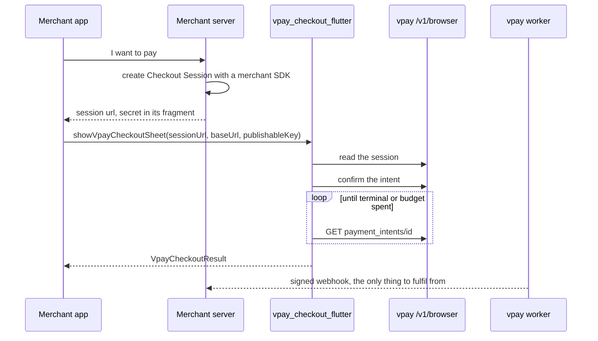
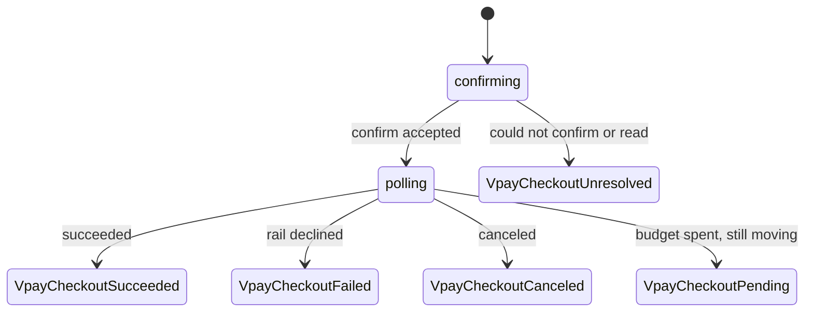

# Flutter checkout plugin

`vpay_checkout_flutter` (in `sdks/flutter/vpay_checkout_flutter`) is a
**payer-facing** plugin for Flutter apps. It never creates a payment: your
server creates the Checkout Session with a [merchant SDK](/sdks/) and hands the
app the session `url`. The plugin then runs the payment on the device and
returns a typed result once the payment intent has _actually_ settled — decided
by asking vpay, never by where a browser ended up
([ADR-0021](vpay:docs/adr/0021-flutter-checkout-plugin.md)).

Agents working on this plugin should load [vpay-sdks](skill:vpay-sdks); for the
checkout page it opens, [vpay-checkout](skill:vpay-checkout).

::: warning Not published, and no CI gate runs it
Add it by path — `vpay_checkout_flutter: path:
…/sdks/flutter/vpay_checkout_flutter` — it is not on pub.dev. None of its `just`
recipes (`install-flutter`, `analyze-flutter`, `test-flutter`) is in `just ci`;
a human runs them.
:::

## The rule it exists for: poll, never trust a URL

The merchant controls `success_url`. A plugin that reported success because a
window navigated there would report a payment it never verified — exactly the
"plausible success nobody earned" failure vpay's own rules name first. So the
outcome comes only from `GET /v1/browser/payment_intents/{id}`, authenticated
with the publishable key and the intent's own `client_secret`. That read
outlives the session, which is what makes polling after the window closes
possible at all.



## Opening a checkout

From the package README:

```dart
import 'package:vpay_checkout_flutter/vpay_checkout_flutter.dart';

final VpayCheckoutResult result = await showVpayCheckoutSheet(
  context,
  sessionUrl: sessionUrl,
  baseUrl: 'https://api.vpay.example',
  publishableKey: 'pk_test_…',
  merchantName: 'Njangi Store',
);
```

A native bottom sheet rises over your app, confirms, and polls until the intent
is terminal or the poll budget runs out. The fields it shows come from the
server's rail spec, so it can render a rail it has never heard of. A rail that
needs the payer to authenticate on the rail's own site (Orange Money) hands off
to the **payer's browser** and comes back; you do not choose that.
`showVpayCheckoutSheetRoute` is the same as a full-screen route. French is the
default locale.

The in-app `WebView` was removed on 2026-09-16: inside the merchant app's
process, a compromised app could have read what the payer typed. A browser runs
in its own process and shows a real URL bar.

| Platform | Browser surface                                                          |
| -------- | ------------------------------------------------------------------------ |
| Android  | Partial (bottom-sheet) Custom Tab, `androidx.browser`                    |
| iOS      | `SFSafariViewController` at a `.large()` detent, iOS 15 floor            |
| macOS    | `NSWorkspace.open` — the default browser, and no dismissal signal at all |
| Web      | a `window.open` popup, origin- and source-pinned `postMessage`           |

## Handle all five outcomes

`VpayCheckoutResult` is a sealed class, so the compiler makes you handle each:

| Result                   | Meaning                                                                | What to do                                  |
| ------------------------ | ---------------------------------------------------------------------- | ------------------------------------------- |
| `VpayCheckoutSucceeded`  | The device observed `succeeded`                                        | Show a receipt; **fulfil from the webhook** |
| `VpayCheckoutFailed`     | The rail declined; carries `code` and the rail's own `providerMessage` | Show the rail's words beside yours          |
| `VpayCheckoutCanceled`   | The intent is terminally canceled                                      | Back to the cart                            |
| `VpayCheckoutPending`    | Still moving when the budget ran out                                   | Never an error; the webhook will settle it  |
| `VpayCheckoutUnresolved` | We could not find out — window never opened, network, expired session  | No money moved on this side of the call     |



**`VpayCheckoutSucceeded` is a UI fact, not a settlement.** A payer's device is
not an authority on whether you were paid. Ship when your server receives and
verifies `payment_intent.succeeded` ([Webhooks](/api/webhooks)).

## Credentials on the device

The plugin never holds a merchant token, private key or `Authorization` header —
only a publishable key and one session's short-lived credentials, read out of
the `url` your server returned. Every type holding a session URL or secret
overrides `toString()` to redact it, and a test asserts `lib/` contains no
logging call. One fragile spot the README spells out: the pigeon-generated
channel types are **hand-edited** to redact, and regenerating them silently
reverts all four copies; only the Dart one is caught by a test. `BrowserClient`
refuses a non-`https` base URL unless you pass `allowInsecureBaseUrl: true` —
needed for the plain-HTTP demo stack only.

## App Store and Play policy

The rule keys on **what is sold**, not on where the payment UI lives. Physical
goods and services consumed outside the app must use a non-IAP method, and this
plugin is one. Digital goods unlocked inside the app need the store's own in-app
purchase, and opening a browser can itself be the violation. The README quotes
Apple's guidelines as read on 2026-09-13; it is not legal advice. See
[Mobile checkout](/checkout/mobile).

## What can go wrong

- **The sheet does not close itself.** The browser surfaces cannot see a
  navigation, so the payer taps Done; the plugin then polls before answering.
- **Deep-link return is unverified everywhere.** Android App Links and Universal
  Links need an HTTPS origin serving the association files, which this
  repository cannot deploy. Every checkout today ends as a dismissal.
- **Chrome's first-run screen can intercept the checkout** on a device where
  Chrome has not finished onboarding.

## Status in this release

| Part                                                                 | Status                   | Evidence                                                                                                                                             |
| -------------------------------------------------------------------- | ------------------------ | ---------------------------------------------------------------------------------------------------------------------------------------------------- |
| Outcome logic: poll-never-URL, dismissal polls first, result mapping | <Status s="built" />     | Pure-Dart unit tests (`just test-flutter`, MockClient)                                                                                               |
| Against a running vpay                                               | <Status s="partial" />   | `just test-flutter-e2e`: real sessions, confirm and poll on the compose stack; the merchant's own order read `paid` from its verified webhook        |
| Native sheet on Android                                              | <Status s="partial" />   | Driven by hand on an emulator against the demo stack (2026-09-17): three MTN payments to `paid`, one Orange hand-off through the Custom Tab and back |
| iOS browser surface                                                  | <Status s="partial" />   | Driven end to end on an iOS Simulator (2026-09-16); the native sheet was not run on iOS                                                              |
| macOS                                                                | <Status s="unproven" />  | Compiled by nobody                                                                                                                                   |
| Deep-link return (App Links, Universal Links)                        | <Status s="not-built" /> | Wired, never driven; needs a merchant-hosted origin                                                                                                  |
| CI gate                                                              | <Status s="not-built" /> | No Flutter recipe is in `just ci`                                                                                                                    |
| Against a real rail                                                  | <Status s="unproven" />  | Every stack it has met used WireMock rails                                                                                                           |

Every one of those walks was driven by a human, not by a gate, and against
WireMock rails. The parity matrix still carries a ⛔ dated 2026-09-16 saying the
revised Android surface had only been compiled; the hand walk recorded in
[docs/flows/mobile-checkout.md](vpay:docs/flows/mobile-checkout.md#status) is
from the next day. The full record is the Flutter table of
[docs/sdks/parity.md](vpay:docs/sdks/parity.md) and the plugin's
[README](vpay:sdks/flutter/vpay_checkout_flutter/README.md).

## Go deeper

- [sdks/flutter/vpay_checkout_flutter/README.md](vpay:sdks/flutter/vpay_checkout_flutter/README.md)
  — setup, theming, platform hosts, redaction
- [ADR-0021: a Flutter checkout plugin](vpay:docs/adr/0021-flutter-checkout-plugin.md)
- [docs/flows/mobile-checkout.md](vpay:docs/flows/mobile-checkout.md)
- [Mobile checkout](/checkout/mobile) and [Hosted checkout](/checkout/hosted)
- Skills: [vpay-sdks](skill:vpay-sdks), [vpay-checkout](skill:vpay-checkout)
