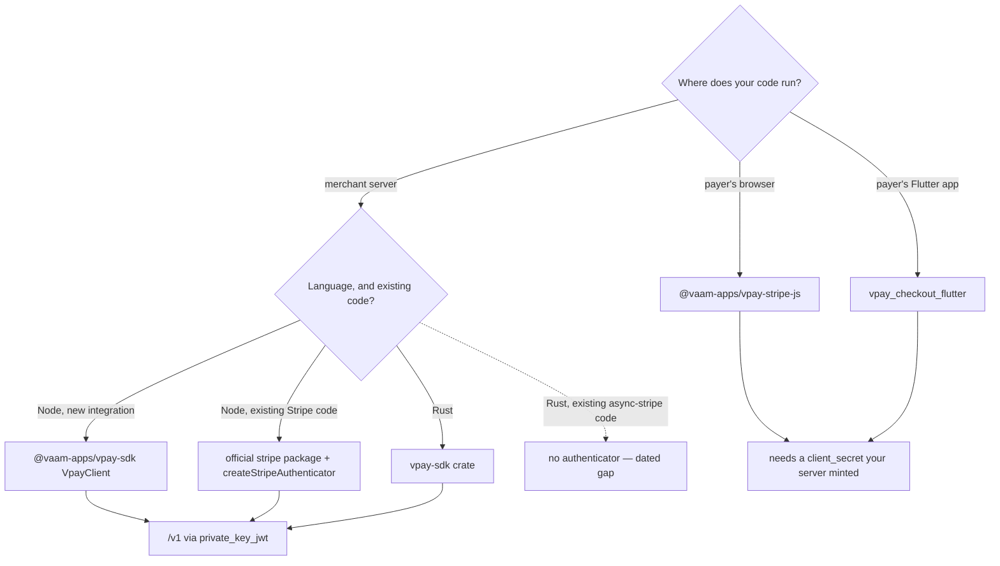
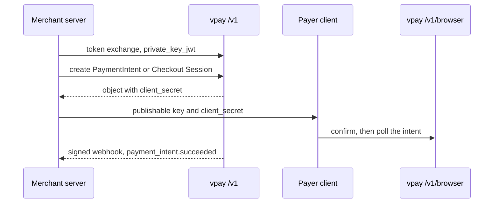

# SDKs

vpay has two kinds of client, and they hold different credentials. **Merchant
SDKs** run on the merchant's server, hold the merchant's private key, and call
`/v1`. **Payer-facing clients** run in a payer's browser or phone, hold only a
publishable key and one intent's or session's `client_secret`, and call
`/v1/browser`. Keeping those apart is the point: a merchant credential on a
payer's device is a credential that has left the merchant's control.

Agents working on any SDK should load [vpay-sdks](skill:vpay-sdks).

## The family

| Package                         | Directory                            | Runs on                        | Talks to                       | Page                                               |
| ------------------------------- | ------------------------------------ | ------------------------------ | ------------------------------ | -------------------------------------------------- |
| `@vaam-apps/vpay-sdk`           | `sdks/nodejs`                        | merchant server (Node ≥ 22.11) | `/v1`                          | [Node.js](/sdks/nodejs)                            |
| `vpay-sdk`                      | `sdks/rust`                          | merchant server (tokio)        | `/v1`                          | [Rust](/sdks/rust)                                 |
| `@vaam-apps/vpay-stripe-js`     | `sdks/stripe-js`                     | payer's browser                | `/v1/browser`                  | [Stripe compatibility](/sdks/stripe)               |
| `vpay_checkout_flutter`         | `sdks/flutter/vpay_checkout_flutter` | payer's Flutter app            | `/v1/browser`, the hosted page | [Flutter](/sdks/flutter)                           |
| `@vaam-apps/vpay-stripe-compat` | `sdks/stripe-compat`                 | CI only — **not an SDK**       | a live compose stack           | [Stripe compatibility](/sdks/stripe#stripe-compat) |

`sdks/stripe-compat` ships nothing. It is evidence: the official `stripe` Node
package, driven through the Node SDK's authenticator against a real
`vpay-server`, to prove that a Stripe-shaped integration works. It gets no row
in the parity matrix, because it proves claims rather than making its own.

## Which one do I need?

Whichever you pick, the flow has the same shape: your server authenticates with
`client_credentials` + a signed `private_key_jwt` assertion
([Authentication](/api/authentication)), creates a PaymentIntent or Checkout
Session, and hands its `client_secret` to the payer-side client. The payer side
confirms and polls; **your server learns the outcome from a signed webhook** and
fulfils from that, never from what a payer's device reports.

## The parity rule

The two merchant SDKs are independent implementations of one wire contract, and
[ADR-0015](vpay:docs/adr/0015-sdk-parity.md) holds them to **parity per
capability** — a testable claim about behaviour on the wire, not a matching
method name. A capability lands in both SDKs in the same pull request, or it is
recorded as a **dated, owned gap** (`⛔`, a date, the reason, an owner). Every
`✅` cell must name a test that exists in that SDK's own tree.

`cargo xtask verify-sdk-parity` reads
[docs/sdks/parity.md](vpay:docs/sdks/parity.md) on every `just verify` and
checks it **in both directions**:

- **code → doc:** every `<resource>.<method>` either SDK declares must have a
  row. A method with no row fails the build, naming its file and line.
- **doc → code:** every method row must name a method at least one SDK declares,
  unless every cell is a dated `⛔`. And a `✅` may only sit in a column whose
  own tree declares that method.

What a `✅` does _not_ mean: that the code is bug-free, or that any CI job ran
the named test. It means a case exists that would fail if the capability broke.

## The matrix, summarised

Counts are not given here on purpose — read the matrix itself. This is the shape
of it at v0.4.1:

| Area                                                                                                                                     | `sdks/rust`                                                               | `sdks/nodejs`                                                      |
| ---------------------------------------------------------------------------------------------------------------------------------------- | ------------------------------------------------------------------------- | ------------------------------------------------------------------ |
| `private_key_jwt` assertion and token exchange                                                                                           | ✅                                                                        | ✅, except real-OP conformance is not CI-gated ⛔                  |
| Token cache, refresh margin, single-flight                                                                                               | ✅, but a non-`Bearer` `token_type` is accepted ⛔                        | ✅                                                                 |
| One re-auth on `401`, replaying body and `Idempotency-Key`                                                                               | ✅                                                                        | ✅, but a second concurrent `401` can discard a fresh token ⛔     |
| Retries beyond that single `401`                                                                                                         | ⛔ none, deliberately                                                     | ⛔ none, deliberately                                              |
| `payment_intents`, `refunds`, `checkout.sessions`, `customers`, `invoices`, `invoice_items`, `account_holders`, `balance`, `events.list` | ✅                                                                        | ✅                                                                 |
| `events.retrieve` (the route is served)                                                                                                  | ⛔                                                                        | ⛔                                                                 |
| `request-id` surfaced, `stripe-should-retry` read                                                                                        | ⛔                                                                        | ⛔                                                                 |
| Webhook verification                                                                                                                     | ✅                                                                        | ✅, but a verified-but-undecodable body is not a distinct error ⛔ |
| `client_secret` kept out of diagnostic output                                                                                            | ✅                                                                        | ⛔ on `PaymentIntent`; ✅ on Checkout Sessions                     |
| An authenticator for the official Stripe SDK                                                                                             | ⛔ `async-stripe` has no per-request hook                                 | ✅                                                                 |
| Exercised against a running vpay                                                                                                         | ✅ refunds and invoices; ⛔ checkout sessions, customers, account holders | same as Rust                                                       |

"Against a running vpay" means the SDK's live suites, which drive a real
`vpay-server` over a socket — whose rails are still WireMock. Nothing any SDK
has done is evidence about a real rail, with one exception: the single MTN
**sandbox** payment of 2026-09-15 was minted by
`examples/checkout-browser/mint.mjs` through the Node SDK and confirmed in the
browser through `vpay-stripe-js`
([live sandbox test](/operate/runbooks#live-sandbox-test)). The matrix also has
its own tables for the browser client and the Flutter plugin; see their pages.

::: warning One method with no route, one refund that never settles
Both SDKs ship `balance.retrieve`, and the server does not serve `/v1/balance`:
it is the one SDK method that reaches a `404 unknown_route`. And a
`refunds.create` from either SDK reaches a real handler and returns a `pending`
refund that **nothing settles** — there is no refund poll ladder. That is a gap
in vpay, not a parity gap.
:::

## Status in v0.4.1

| Part                                        | Status                  | Evidence                                                                                                                                 |
| ------------------------------------------- | ----------------------- | ---------------------------------------------------------------------------------------------------------------------------------------- |
| Parity gate, both directions and per column | <Status s="built" />    | `cargo xtask verify-sdk-parity` in `just verify`                                                                                         |
| Merchant SDKs against a running vpay        | <Status s="partial" />  | Live suites for refunds and invoices; most cases run against in-process stubs                                                            |
| Browser client and Flutter plugin           | <Status s="partial" />  | Proven against stubs and, in parts, a live compose stack                                                                                 |
| Any SDK in the path of a real rail call     | <Status s="unproven" /> | Once: the 2026-09-15 MTN sandbox payment was minted with the Node SDK and confirmed with `vpay-stripe-js` — no other rail, no production |

See [docs/status.md](vpay:docs/status.md) for the repository-wide picture and
[docs/sdks/parity.md](vpay:docs/sdks/parity.md#gap-ledger) for every open gap.

## Go deeper

- [docs/sdks/parity.md](vpay:docs/sdks/parity.md) — the matrix and the gap
  ledger
- [docs/sdks/README.md](vpay:docs/sdks/README.md)
- [ADR-0015: SDK parity, machine-checked](vpay:docs/adr/0015-sdk-parity.md)
- [docs/flows/merchant-auth.md](vpay:docs/flows/merchant-auth.md) — the wire
  contract both merchant SDKs implement
- [Parity of these docs](/about/parity) — how this site is kept true of vpay
- Skill: [vpay-sdks](skill:vpay-sdks)
