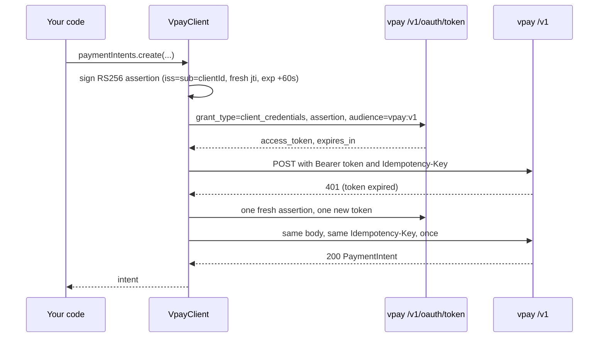

# Node.js SDK

`@vaam-apps/vpay-sdk` is the Node.js merchant SDK for vpay's `/v1` API. It runs
on your server, holds your private key, and does the whole authentication
handshake on every call — so your code reads like a Stripe integration while the
wire carries vpay's key-based OAuth2 flow instead of an API key. It has zero
runtime dependencies and needs Node.js `>=22.11.0`.

Agents working on this SDK should load [vpay-sdks](skill:vpay-sdks); for the
`/v1` contract it implements, [vpay-merchant-api](skill:vpay-merchant-api).

## Install

Inside the vpay workspace it is a workspace package:

```bash
pnpm --filter @vaam-apps/vpay-sdk build
```

From npm:

```bash
pnpm add @vaam-apps/vpay-sdk
```

::: info Is it on npm?
The package's own README still says it is not yet published. That line is stale:
vpay's gate log records that `release.yml` gained a `publish-node-sdk` job and
that on 2026-09-20 `npm view @vaam-apps/vpay-sdk version` returned `0.3.0`
([docs/status/gates.md](vpay:docs/status/gates.md)). The manifest at v0.4.1 is
version `0.4.1`.
:::

## What the SDK does for you

`/v1` never accepts an API key. You are a statically registered OAuth2 client,
vpay holds only your **public** key, and every token is earned by signing a
short-lived assertion ([Authentication](/api/authentication)).



The token is cached until shortly before `expires_in` (a 30-second margin, or
half the lifetime for very short tokens), and concurrent first calls share one
token request. There is no refresh token. A `401` triggers exactly one re-auth
and retry, replaying the identical body and `Idempotency-Key`; a second `401` is
returned to you. Nothing else is retried automatically — not a `5xx`, not a
timeout.

## Usage

From the package README. Amounts are integer minor units; XAF is zero-decimal,
so `5000` is 5,000 FCFA ([Money](/payments/money)).

```ts
import { readFileSync } from "node:fs";
import { VpayClient } from "@vaam-apps/vpay-sdk";

const vpay = new VpayClient({
  baseUrl: "https://api.vpay.example",
  clientId: "merchant_a",
  privateKey: readFileSync("./merchant_a.key.pem", "utf8"),
});

const intent = await vpay.paymentIntents.create(
  {
    amount: 5000, // 5,000 FCFA — XAF is zero-decimal, see docs/flows/money.md
    currency: "xaf",
    payment_method_types: ["mtn_momo"],
    metadata: { order_id: "1234" },
  },
  { idempotencyKey: "order_1234_attempt_1" },
);

const confirmed = await vpay.paymentIntents.confirm(intent.id, {
  payment_method_data: {
    type: "mtn_momo",
    mtn_momo: { msisdn: "237670000000" },
  },
});

// `processing` means NOT YET. Wait for a payment_intent.succeeded webhook,
// or poll retrieve(). There is no `failed` status — see payment-lifecycle.md.
console.log(confirmed.status);

// Orange Money is a redirect rail:
const redirectConfirm = await vpay.paymentIntents.confirm(intent.id, {
  payment_method_data: { type: "orange_money" },
  return_url: "https://shop.example/return",
});
if (redirectConfirm.next_action?.type === "redirect_to_url") {
  // redirect the payer's browser to redirectConfirm.next_action.redirect_to_url.url
}
```

A push rail (MTN) moves the intent to `processing` while the payer approves on
their handset; a redirect rail (Orange) answers `requires_action` with a URL to
send the payer to ([Payment lifecycle](/payments/lifecycle)). The client also
exposes `refunds`, `events.list`, `checkout.sessions`, `customers`, `invoices`,
`invoiceItems`, `accountHolders` and `balance`; the package README covers each.
`events.retrieve` does not exist in this SDK (a dated parity gap), and
`balance.retrieve` reaches a `404` because the server serves no `/v1/balance`.

`create()` and `retrieve()` return the intent's `client_secret` — the payer
credential you hand to [the browser client](/sdks/stripe). It is absent from
list items and webhook bodies. Do not log it: on a `PaymentIntent`,
`console.log(intent)` prints it (a dated gap); a `CheckoutSession` redacts its
own secret from `util.inspect`.

## Configuration worth knowing

| Option                              | Default           | Note                                                                    |
| ----------------------------------- | ----------------- | ----------------------------------------------------------------------- |
| `baseUrl`, `clientId`, `privateKey` | —                 | Required. The key is PEM text or a `KeyObject`, never logged            |
| `kid`                               | —                 | Only if you registered more than one key                                |
| `tokenEndpoint`                     | `${issuer}/token` | Where this process POSTs — must be reachable from _your_ server         |
| `assertionAudience`                 | `tokenEndpoint`   | What the OP calls itself: `{deployment.public_base_url}/v1/oauth/token` |
| `audience`                          | `vpay:v1`         | Without it the token is refused by `/v1`                                |
| `assertionLifetimeSeconds`          | `60`              | `1..=300`; keep the default — 300 is the OP's exact refusal boundary    |
| `timeoutMs`                         | `30000`           | Token exchange and every resource call                                  |

**The one that bites:** if your server reaches vpay by an internal name (a
compose service, a private DNS name) while vpay's public base URL is something
else, set `assertionAudience` to the public token endpoint. Otherwise every
token request answers `invalid_client` with nothing pointing at the cause.

## Errors

Every error extends `VpayError`. Branch on the subclass, then on `code`:

| Class                         | When                                                                        |
| ----------------------------- | --------------------------------------------------------------------------- |
| `VpayApiError`                | A non-2xx from a `/v1` route — `status`, `type`, `code`, `message`, `param` |
| `VpayAuthError`               | The token endpoint refused (`invalid_client`, …). Never retried             |
| `VpayUnexpectedResponseError` | Not vpay's envelope — a proxy's HTML 502, or a non-`Bearer` token           |
| `VpayTransportError`          | DNS, TLS, refused connection, timeout                                       |
| `VpayConfigError`             | Misconfiguration, caught at construction where possible                     |
| `WebhookSignatureError`       | `verifyWebhook` rejected a delivery                                         |

Two idempotency errors share status `400` and type `idempotency_error` and mean
opposite things: `idempotency_key_in_flight` (wait and resend the same call) and
`idempotency_key_in_use` (the key was used with a different body — a bug). One
exception to the `VpayError` rule: an out-of-range amount throws a bare
`TypeError` (a dated gap). See [Errors](/payments/errors).

## Webhook verification

Verify the **raw** request body — a parsed and re-serialised body breaks the
HMAC. Delivery is at-least-once and unordered, so dedupe on `event.id`. Trimmed
from the README's example:

```ts
import { verifyWebhook, WebhookSignatureError } from "@vaam-apps/vpay-sdk";

let event;
try {
  // The RAW request body must be used — parsing and re-stringifying it
  // breaks the HMAC. Do not run a body-parsing middleware before this.
  event = verifyWebhook({
    rawBody: raw,
    signatureHeader: header,
    secret: webhookSecret,
  });
} catch (err) {
  if (err instanceof WebhookSignatureError) {
    res.writeHead(400).end("bad signature");
    return;
  }
  throw err;
}
```

It accepts any matching `v1=` during a secret rotation and rejects a timestamp
more than five minutes from your clock. See [Webhooks](/api/webhooks).

## Using the official Stripe SDK

If you already have code written against `stripe`, `@vaam-apps/vpay-sdk/stripe`
exports an authenticator that performs the handshake inside stripe-node's
`config.authenticator` hook, with an empty API key. `stripe` is an optional peer
dependency:

```js
import { readFileSync } from "node:fs";
import Stripe from "stripe";
import { createStripeAuthenticator } from "@vaam-apps/vpay-sdk/stripe";

const authenticator = createStripeAuthenticator({
  baseUrl: "http://localhost:8080",
  clientId: "acme-cameroon",
  privateKey: readFileSync("./merchant-key.pem", "utf8"),
  kid: "acme-cameroon-2026-08",
});

const stripe = new Stripe("", {
  authenticator,
  host: "localhost",
  port: "8080",
  protocol: "http",
  maxNetworkRetries: 2,
  timeout: 30_000,
  telemetry: false,
});
```

`host`, `port` and `protocol` are not optional: the authenticator refuses to
sign a request addressed anywhere but `baseUrl`, so a live vpay token can never
be sent to `api.stripe.com`. Because an authenticator runs before a request, it
cannot see a `401`; call `authenticator.invalidate()` when you catch a
`StripeAuthenticationError`. `examples/merchant-stripe-node` runs this against
the compose stack. What does and does not port is on
[Stripe compatibility](/sdks/stripe) and
[Stripe-shaped API](/api/stripe-compat).

## What its tests talk to

Be precise about this, because it is the difference between "the SDK encodes the
right bytes" and "the SDK works against vpay".

- **Almost every test in `sdks/nodejs` runs against a `node:http` server the
  test starts** — a real socket and real bytes on the wire, but a stub
  answering, not vpay. That covers the assertion's claims, the token exchange,
  caching and re-auth, every resource method's path and body, errors and
  webhooks.
- **Two live suites drive a real `vpay-server`**: `src/invoices.live.test.ts`
  and `src/refunds.live.test.ts`, run by `pnpm test:live` (a separate vitest
  project) and brought up by `just sdk-live`. They fail rather than skip when no
  stack answers. The rails behind that stack are WireMock.
- **`sdks/stripe-compat`** drives the official `stripe` package through this
  SDK's authenticator against a live compose stack, in CI's `e2e` job.
- **`examples/merchant-node`** is written against a hypothetical
  `api.vpay.example` and is not run against a stack by anything.
- **One real-rail run:** on 2026-09-15 the MTN sandbox payment was minted by
  `examples/checkout-browser/mint.mjs` through this SDK
  ([live sandbox test](/operate/runbooks#live-sandbox-test)).

## Status in v0.4.1

| Part                                                                 | Status                   | Evidence                                                                    |
| -------------------------------------------------------------------- | ------------------------ | --------------------------------------------------------------------------- |
| `private_key_jwt` handshake, token cache, single re-auth             | <Status s="built" />     | Parity ✅ rows against `node:http` stubs; real-OP check is manual only (⛔) |
| `/v1` resource methods                                               | <Status s="built" />     | Every method's wire shape pinned; byte-identical to the Rust SDK            |
| Refunds and invoices against a running vpay                          | <Status s="partial" />   | Live suites green against WireMock rails; no refund ever settles            |
| Checkout sessions, customers, account holders against a running vpay | <Status s="unproven" />  | Stub-only (dated ⛔ rows)                                                   |
| Stripe authenticator                                                 | <Status s="built" />     | Unit-tested and exercised end to end by `sdks/stripe-compat`                |
| Retries, `request-id`, `stripe-should-retry`, `events.retrieve`      | <Status s="not-built" /> | Dated ⛔ rows in the parity matrix                                          |

The full record is the Node column of
[docs/sdks/parity.md](vpay:docs/sdks/parity.md) and the package's own
[README](vpay:sdks/nodejs/README.md).

## Go deeper

- [sdks/nodejs/README.md](vpay:sdks/nodejs/README.md) — every option, method and
  error
- [examples/merchant-node/index.mjs](vpay:examples/merchant-node/index.mjs) and
  [examples/merchant-stripe-node](vpay:examples/merchant-stripe-node)
- [docs/sdks/parity.md](vpay:docs/sdks/parity.md) — the Node column, cell by
  cell
- [SDK overview](/sdks/) and [Rust SDK](/sdks/rust)
- Skills: [vpay-sdks](skill:vpay-sdks),
  [vpay-merchant-api](skill:vpay-merchant-api)
