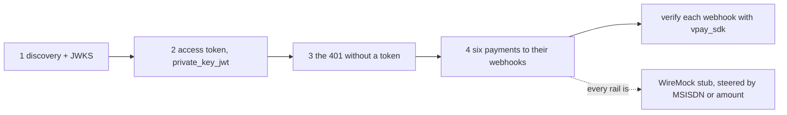

# Rust SDK

`vpay-sdk` (in `sdks/rust`) is the Rust merchant SDK for vpay's `/v1` API. It
implements the same wire contract as the [Node.js SDK](/sdks/nodejs) and is held
to putting **byte-identical** request bodies on the wire. It is also the SDK
`just demo` runs: `examples/merchant-demo` uses it to walk six payments through
both rails to their signed webhooks.

Agents working on this SDK should load [vpay-sdks](skill:vpay-sdks); for the
`/v1` contract, [vpay-merchant-api](skill:vpay-merchant-api).

## Install

The crate is a workspace member and is **`publish = false`** — it is not on
crates.io. Depend on it by path from inside the vpay workspace:

```toml
[dependencies]
vpay-sdk = { path = "sdks/rust" }
```

```bash
cargo nextest run -p vpay-sdk    # or: just test-sdk-rust
```

Every request method is `async` and needs a `tokio` runtime. TLS is rustls with
Mozilla's **vendored** root bundle, never OpenSSL; the crate builds its own
rustls config and installs no process-wide crypto provider. One consequence: a
merchant behind a TLS-intercepting proxy with a private CA is not trusted, and
there is no setting for that.

## What the SDK does for you

The same handshake as every vpay merchant client
([Authentication](/api/authentication)): an RS256 `private_key_jwt` assertion
(fresh `jti`, 60-second default lifetime, hard-capped at 300), exchanged at the
token endpoint with `audience=vpay:v1` and no client secret; the token cached
until `expires_in` minus a margin, shared by concurrent callers; and on a `401`
exactly one re-auth and one retry replaying the same body and `Idempotency-Key`.
A failure _from the token endpoint_ is never retried — retrying a credential
problem only spends another `jti`. Every `POST` carries an `Idempotency-Key`,
yours or a generated UUIDv4.

## Usage

From the crate README, trimmed to one create and confirm:

```rust
use std::collections::BTreeMap;
use std::time::Duration;

use vpay_sdk::payment_intents::{
    ConfirmPaymentIntentParams, CreatePaymentIntentParams, PaymentMethodType,
};
use vpay_sdk::{Client, Credentials, IntentStatus, NextAction, RequestOptions};

let pem = std::fs::read_to_string("./merchant_a.key.pem")?;
let client = Client::builder("https://api.vpay.example")
    .credentials(Credentials::rsa_pem("merchant_a", &pem)?)
    .timeout(Duration::from_secs(30))
    .build()?;

let mut metadata = BTreeMap::new();
metadata.insert("order_id".to_string(), "1234".to_string());

let intent = client
    .payment_intents()
    .create(
        CreatePaymentIntentParams {
            amount: 5000,
            currency: "xaf".to_string(),
            payment_method_types: vec![PaymentMethodType::MtnMomo],
            metadata,
            description: Some("Order 1234".to_string()),
            customer: None,
        },
        RequestOptions::new().with_idempotency_key("order_1234_attempt_1"),
    )
    .await?;

let confirmed = client
    .payment_intents()
    .confirm(
        &intent.id,
        ConfirmPaymentIntentParams::mtn_momo("237670000000"),
        RequestOptions::new(),
    )
    .await?;

match confirmed.status {
    IntentStatus::Processing => {}
    IntentStatus::RequiresAction => {
        // Redirect rail (Orange Money): send the payer to the URL.
        if let Some(NextAction::RedirectToUrl { redirect_to_url }) = &confirmed.next_action {
            println!("redirect to {}", redirect_to_url.url);
        }
    }
    IntentStatus::RequiresPaymentMethod => {
        if let Some(err) = &confirmed.last_payment_error {
            println!("refused: {} — {}", err.code, err.message);
        }
    }
    IntentStatus::Succeeded | IntentStatus::Canceled => {}
}
```

Two things the types do for you. `ConfirmPaymentIntentParams` has one variant
per rail — `mtn_momo(msisdn)` for the push rail, `orange_money(return_url)` for
the redirect rail — so the two cannot be mixed up. And there is no `failed`
status: a rail refusal returns the intent to `RequiresPaymentMethod` with
`last_payment_error` set ([Payment lifecycle](/payments/lifecycle)).
`last_payment_error.code` is an open `String` on purpose, so a failure code
newer than your SDK still decodes.

The client exposes `payment_intents()`, `checkout().sessions()`, `customers()`,
`invoices()`, `invoice_items()`, `refunds()`, `events()`, `balance()` and
`account_holders()`. As in Node, there is no `events().retrieve()`, and
`balance().retrieve()` reaches a `404` because the server has no `/v1/balance`.

## Errors

Two types, deliberately. `ConfigError` comes from building a client or reading a
key — nothing has reached the wire. `Error` is everything that happens on, or
instead of, the wire:

| Variant                     | When                                                                    |
| --------------------------- | ----------------------------------------------------------------------- |
| `Error::Api`                | A non-2xx `/v1` envelope — `status`, `kind`, `code`, `message`, `param` |
| `Error::TokenEndpoint`      | The token endpoint refused. Never retried                               |
| `Error::UnexpectedResponse` | Not the envelope — a proxy's HTML 502, an undecodable success           |
| `Error::Transport`          | DNS, TLS, timeout, refused connection                                   |
| `Error::InvalidParams`      | An amount negative or past 2^53-1; nothing sent                         |
| `Error::Config`             | A `ConfigError` surfaced through a request path                         |
| `Error::Webhook`            | `webhooks::verify` rejected a delivery                                  |

Branch on `code`, not on `kind`: `idempotency_key_in_flight` means wait and
resend the same call; `idempotency_key_in_use` means the key was reused with a
different body. See [Errors](/payments/errors).

## Webhook verification

```rust
use vpay_sdk::webhooks::{self, DEFAULT_TOLERANCE};

// The RAW request body must be used. A parsed-and-reserialised body breaks
// the HMAC — do not run a JSON body parser before this.
let event = webhooks::verify(raw_body, signature_header, secret, DEFAULT_TOLERANCE)?;

match event.kind.as_str() {
    "payment_intent.succeeded" => {
        let intent = event.payment_intent()?;
        println!("{} succeeded", intent.id);
    }
    _ => {}
}
```

It compares in constant time, accepts a second `v1=` during rotation, and holds
its header grammar byte for byte to the Node verifier's. It does not dedupe —
keep a unique index on processed event ids. See [Webhooks](/api/webhooks).

## The demo that drives it: `examples/merchant-demo`

`just demo` boots the compose stack and runs this program, which authenticates
with the SDK and exits `0` only if every step behaves as expected.



| #   | Rail           | Outcome                           | Settles to                | `failure_code`       |
| --- | -------------- | --------------------------------- | ------------------------- | -------------------- |
| 1   | `mtn_momo`     | payer approves                    | `succeeded`               | —                    |
| 2   | `mtn_momo`     | no balance                        | `requires_payment_method` | `insufficient_funds` |
| 3   | `mtn_momo`     | prompt expires                    | `requires_payment_method` | `payer_timeout`      |
| 4   | `orange_money` | payer completes the page          | `succeeded`               | —                    |
| 5   | `orange_money` | page expires                      | `requires_payment_method` | `payer_timeout`      |
| 6   | `orange_money` | rail refuses, undocumented reason | `requires_payment_method` | `provider_error`     |

Nothing in the program tells vpay what should happen: each outcome is selected
at the WireMock stub by a field a merchant genuinely controls (the MSISDN on
MTN, the amount on Orange). It is a real run of real code against stub rails —
no money moves. [Demo runbook](/operate/runbooks#demo).

## What its tests talk to

- **Most of the crate's tests run against `wiremock`** — a real local HTTP
  server, so the SDK's transport and encoding run unchanged, but a stub answers.
- **The assertion is checked against the real verifier.**
  `tests/op_conformance.rs` hands minted assertions to the pinned
  `authkestra-op` verifier vpay itself runs, including negative controls.
- **Against a real `vpay-server`:**
  `backends/tests/integration/tests/merchant_token_flow.rs` drives the crate
  through a real token exchange and across the `/v1` boundary;
  `tests/live_invoices.rs` and `tests/live_refunds.rs`, behind the `live-stack`
  feature and run by `just sdk-live`, drive full lifecycles and fail rather than
  skip without a stack. Rails are WireMock throughout.
- **Not proven: TLS.** Nothing in the repository serves TLS, so certificate
  verification against the vendored roots is exercised by no test.

## Status in this release

| Part                                        | Status                   | Evidence                                                   |
| ------------------------------------------- | ------------------------ | ---------------------------------------------------------- |
| Handshake, token cache, single re-auth      | <Status s="built" />     | Parity ✅ rows; real-verifier conformance test             |
| `/v1` resource methods                      | <Status s="built" />     | Every method's wire shape pinned; byte-identical to Node   |
| Refunds and invoices against a running vpay | <Status s="partial" />   | Live suites against WireMock rails; no refund ever settles |
| `token_type` validation, timeout test       | <Status s="not-built" /> | Dated ⛔ rows                                              |
| An `async-stripe` authenticator             | <Status s="not-built" /> | Dated ⛔: `async-stripe` has no per-request hook           |
| TLS verification                            | <Status s="unproven" />  | No test serves TLS                                         |
| Published crate                             | <Status s="not-built" /> | `publish = false`                                          |

The full record is the Rust column of
[docs/sdks/parity.md](vpay:docs/sdks/parity.md) and the crate's own
[README](vpay:sdks/rust/README.md).

## Go deeper

- [sdks/rust/README.md](vpay:sdks/rust/README.md) — the whole API, the parity
  table between languages, the mutation list
- [examples/merchant-demo/README.md](vpay:examples/merchant-demo/README.md) —
  the four steps and the outcome table
- [sdks/rust/examples/create_and_confirm.rs](vpay:sdks/rust/examples/create_and_confirm.rs)
- [SDK overview](/sdks/) and [Node.js SDK](/sdks/nodejs)
- Skills: [vpay-sdks](skill:vpay-sdks),
  [vpay-merchant-api](skill:vpay-merchant-api)
