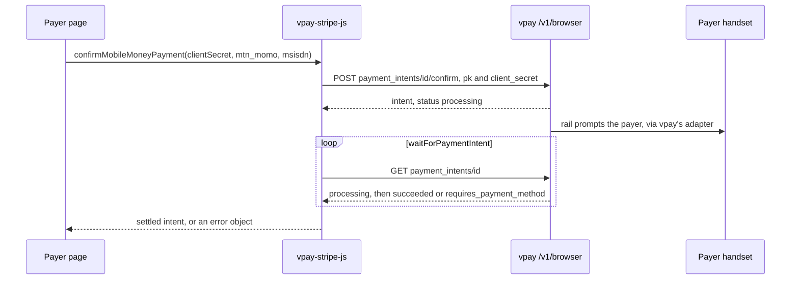
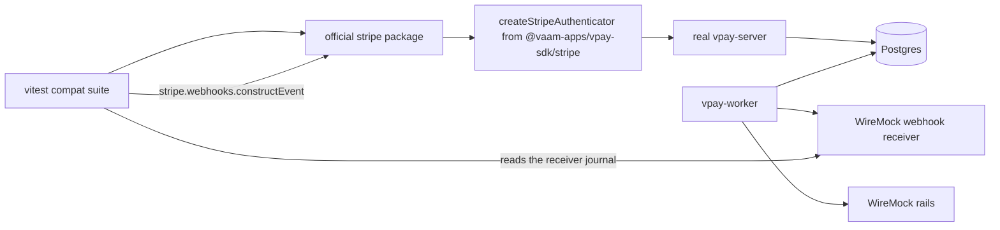

# Stripe compatibility

vpay's API is Stripe-shaped, so two Stripe-flavoured pieces sit in its SDK
family. They answer different questions. **`@vaam-apps/vpay-stripe-js`** is a
browser client for the _payer's_ page, shaped like Stripe.js so checkout code
ports over. **`sdks/stripe-compat`** ships nothing: it is a conformance suite
proving that a _merchant's_ server code written against the official `stripe`
Node package works against a real vpay once the Node SDK's authenticator is
plugged in. The server-side half of that story is on
[Node.js SDK](/sdks/nodejs#using-the-official-stripe-sdk) and
[Stripe-shaped API](/api/stripe-compat).

Agents working on either should load [vpay-sdks](skill:vpay-sdks); for the payer
surface and checkout page, [vpay-checkout](skill:vpay-checkout).

## `@vaam-apps/vpay-stripe-js`: the browser client

`@stripe/stripe-js` cannot be pointed at another API — it has no base-URL option
and its loader hard-codes `js.stripe.com`. So this is vpay's own package,
**drop-in shaped**, speaking vpay's `/v1/browser` routes. Zero runtime
dependencies, ESM, TypeScript strict. It never holds a merchant key: it
authenticates with a publishable key and the intent's `client_secret`, which
your server obtained from a [merchant SDK](/sdks/).

It has been on the npm registry since 2026-09-19 — `release.yml`'s
`publish-stripe-js-sdk` job publishes it on every `v*` tag — and inside the vpay
workspace it is a `workspace:*` dependency:

```bash
pnpm add @vaam-apps/vpay-stripe-js
```

### Using it

From the package README — the server creates the intent and renders the
publishable key and `client_secret` into the page; the browser confirms and
waits:

```ts
// browser
import { loadStripe } from "@vaam-apps/vpay-stripe-js";

const stripe = await loadStripe(publishableKey, {
  baseUrl: "https://api.vpay.example",
});

const confirmed = await stripe.confirmMobileMoneyPayment(clientSecret, {
  type: "mtn_momo",
  msisdn: "237690000000",
});
if (confirmed.error) {
  show(confirmed.error.message);
} else {
  // The payer now approves the push on their handset. Poll until the intent
  // stops moving — three minutes by default, every two seconds, jittered.
  const settled = await stripe.waitForPaymentIntent(clientSecret);
  show(settled.error ? settled.error.message : settled.paymentIntent.status);
}
```



The final outcome the page shows is still a UI fact. Your server fulfils from
the signed webhook ([Webhooks](/api/webhooks)).

### What is and is not compatible

| Stripe.js                                                     | `@vaam-apps/vpay-stripe-js`                                                |
| ------------------------------------------------------------- | -------------------------------------------------------------------------- |
| `loadStripe(pk)`                                              | `loadStripe(pk, { baseUrl, checkoutBaseUrl? })` — no `<script>` downloaded |
| `retrievePaymentIntent`, `confirmPayment`, `handleNextAction` | same signatures (`confirmPayment` minus `elements`)                        |
| —                                                             | `confirmMobileMoneyPayment`, `waitForPaymentIntent`                        |
| `createEmbeddedCheckoutPage`                                  | `initEmbeddedCheckout` — frames **vpay's own** checkout page               |
| —                                                             | `retrieveCheckoutSession`, `openCheckoutPopup`, `notifyCheckoutOpener`     |

**Never compatible, by construction:** Elements, cards, 3DS, the Payment
Element, Link, Payment Request / Apple Pay / Google Pay, `confirmCardPayment`,
`createPaymentMethod`, ConfirmationTokens, SetupIntents. Each depends on card
data or a `js.stripe.com` iframe. A missing method is a compile error on the
merchant's page rather than a plausible failure at the till.

Stripe's own Checkout does _not_ port by changing an import: vpay's session
object is its own (no `line_items`, `mode` or `amount_total`). What does port is
the embedded handle — `{ mount, unmount, destroy }` is assignable to Stripe's
`StripeEmbeddedCheckout` in both directions, pinned by a compile-time test — and
the `PaymentIntentResult` narrowing idiom.

**Redirect rails** follow Stripe.js: on `next_action.redirect_to_url` the page
navigates and the promise never settles, unless you pass
`redirect: 'if_required'`. vpay appends **nothing** to your `return_url` — none
of Stripe's `payment_intent` / `redirect_status` parameters — so the return page
must carry its own state and call `retrievePaymentIntent`.

The return trip itself is wired: vpay mounts `/provider/{code}/callback` and
tells the rail a per-charge `return_url`. Under a Checkout Session that is
vpay's own return page, and a real browser has walked the whole Orange round
trip in `shop-hosted.cy.ts` — against Orange's WireMock stub, not Orange.
Without a session, the payer lands on **your** `return_url`, and you learn the
outcome from `retrievePaymentIntent`, never from the fact that they came back
([Browser checkout](/checkout/browser)).

### Errors

Nothing on the `Stripe` object rejects; every failure is
`{ error: { type, code?, message?, param? } }`. Every credential failure —
unknown publishable key, wrong `client_secret`, another merchant's key, unknown
intent — is the **same** `resource_missing` 404, byte for byte. Three codes are
the client's own: `polling_timeout`, `redirect_unavailable` (a redirect with no
`window`) and `unexpected_response`; `api_connection_error` with no code means
the request never landed. No message it builds contains a `client_secret` or
publishable key, and there is no `console` call in its shipping source.
`loadStripe` and `initEmbeddedCheckout` are the two that _do_ reject, on
integration mistakes visible at first page load.

## `sdks/stripe-compat`: the official `stripe` package, against a real stack {#stripe-compat}

This suite takes the official `stripe` package — the one a merchant already has
— and drives it through `createStripeAuthenticator` against a real
`vpay-server`, worker, Postgres, WireMock rails and a WireMock webhook receiver,
out of process over TCP.



```bash
just demo_port=18080 stripe-compat
```

That recipe brings the stack up and runs the suite; `just demo-down` tears it
down. What it covers:

| File                         | Proves                                                                                                                               |
| ---------------------------- | ------------------------------------------------------------------------------------------------------------------------------------ |
| `lifecycle.compat.test.ts`   | create, retrieve, cursor paging with `autoPagingToArray`, cancel, confirm to `processing`, a bounded poll to `succeeded`             |
| `webhooks.compat.test.ts`    | a delivery the receiver actually recorded verifies with `stripe.webhooks.constructEvent`; tampered body and wrong secret are refused |
| `errors.compat.test.ts`      | status → Stripe error class, `err.param`, `err.requestId`, the 409 retry advisory, money-moving parameters refused not ignored       |
| `idempotency.compat.test.ts` | stripe-node's auto-generated key, replay, reused key with a changed body                                                             |
| `headers.compat.test.ts`     | the `request-id` / `x-request-id` mirror; `Stripe-Version` and `Stripe-Account` accepted and ignored                                 |

**It cannot skip.** A `globalSetup` fails the run when no vpay answers
`/healthz` or the merchant handshake does not complete — a suite that skipped
itself would report green with zero cases. Its script is `compat`, not `test`,
so a job with no stack never picks it up; CI runs it in the `e2e (compose)` job.

## What can go wrong

- **Porting a card flow.** Anything card-shaped is absent, not stubbed; plan a
  mobile-money flow instead.
- **Relying on Stripe's return parameters.** vpay adds none to `return_url`.
- **A wrong `checkoutBaseUrl`** does not fail loudly: it is the origin every
  embedded-checkout message is pinned to, so it silently accepts nothing.
- **Reading `stripe-should-retry: true`.** The suite observes only the `false`
  direction; the `true` direction cannot be staged without a test double.

## Status in this release

| Part                                                  | Status                  | Evidence                                                                                                                                  |
| ----------------------------------------------------- | ----------------------- | ----------------------------------------------------------------------------------------------------------------------------------------- |
| `vpay-stripe-js` payment-intent half                  | <Status s="built" />    | Unit-tested against a `node:http` stub; Cypress drives `examples/checkout-browser` to `succeeded` on the compose stack (observed locally) |
| `vpay-stripe-js` embedded checkout                    | <Status s="partial" />  | jsdom and stub suites; a Cypress spec completes a payment inside the embedded page                                                        |
| `vpay-stripe-js` popup                                | <Status s="unproven" /> | Stub windows only; never driven by a real browser (dated ⛔)                                                                              |
| `vpay-stripe-js` package suite against a running vpay | <Status s="unproven" /> | Its own suite is stub-only (dated ⛔)                                                                                                     |
| One real-rail payment                                 | <Status s="partial" />  | The 2026-09-15 MTN **sandbox** payment was confirmed through `examples/checkout-browser`, which uses this package                         |
| `sdks/stripe-compat` against a real stack             | <Status s="built" />    | Runs in CI's `e2e (compose)` job; rails and receiver are WireMock                                                                         |
| `stripe-should-retry: true`, `stripe.events.list()`   | <Status s="unproven" /> | Not observed / untested, per the flow's Status section                                                                                    |

The full record: the browser table of
[docs/sdks/parity.md](vpay:docs/sdks/parity.md), the package
[README](vpay:sdks/stripe-js/README.md), and the Status section of
[docs/flows/stripe-sdk-compat.md](vpay:docs/flows/stripe-sdk-compat.md#status).

## Go deeper

- [sdks/stripe-js/README.md](vpay:sdks/stripe-js/README.md) — every method, the
  type-compatibility claims, the popup and frame protocols
- [sdks/stripe-compat/README.md](vpay:sdks/stripe-compat/README.md) — running
  the suite, its layout
- [docs/flows/stripe-sdk-compat.md](vpay:docs/flows/stripe-sdk-compat.md) and
  [docs/flows/browser-checkout.md](vpay:docs/flows/browser-checkout.md)
- [Browser checkout](/checkout/browser), [Hosted checkout](/checkout/hosted),
  [Stripe-shaped API](/api/stripe-compat)
- Skills: [vpay-sdks](skill:vpay-sdks), [vpay-checkout](skill:vpay-checkout)
