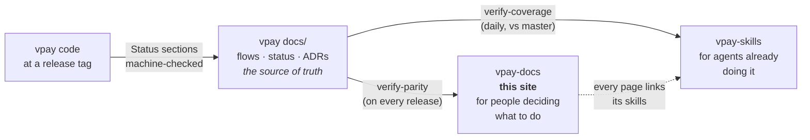

# Agent skills

These pages are for people. **Agent skills** are the same ground written for a
coding agent that is already at work in the vpay repository, or in a merchant
codebase that talks to vpay. They live in their own repository,
[vaam-apps/vpay-skills](https://github.com/vaam-apps/vpay-skills), and install
with one command:

```bash
npx skills add https://github.com/vaam-apps/vpay-skills --skill vpay
```

`vpay` is the orientation skill. Start there, and it routes to the others. A
merchant integrating the Node SDK needs only
[vpay-merchant-api](skill:vpay-merchant-api) and
[vpay-webhooks](skill:vpay-webhooks). It doesn't need the whole vpay tree.

## Three audiences, three tiers

A human reading this site and an agent loading a skill need different things
from the same facts. vpay keeps both, plus its own exhaustive record, and gates
the drift between them.



|                 | vpay `docs/`                         | This site                                          | vpay-skills                                                 |
| --------------- | ------------------------------------ | -------------------------------------------------- | ----------------------------------------------------------- |
| Written for     | a contributor who needs every detail | a person evaluating, integrating or operating vpay | an agent making a change **now**                            |
| Judged on       | is it complete and dated?            | is it clear, and true of the release?              | would an agent that read only this get it right first time? |
| Pinned to       | the commit it lives in               | a vpay **release tag**, in `vpay.lock.json`        | a vpay **commit**, stamped in every `SKILL.md`              |
| Drift caught by | vpay's own fifteen gates             | `verify-parity`, on every vpay release             | `verify-coverage`, daily against vpay's `master`            |

vpay's own [AGENTS.md](vpay:AGENTS.md) names all three tiers in its list of
which document answers what: an ADR, a flow doc, a runbook, a skill for an
**agent**, and this site for a **person**.

## The parity rule

vpay's own rule is that **a feature lands in three places or it has not landed:
the code, the docs and the skills.** Its reason is the one this site inherits. A
status page that lags is worse than none, because people trust it. A skill that
lags is worse still. An agent doesn't just trust it. It acts on it, fast, in
every session that loads it.

So every page on this site names its skills in its frontmatter, and the theme
prints them at the bottom with an install command. The parity check on this site
fails when a page names a skill that doesn't exist, or when vpay-skills adds a
skill that no page here references. When a skill is added, a page here has to
acknowledge it.

## Every skill

The table is generated when the site is built. It reads each `SKILL.md` from
vpay-skills at the pinned commit and compares the skill's own
**verified-against** stamp with the vpay release these pages document.

<SkillTable />

::: warning A skill is true of _a_ vpay, not of vpay
A skill marked **newer than** the release was verified against a vpay commit
that came after it. It may describe something this release doesn't have. The
reverse holds too: a skill marked **older than** the release was verified before
the release's latest changes. Read the skill's own stamp before trusting a claim
that depends on the version, and when the two disagree, trust the repository.
vpay-skills'
[VERSIONING.md](https://github.com/vaam-apps/vpay-skills/blob/main/VERSIONING.md)
is the full rule.
:::

## By task

```mermaid
flowchart TD
  start(["What is the agent about to do?"])
  start --> any["Anything in the repo"] --> vpay[vpay]
  start --> write["Write Rust or TypeScript"] --> conv[vpay-conventions]
  start --> run["Run a build, a gate, CI"] --> tool[vpay-tooling]
  start --> broke["Something broke oddly"] --> trouble[vpay-troubleshooting]
  start --> finish["Finish a change"] --> docs[vpay-docs-status]
  start --> money["Touch payments"]
  money --> pay[vpay-payments]
  money --> rec[vpay-reconciler]
  start --> wire["Touch the merchant wire"]
  wire --> api[vpay-merchant-api]
  wire --> hooks[vpay-webhooks]
  wire --> cust[vpay-customers]
  wire --> inv[vpay-invoices]
  start --> rail["Touch a rail"]
  rail --> port[vpay-provider-adapters]
  rail --> mtn[vpay-mtn-momo]
  rail --> om[vpay-orange-money]
  start --> ui["Touch a screen"]
  ui --> fe[vpay-frontend]
  ui --> co[vpay-checkout]
  ui --> dash[vpay-dashboard]
  start --> data["Touch the schema"] --> dl[vpay-data-layer]
  start --> sdk["Touch an SDK"] --> sdks[vpay-sdks]
  start --> ops["Configure or deploy"] --> opsn[vpay-ops]
```



## Installing more than one

```bash
npx skills add https://github.com/vaam-apps/vpay-skills --skill vpay
npx skills add https://github.com/vaam-apps/vpay-skills --skill vpay-merchant-api
npx skills add https://github.com/vaam-apps/vpay-skills --skill vpay-webhooks
```

`npx skills add` fetches one directory into `.agents/skills/` and pins its hash
in `skills-lock.json`. vpay itself uses the same mechanism for the skills it
consumes, [`skills-lock.json`](vpay:skills-lock.json).

## Go deeper

- [vaam-apps/vpay-skills](https://github.com/vaam-apps/vpay-skills): the skills,
  `coverage.json` and the `verify-coverage` gate
- [AGENTS.md § Docs↔skills parity](vpay:AGENTS.md#docsskills-parity): vpay's
  statement of the three-places rule
- [How these docs stay current](/about/parity): this site's side of it
